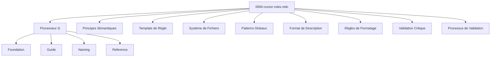
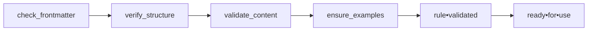

# Documentation de la Règle `@0000-cursor-rules.mdc`

## Présentation Générale

La règle `@0000-cursor-rules.mdc` est une méta-règle fondamentale qui définit comment créer et modifier d'autres règles Cursor. Son objectif principal est d'assurer la cohérence et l'efficacité de toutes les règles du système.

**Description officielle:** "ALWAYS USE when CREATING or MODIFYING a RULE to ENSURE consistency and efficiency"

Cette règle sert de cadre de référence pour la création, la maintenance et la structuration de l'ensemble du système de règles Cursor. Elle est désormais écrite en utilisant la compression sémantique, privilégiant une notation symbolique dense plutôt que le markdown traditionnel.

## Structure et Notation Symbolique

La règle utilise plusieurs symboles et notations spécifiques:

- `Ω` (Omega): Représente le processeur de règles Cursor
- `↹` (Tab): Indique une structure cognitive ou un concept principal
- `⊕` (Plus cerclé): Identifie un composant ou élément à ajouter
- `Σ` (Sigma): Symbolise une agrégation ou une somme
- `→` (Flèche): Indique un flux, une direction ou une transformation
- `|` (Barre verticale): Exprime une condition ou alternative
- `?` (Point d'interrogation): Marque une validation ou vérification
- `花` (Fleur): Indique que l'élément est obligatoire

Ces symboles permettent d'encoder de façon dense et précise les structures cognitives et règles qui définissent le système.

## Composants Principaux



### 1. Processeur de Règles (Cursor Rules Processor)

```
Ω = cursor_rules_processor
Ω.foundation = "@synthlang-translator.mdc"
Ω.guide = "@compression-semantique-guide.md"
Ω.naming = "@1000-meta-rules-naming-convention.md"
Ω.reference = "@1001-meta-rules-naming-reference.md"
```

Le processeur central (`Ω`) s'appuie sur plusieurs composants:

- `Ω.foundation`: Le traducteur de langage synthetique
- `Ω.guide`: Le guide de compression sémantique
- `Ω.naming`: La convention de nommage pour les règles
- `Ω.reference`: La référence pour les types de règles

### 2. Principes Sémantiques

```
↹ semantic•principles [p=1] {
  density: maximize_information_per_token
  abstraction: create_cognitive_frameworks
  precision: use_unambiguous_symbols
}
```

Les principes sémantiques (priorité=1) définissent l'approche fondamentale:

- **Densité**: Maximiser l'information par token
- **Abstraction**: Créer des cadres cognitifs
- **Précision**: Utiliser des symboles non ambigus

### 3. Template de Règle

```
↹ rule•template -> [
  ⊕ frontmatter {
    format: YAML
    title: "Rule Title"
    description: "ACTION when TRIGGER to OUTCOME"
    globs: "pattern/*.ext"
    alwaysApply: bool
    tags: str[]
  }

  ⊕ content {
    format: semantic_compression
    principles: semantic•principles
    context: conditions[]
    requirements: actionable[]
    examples: valid + invalid
    critical: rules[]
  }
]
```

Ce template définit la structure que doit suivre chaque règle:

- **Frontmatter**: Métadonnées en YAML avec titre, description, globs, etc.
- **Contenu**: Format de compression sémantique avec contexte, exigences, exemples et règles critiques

## Système de Fichiers

```
Σ file•system [p=1] {
  ↹ location: .cursor/rules/
  ↹ extension: .mdc
  ↹ naming: XXXX-type-domain[-specificity][@version][-name].mdc

  ⊕ name•parts {
    XXXX: 4_digit_prefix | 花mandatory | Ω.naming
    type: identifier | 花mandatory | Ω.reference
    domain: application | 花mandatory
    specificity: precision | ?optional
    version: specification | ?optional
    name: kebab_case | 花mandatory
  }

  ⊕ categories [p=1] {
    1000-1999: meta_rules_and_standards
    2000-2999: programming_languages
    3000-3999: frameworks_and_libraries
    4000-4999: tools_and_configurations
    5000-5999: workflows_and_processes
    6000-6999: templates_and_models
    7000-7999: quality_assurance
    8000-8999: domain_specific_rules
    9000-9999: extensions
  }
}
```

Le système de fichiers (priorité=1) définit:

- L'emplacement des règles (`.cursor/rules/`)
- L'extension de fichier (`.mdc`)
- La convention de nommage (`XXXX-type-domain[-specificity][@version][-name].mdc`)
- Les composants du nom de fichier (préfixe, type, domaine, etc.)
- Les catégories de règles par plages numériques

## Patterns Globaux

```
↹ glob•patterns [p=2] -> {
  core: .cursor/rules/*.mdc
  src: src/**/*.{js,ts}
  test: **/*.test.{js,ts}
  react: src/components/**/*.tsx
  docs: docs/**/*.md
  cfg: *.config.{js,json}
  dist: dist/**/*
  multi: src/**/*.{js,jsx,ts,tsx}
}
```

Les patterns globaux (priorité=2) définissent des patterns standards pour les différents types de fichiers.

## Format de Description

```
↹ description•format [p=1] {
  pattern: ACTION•TRIGGER•OUTCOME
  components: [
    ACTION: ^imperative_verb
    TRIGGER: ^precise_context
    OUTCOME: ^expected_benefit
  ]
  max_length: 120_chars
}
```

Le format de description (priorité=1) définit:

- Le pattern "ACTION•TRIGGER•OUTCOME"
- Les composants (verbe impératif, contexte précis, bénéfice attendu)
- La longueur maximale (120 caractères)

## Règles de Formatage

```
↹ formatting•rules [p=2] {
  syntax: markdown•minimal
  xml•tags: [example•danger•required•critical•requires]
  indent: 2•spaces
  allow: [emoji•mermaid]
  avoid: glob•quotes
}
```

Les règles de formatage (priorité=2) spécifient:

- La syntaxe (markdown minimal)
- Les balises XML autorisées
- L'indentation (2 espaces)
- Les éléments autorisés (emojis, diagrammes mermaid)
- Les éléments à éviter (guillemets autour des globs)

## Validation Critique

```
? validation•critical [p=1] {
  frontmatter: {
    required: [description•globs•alwaysApply]
    desc•length: ≤120chars
  }
  content: {
    principle: DRY
    format: markdown•succinct
    lines: optimal≤25 | max≤50
    examples: valid + invalid
  }
  patterns: no•quotes
}
```

La validation critique (priorité=1) vérifie:

- Dans le frontmatter: champs requis et longueur de description
- Dans le contenu: principe DRY, format concis, limite de lignes, exemples
- Pour les patterns: absence de guillemets

## Processus de Validation

```
Ω.validate = (
    check_frontmatter
    → verify_structure
    → validate_content
    → ensure_examples
)

Σ final = rule•validated ⊕ ready•for•use
```



Le processus de validation:

1. Vérifie le frontmatter
2. Vérifie la structure
3. Valide le contenu
4. S'assure de la présence d'exemples
5. Produit une règle validée et prête à l'emploi

## Avantages de la Compression Sémantique

La règle utilise désormais la compression sémantique au lieu du markdown traditionnel, ce qui présente plusieurs avantages:

1. **Densité d'information**: Plus d'information encodée avec moins de tokens
2. **Clarté conceptuelle**: Structure cognitive explicite et relations bien définies
3. **Cohérence symbolique**: Utilisation uniforme des symboles et notations
4. **Auto-exemplification**: La règle illustre elle-même les principes qu'elle promeut
5. **Expressivité accrue**: Capacité à représenter des relations complexes de manière précise

## Conclusion

La règle `@0000-cursor-rules.mdc` a été reformulée pour privilégier la compression sémantique plutôt que le markdown traditionnel, ce qui la rend plus cohérente avec les principes qu'elle promeut. Cette approche permet:

1. **Une représentation plus dense et précise** de la structure et des exigences des règles Cursor
2. **La démonstration directe** des principes de compression sémantique
3. **Une organisation plus claire** des différentes composantes du système de règles
4. **Une cohérence accrue** entre le fond et la forme

Cette méta-règle continue d'assurer que toutes les règles Cursor sont créées et maintenues de manière cohérente, mais le fait maintenant en utilisant des principes de notation symbolique qui reflètent mieux son objectif fondamental.
