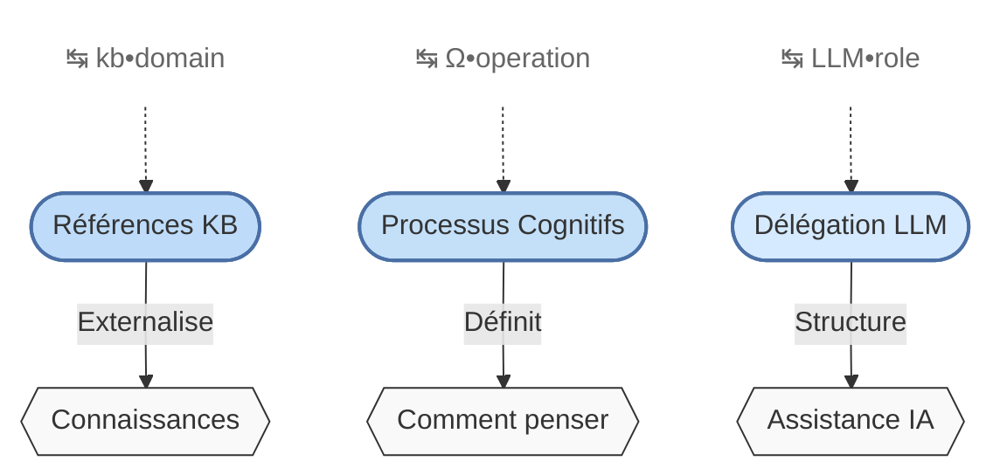
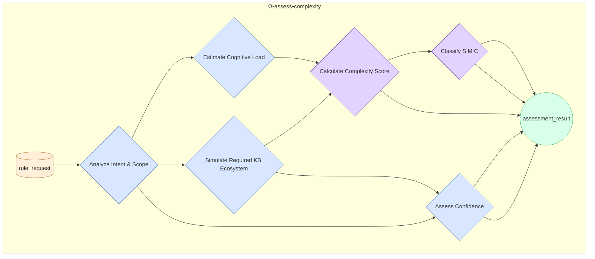
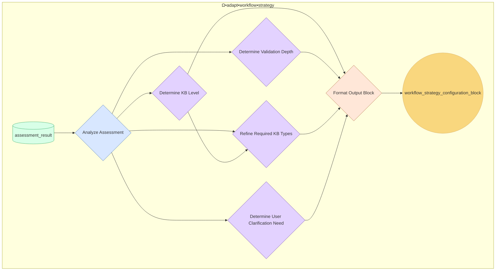
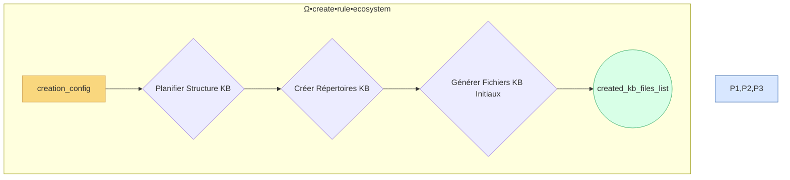
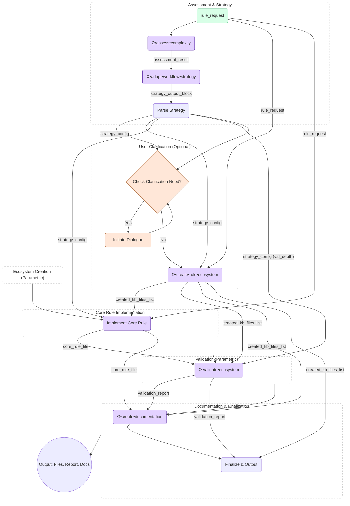
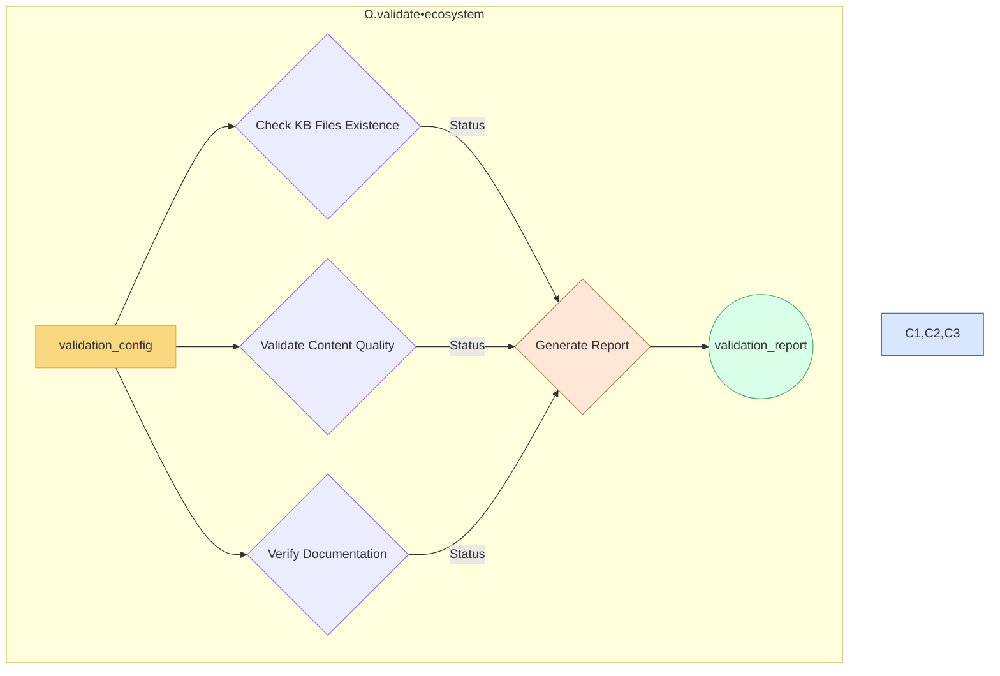
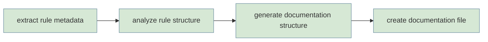
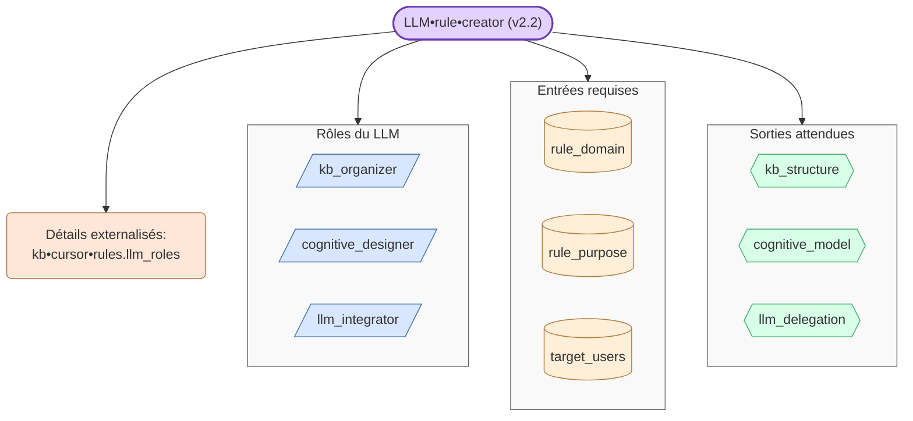
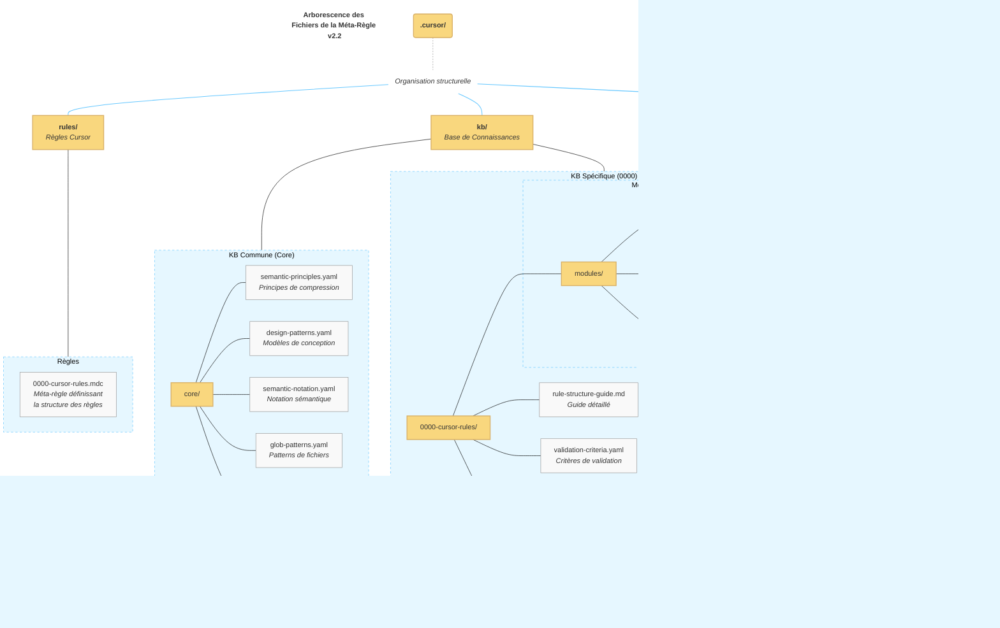

# Documentation de la Méta-Règle pour la Création de Règles Cursor

## 📋 Résumé

La méta-règle `0000-cursor-rules.mdc` définit le standard et le processus de création des règles Cursor. Elle établit une méthodologie complète pour garantir des règles cohérentes, compréhensibles et efficaces à travers un système de compression sémantique, d'externalisation des connaissances et de processus cognitifs clairs. La version actuelle (3.1) met l'accent sur la modularité et la factorisation des connaissances tout en maintenant la séparation claire entre connaissances, processus cognitifs et rôles du LLM.

| Aspect               | Description                                                                             |
| -------------------- | --------------------------------------------------------------------------------------- |
| **Objectif**         | Standardiser la création et la modification des règles Cursor                           |
| **Applicabilité**    | S'applique à tous les fichiers `.cursor/rules/*.mdc`                                    |
| **Principe central** | Compression sémantique + référencement externe + workflow cognitif structuré            |
| **Format**           | Markdown avec compression sémantique                                                    |
| **Version actuelle** | 3.1 (organisation améliorée des fichiers et templates)                                  |
| **Prérequis**        | Comprendre les principes de compression sémantique et la structure des connaissances KB |

## 🧠 Concepts Fondamentaux

### Principes de Compression Sémantique

La compression sémantique est un système de notation qui permet de maximiser la densité d'information tout en maintenant la clarté et la précision. Elle utilise des symboles spécifiques pour représenter des concepts complexes de manière concise.

| Symbole | Signification             | Utilisation                                  |
| ------- | ------------------------- | -------------------------------------------- |
| `↹`     | Section/Catégorie         | Indique le début d'une section logique       |
| `⊕`     | Élément/Définition        | Définit un élément dans une section          |
| `→`     | Flux/Séquence             | Indique une étape séquentielle ou un flux    |
| `Σ`     | Résumé/Conclusion         | Résume ou conclut une section                |
| `⨁`     | Combinaison               | Indique la combinaison de plusieurs éléments |
| `⇌`     | Relation bidirectionnelle | Indique une relation dans les deux sens      |
| `•`     | Connecteur                | Relie des concepts ou termes associés        |
| `+`     | Addition                  | Indique l'ajout d'un concept ou propriété    |
| `[p=n]` | Niveau de priorité        | Indique l'importance (1=la plus élevée)      |

### Les Trois Piliers d'une Règle Cursor

La version 2.2 de la méta-règle maintient les trois piliers fondamentaux pour toute règle Cursor, mais avec une approche plus modulaire:


```mermaid
flowchart TD
    %% Définition des nœuds avec des formes plus élégantes
    P1(["Références KB"])
    P2(["Processus Cognitifs"])
    P3(["Délégation LLM"])
    K{{Connaissances}}
    C{{Comment penser}}
    L{{Assistance IA}}

    %% Connexions avec libellés courts
    P1 -->|"Externalise"| K
    P2 -->|"Définit"| C
    P3 -->|"Structure"| L

    %% Annotations légères
    Notation1["↹ kb•domain"] -.-> P1
    Notation2["↹ Ω•operation"] -.-> P2
    Notation3["↹ LLM•role"] -.-> P3

    %% Styles améliorés
    style P1 fill:#bedcfa,stroke:#4a6fa5,stroke-width:2px,color:#333
    style P2 fill:#c4e0f9,stroke:#4a6fa5,stroke-width:2px,color:#333
    style P3 fill:#d6eaff,stroke:#4a6fa5,stroke-width:2px,color:#333
    style K fill:#f9f9f9,stroke:#333,stroke-width:1px
    style C fill:#f9f9f9,stroke:#333,stroke-width:1px
    style L fill:#f9f9f9,stroke:#333,stroke-width:1px
    style Notation1 fill:none,stroke:none,color:#666
    style Notation2 fill:none,stroke:none,color:#666
    style Notation3 fill:none,stroke:none,color:#666
```

1. **Références KB** (`kb•domain`): Pointent vers des fichiers externes contenant les connaissances spécifiques au domaine, évitant la duplication d'information dans la règle elle-même.

2. **Processus Cognitifs** (`Ω•operation`): Définissent explicitement les processus de raisonnement, pas simplement ce qu'il faut savoir, mais comment réfléchir au problème.

3. **Délégation LLM** (`LLM•role`): Structure précisément comment le LLM doit contribuer, avec des entrées, sorties, contraintes et validations clairement définies.

### Adaptation Basée sur la Complexité (Nouveauté v3.x)

Pour pallier la rigidité potentielle d'un workflow unique, la version 3.x introduit une approche adaptative basée sur une évaluation préliminaire de la complexité de la règle à créer.

1.  **Classification S/M/C :** Avant la création complète, la complexité de la demande de règle est évaluée et classifiée comme **Simple (S)**, **Moyenne (M)**, ou **Complexe (C)**.
2.  **Modules Dédiés :** Deux nouveaux modules principaux gèrent ce processus :
    - `Ω•assess•complexity` : Évalue la demande.
    - `Ω•adapt•workflow•strategy` : Détermine la stratégie de création (niveau KB, profondeur de validation) en fonction de l'évaluation.
3.  **Workflow Adapté :** Le workflow principal (`Ω•create•rule`) utilise la stratégie déterminée pour paramétrer les étapes de création de l'écosystème (`Ω•create•rule•ecosystem`) et de validation (`Ω.validate•ecosystem`).
4.  **Externalisation Maintenue :** Le principe d'externalisation stricte des connaissances est conservé. Même une règle "Simple" requiert un écosystème KB externe minimal. La flexibilité réside dans la **quantité** et le **type** de fichiers KB exigés, ainsi que dans la **profondeur** de la validation.

Cette approche permet d'ajuster l'effort et la rigueur du processus à la nature de la règle, optimisant l'efficacité sans sacrifier la qualité pour les règles complexes.

### Architecture de la Base de Connaissances (KB)

La règle 2.2 utilise une architecture de connaissances encore plus modulaire avec des modules spécifiques pour différents aspects du système:


```mermaid
flowchart TD
    %% Définition du graphe principal
    CORE([".cursor/kb/core/"]) --- SP>semantic-principles.yaml]
    CORE --- DP>design-patterns.yaml]
    CORE --- SN>semantic-notation.yaml]
    CORE --- GP>glob-patterns.yaml]
    CORE --- RS>rule-structure.yaml]

    R0([".cursor/kb/0000-cursor-rules/"]) --- RSG>rule-structure-guide.md]
    R0 --- VC>validation-criteria.yaml]
    R0 --- EX([examples/])
    EX --- VE>valid-example.md]
    EX --- IE>bad-example.md]

    R0 --- MOD([modules/])
    MOD --- LR>llm-roles.yaml]
    MOD --- DS>documentation-structure.yaml]
    MOD --- RSD>rule-structure-details.yaml]

    %% Styles améliorés
    classDef coredir fill:#f2e6d9,stroke:#b58863,stroke-width:2px,color:#333
    classDef ruledir fill:#d9e6f2,stroke:#6382b5,stroke-width:2px,color:#333
    classDef file fill:#f9f9f9,stroke:#333,stroke-width:1px,color:#555
    classDef module fill:#e6f7ff,stroke:#4a90e2,stroke-width:1px,color:#555

    class CORE,EX,MOD coredir
    class R0 ruledir
    class SP,DP,SN,GP,RS,RSG,VC,VE,IE file
    class LR,DS,RSD module
```

## ⚙️ Nouveaux Modules Clés (v3.x)

La version 3.x introduit deux modules essentiels pour l'approche adaptative.

### 1. Module d'Évaluation de Complexité (`Ω•assess•complexity`)

**Objectif :** Évaluer de manière structurée la complexité intrinsèque d'une demande de création de règle.

**Processus Interne :**


```mermaid
graph TD
    subgraph Assessment Process [Ω•assess•complexity]
        direction LR
        Input[(rule_request)] --> P1{Analyze Intent & Scope}
        P1 --> P2{Estimate Cognitive Load}
        P1 --> P3{Simulate Required KB Ecosystem}
        P2 --> P4{Calculate Complexity Score}
        P3 --> P4
        P4 --> P5{Classify S M C}
        P5 --> P7((assessment_result))
        P1 --> P6{Assess Confidence}
        P3 --> P6
        P6 --> P7
        P4 --> P7
        P5 --> P7
        P6 --> P7
    end

    classDef inputNode fill:#ffeed8,stroke:#af7d3d,stroke-width:1px
    classDef processNode fill:#d8e7ff,stroke:#3d6daf,stroke-width:1px
    classDef decisionNode fill:#e3d2ff,stroke:#6a3daf,stroke-width:1px
    classDef outputNode fill:#d8ffe7,stroke:#3daf6d,stroke-width:1px

    class Input inputNode
    class P1,P2,P3,P6 processNode
    class P4,P5 decisionNode
    class P7 outputNode
```

**Annotations pour le diagramme `Ω•assess•complexity` :**

- **P3 (Simulate Required KB Ecosystem) :** Estimation des types KB (guideline, example, template...), Suggestion KB minimal, Feedback interne.
- **P4 (Calculate Complexity Score) :** Combine Charge Cognitive et Estimation KB (poids initiaux).
- **P5 (Classify S M C) :** Application des seuils (<0.3, 0.3-0.7, >=0.7).
- **P6 (Assess Confidence) :** Évaluation clarté requête et fiabilité simulation.
- **P7 (assessment_result) :** Objet contenant score, classification, estimations, confiance, justification...

**Sortie Clé :** `assessment_result` (objet structuré) contenant le score, la classification S/M/C, l'estimation de l'empreinte KB, une suggestion de KB minimal (pour S), le score de confiance, et la justification.

### 2. Module d'Adaptation de Stratégie (`Ω•adapt•workflow•strategy`)

**Objectif :** Traduire l'évaluation de complexité en une configuration de stratégie concrète pour la suite du workflow.

**Processus Interne :**


```mermaid
graph TD
    subgraph Strategy Adaptation [Ω•adapt•workflow•strategy]
        direction LR
        Input[(assessment_result)] --> A1{Analyze Assessment}
        A1 --> D1{Determine KB Level}
        A1 --> D2{Determine Validation Depth}
        A1 --> D3{Refine Required KB Types}
        A1 --> D4{Determine User Clarification Need}
        D1 --> D3
        D1 --> F1{Format Output Block}
        D2 --> F1
        D3 --> F1
        D4 --> F1
        F1 --> Output((workflow_strategy_configuration_block))
    end

    classDef inputNode fill:#d8ffe7,stroke:#3daf6d,stroke-width:1px
    classDef processNode fill:#d8e7ff,stroke:#3d6daf,stroke-width:1px
    classDef decisionNode fill:#e3d2ff,stroke:#6a3daf,stroke-width:1px
    classDef formatNode fill:#ffe7d8,stroke:#af6d3d,stroke-width:1px
    classDef outputNode fill:#f9d77e,stroke:#d9b066,stroke-width:1px

    class Input inputNode
    class A1 processNode
    class D1,D2,D3,D4 decisionNode
    class F1 formatNode
    class Output outputNode
```

**Annotations pour le diagramme `Ω•adapt•workflow•strategy` :**

- **D1 (Determine KB Level) :** Classification Mappée : S => Minimal, M => Standard, C => Comprehensive.
- **D2 (Determine Validation Depth) :** Basé sur Classification & Confiance (Ex: Simple/High => Basic, Low Conf => Standard...).
- **D3 (Refine Required KB Types) :** Filtre les types KB estimés selon le niveau KB (Minimal garde 1-2).
- **D4 (Determine User Clarification Need) :** Basé sur seuil de confiance (<0.7).
- **F1 (Format Output Block) :** Crée un bloc texte structuré clé-valeur standardisé.

**Sortie Clé :** `workflow_strategy_configuration_block` (bloc texte structuré) contenant `kb_creation_level`, `required_kb_types`, `validation_depth`, `trigger_user_clarification`, et `additional_guidance`. Ce bloc est ensuite parsé par le workflow principal.

### 3. Module de Création d'Écosystème (`Ω•create•rule•ecosystem`)

**Objectif :** Créer la structure de répertoires et les fichiers initiaux de la Base de Connaissances (KB) associés à une nouvelle règle, en respectant la stratégie de complexité (`kb_creation_level`, `required_kb_types`) déterminée précédemment.

**Inputs :** Objet `creation_config` contenant la requête initiale (`rule_request`) et les paramètres de stratégie (`kb_creation_level`, `required_kb_types`, `additional_guidance`).

**Processus Interne Simplifié :**


```mermaid
graph TD
    subgraph Ecosystem Creation [Ω•create•rule•ecosystem]
        direction LR
        Input[creation_config] --> P1{Planifier Structure KB}
        P1 --> P2{Créer Répertoires KB}
        P2 --> P3{Générer Fichiers KB Initiaux}
        P3 --> Output((created_kb_files_list))
    end
    style Input fill:#f9d77e,stroke:#d9b066
    style P1,P2,P3 fill:#d8e7ff,stroke:#3d6daf
    style Output fill:#d8ffe7,stroke:#3daf6d
```

- **Planification :** Identifie les répertoires nécessaires (ex: `.cursor/kb/<rule_id>/`, `.cursor/kb/<rule_id>/examples/`, etc.) en fonction du `kb_creation_level` (Minimal, Standard, Comprehensive).
- **Création des Répertoires :** Génère la structure de dossiers planifiée.
- **Génération des Fichiers :** Crée les fichiers KB initiaux (vides ou basés sur des templates) correspondant aux `required_kb_types` (ex: `guideline.md`, `valid-example.md`, etc.), en utilisant `additional_guidance` si fournie. Garantit la création des fichiers minimaux même pour le niveau 'Minimal'.

**Sortie Clé :** `created_kb_files_list` (Liste des chemins des fichiers KB créés).

## 🔄 Workflow de Création des Règles (Ω•create•rule) Refactorisé (v3.x)

Le workflow `Ω•create•rule` est maintenant orchestré en phases distinctes, intégrant les nouveaux modules d'évaluation et d'adaptation.


```mermaid
flowchart TB
    subgraph Phase1 ["Assessment & Strategy"]
        direction LR
        R(rule_request) --> C1(Ω•assess•complexity)
        C1 -- assessment_result --> C2(Ω•adapt•workflow•strategy)
        C2 -- strategy_output_block --> C3(Parse Strategy)
    end

    subgraph Phase2 ["User Clarification (Optional)"]
        direction LR
        C3 -- strategy_config --> IF{Check Clarification Need?}
        IF -- Yes --> DLG[Initiate Dialogue]
        DLG --> IF
        IF -- No --> E1
    end

    subgraph Phase3 ["Ecosystem Creation (Parametric)"]
        direction LR
         C3 -- strategy_config --> E1(Ω•create•rule•ecosystem)
         R -- rule_request --> E1
    end

     subgraph Phase4 ["Core Rule Implementation"]
         direction LR
         E1 -- created_kb_files_list --> R1(Implement Core Rule)
         R -- rule_request --> R1
         C3 -- strategy_config --> R1
     end

     subgraph Phase5 ["Validation (Parametric)"]
         direction LR
         R1 -- core_rule_file --> V1(Ω.validate•ecosystem)
         E1 -- created_kb_files_list --> V1
         C3 -- strategy_config (val_depth) --> V1
     end

     subgraph Phase6 ["Documentation & Finalization"]
         direction LR
         V1 -- validation_report --> D1(Ω•create•documentation)
         R1 -- core_rule_file --> D1
         E1 -- created_kb_files_list --> D1
         D1 --> F1(Finalize & Output)
         V1 -- validation_report --> F1
         E1 -- created_kb_files_list --> F1
     end

    %% Connections between phases
    C3 --> IF
    Phase2 --> E1
    Phase3 --> R1
    Phase4 --> V1
    Phase5 --> D1
    Phase6 --> END((Output: Files, Report, Docs))

    %% Styling
    classDef module fill:#e3d2ff,stroke:#6a3daf,rx:5
    classDef check fill:#ffe7d8,stroke:#af6d3d,rx:5
    classDef output fill:#d8ffe7,stroke:#3daf6d,shape:cylinder
    classDef phase fill:none,stroke:#ccc,stroke-width:1px,stroke-dasharray: 5 5,rx:10
    class C1,C2,E1,R1,V1,D1 module
    class IF,DLG check
    class R,assessment_result,strategy_output_block,strategy_config,created_kb_files_list,core_rule_file,validation_report output
    class Phase1,Phase2,Phase3,Phase4,Phase5,Phase6 phase
```

**Étapes Clés du Workflow Refactorisé :**

1.  **Évaluation & Stratégie :** Appel séquentiel de `Ω•assess•complexity` et `Ω•adapt•workflow•strategy`. Le bloc de configuration est parsé.
2.  **Clarification Utilisateur (Optionnelle) :** Si le score de confiance est bas, un dialogue est initié pour confirmer/ajuster la stratégie.
3.  **Création de l'Écosystème :** Appel de `Ω•create•rule•ecosystem` avec les paramètres `kb_creation_level`, `required_kb_types`, et `additional_guidance` issus de la stratégie.
4.  **Implémentation de la Règle Cœur :** Génération du fichier `.mdc` principal. Le `kb_creation_level` peut influencer légèrement le détail de la règle elle-même.
5.  **Validation :** Appel de `Ω.validate•ecosystem` avec les fichiers créés et le paramètre `validation_depth` issu de la stratégie.
6.  **Documentation & Finalisation :** Génération de la documentation (`Ω•create•documentation`) et finalisation.

Ce workflow modulaire permet une adaptation fine du processus tout en gardant une structure claire.

_Note : La règle `0000-cursor-rules.mdc` contient également une section `Ω.validate` plus simple, focalisée sur la vérification de la présence et de la conformité des trois piliers structurels fondamentaux (références KB, opérations cognitives, délégation LLM) au sein du fichier `.mdc` de la règle elle-même. Cette validation structurelle complète la validation plus large de l'écosystème gérée par `Ω.validate•ecosystem`._

## 🔍 Protocole de Validation de l'Écosystème (Ω.validate•ecosystem) Adapté (v3.x)

Le protocole de validation de l'écosystème est maintenant paramétré par la `validation_depth` déterminée lors de la phase de stratégie.

**Input :** `validation_config` (objet contenant `rule_files` et `validation_depth`).

**Processus Adapté :**


```mermaid
graph TD
    subgraph Validation Process [Ω.validate•ecosystem]
        direction LR
        Input[validation_config] --> C1{Check KB Files Existence}
        Input --> C2{Validate Content Quality}
        Input --> C3{Verify Documentation}
        C1 -- Status --> C4{Generate Report}
        C2 -- Status --> C4
        C3 -- Status --> C4
        C4 --> Output((validation_report))
    end

    style Input fill:#f9d77e,stroke:#d9b066
    style C1,C2,C3 fill:#d8e7ff,stroke:#3d6daf
    style C4 fill:#ffe7d8,stroke:#af6d3d
    style Output fill:#d8ffe7,stroke:#3daf6d
```

**Annotations pour le diagramme `Ω.validate•ecosystem` :**

- **C1 (Check KB Files Existence) :** La rigueur dépend de `validation_depth` (Basic, Standard, Deep).
- **C2 (Validate Content Quality) :** La qualité minimale dépend de `validation_depth`.
- **C3 (Verify Documentation) :** Les vérifications dépendent de `validation_depth`.
- **C4 (Generate Report) :** Le standard de certification dépend de `validation_depth`.

Cela garantit que les règles simples ne sont pas soumises à une validation excessivement lourde, tandis que les règles complexes bénéficient d'un examen approfondi.

## 🔄 Processus de Génération de Documentation (Ω•create•documentation)

La version 2.2 introduit un processus formalisé pour la génération automatique de documentation:


```mermaid
flowchart LR
    ERM["extract rule metadata"] --> ARS["analyze rule structure"]
    ARS --> GDS["generate documentation structure"]
    GDS --> CDF["create documentation file"]

    style ERM fill:#d6e8d5,stroke:#6c8ea0,stroke-width:1px
    style ARS fill:#d6e8d5,stroke:#6c8ea0,stroke-width:1px
    style GDS fill:#d6e8d5,stroke:#6c8ea0,stroke-width:1px
    style CDF fill:#d6e8d5,stroke:#6c8ea0,stroke-width:1px
```

### Étapes du processus de documentation

1. **extract•rule•metadata**: Extraire les métadonnées de la règle source
2. **analyze•rule•structure**: Analyser les sections de la règle et identifier les concepts clés
3. **generate•documentation•structure**: Générer la structure de documentation basée sur un template
4. **create•documentation•file**: Créer le fichier de documentation dans l'emplacement approprié

Ce processus permet de maintenir une documentation cohérente et à jour avec la règle elle-même.

## 🤖 Stratégie de Délégation au LLM (v2.2)

La version 2.2 clarifie davantage les rôles du LLM en externalisant leurs détails dans des modules dédiés:


```mermaid
flowchart TD
    %% Structure principale
    LLM(["LLM•rule•creator (v2.2)"]) --> ROLES
    LLM --> INPUTS
    LLM --> OUTPUTS
    LLM --> EXT["Détails externalisés:<br>kb•cursor•rules.llm_roles"]

    %% Groupes avec des formes distinctives
    subgraph ROLES [Rôles du LLM]
        direction LR
        KO[/kb_organizer/]
        CD[/cognitive_designer/]
        LI[/llm_integrator/]
    end

    subgraph INPUTS [Entrées requises]
        direction LR
        RD[(rule_domain)]
        RP[(rule_purpose)]
        TU[(target_users)]
    end

    subgraph OUTPUTS [Sorties attendues]
        direction LR
        KS{{kb_structure}}
        CM{{cognitive_model}}
        LD{{llm_delegation}}
    end

    %% Styles améliorés
    classDef llm fill:#e3d2ff,stroke:#6a3daf,stroke-width:2px,color:#333,rx:5
    classDef group fill:#f9f9f9,stroke:#666,stroke-width:1px,color:#333
    classDef role fill:#d8e7ff,stroke:#3d6daf,stroke-width:1px,color:#333
    classDef input fill:#ffeed8,stroke:#af7d3d,stroke-width:1px,color:#333
    classDef output fill:#d8ffe7,stroke:#3daf6d,stroke-width:1px,color:#333
    classDef ext fill:#ffe7d8,stroke:#af6d3d,stroke-width:1px,color:#333,rx:5

    class LLM llm
    class ROLES,INPUTS,OUTPUTS group
    class KO,CD,LI role
    class RD,RP,TU input
    class KS,CM,LD output
    class EXT ext
```

Cette structure avec référence externe garantit que:

- La règle principale reste concise et focalisée sur l'essentiel
- Les détails d'implémentation sont externalisés dans des modules spécialisés
- Les mises à jour de l'un n'affectent pas nécessairement l'autre

#### LLM•kb•content•generator

Ce rôle est responsable de la génération du contenu substantiel pour les fichiers de la Base de Connaissances (KB).

- **Rôles :**
  - `guideline_author`: Rédige des guides clairs et utiles.
  - `example_creator`: Développe des exemples (bons et mauvais) illustratifs.
  - `template_designer`: Conçoit des modèles réutilisables.
  - `reference_compiler`: Assemble des informations standardisées et faisant autorité.
- **Entrées Requises :** Spécifications de la règle, public cible, cas d'utilisation.
- **Sorties Attendues :** Fichiers KB peuplés (guides, exemples, templates, références).
- **Contraintes :** Contenu complet, pratique, et cohérent avec la règle.

#### LLM•documentation•generator

Ce rôle prend en charge la création de la documentation utilisateur pour la règle.

- **Rôles :**
  - `content_analyzer`: Extrait les concepts clés de la règle.
  - `structure_designer`: Crée une structure de documentation logique.
  - `diagram_creator`: Génère des diagrammes explicatifs.
  - `ecosystem_documenter`: Documente la structure KB associée.
- **Sorties Attendues :** Fichier de documentation complet, guide d'implémentation.

## 🧩 Modules Factorisés (Nouveauté v2.2)

La version 2.2 introduit trois nouveaux modules qui externalisent des aspects spécifiques de la règle:

### 1. Module Rôles LLM (`llm-roles.yaml`)

Ce module externalise les détails des rôles du LLM, incluant:

- Définition précise des rôles pour la création de règles
- Définition des rôles pour la génération de documentation
- Entrées, sorties et critères de qualité pour chaque rôle

### 2. Module Structure de Documentation (`documentation-structure.yaml`)

Ce module externalise tout ce qui concerne la structure de la documentation:

- Principes de documentation (complétude, cohérence, clarté, traçabilité)
- Sections requises et recommandées avec leur ordre
- Types de diagrammes à inclure
- Éléments clés pour une documentation efficace

### 3. Module Détails de Structure de Règle (`rule-structure-details.yaml`)

Ce module externalise les détails concernant la structure des règles:

- Syntaxe et exemple pour chaque section requise
- Erreurs courantes à éviter
- Directives de formatage et placement des symboles
- Critères de validation des règles

## 🌲 Arborescence des Fichiers de la Méta-Règle (v2.2)

### Représentation Graphique


```mermaid
%%{init: {'theme': 'base', 'themeVariables': { 'primaryColor': '#f0f8ff', 'fontSize': '16px'}}}%%
flowchart TD
    %% Titre du diagramme
    title[<b>Arborescence des Fichiers de la Méta-Règle v2.2</b>]
    style title fill:none,stroke:none

    %% Organisation principale
    ROOT("<b>.cursor/</b>") --- STRUCTURE("<i>Organisation structurelle</i>")
    STRUCTURE --- RULES["<b>rules/</b><br><i>Règles Cursor</i>"]
    STRUCTURE --- KB["<b>kb/</b><br><i>Base de Connaissances</i>"]
    STRUCTURE --- DOC["<b>documentation/</b><br><i>Documentation Utilisateur</i>"]

    %% Section des règles
    subgraph RULES_GROUP ["Règles"]
        METARULE["0000-cursor-rules.mdc<br><i>Méta-règle définissant<br>la structure des règles</i>"]
    end
    RULES --- RULES_GROUP

    %% Section KB Core
    subgraph KB_CORE ["KB Commune (Core)"]
        CORE["core/"] --- SP["semantic-principles.yaml<br><i>Principes de compression</i>"]
        CORE --- DP["design-patterns.yaml<br><i>Modèles de conception</i>"]
        CORE --- SN["semantic-notation.yaml<br><i>Notation sémantique</i>"]
        CORE --- GP["glob-patterns.yaml<br><i>Patterns de fichiers</i>"]
        CORE --- RS["rule-structure.yaml<br><i>Structure formelle</i>"]
    end
    KB --- KB_CORE

    %% Section KB 0000
    subgraph KB_SPECIFIC ["KB Spécifique (0000)"]
        KB0000["0000-cursor-rules/"] --- RSG["rule-structure-guide.md<br><i>Guide détaillé</i>"]
        KB0000 --- VC["validation-criteria.yaml<br><i>Critères de validation</i>"]

        subgraph EXAMPLES ["Exemples"]
            EX["examples/"] --- VE["valid-example.md<br><i>Exemple correct</i>"]
            EX --- IE["bad-example.md<br><i>Anti-patterns</i>"]
        end
        KB0000 --- EX

        subgraph MODULES ["Modules Factorisés"]
            MOD["modules/"] --- LR["llm-roles.yaml<br><i>Rôles des LLM</i>"]
            MOD --- DS["documentation-structure.yaml<br><i>Structure de documentation</i>"]
            MOD --- RSD["rule-structure-details.yaml<br><i>Détails de structure</i>"]
        end
        KB0000 --- MOD
    end
    KB --- KB_SPECIFIC

    %% Section Documentation
    subgraph DOC_GROUP ["Documentation"]
        METADOC["0000-cursor-rules-documentation.md<br><i>Documentation complète</i>"]
    end
    DOC --- DOC_GROUP

    %% Légende
    classDef directory fill:#f9d77e,stroke:#d9b066,stroke-width:2px,border-radius:8px
    classDef file fill:#f9f9f9,stroke:#999,stroke-width:1px,border-radius:4px
    classDef module fill:#e6f7ff,stroke:#4a90e2,stroke-width:1px,border-radius:4px
    classDef section fill:#e6f7ff,stroke:#67c8ff,stroke-width:1px,stroke-dasharray:5 5,border-radius:10px
    classDef label fill:none,stroke:none

    class ROOT,RULES,KB,DOC,CORE,KB0000,EX,MOD directory
    class METARULE,SP,DP,SN,GP,RS,RSG,VC,VE,IE,METADOC file
    class LR,DS,RSD module
    class STRUCTURE label
    class RULES_GROUP,KB_CORE,KB_SPECIFIC,DOC_GROUP,EXAMPLES,MODULES section

    %% Annotations sur les relations
    linkStyle 0 stroke:#999,stroke-width:1px,stroke-dasharray:3 3
    linkStyle 1,2,3 stroke:#67c8ff,stroke-width:1.5px
```

### Représentation Textuelle Détaillée

L'organisation des fichiers de la méta-règle v2.2 suit une structure hiérarchique améliorée avec externalisation des modules :

```
.cursor/                                     # Répertoire racine contenant tous les éléments Cursor
│
├── rules/                                   # Contient toutes les règles Cursor
│   │
│   └── 0000-cursor-rules.mdc                # LA MÉTA-RÈGLE PRINCIPALE (v2.2)
│       • Définit la structure des règles
│       • Établit les processus cognitifs
│       • Spécifie la délégation au LLM
│       • Pointe vers les fichiers KB externes
│       • Utilise le principe de factorisation
│
├── kb/                                      # BASE DE CONNAISSANCES
│   │
│   ├── core/                                # KB COMMUNE (réutilisable par plusieurs règles)
│   │   │
│   │   ├── semantic-principles.yaml         # Principes fondamentaux de compression sémantique
│   │   ├── design-patterns.yaml             # Modèles de conception pour les règles
│   │   ├── semantic-notation.yaml           # Notation formelle pour la compression sémantique
│   │   ├── glob-patterns.yaml               # Modèles pour les fichiers ciblés par les règles
│   │   └── rule-structure.yaml              # Structure formelle des règles
│   │
│   └── 0000-cursor-rules/                   # KB SPÉCIFIQUE À LA MÉTA-RÈGLE
│       │
│       ├── rule-structure-guide.md          # Guide détaillé et complet sur la structure des règles
│       ├── validation-criteria.yaml         # Critères formels pour valider la conformité des règles
│       │
│       ├── examples/                        # EXEMPLES DE RÈGLES
│       │   ├── valid-example.md             # Exemple de règle correctement structurée
│       │   └── bad-example.md               # Contre-exemple avec anti-patterns
│       │
│       └── modules/                         # MODULES FACTORISÉS (NOUVEAUTÉ v2.2)
│           │
│           ├── llm-roles.yaml               # Définition détaillée des rôles LLM
│           │   • Rôles pour la création de règles
│           │   • Rôles pour la génération de documentation
│           │   • Entrées, sorties et critères de qualité
│           │
│           ├── documentation-structure.yaml # Structure de la documentation
│           │   • Principes de documentation
│           │   • Sections requises et recommandées
│           │   • Types de diagrammes à inclure
│           │
│           └── rule-structure-details.yaml  # Détails de la structure des règles
│               • Syntaxe de chaque section
│               • Erreurs courantes à éviter
│               • Directives de formatage
│
└── documentation/                           # DOCUMENTATION UTILISATEUR
    │
    └── 0000-cursor-rules-documentation.md   # Documentation complète de la méta-règle (ce document)
        • Mise à jour pour la version 2.2
        • Explication des modules factorisés
        • Guide d'utilisation
        • Représentations visuelles
```

### Relations entre les composants

- **Règle principale** (`.mdc`) : Version 2.2 plus concise, faisant référence aux modules externalisés
- **Modules factorisés** (nouveauté v2.2) :
  - `llm-roles.yaml` : Détails des rôles LLM
  - `documentation-structure.yaml` : Structure de documentation
  - `rule-structure-details.yaml` : Détails de structure des règles
- **Fichiers KB** :
  - Organisation maintenue avec amélioration de la modularité
- **Documentation** : Mise à jour pour refléter les changements de la v2.2

Cette structure améliorée illustre le principe de factorisation et d'externalisation des connaissances, démontrant dans sa propre structure les principes qu'elle promeut.

## ✅ Liste de Vérification v3.x

Utilisez cette liste pour valider votre règle selon la version 3.x:

- [ ] Contient les trois piliers: Références KB, Processus Cognitifs, Délégation LLM
- [ ] Externalise correctement les connaissances dans des fichiers KB (Minimal, Standard ou Comprehensive selon complexité)
- [ ] Applique le principe de factorisation pour les détails d'implémentation
- [ ] Définit clairement les processus de raisonnement (pas juste des informations)
- [ ] Structure précisément la contribution du LLM avec références aux modules
- [ ] Utilise la compression sémantique de manière cohérente
- [ ] **Intègre l'évaluation de complexité et l'adaptation de stratégie (si applicable)**
- [ ] A été validée avec `Ω.validate•ecosystem` (avec la profondeur appropriée)
- [ ] Intègre le processus de génération de documentation
- [ ] Maintient la concision de la règle principale
- [ ] Respecte la structure recommandée pour chaque section

## 📚 Ressources Additionnelles

Pour plus de détails sur l'implémentation de la méta-règle 2.2, consultez:

- `.cursor/kb/0000-cursor-rules/rule-structure-guide.md` - Guide complet de structure
- `.cursor/kb/0000-cursor-rules/validation-criteria.yaml` - Critères formels de validation
- `.cursor/kb/0000-cursor-rules/examples/valid-example.md` - Exemple de règle bien structurée
- `.cursor/kb/0000-cursor-rules/modules/llm-roles.yaml` - Détails des rôles LLM
- `.cursor/kb/0000-cursor-rules/modules/documentation-structure.yaml` - Structure de documentation
- `.cursor/kb/0000-cursor-rules/modules/rule-structure-details.yaml` - Détails de structure des règles
