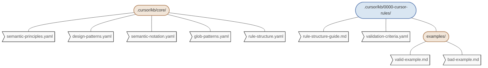
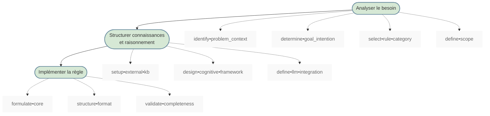
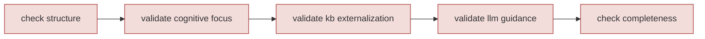
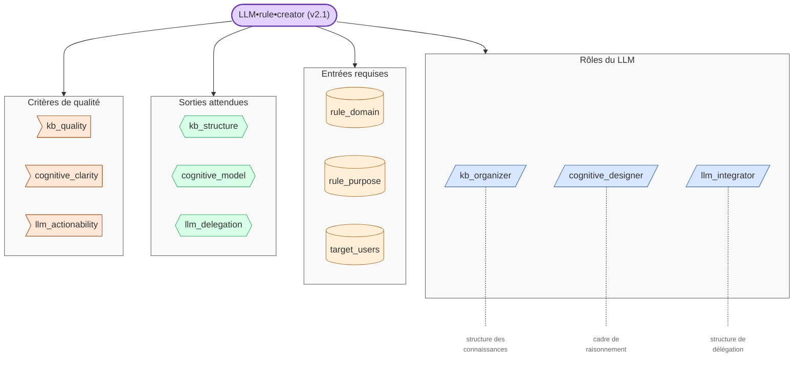
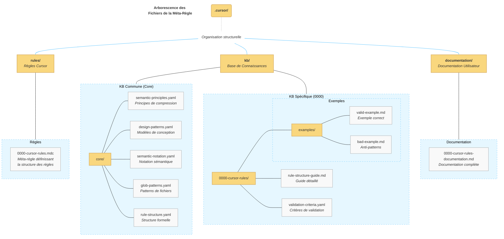

# Documentation de la Méta-Règle pour la Création de Règles Cursor

## 📋 Résumé

La méta-règle `0000-cursor-rules.mdc` définit le standard et le processus de création des règles Cursor. Elle établit une méthodologie complète pour garantir des règles cohérentes, compréhensibles et efficaces à travers un système de compression sémantique, d'externalisation des connaissances et de processus cognitifs clairs. La version actuelle (2.1) met l'accent sur la séparation des connaissances, des processus cognitifs et des rôles du LLM.

| Aspect               | Description                                                                             |
| -------------------- | --------------------------------------------------------------------------------------- |
| **Objectif**         | Standardiser la création et la modification des règles Cursor                           |
| **Applicabilité**    | S'applique à tous les fichiers `.cursor/rules/*.mdc`                                    |
| **Principe central** | Compression sémantique + référencement externe + workflow cognitif structuré            |
| **Format**           | Markdown avec compression sémantique                                                    |
| **Version actuelle** | 2.1 (factorisée et optimisée pour une meilleure séparation des préoccupations)          |
| **Prérequis**        | Comprendre les principes de compression sémantique et la structure des connaissances KB |

## 🧠 Concepts Fondamentaux

### Principes de Compression Sémantique

La compression sémantique est un système de notation qui permet de maximiser la densité d'information tout en maintenant la clarté et la précision. Elle utilise des symboles spécifiques pour représenter des concepts complexes de manière concise.

| Symbole | Signification             | Utilisation                                  |
| ------- | ------------------------- | -------------------------------------------- |
| `↹`     | Section/Catégorie         | Indique le début d'une section logique       |
| `⊕`     | Élément/Définition        | Définit un élément dans une section          |
| `→`     | Flux/Séquence             | Indique une étape séquentielle ou un flux    |
| `Σ`     | Résumé/Conclusion         | Résume ou conclut une section                |
| `⨁`     | Combinaison               | Indique la combinaison de plusieurs éléments |
| `⇌`     | Relation bidirectionnelle | Indique une relation dans les deux sens      |
| `•`     | Connecteur                | Relie des concepts ou termes associés        |
| `+`     | Addition                  | Indique l'ajout d'un concept ou propriété    |
| `[p=n]` | Niveau de priorité        | Indique l'importance (1=la plus élevée)      |

### Les Trois Piliers d'une Règle Cursor

La version 2.1 de la méta-règle met en évidence trois piliers fondamentaux pour toute règle Cursor:


```mermaid
flowchart TD
    %% Définition des nœuds avec des formes plus élégantes
    P1(["Références KB"])
    P2(["Processus Cognitifs"])
    P3(["Délégation LLM"])
    K{{Connaissances}}
    C{{Comment penser}}
    L{{Assistance IA}}

    %% Connexions avec libellés courts
    P1 -->|"Externalise"| K
    P2 -->|"Définit"| C
    P3 -->|"Structure"| L

    %% Annotations légères
    Notation1["↹ kb&#8226;domain"] -.-> P1
    Notation2["↹ Ω&#8226;operation"] -.-> P2
    Notation3["↹ LLM&#8226;role"] -.-> P3

    %% Styles améliorés
    style P1 fill:#bedcfa,stroke:#4a6fa5,stroke-width:2px,color:#333
    style P2 fill:#c4e0f9,stroke:#4a6fa5,stroke-width:2px,color:#333
    style P3 fill:#d6eaff,stroke:#4a6fa5,stroke-width:2px,color:#333
    style K fill:#f9f9f9,stroke:#333,stroke-width:1px
    style C fill:#f9f9f9,stroke:#333,stroke-width:1px
    style L fill:#f9f9f9,stroke:#333,stroke-width:1px
    style Notation1 fill:none,stroke:none,color:#666
    style Notation2 fill:none,stroke:none,color:#666
    style Notation3 fill:none,stroke:none,color:#666
```

1. **Références KB** (`kb•domain`): Pointent vers des fichiers externes contenant les connaissances spécifiques au domaine, évitant la duplication d'information dans la règle elle-même.

2. **Processus Cognitifs** (`Ω•operation`): Définissent explicitement les processus de raisonnement, pas simplement ce qu'il faut savoir, mais comment réfléchir au problème.

3. **Délégation LLM** (`LLM•role`): Structure précisément comment le LLM doit contribuer, avec des entrées, sorties, contraintes et validations clairement définies.

### Architecture de la Base de Connaissances (KB)

La règle utilise une architecture de connaissances hiérarchisée qui sépare les éléments réutilisables (core) des éléments spécifiques à chaque règle.


```mermaid
flowchart TD
    %% Définition du graphe principal
    CORE([".cursor/kb/core/"]) --- SP>semantic-principles.yaml]
    CORE --- DP>design-patterns.yaml]
    CORE --- SN>semantic-notation.yaml]
    CORE --- GP>glob-patterns.yaml]
    CORE --- RS>rule-structure.yaml]

    R0([".cursor/kb/0000-cursor-rules/"]) --- RSG>rule-structure-guide.md]
    R0 --- VC>validation-criteria.yaml]
    R0 --- EX([examples/])
    EX --- VE>valid-example.md]
    EX --- IE>bad-example.md]

    %% Styles améliorés
    classDef coredir fill:#f2e6d9,stroke:#b58863,stroke-width:2px,color:#333
    classDef ruledir fill:#d9e6f2,stroke:#6382b5,stroke-width:2px,color:#333
    classDef file fill:#f9f9f9,stroke:#333,stroke-width:1px,color:#555

    class CORE,EX coredir
    class R0 ruledir
    class SP,DP,SN,GP,RS,RSG,VC,VE,IE file
```

## 🔄 Workflow de Création des Règles (Ω•create•rule)

Le workflow `Ω•create•rule` définit un processus systématique pour créer une règle Cursor efficace et conforme. La version 2.1 simplifie ce processus en trois phases principales:


```mermaid
flowchart TB
    %% Phases principales du workflow
    A(["Analyser le besoin"]) --> B(["Structurer connaissances<br>et raisonnement"])
    B --> C(["Implémenter la règle"])

    %% Détails des phases connectés par des lignes pointillées
    A -.-> A1["identify•problem_context"]
    A -.-> A2["determine•goal_intention"]
    A -.-> A3["select•rule•category"]
    A -.-> A4["define•scope"]

    B -.-> B1["setup•external•kb"]
    B -.-> B2["design•cognitive•framework"]
    B -.-> B3["define•llm•integration"]

    C -.-> C1["formulate•core"]
    C -.-> C2["structure•format"]
    C -.-> C3["validate•completeness"]

    %% Styles améliorés
    classDef phase fill:#d6e8d5,stroke:#6c8ea0,stroke-width:2px,color:#333,rx:5
    classDef step fill:#f9f9f9,stroke:none,stroke-width:1px,color:#666

    class A,B,C phase
    class A1,A2,A3,A4,B1,B2,B3,C1,C2,C3 step
```

### Détail du Workflow Révisé

1. **analyze•need**: Identifier le contexte du problème et l'intention

   - Identifier le contexte du problème à résoudre
   - Déterminer l'objectif précis de la règle
   - Sélectionner la catégorie appropriée
   - Définir la portée

2. **structure•knowledge•and•reasoning**: Organiser les connaissances et le raisonnement

   - Configurer les fichiers KB externes pour stocker les connaissances du domaine
   - Concevoir le cadre cognitif en identifiant les processus de raisonnement
   - Définir les points d'intégration du LLM

3. **implement•rule**: Implémenter et valider la règle
   - Formuler le contenu central (description, exigences, contraintes)
   - Structurer et formater selon les standards
   - Valider la complétude avec `Ω.validate`

## 🔍 Protocole de Validation (Ω.validate)

Le protocole de validation a été simplifié dans la version 2.1 pour se concentrer sur les trois piliers fondamentaux:


```mermaid
flowchart LR
    CS["check structure"] --> VCF["validate cognitive focus"]
    VCF --> VKE["validate kb externalization"]
    VKE --> VLG["validate llm guidance"]
    VLG --> CC["check completeness"]

    style CS fill:#f2dddb,stroke:#a52a2a,stroke-width:1px
    style VCF fill:#f2dddb,stroke:#a52a2a,stroke-width:1px
    style VKE fill:#f2dddb,stroke:#a52a2a,stroke-width:1px
    style VLG fill:#f2dddb,stroke:#a52a2a,stroke-width:1px
    style CC fill:#f2dddb,stroke:#a52a2a,stroke-width:1px
```

### Étapes de validation simplifiées

1. **check•structure**: Vérifier la présence des trois piliers (kb•references, Ω•operators, LLM•delegation)
2. **validate•cognitive•focus**: S'assurer que les processus cognitifs sont bien définis
3. **validate•kb•externalization**: Vérifier que les connaissances sont externalisées
4. **validate•llm•guidance**: Valider la clarté des instructions pour le LLM
5. **check•completeness**: Vérifier la complétude selon les critères du fichier `.cursor/kb/0000-cursor-rules/validation-criteria.yaml`

## 🤖 Stratégie de Délégation au LLM

La version 2.1 clarifie les rôles spécifiques du LLM dans le processus de création de règles:


```mermaid
flowchart TD
    %% Structure principale
    LLM(["LLM•rule•creator (v2.1)"]) --> ROLES
    LLM --> INPUTS
    LLM --> OUTPUTS
    LLM --> QUALITY

    %% Groupes avec des formes distinctives
    subgraph ROLES [Rôles du LLM]
        direction LR
        KO[/kb_organizer/]
        CD[/cognitive_designer/]
        LI[/llm_integrator/]
    end

    subgraph INPUTS [Entrées requises]
        direction LR
        RD[(rule_domain)]
        RP[(rule_purpose)]
        TU[(target_users)]
    end

    subgraph OUTPUTS [Sorties attendues]
        direction LR
        KS{{kb_structure}}
        CM{{cognitive_model}}
        LD{{llm_delegation}}
    end

    subgraph QUALITY [Critères de qualité]
        direction LR
        KQ>"kb_quality"]
        CC>"cognitive_clarity"]
        LA>"llm_actionability"]
    end

    %% Annotations pour les rôles
    KO -.- KO_Desc["structure des<br>connaissances"]
    CD -.- CD_Desc["cadre de<br>raisonnement"]
    LI -.- LI_Desc["structure de<br>délégation"]

    %% Styles améliorés
    classDef llm fill:#e3d2ff,stroke:#6a3daf,stroke-width:2px,color:#333,rx:5
    classDef group fill:#f9f9f9,stroke:#666,stroke-width:1px,color:#333
    classDef role fill:#d8e7ff,stroke:#3d6daf,stroke-width:1px,color:#333
    classDef input fill:#ffeed8,stroke:#af7d3d,stroke-width:1px,color:#333
    classDef output fill:#d8ffe7,stroke:#3daf6d,stroke-width:1px,color:#333
    classDef quality fill:#ffe7d8,stroke:#af6d3d,stroke-width:1px,color:#333
    classDef desc fill:none,stroke:none,color:#666,font-size:12px

    class LLM llm
    class ROLES,INPUTS,OUTPUTS,QUALITY group
    class KO,CD,LI role
    class RD,RP,TU input
    class KS,CM,LD output
    class KQ,CC,LA quality
    class KO_Desc,CD_Desc,LI_Desc desc
```

Cette structure plus claire garantit que:

- Le LLM comprend ses responsabilités spécifiques
- Les attentes en matière d'entrées et de sorties sont bien définies
- Des critères de qualité clairs sont établis pour évaluer la contribution du LLM

## 📋 Organisation Améliorée des Fichiers KB

### Nouveaux Fichiers KB pour la Règle 0000

La factorisation de la version 2.1 a conduit à la création de nouveaux fichiers KB spécifiques:

| Fichier                     | Contenu                                                   |
| --------------------------- | --------------------------------------------------------- |
| `rule-structure-guide.md`   | Guide détaillé sur la structure attendue des règles       |
| `validation-criteria.yaml`  | Critères formels pour valider la conformité des règles    |
| `examples/valid-example.md` | Exemple complet d'une règle correctement structurée       |
| `examples/bad-example.md`   | Exemple de règle mal conçue avec anti-patterns identifiés |

## 🔎 Structure Révisée d'une Règle

### Structure Recommandée

```
---
name: "Nom de la Règle"
description: "VERB quand CONTEXT pour GOAL"
categories: [catégorie1, catégorie2]
glob: "pattern/pour/fichiers/**/*.{extension}"
always_apply: true|false
[options additionnelles]
---

# Titre de la Règle

↹ kb•domaine [p=priorité] { ... }
Σ knowledge•references

↹ principles•core [p=priorité] { ... }
Σ nom•du•groupe•de•principes

↹ Ω•operation [p=priorité] -> [ ... ]
Σ nom•du•processus•cognitif

↹ LLM•role [p=priorité] { ... }
Σ nom•du•modèle•de•délégation

[sections optionnelles additionnelles]

Σ mot•clé•1 ⊕ mot•clé•2 ⊕ mot•clé•3
```

### Sections Obligatoires

1. **Références KB** (`kb•`): Pointe vers des fichiers KB externes au lieu de dupliquer l'information

2. **Opérateurs Cognitifs** (`Ω•`): Définit explicitement les processus de raisonnement, pas juste des informations

3. **Délégation LLM** (`LLM•`): Structure précisément comment le LLM doit contribuer, avec entrées, sorties et contraintes

## ⚠️ Erreurs Courantes à Éviter

La factorisation de la méta-règle met en évidence les erreurs courantes à éviter:

1. **Mélange de connaissance et logique cognitive**

   - ❌ Incorporer des données, exemples ou référentiels directement dans la règle
   - ✅ Pointer vers des fichiers KB externes et se concentrer sur le processus de raisonnement

2. **Absence de processus cognitif explicite**

   - ❌ Simplement lister les faits ou les directives sans expliquer le raisonnement
   - ✅ Définir des opérateurs cognitifs qui montrent comment penser au problème

3. **Délégation LLM vague**
   - ❌ Instructions générales sans structure claire ou critères de validation
   - ✅ Définir précisément les tâches, entrées, sorties et contraintes pour le LLM

## 🛠️ Guide Pratique d'Application de la Version 2.1

### Création d'une Nouvelle Règle

1. **Analysez le besoin et la portée**

   - Identifiez clairement le problème à résoudre
   - Définissez l'objectif, la portée et la catégorie

2. **Structurez les connaissances et le raisonnement**

   - Créez une structure de répertoires KB appropriée pour externaliser les connaissances
   - Identifiez les processus de raisonnement nécessaires
   - Définissez les points d'intégration du LLM

3. **Implémentez et validez la règle**
   - Formulez le contenu en suivant la structure recommandée
   - Utilisez la compression sémantique de manière cohérente
   - Validez avec le protocole `Ω.validate`

### Exemple de Convention de Nommage KB

```
.cursor/kb/{ID-règle}/{type}/{fichier}

Exemples:
.cursor/kb/2100-vue3-composables/patterns/naming.yaml
.cursor/kb/2100-vue3-composables/guidelines/architecture_layers.md
.cursor/kb/2100-vue3-composables/examples/good_examples.md
```

## 🌲 Arborescence des Fichiers de la Méta-Règle

### Représentation Graphique


```mermaid
%%{init: {'theme': 'base', 'themeVariables': { 'primaryColor': '#f0f8ff', 'fontSize': '16px'}}}%%
flowchart TD
    %% Titre du diagramme
    title[<b>Arborescence des Fichiers de la Méta-Règle</b>]
    style title fill:none,stroke:none

    %% Organisation principale
    ROOT("<b>.cursor/</b>") --- STRUCTURE("<i>Organisation structurelle</i>")
    STRUCTURE --- RULES["<b>rules/</b><br><i>Règles Cursor</i>"]
    STRUCTURE --- KB["<b>kb/</b><br><i>Base de Connaissances</i>"]
    STRUCTURE --- DOC["<b>documentation/</b><br><i>Documentation Utilisateur</i>"]

    %% Section des règles
    subgraph RULES_GROUP ["Règles"]
        METARULE["0000-cursor-rules.mdc<br><i>Méta-règle définissant<br>la structure des règles</i>"]
    end
    RULES --- RULES_GROUP

    %% Section KB Core
    subgraph KB_CORE ["KB Commune (Core)"]
        CORE["core/"] --- SP["semantic-principles.yaml<br><i>Principes de compression</i>"]
        CORE --- DP["design-patterns.yaml<br><i>Modèles de conception</i>"]
        CORE --- SN["semantic-notation.yaml<br><i>Notation sémantique</i>"]
        CORE --- GP["glob-patterns.yaml<br><i>Patterns de fichiers</i>"]
        CORE --- RS["rule-structure.yaml<br><i>Structure formelle</i>"]
    end
    KB --- KB_CORE

    %% Section KB 0000
    subgraph KB_SPECIFIC ["KB Spécifique (0000)"]
        KB0000["0000-cursor-rules/"] --- RSG["rule-structure-guide.md<br><i>Guide détaillé</i>"]
        KB0000 --- VC["validation-criteria.yaml<br><i>Critères de validation</i>"]

        subgraph EXAMPLES ["Exemples"]
            EX["examples/"] --- VE["valid-example.md<br><i>Exemple correct</i>"]
            EX --- IE["bad-example.md<br><i>Anti-patterns</i>"]
        end
        KB0000 --- EX
    end
    KB --- KB_SPECIFIC

    %% Section Documentation
    subgraph DOC_GROUP ["Documentation"]
        METADOC["0000-cursor-rules-documentation.md<br><i>Documentation complète</i>"]
    end
    DOC --- DOC_GROUP

    %% Légende
    classDef directory fill:#f9d77e,stroke:#d9b066,stroke-width:2px,border-radius:8px
    classDef file fill:#f9f9f9,stroke:#999,stroke-width:1px,border-radius:4px
    classDef section fill:#e6f7ff,stroke:#67c8ff,stroke-width:1px,stroke-dasharray:5 5,border-radius:10px
    classDef label fill:none,stroke:none

    class ROOT,RULES,KB,DOC,CORE,KB0000,EX directory
    class METARULE,SP,DP,SN,GP,RS,RSG,VC,VE,IE,METADOC file
    class STRUCTURE label
    class RULES_GROUP,KB_CORE,KB_SPECIFIC,DOC_GROUP,EXAMPLES section

    %% Annotations sur les relations
    linkStyle 0 stroke:#999,stroke-width:1px,stroke-dasharray:3 3
    linkStyle 1,2,3 stroke:#67c8ff,stroke-width:1.5px
```

### Représentation Textuelle Détaillée

L'organisation des fichiers de la méta-règle suit une structure hiérarchique claire qui reflète la séparation des préoccupations. Chaque fichier a une responsabilité spécifique dans l'écosystème de la méta-règle :

```
.cursor/                                     # Répertoire racine contenant tous les éléments Cursor
│
├── rules/                                   # Contient toutes les règles Cursor
│   │
│   └── 0000-cursor-rules.mdc                # LA MÉTA-RÈGLE PRINCIPALE
│       • Définit la structure des règles
│       • Établit les processus cognitifs
│       • Spécifie la délégation au LLM
│       • Pointe vers les fichiers KB externes
│
├── kb/                                      # BASE DE CONNAISSANCES
│   │
│   ├── core/                                # KB COMMUNE (réutilisable par plusieurs règles)
│   │   │
│   │   ├── semantic-principles.yaml         # Principes fondamentaux de compression sémantique
│   │   │   • Symboles et leur signification
│   │   │   • Règles d'utilisation
│   │   │   • Exemples de notation
│   │   │
│   │   ├── design-patterns.yaml             # Modèles de conception pour les règles
│   │   │   • Patterns architecturaux
│   │   │   • Anti-patterns à éviter
│   │   │   • Contexts d'utilisation
│   │   │
│   │   ├── semantic-notation.yaml           # Notation formelle pour la compression sémantique
│   │   │   • Syntaxe détaillée
│   │   │   • Combinaisons de symboles
│   │   │   • Règles de formatage
│   │   │
│   │   ├── glob-patterns.yaml               # Modèles pour les fichiers ciblés par les règles
│   │   │   • Syntaxe des globs
│   │   │   • Patterns courants
│   │   │   • Exemples pour différents types de fichiers
│   │   │
│   │   └── rule-structure.yaml              # Structure formelle des règles
│   │       • Sections requises et optionnelles
│   │       • Format du frontmatter
│   │       • Organisation interne
│   │
│   └── 0000-cursor-rules/                   # KB SPÉCIFIQUE À LA MÉTA-RÈGLE
│       │
│       ├── rule-structure-guide.md          # Guide détaillé et complet sur la structure des règles
│       │   • Instructions étape par étape
│       │   • Bonnes pratiques
│       │   • Explications détaillées de chaque section
│       │
│       ├── validation-criteria.yaml         # Critères formels pour valider la conformité des règles
│       │   • Points de contrôle spécifiques
│       │   • Métriques de qualité
│       │   • Erreurs courantes à vérifier
│       │
│       └── examples/                         # EXEMPLES DE RÈGLES
│           │
│           ├── valid-example.md              # Exemple de règle correctement structurée
│           │   • Démonstration des bonnes pratiques
│           │   • Annotations explicatives
│           │   • Structure idéale à suivre
│           │
│           └── bad-example.md                # Contre-exemple avec anti-patterns
│               • Erreurs courantes
│               • Explications des problèmes
│               • Suggestions d'amélioration
│
└── documentation/                           # DOCUMENTATION UTILISATEUR
    │
    └── 0000-cursor-rules-documentation.md   # Documentation complète de la méta-règle (ce document)
        • Présentation des concepts
        • Explications des processus
        • Guide d'utilisation
        • Représentations visuelles
```

### Relations entre les fichiers

- **Règle principale** (`.mdc`) : Contient les opérateurs cognitifs et les délégations LLM, et fait référence aux fichiers KB.
- **Fichiers KB** :
  - Les fichiers `core/` établissent les fondements réutilisables par toutes les règles
  - Les fichiers spécifiques à la règle `0000-cursor-rules/` fournissent des connaissances détaillées pour la méta-règle
- **Documentation** : Synthétise et explique l'ensemble du système pour l'utilisateur final

Cette structure en trois couches (règle, KB, documentation) reflète directement les trois piliers fondamentaux de la méta-règle : séparation des connaissances, des processus cognitifs, et de la délégation LLM.

## ✅ Liste de Vérification Mise à Jour

Utilisez cette liste pour valider votre règle selon la version 2.1:

- [ ] Contient les trois piliers: Références KB, Processus Cognitifs, Délégation LLM
- [ ] Externalise correctement les connaissances dans des fichiers KB
- [ ] Définit clairement les processus de raisonnement (pas juste des informations)
- [ ] Structure précisément la contribution du LLM
- [ ] Utilise la compression sémantique de manière cohérente
- [ ] A été validée avec `Ω.validate`
- [ ] Respecte la structure recommandée pour chaque section

## 📚 Ressources Additionnelles

Pour plus de détails sur l'implémentation de la méta-règle 2.1, consultez:

- `.cursor/kb/0000-cursor-rules/rule-structure-guide.md` - Guide complet de structure
- `.cursor/kb/0000-cursor-rules/validation-criteria.yaml` - Critères formels de validation
- `.cursor/kb/0000-cursor-rules/examples/valid-example.md` - Exemple de règle bien structurée
