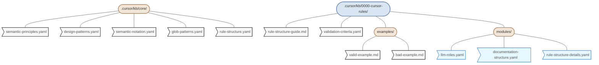
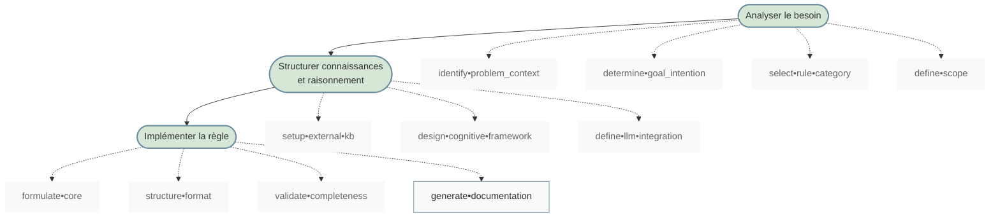
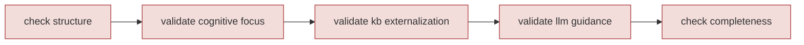
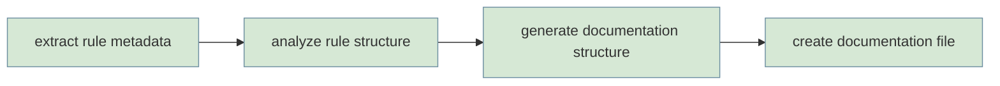
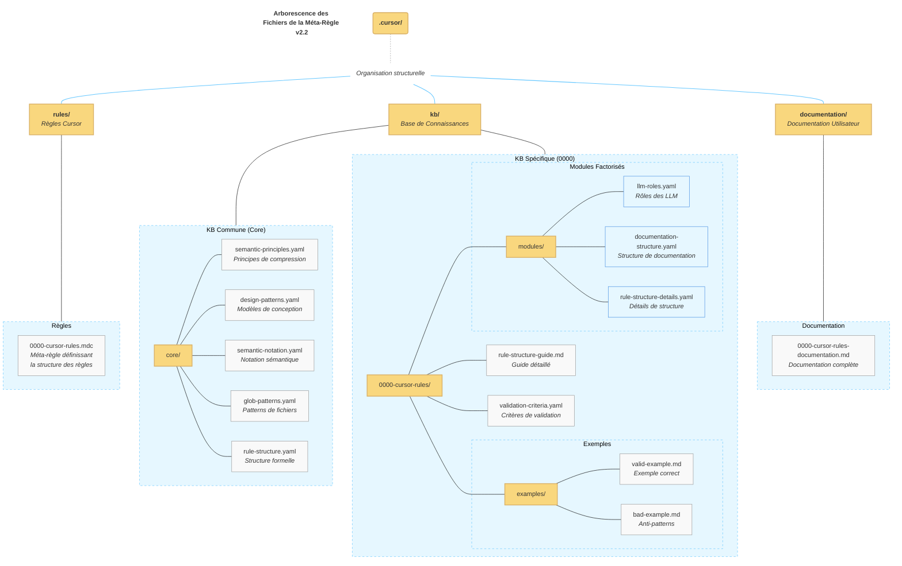

# Documentation de la Méta-Règle pour la Création de Règles Cursor

## 📋 Résumé

La méta-règle `0000-cursor-rules.mdc` définit le standard et le processus de création des règles Cursor. Elle établit une méthodologie complète pour garantir des règles cohérentes, compréhensibles et efficaces à travers un système de compression sémantique, d'externalisation des connaissances et de processus cognitifs clairs. La version actuelle (2.2) met l'accent sur la modularité et la factorisation des connaissances tout en maintenant la séparation claire entre connaissances, processus cognitifs et rôles du LLM.

| Aspect               | Description                                                                             |
| -------------------- | --------------------------------------------------------------------------------------- |
| **Objectif**         | Standardiser la création et la modification des règles Cursor                           |
| **Applicabilité**    | S'applique à tous les fichiers `.cursor/rules/*.mdc`                                    |
| **Principe central** | Compression sémantique + référencement externe + workflow cognitif structuré            |
| **Format**           | Markdown avec compression sémantique                                                    |
| **Version actuelle** | 2.2 (factorisation améliorée avec modules externalisés)                                 |
| **Prérequis**        | Comprendre les principes de compression sémantique et la structure des connaissances KB |

## 🧠 Concepts Fondamentaux

### Principes de Compression Sémantique

La compression sémantique est un système de notation qui permet de maximiser la densité d'information tout en maintenant la clarté et la précision. Elle utilise des symboles spécifiques pour représenter des concepts complexes de manière concise.

| Symbole | Signification             | Utilisation                                  |
| ------- | ------------------------- | -------------------------------------------- |
| `↹`     | Section/Catégorie         | Indique le début d'une section logique       |
| `⊕`     | Élément/Définition        | Définit un élément dans une section          |
| `→`     | Flux/Séquence             | Indique une étape séquentielle ou un flux    |
| `Σ`     | Résumé/Conclusion         | Résume ou conclut une section                |
| `⨁`     | Combinaison               | Indique la combinaison de plusieurs éléments |
| `⇌`     | Relation bidirectionnelle | Indique une relation dans les deux sens      |
| `•`     | Connecteur                | Relie des concepts ou termes associés        |
| `+`     | Addition                  | Indique l'ajout d'un concept ou propriété    |
| `[p=n]` | Niveau de priorité        | Indique l'importance (1=la plus élevée)      |

### Les Trois Piliers d'une Règle Cursor

La version 2.2 de la méta-règle maintient les trois piliers fondamentaux pour toute règle Cursor, mais avec une approche plus modulaire:


```mermaid
flowchart TD
    %% Définition des nœuds avec des formes plus élégantes
    P1(["Références KB"])
    P2(["Processus Cognitifs"])
    P3(["Délégation LLM"])
    K{{Connaissances}}
    C{{Comment penser}}
    L{{Assistance IA}}

    %% Connexions avec libellés courts
    P1 -->|"Externalise"| K
    P2 -->|"Définit"| C
    P3 -->|"Structure"| L

    %% Annotations légères
    Notation1["↹ kb&#8226;domain"] -.-> P1
    Notation2["↹ Ω&#8226;operation"] -.-> P2
    Notation3["↹ LLM&#8226;role"] -.-> P3

    %% Styles améliorés
    style P1 fill:#bedcfa,stroke:#4a6fa5,stroke-width:2px,color:#333
    style P2 fill:#c4e0f9,stroke:#4a6fa5,stroke-width:2px,color:#333
    style P3 fill:#d6eaff,stroke:#4a6fa5,stroke-width:2px,color:#333
    style K fill:#f9f9f9,stroke:#333,stroke-width:1px
    style C fill:#f9f9f9,stroke:#333,stroke-width:1px
    style L fill:#f9f9f9,stroke:#333,stroke-width:1px
    style Notation1 fill:none,stroke:none,color:#666
    style Notation2 fill:none,stroke:none,color:#666
    style Notation3 fill:none,stroke:none,color:#666
```

1. **Références KB** (`kb•domain`): Pointent vers des fichiers externes contenant les connaissances spécifiques au domaine, évitant la duplication d'information dans la règle elle-même.

2. **Processus Cognitifs** (`Ω•operation`): Définissent explicitement les processus de raisonnement, pas simplement ce qu'il faut savoir, mais comment réfléchir au problème.

3. **Délégation LLM** (`LLM•role`): Structure précisément comment le LLM doit contribuer, avec des entrées, sorties, contraintes et validations clairement définies.

### Architecture de la Base de Connaissances (KB)

La règle 2.2 utilise une architecture de connaissances encore plus modulaire avec des modules spécifiques pour différents aspects du système:


```mermaid
flowchart TD
    %% Définition du graphe principal
    CORE([".cursor/kb/core/"]) --- SP>semantic-principles.yaml]
    CORE --- DP>design-patterns.yaml]
    CORE --- SN>semantic-notation.yaml]
    CORE --- GP>glob-patterns.yaml]
    CORE --- RS>rule-structure.yaml]

    R0([".cursor/kb/0000-cursor-rules/"]) --- RSG>rule-structure-guide.md]
    R0 --- VC>validation-criteria.yaml]
    R0 --- EX([examples/])
    EX --- VE>valid-example.md]
    EX --- IE>bad-example.md]

    R0 --- MOD([modules/])
    MOD --- LR>llm-roles.yaml]
    MOD --- DS>documentation-structure.yaml]
    MOD --- RSD>rule-structure-details.yaml]

    %% Styles améliorés
    classDef coredir fill:#f2e6d9,stroke:#b58863,stroke-width:2px,color:#333
    classDef ruledir fill:#d9e6f2,stroke:#6382b5,stroke-width:2px,color:#333
    classDef file fill:#f9f9f9,stroke:#333,stroke-width:1px,color:#555
    classDef module fill:#e6f7ff,stroke:#4a90e2,stroke-width:1px,color:#555

    class CORE,EX,MOD coredir
    class R0 ruledir
    class SP,DP,SN,GP,RS,RSG,VC,VE,IE file
    class LR,DS,RSD module
```

## 🔄 Workflow de Création des Règles (Ω•create•rule)

Le workflow `Ω•create•rule` définit un processus systématique pour créer une règle Cursor efficace et conforme. La version 2.2 maintient ce processus en trois phases principales, avec une emphase sur l'externalisation:


```mermaid
flowchart TB
    %% Phases principales du workflow
    A(["Analyser le besoin"]) --> B(["Structurer connaissances<br>et raisonnement"])
    B --> C(["Implémenter la règle"])

    %% Détails des phases connectés par des lignes pointillées
    A -.-> A1["identify•problem_context"]
    A -.-> A2["determine•goal_intention"]
    A -.-> A3["select•rule•category"]
    A -.-> A4["define•scope"]

    B -.-> B1["setup•external•kb"]
    B -.-> B2["design•cognitive•framework"]
    B -.-> B3["define•llm•integration"]

    C -.-> C1["formulate•core"]
    C -.-> C2["structure•format"]
    C -.-> C3["validate•completeness"]
    C -.-> C4["generate•documentation"]

    %% Styles améliorés
    classDef phase fill:#d6e8d5,stroke:#6c8ea0,stroke-width:2px,color:#333,rx:5
    classDef step fill:#f9f9f9,stroke:none,stroke-width:1px,color:#666
    classDef newstep fill:#f9f9f9,stroke:#6c8ea0,stroke-width:1px,color:#333

    class A,B,C phase
    class A1,A2,A3,A4,B1,B2,B3,C1,C2,C3 step
    class C4 newstep
```

### Détail du Workflow Amélioré

1. **analyze•need**: Identifier le contexte du problème et l'intention

   - Identifier le contexte du problème à résoudre
   - Déterminer l'objectif précis de la règle
   - Sélectionner la catégorie appropriée
   - Définir la portée

2. **structure•knowledge•and•reasoning**: Organiser les connaissances et le raisonnement

   - Configurer les fichiers KB externes pour stocker les connaissances du domaine
   - Concevoir le cadre cognitif en identifiant les processus de raisonnement
   - Définir les points d'intégration du LLM

3. **implement•rule**: Implémenter et valider la règle
   - Formuler le contenu central (description, exigences, contraintes)
   - Structurer et formater selon les standards
   - Valider la complétude avec `Ω.validate`
   - **Générer la documentation** automatiquement avec `Ω•create•documentation` (nouveau dans v2.2)

## 🔍 Protocole de Validation (Ω.validate)

Le protocole de validation de la version 2.2 maintient la même structure simplifiée que la version 2.1, en référençant des critères externalisés:


```mermaid
flowchart LR
    CS["check structure"] --> VCF["validate cognitive focus"]
    VCF --> VKE["validate kb externalization"]
    VKE --> VLG["validate llm guidance"]
    VLG --> CC["check completeness"]

    style CS fill:#f2dddb,stroke:#a52a2a,stroke-width:1px
    style VCF fill:#f2dddb,stroke:#a52a2a,stroke-width:1px
    style VKE fill:#f2dddb,stroke:#a52a2a,stroke-width:1px
    style VLG fill:#f2dddb,stroke:#a52a2a,stroke-width:1px
    style CC fill:#f2dddb,stroke:#a52a2a,stroke-width:1px
```

### Étapes de validation externalisées

1. **check•structure**: Vérifier la présence des trois piliers (kb•references, Ω•operators, LLM•delegation)
2. **validate•cognitive•focus**: S'assurer que les processus cognitifs sont bien définis
3. **validate•kb•externalization**: Vérifier que les connaissances sont externalisées
4. **validate•llm•guidance**: Valider la clarté des instructions pour le LLM
5. **check•completeness**: Vérifier la complétude selon les critères du fichier externalisé `.cursor/kb/0000-cursor-rules/validation-criteria.yaml`

## 🔄 Processus de Génération de Documentation (Ω•create•documentation)

La version 2.2 introduit un processus formalisé pour la génération automatique de documentation:


```mermaid
flowchart LR
    ERM["extract rule metadata"] --> ARS["analyze rule structure"]
    ARS --> GDS["generate documentation structure"]
    GDS --> CDF["create documentation file"]

    style ERM fill:#d6e8d5,stroke:#6c8ea0,stroke-width:1px
    style ARS fill:#d6e8d5,stroke:#6c8ea0,stroke-width:1px
    style GDS fill:#d6e8d5,stroke:#6c8ea0,stroke-width:1px
    style CDF fill:#d6e8d5,stroke:#6c8ea0,stroke-width:1px
```

### Étapes du processus de documentation

1. **extract•rule•metadata**: Extraire les métadonnées de la règle source
2. **analyze•rule•structure**: Analyser les sections de la règle et identifier les concepts clés
3. **generate•documentation•structure**: Générer la structure de documentation basée sur un template
4. **create•documentation•file**: Créer le fichier de documentation dans l'emplacement approprié

Ce processus permet de maintenir une documentation cohérente et à jour avec la règle elle-même.

## 🤖 Stratégie de Délégation au LLM (v2.2)

La version 2.2 clarifie davantage les rôles du LLM en externalisant leurs détails dans des modules dédiés:


```mermaid
flowchart TD
    %% Structure principale
    LLM(["LLM•rule•creator (v2.2)"]) --> ROLES
    LLM --> INPUTS
    LLM --> OUTPUTS
    LLM --> EXT["Détails externalisés:<br>kb•cursor•rules.llm_roles"]

    %% Groupes avec des formes distinctives
    subgraph ROLES [Rôles du LLM]
        direction LR
        KO[/kb_organizer/]
        CD[/cognitive_designer/]
        LI[/llm_integrator/]
    end

    subgraph INPUTS [Entrées requises]
        direction LR
        RD[(rule_domain)]
        RP[(rule_purpose)]
        TU[(target_users)]
    end

    subgraph OUTPUTS [Sorties attendues]
        direction LR
        KS{{kb_structure}}
        CM{{cognitive_model}}
        LD{{llm_delegation}}
    end

    %% Styles améliorés
    classDef llm fill:#e3d2ff,stroke:#6a3daf,stroke-width:2px,color:#333,rx:5
    classDef group fill:#f9f9f9,stroke:#666,stroke-width:1px,color:#333
    classDef role fill:#d8e7ff,stroke:#3d6daf,stroke-width:1px,color:#333
    classDef input fill:#ffeed8,stroke:#af7d3d,stroke-width:1px,color:#333
    classDef output fill:#d8ffe7,stroke:#3daf6d,stroke-width:1px,color:#333
    classDef ext fill:#ffe7d8,stroke:#af6d3d,stroke-width:1px,color:#333,rx:5

    class LLM llm
    class ROLES,INPUTS,OUTPUTS group
    class KO,CD,LI role
    class RD,RP,TU input
    class KS,CM,LD output
    class EXT ext
```

Cette structure avec référence externe garantit que:

- La règle principale reste concise et focalisée sur l'essentiel
- Les détails d'implémentation sont externalisés dans des modules spécialisés
- Les mises à jour de l'un n'affectent pas nécessairement l'autre

## 🧩 Modules Factorisés (Nouveauté v2.2)

La version 2.2 introduit trois nouveaux modules qui externalisent des aspects spécifiques de la règle:

### 1. Module Rôles LLM (`llm-roles.yaml`)

Ce module externalise les détails des rôles du LLM, incluant:

- Définition précise des rôles pour la création de règles
- Définition des rôles pour la génération de documentation
- Entrées, sorties et critères de qualité pour chaque rôle

### 2. Module Structure de Documentation (`documentation-structure.yaml`)

Ce module externalise tout ce qui concerne la structure de la documentation:

- Principes de documentation (complétude, cohérence, clarté, traçabilité)
- Sections requises et recommandées avec leur ordre
- Types de diagrammes à inclure
- Éléments clés pour une documentation efficace

### 3. Module Détails de Structure de Règle (`rule-structure-details.yaml`)

Ce module externalise les détails concernant la structure des règles:

- Syntaxe et exemple pour chaque section requise
- Erreurs courantes à éviter
- Directives de formatage et placement des symboles
- Critères de validation des règles

## 🌲 Arborescence des Fichiers de la Méta-Règle (v2.2)

### Représentation Graphique


```mermaid
%%{init: {'theme': 'base', 'themeVariables': { 'primaryColor': '#f0f8ff', 'fontSize': '16px'}}}%%
flowchart TD
    %% Titre du diagramme
    title[<b>Arborescence des Fichiers de la Méta-Règle v2.2</b>]
    style title fill:none,stroke:none

    %% Organisation principale
    ROOT("<b>.cursor/</b>") --- STRUCTURE("<i>Organisation structurelle</i>")
    STRUCTURE --- RULES["<b>rules/</b><br><i>Règles Cursor</i>"]
    STRUCTURE --- KB["<b>kb/</b><br><i>Base de Connaissances</i>"]
    STRUCTURE --- DOC["<b>documentation/</b><br><i>Documentation Utilisateur</i>"]

    %% Section des règles
    subgraph RULES_GROUP ["Règles"]
        METARULE["0000-cursor-rules.mdc<br><i>Méta-règle définissant<br>la structure des règles</i>"]
    end
    RULES --- RULES_GROUP

    %% Section KB Core
    subgraph KB_CORE ["KB Commune (Core)"]
        CORE["core/"] --- SP["semantic-principles.yaml<br><i>Principes de compression</i>"]
        CORE --- DP["design-patterns.yaml<br><i>Modèles de conception</i>"]
        CORE --- SN["semantic-notation.yaml<br><i>Notation sémantique</i>"]
        CORE --- GP["glob-patterns.yaml<br><i>Patterns de fichiers</i>"]
        CORE --- RS["rule-structure.yaml<br><i>Structure formelle</i>"]
    end
    KB --- KB_CORE

    %% Section KB 0000
    subgraph KB_SPECIFIC ["KB Spécifique (0000)"]
        KB0000["0000-cursor-rules/"] --- RSG["rule-structure-guide.md<br><i>Guide détaillé</i>"]
        KB0000 --- VC["validation-criteria.yaml<br><i>Critères de validation</i>"]

        subgraph EXAMPLES ["Exemples"]
            EX["examples/"] --- VE["valid-example.md<br><i>Exemple correct</i>"]
            EX --- IE["bad-example.md<br><i>Anti-patterns</i>"]
        end
        KB0000 --- EX

        subgraph MODULES ["Modules Factorisés"]
            MOD["modules/"] --- LR["llm-roles.yaml<br><i>Rôles des LLM</i>"]
            MOD --- DS["documentation-structure.yaml<br><i>Structure de documentation</i>"]
            MOD --- RSD["rule-structure-details.yaml<br><i>Détails de structure</i>"]
        end
        KB0000 --- MOD
    end
    KB --- KB_SPECIFIC

    %% Section Documentation
    subgraph DOC_GROUP ["Documentation"]
        METADOC["0000-cursor-rules-documentation.md<br><i>Documentation complète</i>"]
    end
    DOC --- DOC_GROUP

    %% Légende
    classDef directory fill:#f9d77e,stroke:#d9b066,stroke-width:2px,border-radius:8px
    classDef file fill:#f9f9f9,stroke:#999,stroke-width:1px,border-radius:4px
    classDef module fill:#e6f7ff,stroke:#4a90e2,stroke-width:1px,border-radius:4px
    classDef section fill:#e6f7ff,stroke:#67c8ff,stroke-width:1px,stroke-dasharray:5 5,border-radius:10px
    classDef label fill:none,stroke:none

    class ROOT,RULES,KB,DOC,CORE,KB0000,EX,MOD directory
    class METARULE,SP,DP,SN,GP,RS,RSG,VC,VE,IE,METADOC file
    class LR,DS,RSD module
    class STRUCTURE label
    class RULES_GROUP,KB_CORE,KB_SPECIFIC,DOC_GROUP,EXAMPLES,MODULES section

    %% Annotations sur les relations
    linkStyle 0 stroke:#999,stroke-width:1px,stroke-dasharray:3 3
    linkStyle 1,2,3 stroke:#67c8ff,stroke-width:1.5px
```

### Représentation Textuelle Détaillée

L'organisation des fichiers de la méta-règle v2.2 suit une structure hiérarchique améliorée avec externalisation des modules :

```
.cursor/                                     # Répertoire racine contenant tous les éléments Cursor
│
├── rules/                                   # Contient toutes les règles Cursor
│   │
│   └── 0000-cursor-rules.mdc                # LA MÉTA-RÈGLE PRINCIPALE (v2.2)
│       • Définit la structure des règles
│       • Établit les processus cognitifs
│       • Spécifie la délégation au LLM
│       • Pointe vers les fichiers KB externes
│       • Utilise le principe de factorisation
│
├── kb/                                      # BASE DE CONNAISSANCES
│   │
│   ├── core/                                # KB COMMUNE (réutilisable par plusieurs règles)
│   │   │
│   │   ├── semantic-principles.yaml         # Principes fondamentaux de compression sémantique
│   │   ├── design-patterns.yaml             # Modèles de conception pour les règles
│   │   ├── semantic-notation.yaml           # Notation formelle pour la compression sémantique
│   │   ├── glob-patterns.yaml               # Modèles pour les fichiers ciblés par les règles
│   │   └── rule-structure.yaml              # Structure formelle des règles
│   │
│   └── 0000-cursor-rules/                   # KB SPÉCIFIQUE À LA MÉTA-RÈGLE
│       │
│       ├── rule-structure-guide.md          # Guide détaillé et complet sur la structure des règles
│       ├── validation-criteria.yaml         # Critères formels pour valider la conformité des règles
│       │
│       ├── examples/                        # EXEMPLES DE RÈGLES
│       │   ├── valid-example.md             # Exemple de règle correctement structurée
│       │   └── bad-example.md               # Contre-exemple avec anti-patterns
│       │
│       └── modules/                         # MODULES FACTORISÉS (NOUVEAUTÉ v2.2)
│           │
│           ├── llm-roles.yaml               # Définition détaillée des rôles LLM
│           │   • Rôles pour la création de règles
│           │   • Rôles pour la génération de documentation
│           │   • Entrées, sorties et critères de qualité
│           │
│           ├── documentation-structure.yaml # Structure de la documentation
│           │   • Principes de documentation
│           │   • Sections requises et recommandées
│           │   • Types de diagrammes à inclure
│           │
│           └── rule-structure-details.yaml  # Détails de la structure des règles
│               • Syntaxe de chaque section
│               • Erreurs courantes à éviter
│               • Directives de formatage
│
└── documentation/                           # DOCUMENTATION UTILISATEUR
    │
    └── 0000-cursor-rules-documentation.md   # Documentation complète de la méta-règle (ce document)
        • Mise à jour pour la version 2.2
        • Explication des modules factorisés
        • Guide d'utilisation
        • Représentations visuelles
```

### Relations entre les composants

- **Règle principale** (`.mdc`) : Version 2.2 plus concise, faisant référence aux modules externalisés
- **Modules factorisés** (nouveauté v2.2) :
  - `llm-roles.yaml` : Détails des rôles LLM
  - `documentation-structure.yaml` : Structure de documentation
  - `rule-structure-details.yaml` : Détails de structure des règles
- **Fichiers KB** :
  - Organisation maintenue avec amélioration de la modularité
- **Documentation** : Mise à jour pour refléter les changements de la v2.2

Cette structure améliorée illustre le principe de factorisation et d'externalisation des connaissances, démontrant dans sa propre structure les principes qu'elle promeut.

## ✅ Liste de Vérification v2.2

Utilisez cette liste pour valider votre règle selon la version 2.2:

- [ ] Contient les trois piliers: Références KB, Processus Cognitifs, Délégation LLM
- [ ] Externalise correctement les connaissances dans des fichiers KB
- [ ] Applique le principe de factorisation pour les détails d'implémentation
- [ ] Définit clairement les processus de raisonnement (pas juste des informations)
- [ ] Structure précisément la contribution du LLM avec références aux modules
- [ ] Utilise la compression sémantique de manière cohérente
- [ ] A été validée avec `Ω.validate`
- [ ] Intègre le processus de génération de documentation
- [ ] Maintient la concision de la règle principale
- [ ] Respecte la structure recommandée pour chaque section

## 📚 Ressources Additionnelles

Pour plus de détails sur l'implémentation de la méta-règle 2.2, consultez:

- `.cursor/kb/0000-cursor-rules/rule-structure-guide.md` - Guide complet de structure
- `.cursor/kb/0000-cursor-rules/validation-criteria.yaml` - Critères formels de validation
- `.cursor/kb/0000-cursor-rules/examples/valid-example.md` - Exemple de règle bien structurée
- `.cursor/kb/0000-cursor-rules/modules/llm-roles.yaml` - Détails des rôles LLM
- `.cursor/kb/0000-cursor-rules/modules/documentation-structure.yaml` - Structure de documentation
- `.cursor/kb/0000-cursor-rules/modules/rule-structure-details.yaml` - Détails de structure des règles
