# Apex Meta-Rule Dependency Map

## Visual Diagram

```mermaid
graph TD;
    %% ---- Root Meta-Rule ----
    R0000["@rule/0000-cursor-rules (MetaRule @ .cursor/rules/)"];

    %% ---- Direct Dependencies of @0000-cursor-rules ----
    KB_CorePrinciples["core_principles (KB @ .../knowledge/)"];
    KB_InitialRefs["initial_kb_references (KB @ .../config/)"];
    WF_CreateRule["create_cursor_rule (Workflow @ .../workflows/)"];

    R0000 --> KB_CorePrinciples;
    R0000 --> KB_InitialRefs;
    R0000 --> WF_CreateRule;

    %% ---- Dependencies of KB_CorePrinciples ----
    KB_SemanticLang["semantic_language (KB @ .../knowledge/)"];
    KB_CorePrinciples --> KB_SemanticLang;

    %% ---- Dependencies of WF_CreateRule ----
    OP_AssessComplexity["assess_complexity (Operation @ .../operations/)"];
    KB_Spec_AssessComplexity["assess_complexity (Spec KB @ .../specs/)"];
    OP_AdaptStrategy["adapt_workflow_strategy (Operation @ .../operations/)"];
    OP_RequestClarification["request_clarification (Operation @ .../operations/)"];
    OP_CreateEcosystem["create_rule_ecosystem (Operation @ .../operations/)"];
    OP_ImplementCore["implement_core_rule_file (Operation @ .../operations/)"];
    OP_CreateDocs["create_documentation (Operation @ .../operations/)"];
    OP_ValidateEcosystem["validate_ecosystem (Operation @ .../operations/)"];
    OP_FinalizeCreation["finalize_creation (Operation @ .../operations/)"];

    WF_CreateRule --> KB_InitialRefs;
    WF_CreateRule --> OP_AssessComplexity;
    OP_AssessComplexity --> KB_Spec_AssessComplexity;
    WF_CreateRule --> OP_AdaptStrategy;
    WF_CreateRule --> OP_RequestClarification;
    WF_CreateRule --> OP_CreateEcosystem;
    WF_CreateRule --> OP_ImplementCore;
    WF_CreateRule --> OP_CreateDocs;
    WF_CreateRule --> OP_ValidateEcosystem;
    WF_CreateRule --> OP_FinalizeCreation;

    %% ---- Dependencies of Operations ----
    LLM_InterpretFeedback["interpret_clarification_feedback (LLMContract @ .../llm_contracts/)"];
    LLM_ComplexityAssessor["complexity_assessor (LLMContract @ .../llm_contracts/)"];
    LLM_KBContentGen["kb_content_generator (LLMContract @ .../llm_contracts/)"];
    KB_MDCGenPrompt["semantic_mdc_generator_prompt (Prompt KB @ .../prompts/)"];
    LLM_MDCRefiner["mdc_semantic_refiner (LLMContract @ .../llm_contracts/)"];
    LLM_DocGen["documentation_generator (LLMContract @ .../llm_contracts/)"];

    OP_AssessComplexity --> LLM_ComplexityAssessor;
    OP_AdaptStrategy --> KB_InitialRefs;
    %% Already depicted from WF
    OP_RequestClarification --> LLM_InterpretFeedback;
    OP_CreateEcosystem --> LLM_KBContentGen;
    OP_ImplementCore --> KB_MDCGenPrompt;
    OP_ImplementCore --> LLM_MDCRefiner;
    OP_CreateDocs --> LLM_DocGen;

    %% ---- Styling ----
    classDef rule fill:#ddffdd,stroke:#3c3,stroke-width:1px;
    classDef kb fill:#ffffcc,stroke:#cccc00,stroke-width:1px;
    classDef kbSpec fill:#ddeeff,stroke:#36c,stroke-width:1px,color:#000;
    classDef workflow fill:#e6ccff,stroke:#9900cc,stroke-width:1px;
    classDef operation fill:#cce6ff,stroke:#007acc,stroke-width:1px;
    classDef llmContract fill:#ffd9b3,stroke:#ff8000,stroke-width:1px;

    class R0000 rule;
    class KB_CorePrinciples,KB_InitialRefs,KB_SemanticLang,KB_MDCGenPrompt kb;
    class KB_Spec_AssessComplexity kbSpec;
    class WF_CreateRule workflow;
    class OP_AssessComplexity,OP_AdaptStrategy,OP_RequestClarification,OP_CreateEcosystem,OP_ImplementCore,OP_CreateDocs,OP_ValidateEcosystem,OP_FinalizeCreation operation;
    class LLM_InterpretFeedback,LLM_ComplexityAssessor,LLM_KBContentGen,LLM_MDCRefiner,LLM_DocGen llmContract;
```

## Component Definitions

Below is a list of components involved in the `@rule/0000-cursor-rules` ecosystem, their types, internal versions, purposes, paths, and current status after Phase 1 stabilization and Phase 2 refactoring. IDs used below are the versionless identifiers.

1.  **ID:** `@rule/0000-cursor-rules`
    *   **Type:** MetaRule
    *   **Path:** `.cursor/rules/0000-cursor-rules.mdc`
    *   **Internal Version:** `1.0.0`
    *   **Status:** Exists
    *   **Purpose:** Main entry point for Apex-driven Cursor rule creation.
    *   **Dependencies:** `@kb/0000-cursor-rules/knowledge/core_principles`, `@kb/0000-cursor-rules/config/initial_kb_references`, `@workflow/0000-cursor-rules/create_cursor_rule`
    *   **Referenced By:** None (Root of this map)

2.  **ID:** `@kb/0000-cursor-rules/knowledge/core_principles`
    *   **Type:** KB (MDC)
    *   **Path:** `.cursor/kb/0000-cursor-rules/knowledge/core_principles.mdc`
    *   **Internal Version:** `1.0.0`
    *   **Status:** Exists
    *   **Purpose:** Core principles for Cursor rule creation.
    *   **Dependencies:** `@kb/0000-cursor-rules/knowledge/semantic_language`
    *   **Referenced By:** `@rule/0000-cursor-rules`

3.  **ID:** `@kb/0000-cursor-rules/knowledge/semantic_language`
    *   **Type:** KB (YAML)
    *   **Path:** `.cursor/kb/0000-cursor-rules/knowledge/semantic_language.yaml`
    *   **Internal Version:** `1.0.0`
    *   **Status:** Skeleton Created
    *   **Purpose:** Defines core semantic keywords, operators, and structural conventions for Apex .mdc syntax.
    *   **Dependencies:** None
    *   **Referenced By:** `@kb/0000-cursor-rules/knowledge/core_principles`

4.  **ID:** `@kb/0000-cursor-rules/config/initial_kb_references`
    *   **Type:** KB (YAML)
    *   **Path:** `.cursor/kb/0000-cursor-rules/config/initial_kb_references.yaml`
    *   **Internal Version:** `1.0.0`
    *   **Status:** Skeleton Created
    *   **Purpose:** Configuration listing common/default KB references for the rule creation process.
    *   **Dependencies:** None
    *   **Referenced By:** `@rule/0000-cursor-rules`, `@workflow/0000-cursor-rules/create_cursor_rule`, `@op/0000-cursor-rules/adapt_workflow_strategy`

5.  **ID:** `@workflow/0000-cursor-rules/create_cursor_rule`
    *   **Type:** Workflow
    *   **Path:** `.cursor/rules/0000-cursor-rules/workflows/create_cursor_rule.mdc`
    *   **Internal Version:** `1.0.1`
    *   **Status:** Exists
    *   **Purpose:** Orchestrates creating a Cursor rule.
    *   **Dependencies:** `@kb/0000-cursor-rules/config/initial_kb_references`, `@op/0000-cursor-rules/assess_complexity`, `@op/0000-cursor-rules/adapt_workflow_strategy`, `@op/0000-cursor-rules/request_clarification`, `@op/0000-cursor-rules/create_rule_ecosystem`, `@op/0000-cursor-rules/implement_core_rule_file`, `@op/0000-cursor-rules/create_documentation`, `@op/0000-cursor-rules/validate_ecosystem`, `@op/0000-cursor-rules/finalize_creation`
    *   **Referenced By:** `@rule/0000-cursor-rules`

6.  **ID:** `@op/0000-cursor-rules/assess_complexity`
    *   **Type:** Operation
    *   **Path:** `.cursor/rules/0000-cursor-rules/operations/assess_complexity.mdc`
    *   **Internal Version:** `1.0.0`
    *   **Status:** Skeleton Created
    *   **Purpose:** Assesses complexity of a rule request.
    *   **Dependencies:** `@kb/0000-cursor-rules/specs/assess_complexity`, `@llm_contract/0000-cursor-rules/complexity_assessor`
    *   **Referenced By:** `@workflow/0000-cursor-rules/create_cursor_rule`

7.  **ID:** `@kb/0000-cursor-rules/specs/assess_complexity`
    *   **Type:** KB (OperationSpec MDC)
    *   **Path:** `.cursor/kb/0000-cursor-rules/specs/assess_complexity.mdc`
    *   **Internal Version:** `1.0.0`
    *   **Status:** Skeleton Created
    *   **Purpose:** Provides detailed criteria for complexity assessment.
    *   **Dependencies:** None
    *   **Referenced By:** `@op/0000-cursor-rules/assess_complexity`

8.  **ID:** `@llm_contract/0000-cursor-rules/complexity_assessor`
    *   **Type:** LLMContract
    *   **Path:** `.cursor/rules/0000-cursor-rules/llm_contracts/complexity_assessor.mdc`
    *   **Internal Version:** `1.0.0`
    *   **Status:** Skeleton Created
    *   **Purpose:** LLM contract to assess rule_request complexity.
    *   **Dependencies:** None
    *   **Referenced By:** `@op/0000-cursor-rules/assess_complexity`

9.  **ID:** `@op/0000-cursor-rules/adapt_workflow_strategy`
    *   **Type:** Operation
    *   **Path:** `.cursor/rules/0000-cursor-rules/operations/adapt_workflow_strategy.mdc`
    *   **Internal Version:** `1.0.1`
    *   **Status:** Skeleton Created
    *   **Purpose:** Adapts workflow strategy and generates target artifact manifest.
    *   **Dependencies:** `@kb/0000-cursor-rules/config/initial_kb_references`
    *   **Referenced By:** `@workflow/0000-cursor-rules/create_cursor_rule`

10. **ID:** `@op/0000-cursor-rules/request_clarification`
    *   **Type:** Operation
    *   **Path:** `.cursor/rules/0000-cursor-rules/operations/request_clarification.mdc`
    *   **Internal Version:** `1.0.0`
    *   **Status:** Skeleton Created
    *   **Purpose:** Engages the user for clarification.
    *   **Dependencies:** `@llm_contract/0000-cursor-rules/interpret_clarification_feedback`
    *   **Referenced By:** `@workflow/0000-cursor-rules/create_cursor_rule`

11. **ID:** `@llm_contract/0000-cursor-rules/interpret_clarification_feedback`
    *   **Type:** LLMContract
    *   **Path:** `.cursor/rules/0000-cursor-rules/llm_contracts/interpret_clarification_feedback.mdc`
    *   **Internal Version:** `1.0.0`
    *   **Status:** Skeleton Created
    *   **Purpose:** Interprets user feedback for clarification.
    *   **Dependencies:** None
    *   **Referenced By:** `@op/0000-cursor-rules/request_clarification`

12. **ID:** `@op/0000-cursor-rules/create_rule_ecosystem`
    *   **Type:** Operation
    *   **Path:** `.cursor/rules/0000-cursor-rules/operations/create_rule_ecosystem.mdc`
    *   **Internal Version:** `1.0.1`
    *   **Status:** Skeleton Created
    *   **Purpose:** Creates the KB ecosystem for a new rule.
    *   **Dependencies:** `@llm_contract/0000-cursor-rules/kb_content_generator`
    *   **Referenced By:** `@workflow/0000-cursor-rules/create_cursor_rule`

13. **ID:** `@llm_contract/0000-cursor-rules/kb_content_generator`
    *   **Type:** LLMContract
    *   **Path:** `.cursor/rules/0000-cursor-rules/llm_contracts/kb_content_generator.mdc`
    *   **Internal Version:** `1.0.0`
    *   **Status:** Skeleton Created
    *   **Purpose:** LLM contract to generate KB content.
    *   **Dependencies:** None
    *   **Referenced By:** `@op/0000-cursor-rules/create_rule_ecosystem`

14. **ID:** `@op/0000-cursor-rules/implement_core_rule_file`
    *   **Type:** Operation
    *   **Path:** `.cursor/rules/0000-cursor-rules/operations/implement_core_rule_file.mdc`
    *   **Internal Version:** `1.0.2`
    *   **Status:** Skeleton Created
    *   **Purpose:** Generates the core rule `.mdc` file content.
    *   **Dependencies:** `@kb/0000-cursor-rules/prompts/semantic_mdc_generator_prompt`, `@llm_contract/0000-cursor-rules/mdc_semantic_refiner`
    *   **Referenced By:** `@workflow/0000-cursor-rules/create_cursor_rule`

15. **ID:** `@kb/0000-cursor-rules/prompts/semantic_mdc_generator_prompt`
    *   **Type:** KB (Prompt TXT)
    *   **Path:** `.cursor/kb/0000-cursor-rules/prompts/semantic_mdc_generator_prompt.txt`
    *   **Internal Version:** `1.0.0`
    *   **Status:** Skeleton Created
    *   **Purpose:** Prompt for semantic .mdc rule generation.
    *   **Dependencies:** None
    *   **Referenced By:** `@op/0000-cursor-rules/implement_core_rule_file`

16. **ID:** `@llm_contract/0000-cursor-rules/mdc_semantic_refiner`
    *   **Type:** LLMContract
    *   **Path:** `.cursor/rules/0000-cursor-rules/llm_contracts/mdc_semantic_refiner.mdc`
    *   **Internal Version:** `1.0.0`
    *   **Status:** Skeleton Created
    *   **Purpose:** LLM contract to refine .mdc content.
    *   **Dependencies:** None
    *   **Referenced By:** `@op/0000-cursor-rules/implement_core_rule_file`

17. **ID:** `@op/0000-cursor-rules/create_documentation`
    *   **Type:** Operation
    *   **Path:** `.cursor/rules/0000-cursor-rules/operations/create_documentation.mdc`
    *   **Internal Version:** `1.0.1`
    *   **Status:** Skeleton Created
    *   **Purpose:** Generates documentation for the new rule.
    *   **Dependencies:** `@llm_contract/0000-cursor-rules/documentation_generator`
    *   **Referenced By:** `@workflow/0000-cursor-rules/create_cursor_rule`

18. **ID:** `@llm_contract/0000-cursor-rules/documentation_generator`
    *   **Type:** LLMContract
    *   **Path:** `.cursor/rules/0000-cursor-rules/llm_contracts/documentation_generator.mdc`
    *   **Internal Version:** `1.0.0`
    *   **Status:** Skeleton Created
    *   **Purpose:** LLM contract to generate documentation.
    *   **Dependencies:** None
    *   **Referenced By:** `@op/0000-cursor-rules/create_documentation`

19. **ID:** `@op/0000-cursor-rules/validate_ecosystem`
    *   **Type:** Operation
    *   **Path:** `.cursor/rules/0000-cursor-rules/operations/validate_ecosystem.mdc`
    *   **Internal Version:** `1.0.1`
    *   **Status:** Skeleton Created
    *   **Purpose:** Validates the created rule ecosystem.
    *   **Dependencies:** None
    *   **Referenced By:** `@workflow/0000-cursor-rules/create_cursor_rule`

20. **ID:** `@op/0000-cursor-rules/finalize_creation`
    *   **Type:** Operation
    *   **Path:** `.cursor/rules/0000-cursor-rules/operations/finalize_creation.mdc`
    *   **Internal Version:** `1.0.0`
    *   **Status:** Skeleton Created
    *   **Purpose:** Finalizes rule creation and compiles a report.
    *   **Dependencies:** None
    *   **Referenced By:** `@workflow/0000-cursor-rules/create_cursor_rule`
