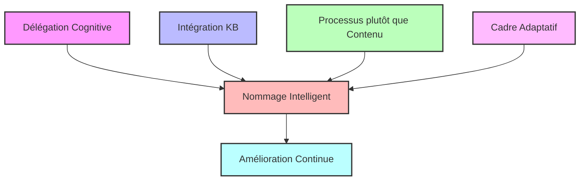
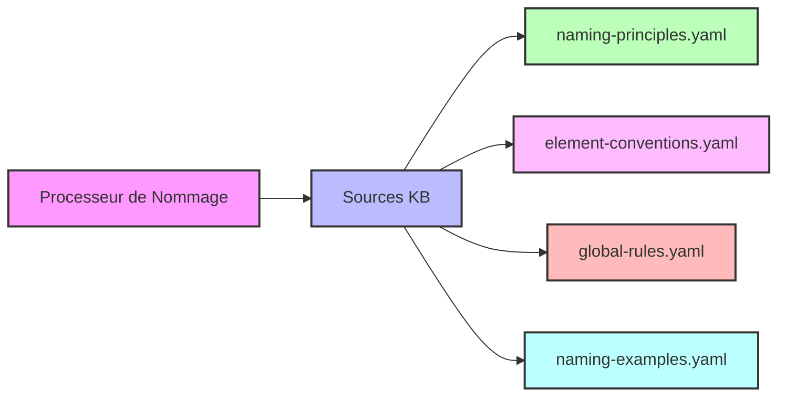
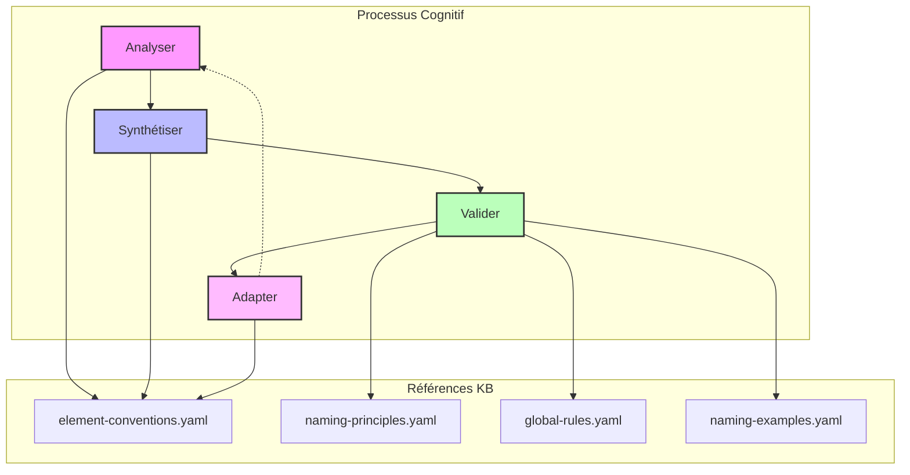
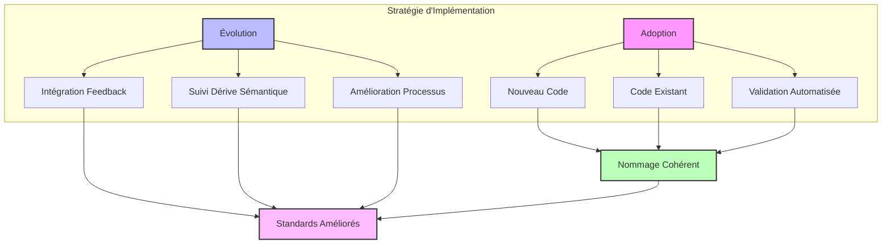
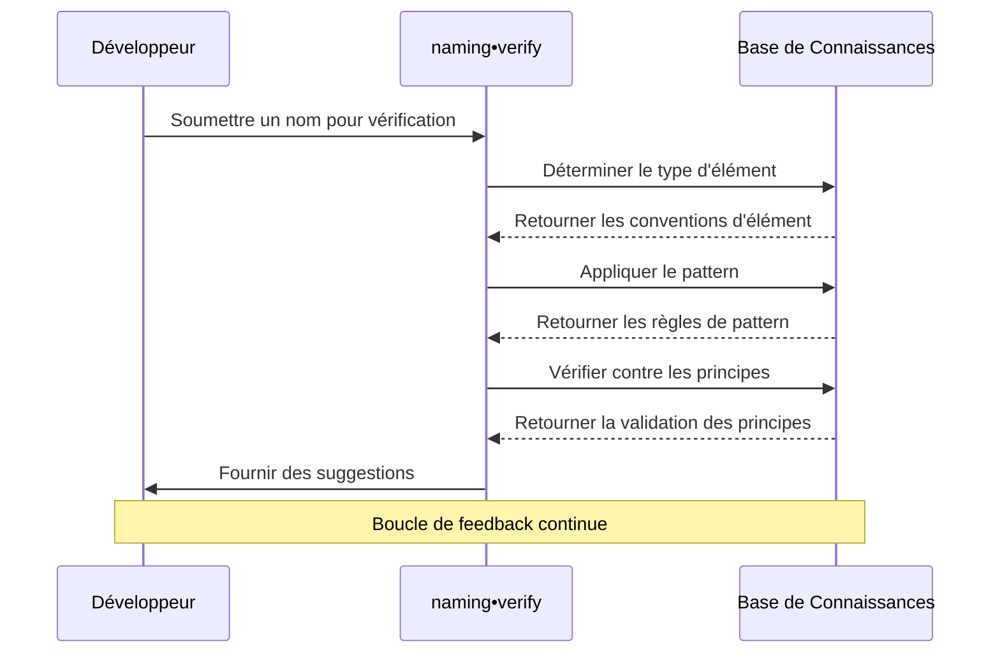
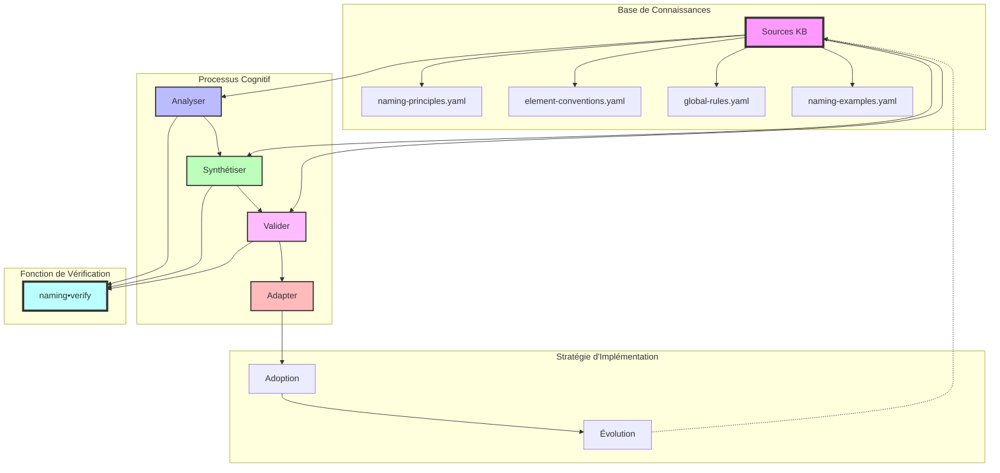

# Documentation du Workflow Cognitif des Standards de Nommage

## Aperçu

Le Workflow Cognitif des Standards de Nommage définit une approche structurée pour nommer les éléments dans le code. Au lieu de coder en dur des règles de nommage spécifiques, ce workflow délègue la complexité de transformation aux Grands Modèles de Langage (LLMs) tout en maintenant le contrôle sur les données d'entrée (KB) et les paramètres.

Cette documentation explique comment appliquer le workflow cognitif défini dans `1002-meta-naming-standards.mdc`, en détaillant sa structure, ses composants et son application pratique.

## Table des matières

1. [Concepts fondamentaux](#concepts-fondamentaux)
2. [Base de connaissances](#base-de-connaissances)
3. [Processus cognitif](#processus-cognitif)
4. [Stratégie d'implémentation](#stratégie-dimplémentation)
5. [Fonction de vérification](#fonction-de-vérification)
6. [Visualisation du workflow](#visualisation-du-workflow)
7. [Exemples pratiques](#exemples-pratiques)
8. [Intégration avec les outils](#intégration-avec-les-outils)
9. [Bonnes pratiques](#bonnes-pratiques)
10. [Résolution des problèmes](#résolution-des-problèmes)

## Concepts fondamentaux

Le workflow des standards de nommage est construit sur ces concepts fondamentaux :

- **Délégation cognitive** : Déléguer la complexité de transformation aux LLMs
- **Intégration KB** : Maintenir le contrôle via des fichiers de base de connaissances
- **Processus plutôt que contenu** : Définir le processus de réflexion plutôt que des règles spécifiques
- **Cadre adaptatif** : Offrir de la flexibilité pour différents contextes de code
- **Amélioration continue** : Intégrer des mécanismes de feedback pour l'amélioration



## Base de connaissances

Le workflow fait référence à des fichiers de base de connaissances (KB) externes qui contiennent les conventions de nommage, principes et exemples. Cette séparation permet aux règles d'évoluer indépendamment du processus cognitif.

### Sources KB

| Fichier KB                 | Objectif                                  | Contenu                                                 |
| -------------------------- | ----------------------------------------- | ------------------------------------------------------- |
| `naming-principles.yaml`   | Définit les principes fondamentaux        | Descriptif, recherchable, cohérent, concis, cohérent    |
| `element-conventions.yaml` | Associe les types d'éléments aux patterns | Fichiers, dossiers, variables, fonctions, classes, etc. |
| `global-rules.yaml`        | Spécifie les contraintes globales         | Longueur max, politiques d'abréviations, etc.           |
| `naming-examples.yaml`     | Fournit des exemples                      | Exemples valides et invalides avec explications         |



## Processus cognitif

Le cœur du workflow est un processus cognitif en quatre étapes :

### 1. Analyser

Comprendre l'élément et son contexte :

- Identifier l'objectif et le contexte
- Déterminer le type d'élément en utilisant les conventions KB
- Évaluer le rôle fonctionnel
- Évaluer la portée et la visibilité

### 2. Synthétiser

Appliquer le pattern approprié pour créer un nom :

- Récupérer le pattern pertinent depuis la KB
- Appliquer le pattern à l'intention de l'élément
- Transformer l'objectif fonctionnel en nom
- Vérifier l'unicité dans l'espace de noms

### 3. Valider

Vérifier le nom par rapport aux principes et contraintes :

- Vérifier les principes de nommage (descriptif, recherchable, etc.)
- Valider contre les contraintes globales (longueur, abréviations)
- Comparer avec les exemples de la KB
- Évaluer la qualité multidimensionnelle (clarté, concision, etc.)

### 4. Adapter

Ajuster aux contextes spécifiques du projet :

- Détecter les patterns existants dans le code
- Aligner avec le vocabulaire du domaine
- Maintenir la cohérence avec le code existant
- Équilibrer les standards avec les besoins contextuels spécifiques



## Stratégie d'implémentation

Le workflow inclut des stratégies pour adopter et faire évoluer les standards de nommage :

### Adoption

- **Nouveau code** : Appliquer le processus cognitif à tout nouveau code
- **Code existant** : Refactoriser le nommage de manière opportuniste lors de la maintenance
- **Validation automatisée** : Intégrer avec des linters et des outils de qualité de code

### Évolution

- **Intégration de feedback** : Apprendre des corrections et ajustements
- **Suivi de la dérive sémantique** : Identifier quand les concepts de nommage évoluent
- **Amélioration du processus** : Améliorer le workflow cognitif au fil du temps



## Fonction de vérification

La fonction `naming•verify` encapsule le processus cognitif dans une fonction de vérification rationalisée :

1. Analyser pour déterminer le type d'élément
2. Synthétiser en appliquant le pattern approprié
3. Valider par rapport à toutes les sources KB
4. Suggérer des améliorations si nécessaire



## Visualisation du workflow

Ce diagramme illustre le workflow cognitif complet des standards de nommage :



## Exemples pratiques

### Exemple 1 : Nommer une variable

```javascript
// Application du workflow cognitif
// ANALYSER : C'est une variable booléenne indiquant le statut de vérification d'un utilisateur
// SYNTHÉTISER : Pour les variables booléennes, utiliser le pattern isPrefixed des conventions
// VALIDER : Vérifier contre les principes de nommage (descriptif, recherchable, etc.)
// ADAPTER : Aligner avec la terminologie du domaine

// Bon : Suivre le workflow cognitif
const isVerified = checkUserVerification();

// Mauvais : Ne pas suivre le workflow cognitif
const verified = checkUserVerification();
```

### Exemple 2 : Nommer un composant

```typescript
// ANALYSER : Composant React pour afficher le profil utilisateur
// SYNTHÉTISER : Pour les composants, utiliser le pattern PascalCase
// VALIDER : Assurer que le nom est descriptif et suit les conventions
// ADAPTER : Aligner avec le nommage des composants existants dans le projet

// Bon : Suivre le workflow cognitif
const UserProfileCard = () => {
  // Implémentation du composant
};

// Mauvais : Ne pas suivre le workflow cognitif
const userprofilecard = () => {
  // Implémentation du composant
};
```

## Intégration avec les outils

Le workflow cognitif des standards de nommage peut être intégré avec divers outils de développement :

- **Linters** : Configurer ESLint/TSLint avec des règles de conventions de nommage
- **Pipelines CI/CD** : Ajouter la validation de nommage aux vérifications de pull request
- **Extensions d'IDE** : Créer des plugins qui suggèrent des noms basés sur le workflow
- **Générateurs de documentation** : Documenter automatiquement les patterns de nommage utilisés

## Bonnes pratiques

- **Commencer par l'analyse** : Toujours commencer par comprendre l'objectif de l'élément
- **Référencer les fichiers KB** : Consulter les fichiers KB plutôt que mémoriser les patterns
- **Examiner le contexte** : Considérer le code environnant et les concepts du domaine
- **Valider minutieusement** : Vérifier toutes les dimensions de qualité du nommage
- **Documenter les décisions** : Expliquer les choix de nommage non standard
- **Mettre à jour les fichiers KB** : Contribuer à l'amélioration de la base de connaissances

## Résolution des problèmes

| Problème                         | Cause possible                                | Solution                                                 |
| -------------------------------- | --------------------------------------------- | -------------------------------------------------------- |
| Nommage incohérent               | Sauter des étapes du workflow                 | Appliquer le processus cognitif complet                  |
| Conflits de noms                 | Vérification insuffisante de l'espace de noms | Améliorer la validation d'unicité                        |
| Noms trop complexes              | Sur-optimisation pour la descriptivité        | Équilibrer avec le principe de concision                 |
| Désalignement du domaine         | Phase d'adaptation insuffisante               | Renforcer l'intégration du vocabulaire du domaine        |
| Problèmes d'intégration d'outils | Références KB obsolètes                       | Mettre à jour les fichiers KB et synchroniser les outils |

---

## Contribuer à cette documentation

Cette documentation est conçue pour évoluer avec le workflow cognitif des standards de nommage. Pour contribuer :

1. Soumettre des améliorations aux fichiers KB
2. Suggérer des améliorations au processus cognitif
3. Partager des exemples pratiques de vos projets
4. Contribuer des diagrammes Mermaid supplémentaires pour la visualisation

---

_Dernière mise à jour : 2025-03-29_
