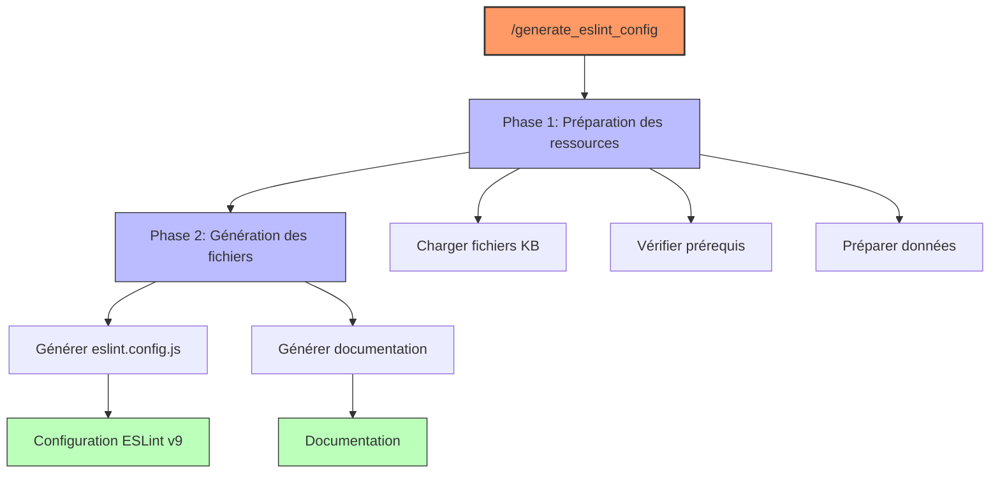
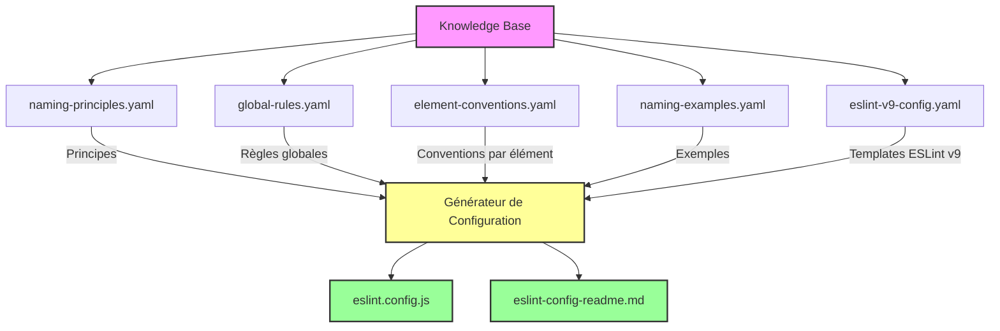
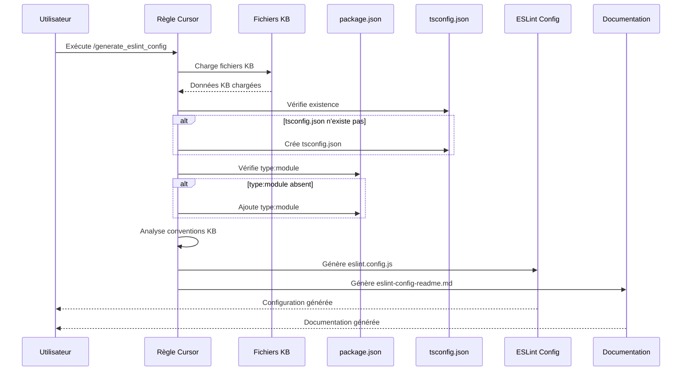
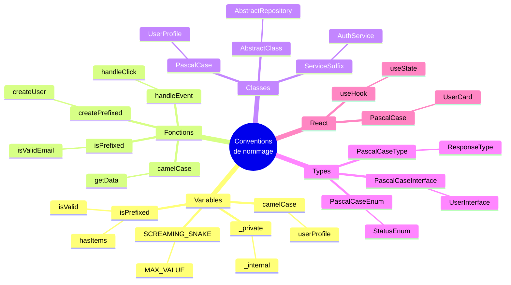
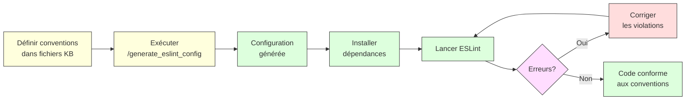
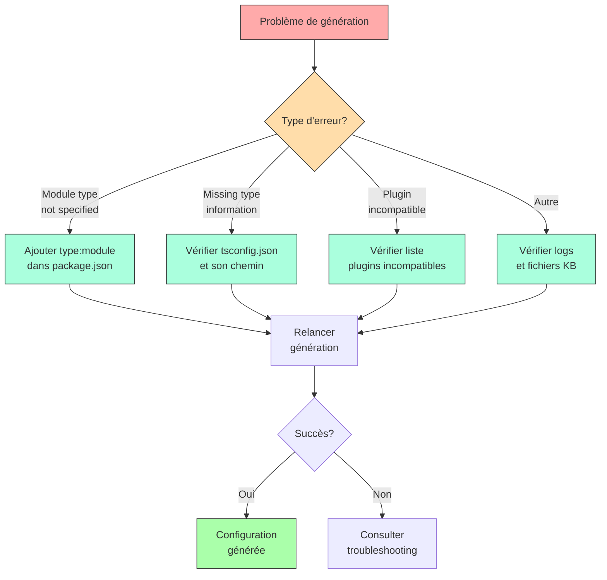

# Règle 1003-eslint@9-naming-generator

**Description**: "GENERATE ESLint flat configuration from KB files when IMPLEMENTING naming standards to ENSURE validation with ESLint v9+"

**Date de création**: 2025-03-29  
**Version**: 1.0.0  
**Auteur**: AI Assistant

## Objectif

Cette règle permet de générer automatiquement une configuration ESLint au format "flat config" (v9+) à partir des conventions de nommage définies dans des fichiers Knowledge Base (KB). La configuration générée applique les standards de nommage pour JavaScript/TypeScript en respectant les exigences spécifiques d'ESLint v9.

## Architecture globale



## Prérequis

Pour utiliser cette règle, vous devez disposer des éléments suivants :

- Un projet JavaScript/TypeScript
- Des fichiers KB définissant les conventions de nommage
- Un environnement compatible avec ESLint v9+
- TypeScript 5.x (recommandé)

## Structure des fichiers Knowledge Base



## Fichiers Knowledge Base (KB) utilisés

La règle exploite les fichiers KB suivants :

| Fichier KB              | Chemin                                | Description                                                                              |
| ----------------------- | ------------------------------------- | ---------------------------------------------------------------------------------------- |
| Principes de nommage    | `.cursor/kb/naming-principles.yaml`   | Principes généraux guidant les conventions de nommage                                    |
| Règles globales         | `.cursor/kb/global-rules.yaml`        | Règles s'appliquant à tous les types d'éléments                                          |
| Conventions par élément | `.cursor/kb/element-conventions.yaml` | Conventions spécifiques pour chaque type d'élément (variables, fonctions, classes, etc.) |
| Exemples de nommage     | `.cursor/kb/naming-examples.yaml`     | Exemples concrets de noms valides et invalides                                           |
| Configuration ESLint v9 | `.cursor/kb/eslint-v9-config.yaml`    | Templates et mappings pour ESLint v9 format plat                                         |

## Structure de la règle

La règle est définie selon une structure de commande permettant une exécution organisée en phases distinctes.

### Commande principale

```
/generate_eslint_config[output_path="eslint.config.js"]
```

### Phases d'exécution

La règle s'exécute en deux phases principales :

#### Phase 1: Préparation des ressources

Cette phase initialise les ressources nécessaires en :

- Chargeant et parsant les fichiers KB
- Vérifiant et préparant les prérequis (tsconfig.json, package.json)
- Structurant les données pour la génération

```
|init_resources() -> $resources
    |$kb_data = {}
    |for (path_key, path_value in $KB:paths)
        |read_file(path_value) -> $content
        |parse_yaml($content) -> $kb_data[path_key]

    |$tsconfig_path = setup_tsconfig($kb_data.eslint_v9.prerequisites.tsconfig)
    |$package_updated = setup_package_json($kb_data.eslint_v9.prerequisites.package_json)
```

#### Phase 2: Génération des fichiers

Cette phase génère les fichiers de configuration ESLint et la documentation associée :

- Génération de la configuration ESLint (eslint.config.js)
- Génération de la documentation (eslint-config-readme.md)

```
|generate_files($resources, $output_path) -> $result
    |generate_eslint_config($resources, $output_path) -> $eslint_config_result
    |generate_documentation($resources) -> $readme_result
```

## Processus détaillé



## Fonctionnalités principales

### 1. Vérification et préparation des prérequis

La règle vérifie et met en place automatiquement :

- Un fichier `tsconfig.json` approprié s'il n'existe pas
- L'attribut `"type": "module"` dans le `package.json` (requis pour ESLint v9)

### 2. Génération de la configuration ESLint

La règle génère une configuration ESLint v9 au format plat avec :

- Structure modulaire avec exports ES
- Compatibilité TypeScript complète
- Règles de nommage basées sur les conventions KB
- Configurations spécifiques pour JavaScript, TypeScript, React et tests

### 3. Génération de documentation

La règle produit également une documentation complète expliquant :

- L'installation et la configuration
- Les conventions implémentées
- L'utilisation et la personnalisation
- La résolution des problèmes courants

## Exemple de configuration générée

```javascript
// ESLint flat config générée à partir des conventions de nommage
// Date de génération: 2024-03-29
// Version d'ESLint ciblée: 9

import typescriptEslint from "@typescript-eslint/eslint-plugin";
import tsParser from "@typescript-eslint/parser";

export default [
  // Configuration globale
  {
    ignores: ["node_modules/**", "dist/**", "build/**", ".eslint/**"],
  },

  // Configuration de base pour tous les fichiers JavaScript
  {
    files: ["**/*.{js,jsx}"],
    languageOptions: {
      ecmaVersion: 2022,
      sourceType: "module",
    },
    rules: {
      // Règle globale pour la longueur maximale
      "id-length": ["error", { max: 50 }],
    },
  },

  // Configuration spécifique pour TypeScript
  {
    files: ["**/*.{ts,tsx}"],
    languageOptions: {
      ecmaVersion: 2022,
      sourceType: "module",
      parser: tsParser,
      parserOptions: {
        ecmaFeatures: {
          jsx: true,
        },
        project: "./tsconfig.json",
      },
    },
    plugins: {
      "@typescript-eslint": typescriptEslint,
    },
    rules: {
      // Règles de nommage pour variables, fonctions, classes, etc.
    },
  },

  // Autres configurations spécifiques...
];
```

## Hiérarchie des conventions de nommage



## Conventions de nommage implémentées

La configuration générée applique les conventions de nommage suivantes :

### Variables

- Variables standard : `camelCase` (ex: `userData`)
- Variables booléennes : préfixées par `is`, `has`, `should`, etc. (ex: `isValid`)
- Constantes : `SCREAMING_SNAKE_CASE` (ex: `MAX_RETRIES`)
- Variables privées : `_camelCase` (ex: `_internalValue`)

### Fonctions

- Fonctions standard : `camelCase()` (ex: `calculateTotal()`)
- Fonctions booléennes : `isPrefixed()` (ex: `isEmailValid()`)
- Fonctions factory : `createPrefixed()` (ex: `createUser()`)
- Gestionnaires d'événements : `handlePrefixed()` (ex: `handleClick()`)

### Classes

- Classes standard : `PascalCase` (ex: `UserProfile`)
- Classes abstraites : `AbstractPascalCase` (ex: `AbstractRepository`)
- Services : `PascalCaseService` (ex: `AuthenticationService`)

### Types

- Interfaces : `PascalCaseInterface` (ex: `UserDataInterface`)
- Types alias : `PascalCaseType` (ex: `ResponseType`)
- Enums : `PascalCaseEnum` (ex: `StatusEnum`)
- Membres d'énumération : `SCREAMING_SNAKE_CASE` (ex: `ACTIVE`)

### React/Vue

- Composants : `PascalCase` (ex: `UserProfile`)
- Hooks : `useCamelCase` (ex: `useFormValidation`)

## Comment utiliser cette règle

### 1. Exécuter la commande

Utilisez la commande `/generate_eslint_config` dans Cursor pour générer la configuration :

```
/generate_eslint_config
```

Vous pouvez spécifier un chemin de sortie personnalisé :

```
/generate_eslint_config[output_path="mon/chemin/eslint.config.js"]
```

### 2. Installer les dépendances requises

Installez les dépendances nécessaires pour ESLint v9 :

```bash
npm install --save-dev eslint@^9.0.0 @typescript-eslint/eslint-plugin@^8.0.0 @typescript-eslint/parser@^8.0.0
```

### 3. Utiliser la configuration

Exécutez ESLint avec la configuration générée :

```bash
npx eslint src/**/*.{js,jsx,ts,tsx}
```

Pour corriger automatiquement les problèmes (quand c'est possible) :

```bash
npx eslint src/**/*.{js,jsx,ts,tsx} --fix
```

## Flux d'utilisation



## Personnalisation

### Modification des conventions de nommage

Pour modifier les conventions de nommage appliquées par la règle, vous pouvez :

1. Mettre à jour les fichiers KB (recommandé)
2. Modifier directement le fichier `eslint.config.js` généré
3. Créer une règle dérivée avec vos propres conventions

### Extension de la configuration

Vous pouvez étendre la configuration générée en ajoutant des éléments au tableau exporté :

```javascript
// eslint.config.js
import { existingConfig } from "./generated-eslint.config.js";

export default [
  ...existingConfig,
  // Vos configurations supplémentaires
  {
    files: ["**/*.custom.js"],
    rules: {
      // Règles personnalisées
    },
  },
];
```

## Résolution des problèmes

### Problèmes courants

| Problème                              | Cause                                                   | Solution                                     |
| ------------------------------------- | ------------------------------------------------------- | -------------------------------------------- |
| Erreur "Module type not specified"    | ESLint v9 nécessite ES modules                          | Ajouter `"type": "module"` dans package.json |
| Erreur "Missing type information"     | Informations de type manquantes                         | Vérifier le chemin vers tsconfig.json        |
| Erreur avec les plugins incompatibles | Certains plugins ne sont pas compatibles avec ESLint v9 | Éviter les plugins mentionnés dans le KB     |

### Dépannage



Si la génération échoue :

1. Vérifiez que tous les fichiers KB existent aux chemins spécifiés
2. Assurez-vous que votre environnement est compatible avec ESLint v9
3. Consultez les logs d'erreur pour identifier les problèmes spécifiques

## Améliorations futures

- Support pour les configurations React et Vue spécifiques
- Génération d'exemples de code pour tester la configuration
- Support pour les environnements multi-projets
- Intégration avec d'autres outils d'analyse statique

## Références

- [Documentation officielle ESLint v9](https://eslint.org/docs/latest/)
- [Migration vers ESLint Flat Config](https://eslint.org/docs/latest/use/configure/migration-guide)
- [Documentation @typescript-eslint](https://typescript-eslint.io/linting/configs/)
- [Conventions de nommage TypeScript](https://www.typescriptlang.org/docs/handbook/declaration-files/do-s-and-don-ts.html)
