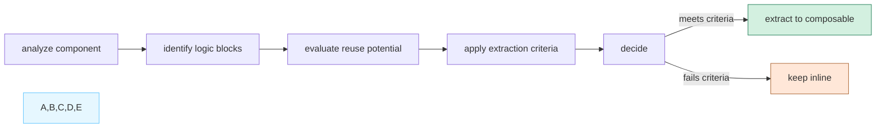
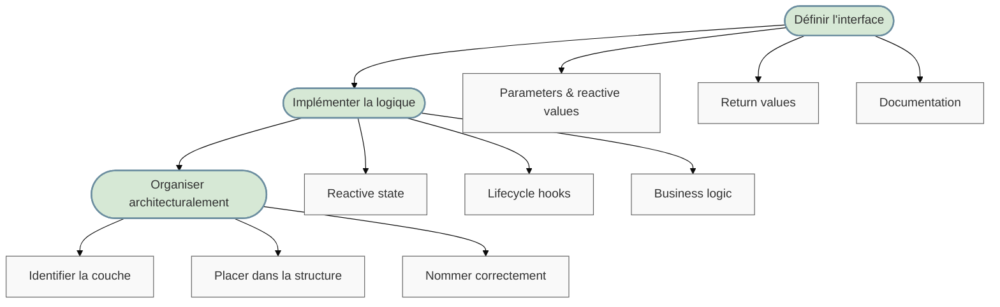
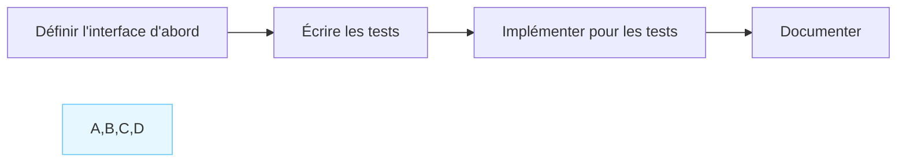
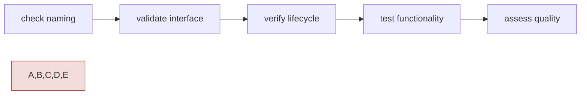
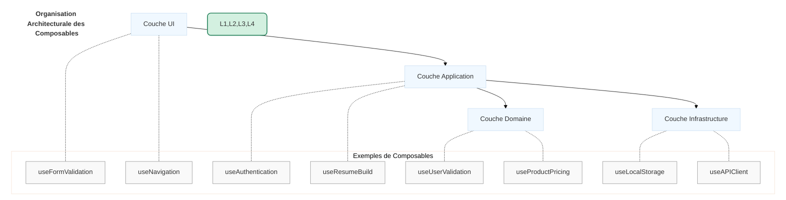
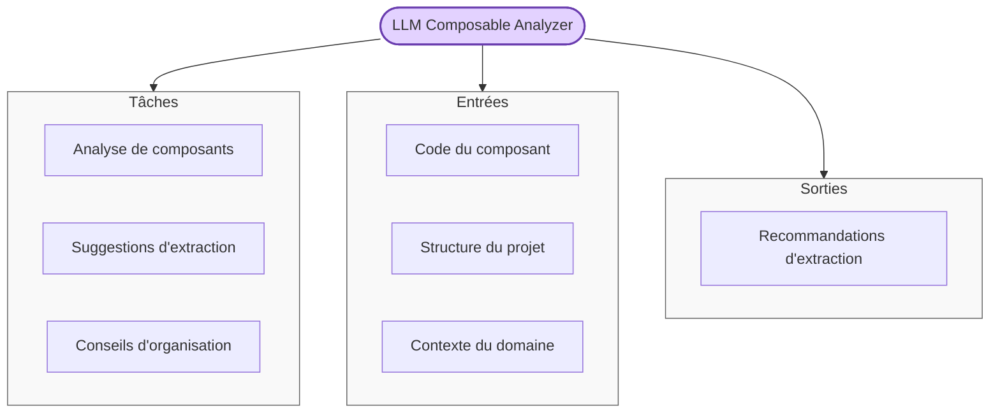
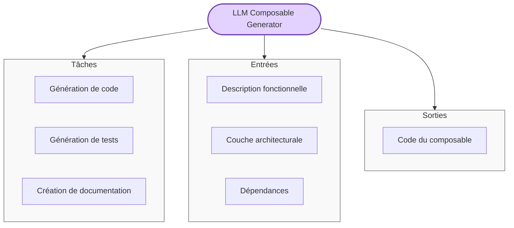

# Documentation de la Règle Vue 3 Composables Pattern

## 📋 Résumé

La règle `2100-vue3-composables.mdc` définit les meilleures pratiques et le processus de création des composables Vue 3. Elle établit une méthodologie complète pour garantir des composables maintenables, réutilisables et respectant les principes de clean architecture. Cette règle met l'accent sur la séparation des préoccupations, la réutilisabilité et la gestion correcte du cycle de vie.

| Aspect               | Description                                                                |
| -------------------- | -------------------------------------------------------------------------- |
| **Objectif**         | Standardiser la création et l'organisation des composables Vue 3           |
| **Applicabilité**    | S'applique à tous les fichiers `**/*.{js,ts,vue}`                          |
| **Principe central** | Séparation des préoccupations + réutilisabilité + clean architecture       |
| **Format**           | Composables avec préfixe `use` suivant la Composition API de Vue 3         |
| **Prérequis**        | Comprendre la Composition API Vue 3 et les principes de clean architecture |

## 🧠 Concepts Fondamentaux

### Qu'est-ce qu'un Composable Vue 3?

Un composable Vue 3 est une fonction JavaScript/TypeScript qui utilise la Composition API pour encapsuler et réutiliser une logique avec état. Les composables permettent d'extraire et de réutiliser la logique entre différents composants, suivant le principe "composition over inheritance" (composition plutôt qu'héritage).

### Caractéristiques d'un Bon Composable

Un composable bien conçu présente les caractéristiques suivantes:

1. **Préfixe `use`** - Tous les composables commencent par `use` (ex: `useUserData`)
2. **Responsabilité unique** - Se concentre sur une seule préoccupation fonctionnelle
3. **Interface minimale** - N'expose que ce qui est nécessaire à l'extérieur
4. **Support de la réactivité** - Accepte des paramètres réactifs et maintient la chaîne de réactivité
5. **Gestion du cycle de vie** - Utilise correctement les hooks comme `onMounted` et `onUnmounted`
6. **Documentation claire** - Accompagné de commentaires JSDoc clairs et exemples d'utilisation

## 🔍 Principes de Base des Composables Vue 3

La règle définit trois principes fondamentaux pour tout composable Vue 3:

```mermaid
%%{init: {'theme': 'base', 'themeVariables': { 'primaryColor': '#ebf8f1', 'fontSize': '16px'}}}%%
flowchart TD
    title[<b>Les Trois Principes Fondamentaux</b>]
    style title fill:none,stroke:none

    P1(["Séparation des Préoccupations"])
    P2(["Réutilisabilité"])
    P3(["Gestion du Cycle de Vie"])

    P1 --> P1A["Une seule responsabilité"]
    P1 --> P1B["Organisation par couches"]
    P1 --> P1C["Séparation données/présentation"]

    P2 --> P2A["Extraction logique commune"]
    P2 --> P2B["Interface minimaliste"]
    P2 --> P2C["Support paramètres réactifs"]

    P3 --> P3A["Nettoyage des ressources"]
    P3 --> P3B["Initialisation appropriée"]
    P3 --> P3C["Contrôle de réactivité"]

    style P1 fill:#d3f0e0,stroke:#2c8560,stroke-width:2px,color:#333
    style P2 fill:#d8e7ff,stroke:#3d6daf,stroke-width:2px,color:#333
    style P3 fill:#ffe7d8,stroke:#af6d3d,stroke-width:2px,color:#333

    style P1A,P1B,P1C fill:#eafaf2,stroke:#2c8560,stroke-width:1px
    style P2A,P2B,P2C fill:#ebf3ff,stroke:#3d6daf,stroke-width:1px
    style P3A,P3B,P3C fill:#fff4eb,stroke:#af6d3d,stroke-width:1px
```



1. **Séparation des Préoccupations**:

   - Single Responsibility Principle: un composable, une responsabilité
   - Organisation par couches architecturales (domaine, application, infrastructure, UI)
   - Séparation de la transformation des données de la présentation

2. **Réutilisabilité**:

   - Extraction de la logique commune utilisée dans plusieurs composants
   - Interface minimaliste qui n'expose que le nécessaire
   - Support des paramètres réactifs (refs, computed, getters)

3. **Gestion du Cycle de Vie**:
   - Libération appropriée des ressources dans `onUnmounted`
   - Initialisation correcte dans `onMounted` quand nécessaire
   - Maintenance de la chaîne de réactivité

## 🔄 Processus de Décision pour l'Extraction (Ω•decide•extract)

Le processus `Ω•decide•extract` définit une approche systématique pour déterminer quand extraire la logique d'un composant en composable:



### Critères d'Extraction

1. **Analyse du composant**:

   - Identification de la logique pouvant être extraite
   - Mesure de la complexité (nombre de lignes, charge cognitive)

2. **Identification des blocs logiques**:

   - Catégorisation de la logique (UI, transformation de données, effets, validation)
   - Les composants de plus de 100 lignes sont candidats à l'extraction

3. **Évaluation du potentiel de réutilisation**:

   - Compte des utilisations similaires à travers les composants
   - Calcul de la valeur de l'extraction (bénéfice vs coût de maintenance)

4. **Décision**:
   - Extraire si les critères sont satisfaits
   - Garder dans le composant si trop simple ou trop spécifique

## 👨‍💻 Workflow de Conception des Composables (Ω•design•composable)

Le workflow `Ω•design•composable` définit les étapes pour concevoir un composable efficace:



### Détail du Workflow de Conception

1. **Définir l'interface**:

   - Déterminer les paramètres nécessaires (support des valeurs réactives)
   - Identifier les valeurs essentielles à retourner (principe de minimalisme)
   - Ajouter des commentaires JSDoc pour les utilisateurs du composable

2. **Implémenter la logique**:

   - Configurer l'état réactif (refs, computed)
   - Ajouter les hooks de cycle de vie si nécessaire
   - Implémenter la logique métier principale

3. **Organiser architecturalement**:
   - Déterminer la couche architecturale appropriée
   - Placer dans la structure du projet (ex: `/composables/{layer}/{domain}`)
   - Nommer selon les conventions établies (préfixe `use`)

## 🧪 Test-Driven Development pour Composables (Ω•apply•tdd)

La règle recommande une approche TDD pour le développement des composables:



### Processus TDD pour Composables

1. **Définir l'interface d'abord**:

   - Déterminer les paramètres et leurs types (support de `MaybeRefOrGetter`)
   - Planifier les valeurs retournées (principe de minimalisme)

2. **Écrire les tests**:

   - Tests d'initialisation (comportement par défaut et options personnalisées)
   - Tests de fonctionnalité (toutes les méthodes et propriétés, cas limites)
   - Tests de réactivité (mises à jour réactives si paramètres réactifs)

3. **Implémenter pour les tests**:

   - Code minimal pour faire passer les tests
   - Refactoriser pour améliorer la qualité du code

4. **Documenter**:
   - Ajouter une documentation JSDoc complète avec exemples
   - Documenter clairement les types pour les consommateurs

## 🔍 Protocole de Validation des Composables (Ω•validate•composable)

Le protocole de validation garantit que les composables respectent tous les critères de qualité:



### Étapes de Validation

1. **Vérification du nommage**:

   - Pattern: commence par `use` suivi d'une majuscule
   - Alignement avec la terminologie du domaine

2. **Validation de l'interface**:

   - Minimalisme: expose uniquement les valeurs nécessaires
   - Support de la réactivité: utilise `toValue()` pour les paramètres réactifs
   - Documentation: JSDoc complet pour les paramètres et valeurs retournées

3. **Vérification du cycle de vie**:

   - Nettoyage: libération correcte des ressources dans `onUnmounted`
   - Initialisation: configuration appropriée dans `onMounted` si nécessaire

4. **Test de fonctionnalité**:

   - Tests unitaires: couverture de tous les chemins (cible: 90%+)
   - Tests d'intégration: test avec les composants

5. **Évaluation de la qualité**:
   - Principes SOLID: respect des principes, en particulier la responsabilité unique
   - Code propre: lisible et maintenable

## 📋 Structure Architecturale des Composables

La règle recommande d'organiser les composables selon les principes de Clean Architecture:



### Les Quatre Couches Architecturales

1. **Couche Domaine** (`/composables/domain/`):

   - Encapsule la logique métier pure
   - Indépendante de l'infrastructure et de l'UI
   - Exemples: `useUserValidation`, `useProductPricing`

2. **Couche Application** (`/composables/application/`):

   - Orchestre les cas d'utilisation
   - Coordonne le domaine et l'infrastructure
   - Exemples: `useAuthentication`, `useCheckoutProcess`

3. **Couche Infrastructure** (`/composables/infrastructure/`):

   - Gère les interactions avec les systèmes externes
   - S'occupe du stockage et de la communication
   - Exemples: `useLocalStorage`, `useAPIClient`

4. **Couche UI** (`/composables/ui/`):
   - Gère les interactions utilisateur
   - Concerne les préoccupations d'interface
   - Exemples: `useFormValidation`, `useNavigation`

## 🤖 Délégation au LLM

### LLM Analyzer pour Composables

La règle définit comment le LLM peut assister dans l'analyse des composants pour l'extraction de composables:



### LLM Generator pour Composables

La règle définit également comment le LLM peut assister dans la génération de composables:



## 🌲 Arborescence des Fichiers

### Représentation Graphique

```mermaid
%%{init: {'theme': 'base', 'themeVariables': { 'primaryColor': '#f0f8ff', 'fontSize': '16px'}}}%%
flowchart TD
    %% Titre du diagramme
    title[<b>Arborescence des Fichiers Vue 3 Composables</b>]
    style title fill:none,stroke:none

    %% Organisation principale
    ROOT("<b>/</b>") --- COMP["<b>composables/</b><br><i>Répertoire principal</i>"]

    %% Couches architecturales
    COMP --- DOMAIN["<b>domain/</b><br><i>Logique métier pure</i>"]
    COMP --- APP["<b>application/</b><br><i>Orchestration des cas d'utilisation</i>"]
    COMP --- INFRA["<b>infrastructure/</b><br><i>Interaction avec l'extérieur</i>"]
    COMP --- UI["<b>ui/</b><br><i>Interactions utilisateur</i>"]

    %% Exemple domain
    subgraph DOMAIN_FILES [" "]
        DOM_USER["user/"]
        DOM_USER --- DOM_UV["useUserValidation.ts"]
        DOM_USER --- DOM_UP["useUserProfile.ts"]

        DOM_PROD["product/"]
        DOM_PROD --- DOM_PP["useProductPricing.ts"]
    end
    DOMAIN --- DOMAIN_FILES

    %% Exemple application
    subgraph APP_FILES [" "]
        APP_AUTH["auth/"]
        APP_AUTH --- APP_AUTH_USE["useAuthentication.ts"]

        APP_CHECKOUT["checkout/"]
        APP_CHECKOUT --- APP_CP["useCheckoutProcess.ts"]
    end
    APP --- APP_FILES

    %% Exemple infrastructure
    subgraph INFRA_FILES [" "]
        INFRA_API["api/"]
        INFRA_API --- INFRA_API_CLIENT["useAPIClient.ts"]

        INFRA_STORAGE["storage/"]
        INFRA_STORAGE --- INFRA_LS["useLocalStorage.ts"]
    end
    INFRA --- INFRA_FILES

    %% Exemple UI
    subgraph UI_FILES [" "]
        UI_FORM["forms/"]
        UI_FORM --- UI_FV["useFormValidation.ts"]

        UI_NAV["navigation/"]
        UI_NAV --- UI_NAV_USE["useNavigation.ts"]
    end
    UI --- UI_FILES

    %% Tests
    ROOT --- TESTS["<b>__tests__/</b><br><i>Tests unitaires</i>"]

    subgraph TEST_FILES [" "]
        TEST_COMP["composables/"]
        TEST_COMP --- TEST_DOM["domain/"]
        TEST_DOM --- TEST_DOM_USER["user/"]
        TEST_DOM_USER --- TEST_DOM_UV["useUserValidation.spec.ts"]
    end
    TESTS --- TEST_FILES

    %% Styles
    classDef directory fill:#f9d77e,stroke:#d9b066,stroke-width:2px,border-radius:8px
    classDef file fill:#f9f9f9,stroke:#999,stroke-width:1px,border-radius:4px
    classDef section fill:#e6f7ff,stroke:#67c8ff,stroke-width:1px,stroke-dasharray:5 5,border-radius:10px
    classDef layer fill:#d3f0e0,stroke:#2c8560,stroke-width:2px,color:#333,border-radius:8px

    class ROOT,COMP,DOMAIN,APP,INFRA,UI,TESTS,DOM_USER,DOM_PROD,APP_AUTH,APP_CHECKOUT,INFRA_API,INFRA_STORAGE,UI_FORM,UI_NAV,TEST_COMP,TEST_DOM,TEST_DOM_USER directory
    class DOM_UV,DOM_UP,DOM_PP,APP_AUTH_USE,APP_CP,INFRA_API_CLIENT,INFRA_LS,UI_FV,UI_NAV_USE,TEST_DOM_UV file
    class DOMAIN_FILES,APP_FILES,INFRA_FILES,UI_FILES,TEST_FILES section
    class DOMAIN,APP,INFRA,UI layer
```



### Représentation Textuelle Détaillée

```
/
│
├── composables/                             # RÉPERTOIRE PRINCIPAL DES COMPOSABLES
│   │
│   ├── domain/                              # COUCHE DOMAINE - Logique métier pure
│   │   │
│   │   ├── user/                            # Regroupement par entité de domaine
│   │   │   ├── useUserValidation.ts         # Validation des données utilisateur selon règles métier
│   │   │   └── useUserProfile.ts            # Gestion des profils utilisateur
│   │   │
│   │   └── product/                         # Autre entité de domaine
│   │       └── useProductPricing.ts         # Calcul des prix selon règles métier
│   │
│   ├── application/                         # COUCHE APPLICATION - Orchestration des cas d'utilisation
│   │   │
│   │   ├── auth/                            # Regroupement par fonctionnalité
│   │   │   └── useAuthentication.ts         # Gestion du workflow d'authentification
│   │   │
│   │   └── checkout/                        # Autre fonctionnalité
│   │       └── useCheckoutProcess.ts        # Orchestration du processus de commande
│   │
│   ├── infrastructure/                      # COUCHE INFRASTRUCTURE - Systèmes externes et stockage
│   │   │
│   │   ├── api/                             # Communication API
│   │   │   └── useAPIClient.ts              # Client API générique
│   │   │
│   │   └── storage/                         # Gestion du stockage
│   │       └── useLocalStorage.ts           # Interaction avec localStorage
│   │
│   └── ui/                                  # COUCHE UI - Interactions utilisateur
│       │
│       ├── forms/                           # Formulaires
│       │   └── useFormValidation.ts         # Validation de formulaires
│       │
│       └── navigation/                      # Navigation
│           └── useNavigation.ts             # Gestion de la navigation
│
└── __tests__/                               # TESTS UNITAIRES
    └── composables/                         # Tests des composables
        └── domain/                          # Tests de la couche domaine
            └── user/                        # Tests des composables user
                └── useUserValidation.spec.ts # Tests pour useUserValidation
```

### Convention de Nommage

- **Fichiers de composables**: `use{Nom}` (ex: `useUserValidation.ts`)
- **Tests**: `{nom_composable}.spec.ts` (ex: `useUserValidation.spec.ts`)
- **Organisation**: `/composables/{couche}/{domaine}/`

## ⚠️ Contraintes Critiques à Respecter

La règle identifie plusieurs contraintes importantes:

1. **Pas d'extraction triviale**:

   - ❌ Ne pas extraire une logique < 10 lignes sans fort potentiel de réutilisation
   - ✅ Extraire uniquement ce qui apporte une réelle valeur

2. **Éviter les composables fourre-tout**:

   - ❌ Ne pas créer de composables avec multiples responsabilités
   - ✅ Respecter le principe de responsabilité unique

3. **Performance**:

   - ❌ Ne pas créer de composables qui ralentissent l'application
   - ✅ Respecter la contrainte de performance (<500ms)

4. **Documentation d'interface**:

   - ❌ Ne pas laisser l'interface du composable sans documentation
   - ✅ Documenter clairement avec JSDoc

5. **Pas de composables purement statiques**:
   - ❌ Ne pas créer de composables pour une logique statique
   - ✅ Créer des composables uniquement quand la gestion d'état est nécessaire

## 📝 Patterns Recommandés

### Organisation

- Dossier dédié `/composables`
- Organisation par domaine et/ou par couche architecturale
- Structure cohérente à travers le projet

### Testabilité

- Conception pour tests isolés
- Injection de dépendances plutôt que hardcoding
- Facilitation du mocking pour les dépendances externes

### Interface

- Types de retour explicites
- Documentation JSDoc avec exemples
- Support des paramètres réactifs avec `toValue()`

## ✅ Liste de Vérification

Utilisez cette liste pour valider vos composables Vue 3:

- [ ] Commence par le préfixe `use` suivi d'une majuscule
- [ ] Respecte le principe de responsabilité unique
- [ ] Organisé dans la couche architecturale appropriée
- [ ] Interface minimaliste n'exposant que le nécessaire
- [ ] Supporte des paramètres réactifs (utilise `toValue()`)
- [ ] Gère correctement le cycle de vie (cleanup dans `onUnmounted`)
- [ ] Documenté avec JSDoc (paramètres, retours, exemples)
- [ ] Tests unitaires avec couverture > 90%
- [ ] Pas de dépendances hardcodées (injection de dépendances)
- [ ] Respecte les contraintes de performance (<500ms)

## 📚 Ressources Additionnelles

Pour plus de détails sur les composables Vue 3, consultez:

- `.cursor/kb/2100-vue3-composables/guidelines/architecture_layers.md` - Architecture en couches
- `.cursor/kb/2100-vue3-composables/guidelines/tdd_workflow.md` - Workflow TDD pour composables
- `.cursor/kb/2100-vue3-composables/examples/good_examples.md` - Exemples de bons composables
- `.cursor/kb/2100-vue3-composables/examples/bad_examples.md` - Anti-patterns à éviter
- [Documentation officielle Vue.js - Composables](https://vuejs.org/guide/reusability/composables.html)
- [Vue.js - Composition API](https://vuejs.org/api/composition-api-setup.html)
- [Vue.js - Réactivité en profondeur](https://vuejs.org/guide/extras/reactivity-in-depth.html)
