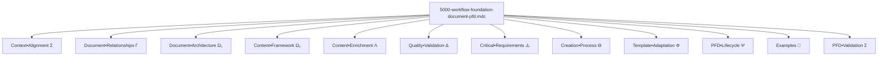

# Documentation de la Règle `@5000-workflow-foundation-document-pfd.mdc`

## Présentation Générale

La règle `@5000-workflow-foundation-document-pfd.mdc` est un cadre fondamental qui définit la structure, le contenu et le processus de création d'un Document Fondation de Projet (PFD). Son objectif principal est d'assurer que la documentation de projet soit complète, précise, structurée et alignée avec les objectifs commerciaux et techniques.

**Description officielle:** "GENERATE when INITIATING project to ENSURE comprehensive and aligned documentation"

Cette règle sert de guide complet pour la création d'une documentation de projet qui servira de référence autoritaire tout au long du cycle de vie du projet. Elle utilise la compression sémantique pour encoder de manière dense et précise les exigences et les structures d'un PFD efficace.

## Structure et Notation Symbolique

La règle utilise plusieurs symboles et notations spécifiques pour représenter ses composants:

- `Σ` (Sigma): Représente un contexte ou une agrégation
- `Ω` (Omega): Identifie l'architecture du document et le cadre de contenu
- `Λ` (Lambda): Indique l'enrichissement du contenu
- `Δ` (Delta): Symbolise la validation de qualité
- `↹` (Tab): Marque une structure ou un concept principal
- `⊕` (Plus cerclé): Identifie un composant ou section à inclure
- `→` (Flèche): Indique un flux, une direction ou une transformation
- `⇌` (Flèche bidirectionnelle): Exprime une relation bidirectionnelle
- `ϴ` (Theta): Représente le processus de création
- `Φ` (Phi): Indique l'adaptation du modèle
- `Ψ` (Psi): Décrit le cycle de vie du document
- `•` (Point médian): Connecte des concepts liés
- `+` (Plus): Combine des éléments similaires
- `Γ` (Gamma): Définit les relations entre documents

Ces symboles permettent d'encoder de façon dense et précise les structures et exigences qui définissent un Document Fondation de Projet efficace.

## Composants Principaux



### 1. Contexte et Alignement (Context•Alignment)

```
## Σ Context•Alignment [p=1]
- PFD = authoritative•reference(scope+requirements+architecture)
- document → single•source•of•truth(stakeholders+developers+operations)
- aligns(technical•implementation ⇌ business•objectives)
- provides•structure(all•project•dimensions)
- balances(comprehensiveness ⇌ clarity ⇌ conciseness)
- basis•for(related•documents+iterative•development)
```

Le contexte et alignement (priorité=1) définit la nature fondamentale et l'objectif du PFD:

- **Référence autoritaire**: Le PFD sert de référence pour la portée, les exigences et l'architecture
- **Source unique de vérité**: Pour toutes les parties prenantes du projet
- **Alignement**: Garantit l'alignement entre l'implémentation technique et les objectifs commerciaux
- **Structure**: Fournit une structure pour toutes les dimensions du projet
- **Équilibre**: Balance entre l'exhaustivité, la clarté et la concision
- **Base**: Sert de fondation pour les documents connexes et le développement itératif

### 2. Relations entre Documents (Document•Relationships)

```
## Γ Document•Relationships [p=1]

↹ foundation•triad {
  components: [
    PFD: high•level•foundation(complete•project•vision),
    PRD: refined•requirements(user•stories+features+validation•criteria),
    Architecture: technical•blueprint(components+patterns+interfaces)
  ]

  flow: PFD → [PRD, Architecture] → implementation

  relationships: {
    PFD⇌PRD: vision•to•requirements+business•alignment,
    PFD⇌Architecture: constraints•to•solutions+technical•decisions,
    PRD⇌Architecture: features•to•components+validation•methods
  }

  lifecycle: {
    PFD: foundational+evolving(major•changes),
    PRD: dynamic+iterative(regular•updates),
    Architecture: living•document(technical•decisions+patterns)
  }
}

↹ agile•mapping {
  storage•convention: project•folder→.ai/,
  documents: [
    foundational: pfd.md(this•document),
    requirements: prd.md(product•requirements•document),
    technical: arch.md(architecture•document)
  ],

  stories: {
    structure: epics→stories→tasks,
    location: .ai/epic-{n}/{m}-{code}.story.md,
    content: [
      purpose+scope,
      acceptance•criteria,
      implementation•steps,
      risks+mitigations,
      hypotheses+validation•methods,
      test•coverage(minimum•80%)
    ]
  }

  traceability: [
    PFD→business•objectives,
    PRD→user•requirements,
    Architecture→technical•decisions,
    Stories→implementation•details
  ]
}
```

Les relations entre documents (priorité=1) définissent la triade de documentation fondamentale et son application dans un contexte agile:

- **Triade fondamentale**:

  - **PFD**: Fondation de haut niveau qui fournit la vision complète du projet
  - **PRD**: Exigences raffinées incluant stories utilisateur, fonctionnalités et critères de validation
  - **Architecture**: Plan technique définissant les composants, patterns et interfaces

- **Flux d'information**: Le PFD alimente à la fois le PRD et l'Architecture, qui ensemble guident l'implémentation

- **Relations bidirectionnelles**:

  - PFD ⇌ PRD: Vision vers exigences et alignement business
  - PFD ⇌ Architecture: Contraintes vers solutions et décisions techniques
  - PRD ⇌ Architecture: Fonctionnalités vers composants et méthodes de validation

- **Cycle de vie**:

  - PFD: Document fondamental qui évolue lors de changements majeurs
  - PRD: Document dynamique avec mises à jour régulières
  - Architecture: Document vivant qui capture les décisions et patterns techniques

- **Cartographie Agile**:
  - **Convention de stockage**: Utilisation du dossier `.ai/` pour les documents de projet
  - **Documents clés**: pfd.md, prd.md, arch.md
  - **Structure des stories**: Organisation en epics → stories → tâches
  - **Emplacement des stories**: Format `.ai/epic-{n}/{m}-{code}.story.md`
  - **Contenu des stories**: Inclut objectif, critères d'acceptation, étapes d'implémentation, risques, hypothèses et couverture de tests (min 80%)
  - **Traçabilité**: Liens clairs entre PFD, PRD, Architecture et Stories d'implémentation

### 3. Architecture du Document (Document•Architecture)

```
## Ω₁ Document•Architecture [p=1]

↹ hierarchy•structure {
  format: markdown•professional
  organization: hierarchical•sections(numbered•headings)
  navigation: table•of•contents(auto•generated)
  accessibility: technical+non_technical
  components: [
    frontmatter(metadata+version+status)
    → toc(detailed+links)
    → main•sections(core+supporting)
    → appendices(reference+supplemental)
  ]
}

↹ metadata•requirements {
  elements: [
    title: project•name+document•type,
    version: semver+date,
    status: draft|review|approved,
    authors: names+roles,
    approvers: authorities+sign•off,
    classification: public|internal|confidential,
    changelog: version•history(date+author+changes)
  ]

  schema: YAML|JSON
  placement: document•start
}
```

L'architecture du document (priorité=1) définit la structure générale et les métadonnées:

- **Structure hiérarchique**: Format markdown professionnel avec des sections numérotées
- **Navigation**: Table des matières auto-générée
- **Accessibilité**: Pour les publics techniques et non techniques
- **Composants**: Frontmatter, table des matières, sections principales, annexes
- **Exigences de métadonnées**: Titre, version, statut, auteurs, approbateurs, classification, historique

### 4. Cadre de Contenu (Content•Framework)

Le cadre de contenu (priorité=1) définit les sections essentielles et leurs attributs:

- **Sections principales**: Introduction, vision, vision technique, aperçu, exigences, architecture, technique, planification, KPI, tests, opérations, développement, annexes
- **Attributs des sections**: Clarté, exhaustivité, traçabilité, mesurabilité, applicabilité, cohérence

Chaque section est détaillée avec ses composants spécifiques, par exemple:

```
⊕ introduction {
  purpose: document•objectives+usage,
  scope: inclusion+exclusion+boundaries,
  glossary: terminology+acronyms+definitions
}
```

### 5. Enrichissement de Contenu (Content•Enrichment)

L'enrichissement de contenu (priorité=1) approfondit plusieurs domaines clés:

- **Détails architecturaux (Λ₁)**: Vues, patterns, interfaces, diagrammes
- **Stack technique (Λ₂)**: Frontend, backend, infrastructure, sécurité, critères de sélection
- **Gestion des risques (Λ₃)**: Dimensions, évaluation, réponse, cadre, validation, cadence
- **Développement itératif (Λ₄)**: Stories, cycles, feedback, adaptation

#### Λ₃•RiskManagement

La gestion des risques inclut désormais:

- **Validation**:

  - Hypothèses explicites et prédictions testables
  - Méthodes de vérification incluant expériences, tests et preuves
  - Suivi des hypothèses (validées/invalidées) avec niveau de confiance
  - Adaptation de la stratégie basée sur les résultats

- **Cadence**:
  - Revues basées sur les sprints et les jalons
  - Reporting aux parties prenantes et tableaux de bord
  - Escalade basée sur des seuils déclencheurs

#### Λ₄•IterativeDevelopment

Le développement itératif comprend:

- **Stories**:

  - Granularité: Focalisées sur l'utilisateur, livrables, testables
  - Création: Dérivées des exigences, incrémentales, priorisées
  - Approbation: Revue par les parties prenantes, critères d'acceptation
  - Implémentation: Développement piloté par les tests, fonctionnalités complètes

- **Cycles**:

  - Planification: Objectifs, portée, sélection de stories
  - Développement: Implémentation, tests, documentation
  - Revue: Démonstration, feedback, acceptation
  - Rétrospective: Apprentissages, améliorations, adaptations

- **Feedback**:

  - Sources: Utilisateurs, parties prenantes, équipe, métriques
  - Incorporation: Mise à jour des exigences, ajustement de la portée, raffinement technique
  - Documentation: Décisions, changements, justifications

- **Adaptation**:
  - PFD: Reflète les pivots majeurs et changements de portée
  - PRD: Capture l'évolution des exigences et priorités
  - Architecture: Mise à jour avec les apprentissages et décisions techniques

### 6. Validation de Qualité (Quality•Validation)

La validation de qualité (priorité=1) établit:

- **Métriques de document (Δ₁)**: Exhaustivité, clarté, alignement, applicabilité
- **Cadre de validation (Δ₂)**: Listes de contrôle, révisions, processus d'approbation

Ces composants garantissent que le PFD répond aux normes de qualité exigées.

### 7. Exigences Critiques (Critical•Requirements)

Les exigences critiques (priorité=1) définissent clairement ce qu'il faut toujours faire et ne jamais faire. Ces listes ont été enrichies pour inclure des aspects agiles:

#### ALWAYS

- Maintenir la traçabilité vers les stories
- Valider les hypothèses critiques
- Mettre à jour après des changements significatifs

#### NEVER

- Ignorer le feedback de l'implémentation
- Laisser des risques sans stratégies d'atténuation
- Permettre des stories sans critères de validation

### 8. Processus de Création (Creation•Process)

Le processus de création (priorité=2) a été enrichi avec:

- **Workflow**: Ajout d'une étape "evolve" pour la mise à jour basée sur le feedback d'implémentation
- **Collaboration**: Ajout de pratiques agile avec mises à jour régulières alignées sur les sprints
- **Gestion des itérations**: Nouvelle section qui définit:
  - Déclencheurs: Fin de sprint, changements majeurs, découvertes techniques
  - Mises à jour: Métadonnées, contenu, approbations
  - Versionnement: Major pour les changements significatifs, minor pour les raffinements, patch pour les corrections

### 9. Adaptation du Modèle (Template•Adaptation)

L'adaptation au contexte agile (priorité=2) a été considérablement enrichie:

- **Intégration**:
  - Stories dérivées des exigences
  - Évolution de l'architecture avec l'apprentissage
  - Suivi des risques à chaque itération
  - Validation des hypothèses via MVP
- **Cérémonies**:
  - Raffinement: Élaboration des exigences et approche technique
  - Planification: Sélection des stories et définition des objectifs de sprint
  - Revue: Démonstration des progrès et collecte de feedback
  - Rétrospective: Mise à jour des éléments du PFD selon les besoins
- **Artefacts**:
  - PFD, PRD, Architecture et Stories comme unités d'implémentation

### 10. Cycle de Vie du PFD (PFD•Lifecycle)

Le cycle de vie (priorité=2) a été enrichi avec:

- **Patterns d'utilisation**: Ajout d'une section sur le développement agile:
  - Création de story: Dérivation à partir des sections PFD
  - Raffinement: Élaboration avec le contexte PFD
  - Priorisation: Alignement avec les objectifs PFD
  - Acceptation: Vérification par rapport aux critères PFD
- **Boucles de feedback**: Nouvelle section qui définit:
  - Implémentation → PFD: Apprentissages techniques, contraintes, opportunités
  - Stories → PRD: Raffinements, ajustements de portée, changements de priorité
  - Architecture → Vision technique: Patterns, décisions, adaptations
  - Métriques → Critères de succès: Performance, progrès, alignement

### 11. Exemples (Examples)

La section d'exemples fournit:

- Un **exemple complet** d'un PFD bien structuré pour un projet de refonte de portail client
- Un **contre-exemple** montrant un PFD inadéquat avec une liste de problèmes

Ces exemples illustrent concrètement les bonnes et mauvaises pratiques.

### 12. Validation du PFD (PFD•Validation)

La validation du PFD (priorité=1) a été enrichie avec trois nouveaux critères spécifiques à l'agile:

- **Préparation agile**: Vérifier que le PFD supporte le développement itératif et le mapping des stories
- **Traçabilité**: Vérifier les liens entre exigences, stories et composants architecturaux
- **Suivi des hypothèses**: Vérifier que les hypothèses critiques sont identifiées et testables

## Application Pratique

### Intégration Agile

Dans un contexte agile, le PFD s'applique comme suit:

1. **Document Initial**: Le PFD est créé au démarrage du projet, définissant la vision générale, les contraintes et les objectifs

2. **Relation avec le PRD**: Le PFD alimente le PRD (`.ai/prd.md`), qui détaille les exigences de manière plus granulaire et peut évoluer plus fréquemment

3. **Relation avec l'Architecture**: Le PFD établit les contraintes et principes qui guident le document d'architecture (`.ai/arch.md`)

4. **Alimentation des Stories**: Le PFD et le PRD sont les sources pour la création de stories (`.ai/epic-{n}/{m}-{code}.story.md`)

5. **Cycle d'Évolution**:

   - Les stories fournissent un feedback lors de l'implémentation
   - Les apprentissages sont incorporés dans le PRD et l'Architecture
   - Les changements majeurs sont propagés au PFD

6. **Synchronisation avec les Sprints**:

   - À la fin de chaque sprint, vérifier si des mises à jour sont nécessaires
   - Après des jalons importants, effectuer une revue complète du PFD

7. **Validation Continue**:
   - Utiliser la validation du PFD pour s'assurer que le document reste pertinent
   - Vérifier la traçabilité entre les exigences, stories et composants architecturaux

### Quand Utiliser Cette Règle

La règle `@5000-workflow-foundation-document-pfd.mdc` doit être utilisée dans les situations suivantes:

1. **Initiation de projet**: Au démarrage d'un nouveau projet pour établir une base solide
2. **Documentation manquante**: Pour un projet existant qui manque de documentation structurée
3. **Révision majeure**: Lors d'une refonte significative ou d'un pivot de projet
4. **Documentation standardisée**: Pour établir des normes cohérentes de documentation à travers différents projets
5. **Alignement des parties prenantes**: Pour s'assurer que toutes les parties prenantes partagent la même vision et compréhension
6. **Préparation Agile**: Avant de démarrer un développement itératif pour établir une fondation claire

### Processus d'Application

```mermaid
flowchart LR
    A[Identifier le projet] --> B[Réunir les parties prenantes]
    B --> C[Suivre le workflow de création]
    C --> D[Rédiger sections par section]
    D --> E[Effectuer la validation]
    E --> F[Obtenir les approbations]
    F --> G[Publier le document]
    G --> H[Créer PRD et Architecture]
    H --> I[Dériver les Stories]
    I --> J[Implémenter par incréments]
    J --> K[Maintenir et mettre à jour]
```



L'application dans un contexte agile ajoute les étapes supplémentaires:

- Création du PRD et de l'Architecture basés sur le PFD
- Dérivation des Stories à partir du PRD
- Implémentation par incréments avec feedback continu
- Maintenance et mise à jour du PFD selon les apprentissages

### Adaptation à Différents Contextes

La règle est conçue pour être adaptable à différents contextes de projet:

- **Taille du projet**: Pour les petits projets, certaines sections peuvent être simplifiées
- **Méthodologie**: La structure peut être adaptée selon que le projet suit une approche agile, cascade ou hybride
- **Type de produit**: L'accent peut être mis sur différentes sections selon qu'il s'agit d'un produit logiciel, d'une API, d'une application mobile, etc.
- **Maturité organisationnelle**: Le niveau de détail peut être ajusté selon la maturité des processus de l'organisation

## Avantages de la Compression Sémantique

La règle utilise la compression sémantique pour encoder efficacement les exigences et structures d'un PFD:

1. **Densité d'information**: Le format compressé permet de représenter un cadre complet en minimisant la verbosité
2. **Structure cognitive claire**: Les symboles et opérateurs créent une structure mentale cohérente
3. **Hiérarchie visible**: Les relations entre composants sont explicitement représentées
4. **Extensibilité**: Le format facilite l'ajout de nouveaux éléments sans perturber la structure existante
5. **Mémorisation facilitée**: Les symboles et patterns récurrents rendent le cadre plus mémorisable

## Interaction avec d'Autres Règles

La règle `@5000-workflow-foundation-document-pfd.mdc` interagit avec plusieurs autres règles de Cursor:

- **0000-cursor-rules.mdc**: Établit le format et la structure de cette règle
- **Règles de documentation**: Peut se référer à des normes de documentation spécifiques
- **Règles de développement**: S'aligne avec les pratiques de développement de l'organisation
- **Règles de qualité**: Contribue aux pratiques d'assurance qualité globales
- **Workflow-agile-standardized.md**: Complémente cette règle en définissant le flux de travail agile qui utilise le PFD comme fondation

## Conclusion

La règle `@5000-workflow-foundation-document-pfd.mdc` fournit un cadre complet pour créer des Documents Fondation de Projet qui servent de référence autoritaire tout au long du cycle de vie du projet. En utilisant la compression sémantique, elle encode de manière dense et précise les exigences d'un PFD efficace.

Les principaux bénéfices de cette règle sont:

1. **Documentation complète et alignée**: Assure que toutes les dimensions du projet sont documentées et alignées avec les objectifs commerciaux
2. **Structure cohérente**: Fournit une structure standardisée qui facilite la navigation et la compréhension
3. **Processus guidé**: Offre un workflow clair pour la création et la maintenance du document
4. **Adaptabilité**: Permet l'adaptation à différents types de projets et méthodologies, particulièrement agile
5. **Validation intégrée**: Inclut des mécanismes de validation pour assurer la qualité du document
6. **Traçabilité end-to-end**: Établit des liens clairs entre la vision, les exigences, l'architecture et l'implémentation
7. **Support du développement itératif**: Facilite l'évolution progressive du document en tandem avec l'implémentation

En suivant cette règle, les équipes peuvent créer des documents de projet qui servent véritablement de "source unique de vérité" et qui guident efficacement le développement, la prise de décision et l'évaluation du projet, même dans un environnement agile dynamique.
