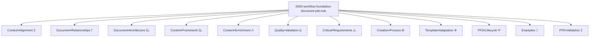
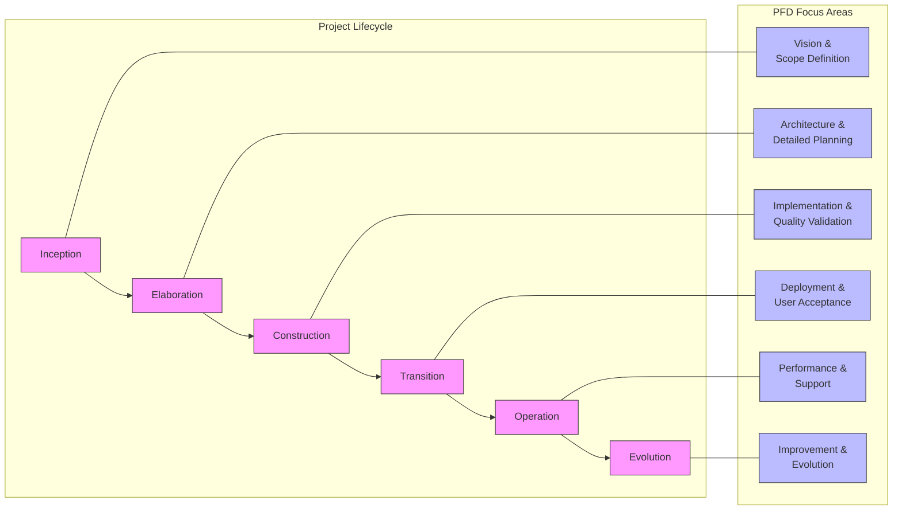

# Documentation de la Règle `@5000-workflow-foundation-document-pfd.mdc`

## Présentation Générale

La règle `@5000-workflow-foundation-document-pfd.mdc` est un cadre fondamental qui définit la structure, le contenu et le processus de création d'un Document Fondation de Projet (PFD). Son objectif principal est d'assurer que la documentation de projet soit complète, précise, structurée et alignée avec les objectifs commerciaux et techniques.

**Description officielle:** "GENERATE when INITIATING project to ENSURE comprehensive and aligned documentation"

Cette règle sert de guide complet pour la création d'une documentation de projet qui servira de référence autoritaire tout au long du cycle de vie du projet. Elle utilise la compression sémantique pour encoder de manière dense et précise les exigences et les structures d'un PFD efficace.

## Structure et Notation Symbolique

La règle utilise plusieurs symboles et notations spécifiques pour représenter ses composants:

- `Σ` (Sigma): Représente un contexte ou une agrégation
- `Ω` (Omega): Identifie l'architecture du document et le cadre de contenu
- `Λ` (Lambda): Indique l'enrichissement du contenu
- `Δ` (Delta): Symbolise la validation de qualité
- `↹` (Tab): Marque une structure ou un concept principal
- `⊕` (Plus cerclé): Identifie un composant ou section à inclure
- `→` (Flèche): Indique un flux, une direction ou une transformation
- `⇌` (Flèche bidirectionnelle): Exprime une relation bidirectionnelle
- `ϴ` (Theta): Représente le processus de création
- `Φ` (Phi): Indique l'adaptation du modèle
- `Ψ` (Psi): Décrit le cycle de vie du document
- `•` (Point médian): Connecte des concepts liés
- `+` (Plus): Combine des éléments similaires
- `Γ` (Gamma): Définit les relations entre documents

Ces symboles permettent d'encoder de façon dense et précise les structures et exigences qui définissent un Document Fondation de Projet efficace.

## Composants Principaux



### 1. Contexte et Alignement (Context•Alignment)

```
## Σ Context•Alignment [p=1]
- PFD = authoritative•reference(scope+requirements+architecture)
- document → single•source•of•truth(stakeholders+developers+operations)
- aligns(technical•implementation ⇌ business•objectives)
- provides•structure(all•project•dimensions)
- balances(comprehensiveness ⇌ clarity ⇌ conciseness)
- basis•for(related•documents+iterative•development)
- foundation•for(epics+stories+tasks)
```

Le contexte et alignement (priorité=1) définit la nature fondamentale et l'objectif du PFD:

- **Référence autoritaire**: Le PFD sert de référence pour la portée, les exigences et l'architecture
- **Source unique de vérité**: Pour toutes les parties prenantes du projet
- **Alignement**: Garantit l'alignement entre l'implémentation technique et les objectifs commerciaux
- **Structure**: Fournit une structure pour toutes les dimensions du projet
- **Équilibre**: Balance entre l'exhaustivité, la clarté et la concision
- **Base**: Sert de fondation pour les documents connexes et le développement itératif
- **Fondation**: Constitue le socle pour la création des epics, stories et tâches

### 2. Relations entre Documents (Document•Relationships)

````
## Γ Document•Relationships [p=1]

↹ foundation•triad {
  components: [
    PFD: high•level•foundation(complete•project•vision),
    PRD: refined•requirements(user•stories+features+validation•criteria),
    Architecture: technical•blueprint(components+patterns+interfaces)
  ]

  flow: PFD → [PRD, Architecture] → implementation

  relationships: {
    PFD⇌PRD: vision•to•requirements+business•alignment,
    PFD⇌Architecture: constraints•to•solutions+technical•decisions,
    PRD⇌Architecture: features•to•components+validation•methods
  }

  lifecycle: {
    PFD: foundational+evolving(major•changes),
    PRD: dynamic+iterative(regular•updates),
    Architecture: living•document(technical•decisions+patterns)
  }

  visual•representation: ```mermaid
    graph TD
      PFD[Project Foundation Document] --> PRD[Product Requirements Document]
      PFD --> ARCH[Architecture Document]
      PRD --> EPICS[Epics]
      ARCH --> EPICS
      EPICS --> STORIES[Stories]
      STORIES --> TASKS[Tasks]

      classDef pfd fill:#ff9900,stroke:#333,stroke-width:2px
      classDef prd fill:#66cc99,stroke:#333,stroke-width:2px
      classDef arch fill:#6699ff,stroke:#333,stroke-width:2px
      classDef epic fill:#cc99ff,stroke:#333,stroke-width:2px
      classDef story fill:#ff99cc,stroke:#333,stroke-width:2px
      classDef task fill:#ffcc66,stroke:#333,stroke-width:2px

      class PFD pfd
      class PRD prd
      class ARCH arch
      class EPICS epic
      class STORIES story
      class TASKS task
````

}

↹ agile•mapping {
storage•convention: project•folder→.ai/,
documents: [
foundational: pfd.md(this•document),
requirements: prd.md(product•requirements•document),
technical: arch.md(architecture•document)
],

stories: {
structure: epics→stories→tasks,
location: .ai/epic-{n}/{m}-{code}.story.md,
naming•convention: {
n: sequential•epic•number,
m: sequential•story•number•within•epic,
code: kebab•case•summary•of•story•title
},
content: [
purpose+scope,
acceptance•criteria,
implementation•steps,
risks+mitigations,
hypotheses+validation•methods,
test•coverage(minimum•80%)
]
}

traceability: [
PFD→business•objectives,
PRD→user•requirements,
Architecture→technical•decisions,
Stories→implementation•details
]

workflow: {
initialization: validate•PRD+create•if•missing+identify•initial•risks,
refinement: improve•PRD+document•architecture+identify•hypotheses,
story•creation: create•first•story+follow•naming•convention+include•risks,
development: test•driven+validate•hypotheses+update•stories,
iteration: continuous•improvement+story•updates+risk•reassessment
}

visual•representation: ```mermaid
flowchart LR
subgraph Documents
direction TB
PFD[PFD: Project Foundation]
PRD[PRD: Requirements Detail]
ARCH[ARCH: Technical Design]
end

      subgraph Implementation
        direction TB
        EPICS[Epics]
        STORIES[Stories]
        TASKS[Tasks]
      end

      PFD --> PRD
      PFD --> ARCH
      PRD --> EPICS
      ARCH --> EPICS
      EPICS --> STORIES
      STORIES --> TASKS

      TASKS -.-> |Feedback| STORIES
      STORIES -.-> |Adjustments| PRD
      STORIES -.-> |Technical Insights| ARCH
      PRD -.-> |Major Changes| PFD
      ARCH -.-> |Constraints| PFD

```
}
```

Les relations entre documents (priorité=1) définissent la triade de documentation fondamentale et son application dans un contexte agile:

- **Triade fondamentale**:

  - **PFD**: Fondation de haut niveau qui fournit la vision complète du projet
  - **PRD**: Exigences raffinées incluant stories utilisateur, fonctionnalités et critères de validation
  - **Architecture**: Plan technique définissant les composants, patterns et interfaces

- **Flux d'information**: Le PFD alimente à la fois le PRD et l'Architecture, qui ensemble guident l'implémentation

- **Relations bidirectionnelles**:

  - PFD ⇌ PRD: Vision vers exigences et alignement business
  - PFD ⇌ Architecture: Contraintes vers solutions et décisions techniques
  - PRD ⇌ Architecture: Fonctionnalités vers composants et méthodes de validation

- **Cycle de vie**:

  - PFD: Document fondamental qui évolue lors de changements majeurs
  - PRD: Document dynamique avec mises à jour régulières
  - Architecture: Document vivant qui capture les décisions et patterns techniques

- **Représentation visuelle**: Diagramme montrant les relations entre les différents documents et les artefacts d'implémentation

- **Cartographie Agile**:
  - **Convention de stockage**: Utilisation du dossier `.ai/` pour les documents de projet
  - **Documents clés**: pfd.md, prd.md, arch.md
  - **Structure des stories**: Organisation en epics → stories → tâches
  - **Emplacement des stories**: Format `.ai/epic-{n}/{m}-{code}.story.md`
  - **Convention de nommage**: Numérotation séquentielle et nomenclature standardisée
  - **Contenu des stories**: Inclut objectif, critères d'acceptation, étapes d'implémentation, risques, hypothèses et couverture de tests (min 80%)
  - **Traçabilité**: Liens clairs entre PFD, PRD, Architecture et Stories d'implémentation
  - **Workflow**: Définit les étapes du processus agile, de l'initialisation à l'itération
  - **Représentation visuelle du workflow**: Illustre les relations et le flux de feedback entre la documentation et l'implémentation

### 3. Architecture du Document (Document•Architecture)

```
## Ω₁ Document•Architecture [p=1]

↹ hierarchy•structure {
  format: markdown•professional
  organization: hierarchical•sections(numbered•headings)
  navigation: table•of•contents(auto•generated)
  accessibility: technical+non_technical
  components: [
    frontmatter(metadata+version+status)
    → toc(detailed+links)
    → main•sections(core+supporting)
    → appendices(reference+supplemental)
  ]
}

↹ metadata•requirements {
  elements: [
    title: project•name+document•type,
    version: semver+date,
    status: draft|review|approved,
    authors: names+roles,
    approvers: authorities+sign•off,
    classification: public|internal|confidential,
    changelog: version•history(date+author+changes),
    related_documents: links(prd+architecture),
    team_size: small|medium|large(2-5|6-15|15+),
    methodology: agile|hybrid|waterfall
  ]

  schema: YAML|JSON
  placement: document•start
}

↹ table•of•contents {
  generation: auto•generated|manual
  format: numbered•sections+links
  depth: h1+h2+h3(minimum)
  navigation: clickable•anchors+reference•links
  updating: maintain•with•content•changes
}
```

L'architecture du document (priorité=1) définit la structure générale et les métadonnées:

- **Structure hiérarchique**: Format markdown professionnel avec des sections numérotées
- **Navigation**: Table des matières auto-générée
- **Accessibilité**: Pour les publics techniques et non techniques
- **Composants**: Frontmatter, table des matières, sections principales, annexes
- **Exigences de métadonnées**:
  - Éléments de base: Titre, version, statut, auteurs, approbateurs, classification, historique
  - Nouveaux éléments: Documents liés (PRD, Architecture), taille d'équipe, méthodologie
- **Table des matières**: Spécifications pour la génération, le format, la profondeur, la navigation et la mise à jour de la table des matières du document

### 4. Cadre de Contenu (Content•Framework)

Le cadre de contenu (priorité=1) définit les sections essentielles et leurs attributs:

- **Sections principales**: Introduction, vision, vision technique, aperçu, exigences, architecture, technique, planification, KPI, tests, opérations, développement, annexes
- **Attributs des sections**: Clarté, exhaustivité, traçabilité, mesurabilité, applicabilité, cohérence

Chaque section est détaillée avec ses composants spécifiques, par exemple:

```
⊕ introduction {
  purpose: document•objectives+usage,
  scope: inclusion+exclusion+boundaries,
  glossary: terminology+acronyms+definitions
}
```

Les améliorations récentes incluent:

- Ajout d'une prioritisation (`high|medium|low`) dans la section des exigences
- Inclusion de vues architecturales (logique, physique, processus, développement)
- Spécification plus précise des versions techniques et de la compatibilité
- Intégration d'une méthodologie complète pour le suivi des KPIs
- Ajout d'automatisation pour les tests et les rapports de couverture
- Inclusion de pratiques de développement comme les revues de code et la programmation par paires
- Formalisation des registres de décisions architecturales dans les annexes
- Nouvelles sections pour l'adaptation à la taille d'équipe et transitions de phase

### 5. Enrichissement de Contenu (Content•Enrichment)

L'enrichissement de contenu (priorité=1) approfondit plusieurs domaines clés:

- **Détails architecturaux (Λ₁)**: Vues, patterns, interfaces, diagrammes
- **Stack technique (Λ₂)**: Frontend, backend, infrastructure, sécurité, critères de sélection
- **Gestion des risques (Λ₃)**: Dimensions, évaluation, réponse, cadre, validation, cadence
- **Développement itératif (Λ₄)**: Stories, cycles, feedback, adaptation
- **Pratiques de documentation (Λ₅)**: Code, API, utilisateur, architecture
- **Principes de développement (Λ₆)**: Nouvelle section détaillant les principes et pratiques

#### Λ₃•RiskManagement

La gestion des risques inclut:

- **Validation**:

  - Hypothèses explicites et prédictions testables
  - Méthodes de vérification incluant expériences, tests et preuves
  - Suivi des hypothèses (validées/invalidées) avec niveau de confiance
  - Adaptation de la stratégie basée sur les résultats

- **Cadence**:
  - Revues basées sur les sprints et les jalons
  - Reporting aux parties prenantes et tableaux de bord
  - Escalade basée sur des seuils déclencheurs
  - Attribution à des propriétaires spécifiques avec statut de progression

#### Λ₄•IterativeDevelopment

Le développement itératif comprend:

- **Stories**:

  - Granularité: Focalisées sur l'utilisateur, livrables, testables
  - Création: Dérivées des exigences, incrémentales, priorisées
  - Approbation: Revue par les parties prenantes, critères d'acceptation
  - Implémentation: Développement piloté par les tests, fonctionnalités complètes

- **Cycles**:

  - Planification: Objectifs, portée, sélection de stories
  - Développement: Implémentation, tests, documentation
  - Revue: Démonstration, feedback, acceptation
  - Rétrospective: Apprentissages, améliorations, adaptations

- **Feedback**:

  - Sources: Utilisateurs, parties prenantes, équipe, métriques
  - Incorporation: Mise à jour des exigences, ajustement de la portée, raffinement technique
  - Documentation: Décisions, changements, justifications

- **Adaptation**:
  - PFD: Reflète les pivots majeurs et changements de portée
  - PRD: Capture l'évolution des exigences et priorités
  - Architecture: Mise à jour avec les apprentissages et décisions techniques

#### Λ₅•DocumentationPractices

Nouvelle section sur les pratiques de documentation:

- **Documentation du code**:

  - Inline: Objectif, paramètres, retours, exemples
  - Style: Cohérent, lisible, maintenable
  - Standards: Spécifiques au langage, conventions de projet
  - Génération: Documentation automatique, inférence de type, exemples

- **Documentation API**:

  - Contrats: Endpoints, paramètres, réponses, erreurs
  - Versioning: Compatibilité, dépréciation, migration
  - Exemples: Requêtes/réponses, cas limites, erreurs
  - Tests: Automatisation, couverture, validation

- **Documentation utilisateur**:

  - Guides: Installation, configuration, opération
  - Tutoriels: Étape par étape, captures d'écran, vidéos
  - Références: API complète, options, paramètres
  - FAQ: Problèmes courants, dépannage

- **Documentation architecture**:
  - Diagrammes: État actuel, cible, transition
  - Décisions: Justification, alternatives, conséquences
  - Patterns: Solutions réutilisables, contexte, compromis
  - Contraintes: Limitations, frontières, hypothèses

#### Λ₆•DevelopmentPrinciples

Nouvelle section sur les principes de développement:

```
↹ Λ₆•DevelopmentPrinciples [p=1] {
  design•principles: {
    SOLID: {
      S: single•responsibility(class•has•one•reason•to•change),
      O: open•closed(open•for•extension+closed•for•modification),
      L: liskov•substitution(subtypes•must•be•substitutable•for•base•types),
      I: interface•segregation(specific•interfaces•better•than•general),
      D: dependency•inversion(depend•on•abstractions+not•implementations)
    },

    KISS: keep•it•simple(avoid•unnecessary•complexity+favor•readability),
    DRY: don't•repeat•yourself(abstraction+reuse+avoid•duplication),
    YAGNI: you•aren't•gonna•need•it(implement•when•needed+not•before),

    clean•code: {
      readability: intuitive•names+consistent•formatting+self•explaining,
      maintainability: modular+testable+well•documented,
      efficiency: optimized•but•not•prematurely+appropriate•algorithms,
      robustness: error•handling+boundary•cases+input•validation
    }
  },

  coding•standards: {
    naming•conventions: {
      variables: descriptive+camelCase+purpose•in•name,
      functions: verb•based+descriptive+single•responsibility,
      classes: noun•based+single•responsibility+cohesive,
      constants: UPPER_SNAKE_CASE+meaningful+well•documented,
      interfaces: descriptive+purpose•driven+well•defined
    },

    formatting: {
      indentation: consistent•spacing+logical•nesting,
      line•length: reasonable•limit(80-120•characters),
      grouping: related•code•together+logical•separation,
      whitespace: consistent•usage+improved•readability
    },

    documentation: {
      inline•comments: explain•why+not•what,
      function•docs: purpose+parameters+return•values+exceptions,
      class•docs: responsibility+usage+lifecycle,
      example•usage: clear•demonstrations+edge•cases
    }
  },

  testing•practices: {
    coverage: minimum•80%+critical•paths•100%,
    methodology: {
      TDD: test•first+red•green•refactor,
      BDD: behavior•specifications+user•stories,
      unit•testing: isolated•components+mocked•dependencies,
      integration•testing: component•interactions+real•dependencies,
      e2e•testing: complete•user•flows+production•like•environment
    },

    quality•assurance: {
      automated•testing: CI•pipeline+pre•commit•hooks,
      manual•testing: exploratory+usability+accessibility,
      performance•testing: load+stress+endurance,
      security•testing: penetration+vulnerability•assessment
    }
  },

  code•review: {
    process: pull•request+defined•reviewers+checklist,
    focus•areas: functionality+security+performance+maintainability,
    feedback: constructive+specific+actionable,
    approval•criteria: test•coverage+quality•standards+no•critical•issues
  },

  version•control: {
    branching•strategy: {
      git•flow: develop+feature+release+hotfix+master,
      github•flow: feature•branches+pull•requests+main,
      trunk•based: short•lived•branches+frequent•integration
    },

    commit•practices: {
      conventional•commits: type+scope+description,
      granularity: atomic+focused+purpose•driven,
      messages: clear+concise+descriptive
    }
  }
}
```

Cette nouvelle section sur les principes de développement définit en détail:

- **Principes de design**:

  - **SOLID**: Définition détaillée de chaque principe:

    - S - Responsabilité unique: chaque classe a une seule raison de changer
    - O - Ouvert/fermé: ouvert à l'extension, fermé à la modification
    - L - Substitution de Liskov: les sous-types doivent être substituables aux types de base
    - I - Ségrégation d'interface: des interfaces spécifiques sont préférables aux interfaces générales
    - D - Inversion de dépendance: dépendre des abstractions, pas des implémentations

  - **KISS**: Keep It Simple - éviter la complexité inutile et favoriser la lisibilité
  - **DRY**: Don't Repeat Yourself - abstraction, réutilisation et évitement de la duplication
  - **YAGNI**: You Aren't Gonna Need It - implémenter les fonctionnalités quand elles sont nécessaires, pas avant

  - **Clean Code**:
    - Lisibilité: noms intuitifs, formatage cohérent, code auto-explicatif
    - Maintenabilité: modulaire, testable, bien documenté
    - Efficacité: optimisé adéquatement, algorithmes appropriés
    - Robustesse: gestion des erreurs, cas limites, validation des entrées

- **Standards de codage**:

  - **Conventions de nommage**:

    - Variables: descriptives, camelCase, nom reflétant l'objectif
    - Fonctions: basées sur des verbes, descriptives, responsabilité unique
    - Classes: basées sur des noms, responsabilité unique, cohésives
    - Constantes: UPPER_SNAKE_CASE, significatives, bien documentées
    - Interfaces: descriptives, orientées objectif, bien définies

  - **Formatage**:

    - Indentation: espacement cohérent, imbrication logique
    - Longueur de ligne: limite raisonnable (80-120 caractères)
    - Regroupement: code connexe groupé, séparation logique
    - Espaces blancs: utilisation cohérente, amélioration de la lisibilité

  - **Documentation**:
    - Commentaires en ligne: expliquer pourquoi, pas quoi
    - Documentation des fonctions: objectif, paramètres, valeurs de retour, exceptions
    - Documentation des classes: responsabilité, utilisation, cycle de vie
    - Exemples d'utilisation: démonstrations claires, cas limites

- **Pratiques de test**:

  - **Couverture**: minimum 80%, chemins critiques 100%
  - **Méthodologie**:

    - TDD: test d'abord, rouge-vert-refactoring
    - BDD: spécifications de comportement, user stories
    - Tests unitaires: composants isolés, dépendances simulées
    - Tests d'intégration: interactions entre composants, dépendances réelles
    - Tests end-to-end: flux utilisateur complets, environnement similaire à la production

  - **Assurance qualité**:
    - Tests automatisés: pipeline CI, hooks pre-commit
    - Tests manuels: exploratoires, utilisabilité, accessibilité
    - Tests de performance: charge, stress, endurance
    - Tests de sécurité: pénétration, évaluation de vulnérabilité

- **Revue de code**:

  - **Processus**: pull request, reviewers définis, checklist
  - **Domaines d'attention**: fonctionnalité, sécurité, performance, maintenabilité
  - **Feedback**: constructif, spécifique, actionnable
  - **Critères d'approbation**: couverture de tests, standards de qualité, absence de problèmes critiques

- **Contrôle de version**:

  - **Stratégie de branches**:

    - Git Flow: develop, feature, release, hotfix, master
    - GitHub Flow: branches de fonctionnalités, pull requests, main
    - Trunk-based: branches de courte durée, intégration fréquente

  - **Pratiques de commit**:
    - Commits conventionnels: type, portée, description
    - Granularité: atomique, ciblé, orienté objectif
    - Messages: clairs, concis, descriptifs

### 6. Validation de Qualité (Quality•Validation)

La validation de qualité (priorité=1) établit:

- **Métriques de document (Δ₁)**: Exhaustivité, clarté, alignement, applicabilité
- **Cadre de validation (Δ₂)**: Listes de contrôle, révisions, processus d'approbation
- **Suivi des métriques (Δ₃)**: Nouvelle section qui définit des métriques détaillées:

```
↹ Δ₃•MetricsTracking [p=1] {
  performance: {
    baseline: initial•measurements+benchmarks,
    targets: specific•values+improvement•goals,
    monitoring: tools+frequency+reporting,
    thresholds: acceptable•ranges+alert•levels
  }

  quality: {
    code: coverage+complexity+duplication+standards,
    testing: unit+integration+e2e+security,
    documentation: completeness+accuracy+usability,
    user•experience: usability+accessibility+performance
  }

  project: {
    velocity: story•points+completion•rate,
    predictability: estimation•accuracy+delivery•consistency,
    efficiency: resource•utilization+output•ratio,
    adaptation: pivot•speed+feedback•incorporation
  }

  business: {
    value: roi+cost•savings+revenue•impact,
    adoption: user•acquisition+retention+engagement,
    satisfaction: nps+csat+user•feedback,
    alignment: objectives•met+business•impact
  }
}
```

#### Δ₃•MetricsTracking

Le suivi des métriques comprend:

- **Performance**:

  - **Baseline**: Mesures initiales qui servent de point de référence pour évaluer les améliorations
  - **Targets**: Valeurs spécifiques à atteindre, avec des jalons progressifs
  - **Monitoring**: Outils et processus pour suivre les métriques en continu
  - **Thresholds**: Définition des plages acceptables et des seuils d'alerte

- **Méthodologie de mesure**:

  - Sources de données: Systèmes, outils, collecte manuelle
  - Fréquence: Quotidienne, hebdomadaire, mensuelle
  - Agrégation: Moyenne, médiane, percentiles, tendances
  - Précision: Marge d'erreur, confiance statistique

- **Tableaux de bord**:

  - Types: Stratégique, tactique, opérationnel
  - Public: C-suite, managers, équipe de développement
  - Visualisations: Graphiques, indicateurs, comparaisons
  - Interactivité: Drill-down, filtres, personnalisation

- **Alertes et seuils**:
  - Définition: Niveaux d'alerte basés sur des seuils prédéfinis
  - Canaux: Email, Slack, SMS, intégrations
  - Escalade: Processus d'escalade automatique
  - Réponse: Procédures de réponse documentées

### 7. Exigences Critiques (Critical•Requirements)

Les exigences critiques (priorité=1) définissent clairement ce qu'il faut toujours faire et ne jamais faire. Ces listes ont été enrichies pour inclure:

#### ALWAYS

- Inclure des registres de décisions avec justification
- Documenter toutes les dépendances externes
- Adapter le niveau de détail à la taille de l'équipe
- Décrire l'évolution attendue du document à travers les phases du projet
- Définir une méthodologie claire de suivi des métriques

#### NEVER

- Omettre l'historique des versions et le changelog
- Exclure des parties prenantes clés des revues
- Ignorer le processus de priorisation des exigences
- Laisser des décisions architecturales sans documentation
- Négliger d'identifier les secteurs de risque élevé

### 8. Processus de Création (Creation•Process)

Le processus de création (priorité=2) a été enrichi avec:

- **Workflow**: Ajout d'une étape "evolve" pour la mise à jour basée sur le feedback d'implémentation
- **Collaboration**: Ajout de pratiques agile avec mises à jour régulières alignées sur les sprints
- **Gestion des itérations**: Nouvelle section qui définit:

  - Déclencheurs: Fin de sprint, changements majeurs, découvertes techniques
  - Mises à jour: Métadonnées, contenu, approbations
  - Versionnement: Major pour les changements significatifs, minor pour les raffinements, patch pour les corrections

- **Suivi des décisions**: Nouvelle section qui formalise:

```
↹ decision•tracking → {
  structure: {
    id: sequential•identifier,
    title: concise•description,
    status: proposed|accepted|rejected|superseded,
    date: when•decided,
    context: problem•statement+background,
    decision: clear•outcome+rationale,
    consequences: positive+negative+neutral,
    alternatives: options•considered+rejection•reasons
  }

  management: {
    storage: alongside•PFD+version•controlled,
    referencing: citations•in•relevant•sections,
    updates: status•changes+revisions+superseding,
    traceability: implementation•verification
  }

  templates: {
    ADR: lightweight•decision•records,
    RFC: detailed•request•for•comments,
    spike: exploration•outcome•documentation
  }
}
```

Cette section **Suivi des décisions** formalise la structure et la gestion des décisions architecturales:

- **Structure**:

  - Identifiant: numéro séquentiel unique
  - Titre: description concise de la décision
  - Statut: proposée, acceptée, rejetée ou remplacée
  - Date: moment où la décision a été prise
  - Contexte: énoncé du problème et contexte
  - Décision: résultat clair avec justification
  - Conséquences: positives, négatives et neutres
  - Alternatives: options considérées et raisons de rejet

- **Gestion**:

  - Stockage: à côté du PFD, versionné
  - Référencement: citations dans les sections pertinentes
  - Mises à jour: changements de statut, révisions, remplacement
  - Traçabilité: vérification de l'implémentation

- **Templates**:
  - ADR: registres de décisions architecturales légers
  - RFC: demandes de commentaires détaillées
  - Spike: documentation des résultats d'exploration

### 9. Adaptation du Modèle (Template•Adaptation)

L'adaptation du modèle (priorité=2) a été enrichie avec:

- **Types de projets**: Différentes emphases selon le type (produit logiciel, système d'entreprise, etc.)
- **Alignement méthodologique**: Approches agile, cascade et hybride
- **Adaptation à la taille de l'équipe**: Nouvelle section qui définit:

  - **Petite équipe (2-5 personnes)**:

    - Focus sur les sections essentielles (Vision, Exigences, Architecture de base, KPIs)
    - Niveau de détail: Documentation concise mais complète des décisions critiques
    - Mises à jour: Fréquentes et informelles, avec vérification régulière d'alignement
    - Collaboration: Communication directe, sessions de travail communes pour les décisions

  - **Équipe moyenne (6-15 personnes)**:

    - Focus sur l'équilibre entre structure et agilité, détail modéré dans toutes les sections
    - Niveau de détail: Clarification des interfaces entre composants et responsabilités d'équipes
    - Mises à jour: Synchronisation hebdomadaire, revues structurées
    - Collaboration: Combinaison de communications synchrones et asynchrones

  - **Grande équipe (15+ personnes)**:
    - Focus sur la documentation complète et formelle, gouvernance claire
    - Niveau de détail: Spécifications détaillées des interfaces, processus, et responsabilités
    - Mises à jour: Processus formel de gestion des changements, revues planifiées
    - Collaboration: Communication basée sur les rôles, documentation extensive des décisions

### 10. Cycle de Vie du PFD (PFD•Lifecycle)

Le cycle de vie (priorité=2) a été enrichi avec:

- **Gestion continue**: Maintenance, application, évolution
- **Patterns d'utilisation**: Onboarding, prise de décision, implémentation, vérification, développement agile
- **Boucles de feedback**: Implémentation → PFD, Stories → PRD, etc.
- **Transitions de phase**: Nouvelle section qui définit les évolutions du document lors des transitions:

```
↹ phase•transitions → {
  inception→elaboration: validated•vision+scoped•requirements,
  elaboration→construction: architectural•foundation+detailed•plan,
  construction→transition: feature•complete+quality•verified,
  transition→operation: deployed+accepted+supported,
  operation→evolution: performance•data+improvement•opportunities
}
```

#### phase•transitions

Cette section définit comment le PFD évolue à travers les différentes phases du projet:

- **Phase d'Inception → Élaboration**:

  - Focus du PFD: Vision validée, exigences délimitées, risques majeurs identifiés
  - Sections critiques: Vision, Aperçu, Exigences de haut niveau
  - Livrables associés: Vision Produit, Épics initiaux
  - Critères de transition: Vision validée et partagée, portée définie, exigences principales identifiées
  - Modifications du PFD: Raffinement de la vision, précision des exigences, identification des contraintes

- **Phase d'Élaboration → Construction**:

  - Focus du PFD: Fondation architecturale, plan détaillé, réduction des risques
  - Sections critiques: Architecture, Approche Technique, Planification détaillée
  - Livrables associés: Prototype architectural, User Stories priorisées
  - Critères de transition: Architecture validée, plan détaillé établi, risques majeurs atténués
  - Modifications du PFD: Détail de l'architecture, spécification technique, planning précis

- **Phase de Construction → Transition**:

  - Focus du PFD: Suivi de l'avancement, adaptation aux découvertes
  - Sections critiques: KPIs, Stratégie de Test, Opérations
  - Livrables associés: Incréments produit, Rapports d'avancement
  - Critères de transition: Fonctionnalités complètes, qualité vérifiée, plan de déploiement prêt
  - Modifications du PFD: Mise à jour des KPIs, finalisation de la documentation opérationnelle

- **Phase de Transition → Opération**:

  - Focus du PFD: Déploiement, acceptation utilisateur, support
  - Sections critiques: Opérations, Support et Maintenance
  - Livrables associés: Documentation de déploiement, Matériels de formation
  - Critères de transition: Système déployé, accepté par les utilisateurs, support en place
  - Modifications du PFD: Documentation des procédures opérationnelles, plans de maintenance

- **Phase d'Opération → Évolution**:
  - Focus du PFD: Données de performance, opportunités d'amélioration
  - Sections critiques: KPIs, Documentation, Historique
  - Livrables associés: Rapports de performance, Demandes d'évolution
  - Critères de transition: Données suffisantes collectées, opportunités d'amélioration identifiées
  - Modifications du PFD: Mise à jour basée sur les retours d'expérience, préparation pour les futures évolutions

**Visualisation du flux de transition**:



Chaque transition de phase nécessite une revue et mise à jour du PFD pour refléter les changements et apprentissages. Cette approche garantit que le document reste pertinent et utile tout au long du cycle de vie du projet.

### 11. Exemples (Examples)

La section d'exemples a été enrichie avec:

- Un **exemple complet** de PFD pour un projet de refonte de portail client
- Un **exemple technique** de PFD pour un projet d'infrastructure technique, incluant:
  - Diagrammes d'infrastructure et d'architecture réseau
  - Tableau des composants et technologies
  - Registre de décisions architecturales
  - Stratégie de déploiement et de migration
  - Métriques de performance et SLAs
- Un **exemple adapté** pour différentes tailles d'équipe, montrant les variations selon le contexte
- Un **contre-exemple** montrant un PFD inadéquat avec une liste étendue de problèmes

### 12. Validation du PFD (PFD•Validation)

La validation du PFD (priorité=1) a été enrichie avec:

- **Préparation agile**: Vérifier que le PFD supporte le développement itératif et le mapping des stories
- **Traçabilité**: Vérifier les liens entre exigences, stories et composants architecturaux
- **Suivi des hypothèses**: Vérifier que les hypothèses critiques sont identifiées et testables
- **Registres de décisions**: Vérifier que les décisions architecturales sont documentées et justifiées
- **Adaptation contextuelle**: Vérifier que le niveau de détail est approprié pour la taille de l'équipe
- **Planification des transitions**: Vérifier que l'évolution du PFD est définie pour chaque phase

## Application Pratique

### Intégration Agile

Dans un contexte agile, le PFD s'applique comme suit:

1. **Document Initial**: Le PFD est créé au démarrage du projet, définissant la vision générale, les contraintes et les objectifs

2. **Relation avec le PRD**: Le PFD alimente le PRD (`.ai/prd.md`), qui détaille les exigences de manière plus granulaire et peut évoluer plus fréquemment

3. **Relation avec l'Architecture**: Le PFD établit les contraintes et principes qui guident le document d'architecture (`.ai/arch.md`)

4. **Alimentation des Stories**: Le PFD et le PRD sont les sources pour la création de stories (`.ai/epic-{n}/{m}-{code}.story.md`)

5. **Cycle d'Évolution**:

   - Les stories fournissent un feedback lors de l'implémentation
   - Les apprentissages sont incorporés dans le PRD et l'Architecture
   - Les changements majeurs sont propagés au PFD

6. **Synchronisation avec les Sprints**:

   - À la fin de chaque sprint, vérifier si des mises à jour sont nécessaires
   - Après des jalons importants, effectuer une revue complète du PFD

7. **Validation Continue**:
   - Utiliser la validation du PFD pour s'assurer que le document reste pertinent
   - Vérifier la traçabilité entre les exigences, stories et composants architecturaux
   - S'assurer que les décisions architecturales sont correctement documentées

### Adaptation à la Taille de l'Équipe

Le PFD peut être adapté en fonction de la taille de l'équipe:

1. **Petites équipes (2-5 personnes)**:

   - Se concentrer sur les sections essentielles (vision, exigences, architecture)
   - Favoriser une approche légère avec des mises à jour fréquentes
   - Privilégier la communication directe pour compléter la documentation
   - Utiliser des outils collaboratifs pour maintenir le document à jour

2. **Équipes moyennes (6-15 personnes)**:

   - Équilibrer le niveau de détail et la communication structurée
   - Établir un calendrier régulier de revues et de mises à jour
   - Combiner des approches formelles et informelles
   - Assigner des responsabilités claires pour les différentes sections

3. **Grandes équipes (15+ personnes)**:
   - Développer un document complet avec un haut niveau de détail
   - Mettre en place une gouvernance formelle pour les mises à jour
   - Définir des processus explicites d'approbation et de communication
   - Maintenir une traçabilité rigoureuse avec les autres documents

### Quand Utiliser Cette Règle

La règle `@5000-workflow-foundation-document-pfd.mdc` doit être utilisée dans les situations suivantes:

1. **Initiation de projet**: Au démarrage d'un nouveau projet pour établir une base solide
2. **Documentation manquante**: Pour un projet existant qui manque de documentation structurée
3. **Révision majeure**: Lors d'une refonte significative ou d'un pivot de projet
4. **Documentation standardisée**: Pour établir des normes cohérentes de documentation à travers différents projets
5. **Alignement des parties prenantes**: Pour s'assurer que toutes les parties prenantes partagent la même vision et compréhension
6. **Préparation Agile**: Avant de démarrer un développement itératif pour établir une fondation claire
7. **Changement d'échelle**: Lors d'une modification significative de la taille de l'équipe nécessitant une adaptation
8. **Transition de phase**: Lors du passage à une nouvelle phase du projet nécessitant une mise à jour de la documentation

### Processus d'Application


## Avantages de la Compression Sémantique

La règle utilise la compression sémantique pour encoder efficacement les exigences et structures d'un PFD:

1. **Densité d'information**: Le format compressé permet de représenter un cadre complet en minimisant la verbosité
2. **Structure cognitive claire**: Les symboles et opérateurs créent une structure mentale cohérente
3. **Hiérarchie visible**: Les relations entre composants sont explicitement représentées
4. **Extensibilité**: Le format facilite l'ajout de nouveaux éléments sans perturber la structure existante
5. **Mémorisation facilitée**: Les symboles et patterns récurrents rendent le cadre plus mémorisable

## Conclusion

La règle `@5000-workflow-foundation-document-pfd.mdc` fournit un cadre complet pour créer des Documents Fondation de Projet qui servent de référence autoritaire tout au long du cycle de vie du projet. En utilisant la compression sémantique, elle encode de manière dense et précise les exigences d'un PFD efficace.

Les principaux bénéfices de cette règle sont:

1. **Documentation complète et alignée**: Assure que toutes les dimensions du projet sont documentées et alignées avec les objectifs commerciaux
2. **Structure cohérente**: Fournit une structure standardisée qui facilite la navigation et la compréhension
3. **Processus guidé**: Offre un workflow clair pour la création et la maintenance du document
4. **Adaptabilité**: Permet l'adaptation à différents types de projets, méthodologies et tailles d'équipe
5. **Validation intégrée**: Inclut des mécanismes de validation pour assurer la qualité du document
6. **Traçabilité end-to-end**: Établit des liens clairs entre la vision, les exigences, l'architecture et l'implémentation
7. **Support du développement itératif**: Facilite l'évolution progressive du document en tandem avec l'implémentation
8. **Gestion des décisions**: Formalise le suivi des décisions architecturales avec leur justification et alternatives
9. **Métriques détaillées**: Intègre un suivi complet des métriques de performance, qualité, projet et business
10. **Adaptabilité contextuelle**: Fournit des recommandations spécifiques selon la taille de l'équipe et la phase du projet
11. **Évolution guidée**: Définit comment le document doit évoluer à travers les différentes phases du projet

En suivant cette règle, les équipes peuvent créer des documents de projet qui servent véritablement de "source unique de vérité" et qui guident efficacement le développement, la prise de décision et l'évaluation du projet, même dans un environnement agile dynamique.
