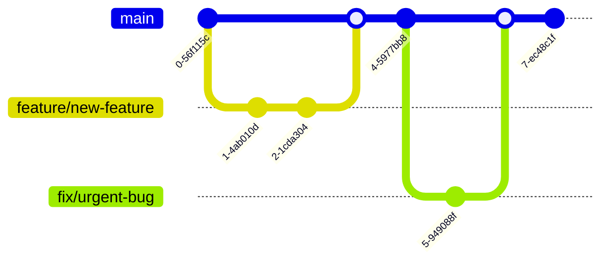
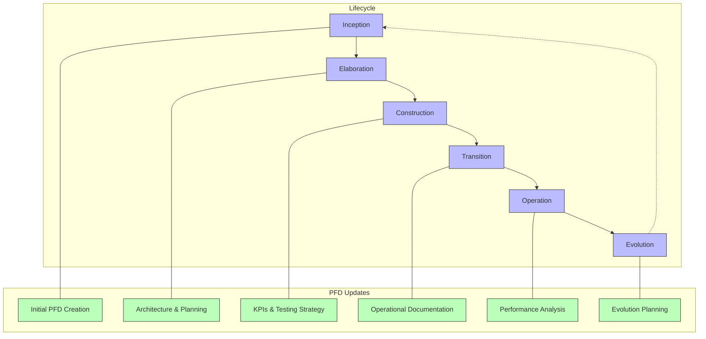

# Document Fondation de Projet: [Nom du Projet]

## Table des Matières

<!-- Table des matières générée automatiquement -->

## 1. Introduction

### 1.1 Objectif du Document

Ce document définit les fondations du projet [Nom du Projet]. Il sert de référence autoritaire pour la portée, les exigences, les décisions techniques et la planification du projet. Ce PFD est destiné à aligner toutes les parties prenantes et à fournir une base solide pour l'ensemble du cycle de vie du projet.

### 1.2 Portée du Projet

#### Inclusions

- [Liste des fonctionnalités/modules/systèmes inclus]
- [...]

#### Exclusions

- [Liste des éléments explicitement exclus]
- [...]

#### Limites

- [Définition des frontières du projet]
- [...]

### 1.3 Glossaire

| Terme/Acronyme | Définition                   |
| -------------- | ---------------------------- |
| [Terme 1]      | [Définition claire]          |
| [Terme 2]      | [Définition claire]          |
| [Acronyme 1]   | [Signification + définition] |

## 2. Vision

### 2.1 Énoncé de Vision

[Un paragraphe concis qui décrit la vision globale du projet, mettant en évidence la valeur apportée aux utilisateurs et à l'organisation]

### 2.2 Alignement Stratégique

| Objectif Stratégique | Contribution du Projet                       |
| -------------------- | -------------------------------------------- |
| [Objectif 1]         | [Comment ce projet contribue à cet objectif] |
| [Objectif 2]         | [Comment ce projet contribue à cet objectif] |

### 2.3 Critères de Succès

| Critère     | Mesure     | Cible          | Méthode de Mesure        |
| ----------- | ---------- | -------------- | ------------------------ |
| [Critère 1] | [Métrique] | [Valeur cible] | [Comment ce sera mesuré] |
| [Critère 2] | [Métrique] | [Valeur cible] | [Comment ce sera mesuré] |

## 3. Vision Technique

### 3.1 Principes Architecturaux

- **[Principe 1]**: [Description et justification]
- **[Principe 2]**: [Description et justification]
- **[Principe 3]**: [Description et justification]

### 3.2 Attributs de Qualité

| Attribut       | Exigence              | Méthode de Mesure        |
| -------------- | --------------------- | ------------------------ |
| Performance    | [Exigence spécifique] | [Comment ce sera mesuré] |
| Sécurité       | [Exigence spécifique] | [Comment ce sera mesuré] |
| Évolutivité    | [Exigence spécifique] | [Comment ce sera mesuré] |
| Maintenabilité | [Exigence spécifique] | [Comment ce sera mesuré] |

### 3.3 Contraintes

- **Contraintes Techniques**: [Liste des contraintes techniques]
- **Contraintes Business**: [Liste des contraintes commerciales]
- **Contraintes Réglementaires**: [Liste des contraintes réglementaires]

## 4. Aperçu

### 4.1 Contexte du Projet

[Description détaillée du contexte, des problèmes actuels, et de la justification du projet]

### 4.2 Objectifs

1. [Objectif SMART 1]
2. [Objectif SMART 2]
3. [Objectif SMART 3]

### 4.3 Public Cible

#### Utilisateurs Primaires

- **[Type d'utilisateur 1]**
  - Profil: [Description]
  - Besoins clés: [Liste des besoins]
  - Fréquence d'utilisation: [Estimation]

#### Utilisateurs Secondaires

- **[Type d'utilisateur 2]**
  - Profil: [Description]
  - Besoins clés: [Liste des besoins]
  - Fréquence d'utilisation: [Estimation]

#### Parties Prenantes

- **[Partie prenante 1]**
  - Rôle: [Description]
  - Intérêts: [Liste des intérêts]

## 5. Exigences

### 5.1 Exigences Fonctionnelles

#### [Catégorie 1]

- En tant que [rôle], je veux [fonctionnalité] afin de [bénéfice]
- En tant que [rôle], je veux [fonctionnalité] afin de [bénéfice]

#### [Catégorie 2]

- En tant que [rôle], je veux [fonctionnalité] afin de [bénéfice]
- En tant que [rôle], je veux [fonctionnalité] afin de [bénéfice]

### 5.2 Exigences Non Fonctionnelles

#### Performance

- [Exigence 1]
- [Exigence 2]

#### Sécurité

- [Exigence 1]
- [Exigence 2]

#### Accessibilité

- [Exigence 1]
- [Exigence 2]

### 5.3 Cas d'Utilisation

#### Cas d'Utilisation 1: [Nom]

- **Acteur**: [Utilisateur]
- **Préconditions**: [État requis]
- **Flux Principal**:
  1. [Étape 1]
  2. [Étape 2]
  3. [Étape 3]
- **Flux Alternatifs**:
  - [Alternative 1]
  - [Alternative 2]
- **Postconditions**: [État résultant]

### 5.4 Priorités

| Exigence     | Priorité (Haute/Moyenne/Basse) | Justification              |
| ------------ | ------------------------------ | -------------------------- |
| [Exigence 1] | [Priorité]                     | [Raison de cette priorité] |
| [Exigence 2] | [Priorité]                     | [Raison de cette priorité] |

## 6. Architecture

### 6.1 Architecture Système

[Diagramme d'architecture ici]

#### Composants Principaux

- **[Composant 1]**: [Objectif et responsabilités]
- **[Composant 2]**: [Objectif et responsabilités]
- **[Composant 3]**: [Objectif et responsabilités]

#### Interfaces

[Description des interfaces entre composants]

### 6.2 Modèle de Données

[Diagramme du modèle de données ici]

#### Entités Clés

- **[Entité 1]**: [Description, attributs et relations]
- **[Entité 2]**: [Description, attributs et relations]
- **[Entité 3]**: [Description, attributs et relations]

### 6.3 Interfaces Utilisateur

[Wireframes ou maquettes ici]

#### Flux Utilisateur

1. [Écran 1] → [Écran 2] → [Écran 3]
2. [Chemin alternatif]

### 6.4 Vues d'Architecture

#### Vue Logique

[Description et diagramme des composants logiques et leurs interactions]

#### Vue de Déploiement

[Description et diagramme de l'infrastructure physique]

#### Vue de Processus

[Description et diagramme des processus, threads, et communication]

#### Vue de Développement

[Description de l'organisation du code et des dépendances]

## 7. Approche Technique

### 7.1 Stack Technologique

#### Frontend

- **Framework**: [Technologie + version]
- **Composants UI**: [Bibliothèque + raison]
- **Gestion d'État**: [Approche + outils]
- **Outils de Build**: [Outils + version]

#### Backend

- **Langages**: [Technologies + versions]
- **Frameworks**: [Technologies + versions]
- **API**: [Approche + format]
- **Bases de Données**: [Technologies + versions]

#### Infrastructure

- **Hébergement**: [Solution + configuration]
- **Conteneurs**: [Technologie + orchestration]
- **CI/CD**: [Pipelines + outils]
- **Monitoring**: [Outils + métriques]

### 7.2 Intégrations Externes

- **[Intégration 1]**: [Description + méthode d'authentification]
- **[Intégration 2]**: [Description + méthode d'authentification]

### 7.3 Sécurité

- **Authentification**: [Mécanisme + détails]
- **Autorisation**: [Approche + gestion des rôles]
- **Protection des Données**: [Méthodes de cryptage + conformité]
- **Audit**: [Mécanismes de journalisation + rapports]

## 8. Planification

### 8.1 Chronologie

#### Phase 1: [Nom]

- **Durée**: [Période]
- **Livrables**: [Liste des livrables]
- **Jalons**: [Dates clés]

#### Phase 2: [Nom]

- **Durée**: [Période]
- **Livrables**: [Liste des livrables]
- **Jalons**: [Dates clés]

### 8.2 Ressources

#### Équipe

- **[Rôle 1]**: [Responsabilités + allocation]
- **[Rôle 2]**: [Responsabilités + allocation]

#### Infrastructure

- **[Ressource 1]**: [Spécifications + objectif]
- **[Ressource 2]**: [Spécifications + objectif]

### 8.3 Évaluation des Risques

| Risque     | Impact           | Probabilité      | Exposition | Stratégie d'Atténuation | Plan de Contingence | Propriétaire | Statut                        |
| ---------- | ---------------- | ---------------- | ---------- | ----------------------- | ------------------- | ------------ | ----------------------------- |
| [Risque 1] | [Haut/Moyen/Bas] | [Haut/Moyen/Bas] | [Valeur]   | [Stratégie]             | [Plan]              | [Nom]        | [Ouvert/En traitement/Mitigé] |
| [Risque 2] | [Haut/Moyen/Bas] | [Haut/Moyen/Bas] | [Valeur]   | [Stratégie]             | [Plan]              | [Nom]        | [Ouvert/En traitement/Mitigé] |

### 8.4 Dépendances Externes

| Dépendance | Description   | Impact                  | Responsable du Suivi | Date Critique | Statut   |
| ---------- | ------------- | ----------------------- | -------------------- | ------------- | -------- |
| [Dép. 1]   | [Description] | [Impact si non résolue] | [Nom]                | [Date]        | [Statut] |
| [Dép. 2]   | [Description] | [Impact si non résolue] | [Nom]                | [Date]        | [Statut] |

## 9. Indicateurs Clés de Performance (KPI)

### 9.1 Définition des KPI

1. **[KPI 1]**: [Description et valeur cible]
2. **[KPI 2]**: [Description et valeur cible]
3. **[KPI 3]**: [Description et valeur cible]

### 9.2 Méthodologie de Mesure

- **Collecte de Données**: [Sources et méthodes]
- **Fréquence de Reporting**: [Calendrier]
- **Outils**: [Analyse et visualisation]
- **Baseline**: [Mesures initiales qui servent de référence]
- **Seuils d'Alerte**: [Niveaux déclenchant une alerte + actions]

### 9.3 Tableaux de Bord

- **Tableau de Bord Business**: [KPIs, audience, fréquence]
- **Tableau de Bord Technique**: [Métriques, audience, fréquence]
- **Alerting**: [Conditions, canaux, responsables]
- **Visualisations**: [Types de graphiques, dimensions clés, filtres]

### 9.4 Métriques par Catégorie

#### 9.4.1 Métriques de Performance

| Métrique     | Baseline | Cible    | Seuil d'Alerte | Méthode de Mesure | Fréquence   |
| ------------ | -------- | -------- | -------------- | ----------------- | ----------- |
| [Métrique 1] | [Valeur] | [Valeur] | [Seuil]        | [Description]     | [Fréquence] |
| [Métrique 2] | [Valeur] | [Valeur] | [Seuil]        | [Description]     | [Fréquence] |

#### 9.4.2 Métriques de Qualité

| Métrique           | Baseline | Cible    | Seuil Minimal | Méthode de Mesure | Fréquence   |
| ------------------ | -------- | -------- | ------------- | ----------------- | ----------- |
| Couverture de Code | [Valeur] | [Valeur] | [Seuil]       | [Description]     | [Fréquence] |
| Dette Technique    | [Valeur] | [Valeur] | [Seuil]       | [Description]     | [Fréquence] |
| Bugs en Production | [Valeur] | [Valeur] | [Seuil]       | [Description]     | [Fréquence] |

#### 9.4.3 Métriques Business

| Métrique     | Baseline | Cible    | Seuil d'Alerte | Méthode de Mesure | Fréquence   |
| ------------ | -------- | -------- | -------------- | ----------------- | ----------- |
| [Métrique 1] | [Valeur] | [Valeur] | [Seuil]        | [Description]     | [Fréquence] |
| [Métrique 2] | [Valeur] | [Valeur] | [Seuil]        | [Description]     | [Fréquence] |

## 10. Stratégie de Test

### 10.1 Types de Tests

- **Tests Unitaires**: [Approche + couverture cible]
- **Tests d'Intégration**: [Approche + composants clés]
- **Tests Système**: [Scénarios end-to-end]
- **Tests d'Acceptation**: [Parties prenantes + critères]
- **Tests de Performance**: [Conditions + critères]
- **Tests de Sécurité**: [Approche + outils]

### 10.2 Environnements de Test

- **Développement**: [Configuration]
- **Staging**: [Configuration]
- **Production**: [Approche de déploiement]

### 10.3 Critères d'Acceptation

1. [Critère 1]
2. [Critère 2]
3. [Critère 3]

### 10.4 Automatisation des Tests

- **Outils**: [Technologies utilisées]
- **Couverture**: [Objectifs et métriques]
- **Intégration CI/CD**: [Configuration]

## 11. Opérations

### 11.1 Plan de Déploiement

- **Checklist Pré-déploiement**: [Éléments à vérifier]
- **Procédure de Déploiement**: [Étapes + responsables]
- **Plan de Rollback**: [Procédure en cas de problèmes]

### 11.2 Support et Maintenance

- **Niveaux de Support**: [Niveaux + temps de réponse]
- **Calendrier de Maintenance**: [Mises à jour régulières]
- **Processus d'Amélioration**: [Comment les nouvelles fonctionnalités sont demandées/approuvées]

### 11.3 Reprise après Sinistre

- **Stratégie de Sauvegarde**: [Fréquence + méthode]
- **Procédure de Restauration**: [Étapes]
- **RTO/RPO**: [Objectifs de temps/point de reprise]

## 12. Développement

### 12.1 Standards de Code

- **Conventions de Code**: [Liens vers les guidelines]
- **Processus de Revue**: [Approche + critères]
- **Gestion de Version**: [Stratégie de branching]

### 12.2 Collaboration

- **Workflow Git**: [Processus + conventions de commit]
- **Pull Requests**: [Processus d'approbation]
- **Communication**: [Outils + canaux]

### 12.3 Documentation

- **Documentation Inline**: [Standards]
- **Documentation API**: [Approche + outils]
- **Documentation Utilisateur**: [Approche + emplacement]
- **Documentation de Code**:
  - Style des commentaires: [Standard adopté]
  - Génération de documentation: [Outils + configuration]
  - Revue de documentation: [Processus]

### 12.4 Pratiques Agiles

- **Refinement**: [Processus + fréquence]
- **Planning**: [Approche + estimation]
- **Stand-ups**: [Format + horaire]
- **Revue**: [Processus + livrables attendus]
- **Rétrospective**: [Méthode + suivi des actions]

### 12.5 Principes de Développement

#### 12.5.1 Principes SOLID

- **Single Responsibility (Responsabilité Unique)**: Chaque classe a une seule raison de changer

  - Application: [Comment ce principe est appliqué dans le projet]
  - Exemples: [Exemples concrets d'application]

- **Open/Closed (Ouvert/Fermé)**: Les entités doivent être ouvertes à l'extension mais fermées à la modification

  - Application: [Comment ce principe est appliqué dans le projet]
  - Exemples: [Exemples concrets d'application]

- **Liskov Substitution (Substitution de Liskov)**: Les objets d'une classe dérivée doivent pouvoir remplacer les objets d'une classe de base sans altérer le comportement du programme

  - Application: [Comment ce principe est appliqué dans le projet]
  - Exemples: [Exemples concrets d'application]

- **Interface Segregation (Ségrégation d'Interface)**: Les clients ne devraient pas être forcés de dépendre d'interfaces qu'ils n'utilisent pas

  - Application: [Comment ce principe est appliqué dans le projet]
  - Exemples: [Exemples concrets d'application]

- **Dependency Inversion (Inversion de Dépendance)**: Les modules de haut niveau ne devraient pas dépendre des modules de bas niveau, les deux devraient dépendre d'abstractions
  - Application: [Comment ce principe est appliqué dans le projet]
  - Exemples: [Exemples concrets d'application]

#### 12.5.2 Autres Principes de Design

- **KISS (Keep It Simple, Stupid)**: Éviter la complexité inutile

  - Application: [Comment ce principe est appliqué dans le projet]
  - Exemples: [Exemples concrets d'application]

- **DRY (Don't Repeat Yourself)**: Éviter la duplication de code et de logique

  - Application: [Comment ce principe est appliqué dans le projet]
  - Exemples: [Exemples concrets d'application]

- **YAGNI (You Aren't Gonna Need It)**: Ne pas implémenter de fonctionnalité avant qu'elle ne soit nécessaire
  - Application: [Comment ce principe est appliqué dans le projet]
  - Exemples: [Exemples concrets d'application]

#### 12.5.3 Clean Code

- **Lisibilité**:

  - Noms de variables et de fonctions significatifs
  - Commentaires explicatifs du pourquoi, pas du quoi
  - Structure de code cohérente et prévisible

- **Maintenabilité**:

  - Méthodes courtes et à responsabilité unique
  - Tests unitaires complets
  - Élimination du code mort ou dupliqué

- **Robustesse**:
  - Gestion complète des erreurs
  - Validation rigoureuse des entrées
  - Traitement des cas limites

#### 12.5.4 Conventions de Nommage

| Élément    | Convention                      | Exemple                              |
| ---------- | ------------------------------- | ------------------------------------ |
| Variables  | camelCase                       | `userData`, `itemCount`              |
| Fonctions  | camelCase, verbe                | `getUserData()`, `calculateTotal()`  |
| Classes    | PascalCase, nom                 | `UserRepository`, `PaymentProcessor` |
| Constantes | UPPER_SNAKE_CASE                | `MAX_RETRY_COUNT`, `API_BASE_URL`    |
| Fichiers   | selon le standard du langage    | `user-service.js`, `UserModel.php`   |
| Dossiers   | kebab-case ou selon le standard | `api-controllers`, `data-models`     |

#### 12.5.5 Qualité du Code

- **Couverture de Tests**:

  - Minimum: 80% de couverture globale
  - 100% pour les chemins critiques
  - Tests unitaires, d'intégration et e2e selon la nature du code

- **Revue de Code**:

  - Critères d'acceptation clairs
  - Checklist de revue (performance, sécurité, style, tests)
  - Au moins un approbateur avant la fusion

- **Standards de Qualité**:
  - Outils d'analyse statique: [Liste des outils]
  - Seuils d'acceptation: [Définition des seuils]
  - Intégration CI: [Configuration des vérifications automatiques]

### 12.6 Stratégie de Contrôle de Version

#### 12.6.1 Modèle de Branches

- **Branche Principale**: `main` ou `master`
- **Branches de Développement**: [Structure et naming]
- **Branches de Fonctionnalités**: [Convention de nommage, ex: `feature/user-authentication`]
- **Branches de Correction**: [Convention de nommage, ex: `fix/login-error`]
- **Branches de Version**: [Si applicable, ex: `release/1.2.0`]

#### 12.6.2 Workflow

#### 12.6.3 Conventions de Commit

- **Format**: `<type>(<scope>): <description>`

  - Types: `feat`, `fix`, `docs`, `style`, `refactor`, `test`, `chore`
  - Exemple: `feat(auth): add OAuth2 authentication`

- **Pull Requests**:
  - Template incluant description, tests, captures d'écran si applicable
  - Revue requise par au moins [nombre] personne(s)
  - CI doit passer avant la fusion

## 13. Annexes

### 13.1 Références

- [Référence 1]: [Description et lien]
- [Référence 2]: [Description et lien]

### 13.2 Documentation Supplémentaire

- [Document 1]: [Objectif et lien]
- [Document 2]: [Objectif et lien]

### 13.3 Historique des Modifications

| Version | Date   | Auteur | Modifications    |
| ------- | ------ | ------ | ---------------- |
| 0.1     | [Date] | [Nom]  | Version initiale |

### 13.4 Registre des Décisions Architecturales

#### ADR-001: [Titre de la Décision]

- **Statut**: [Proposé/Accepté/Rejeté/Remplacé par ADR-XXX]
- **Date**: [YYYY-MM-DD]
- **Contexte**: [Description du problème et du contexte]
- **Décision**: [Description de la décision prise]
- **Justification**: [Pourquoi cette décision a été prise]
- **Conséquences**:
  - **Positives**: [Liste des conséquences positives]
  - **Négatives**: [Liste des conséquences négatives]
  - **Neutres**: [Liste des conséquences neutres]
- **Alternatives Considérées**: [Description des autres options envisagées]
- **Historique des Statuts**:
  - [YYYY-MM-DD]: [Statut] - [Commentaire]

#### ADR-002: [Titre de la Décision]

- **Statut**: [Proposé/Accepté/Rejeté/Remplacé par ADR-XXX]
- **Date**: [YYYY-MM-DD]
- **Contexte**: [Description du problème et du contexte]
- **Décision**: [Description de la décision prise]
- **Justification**: [Pourquoi cette décision a été prise]
- **Conséquences**:
  - **Positives**: [Liste des conséquences positives]
  - **Négatives**: [Liste des conséquences négatives]
  - **Neutres**: [Liste des conséquences neutres]
- **Alternatives Considérées**: [Description des autres options envisagées]
- **Historique des Statuts**:
  - [YYYY-MM-DD]: [Statut] - [Commentaire]

## 14. Approbation

| Rôle   | Nom   | Signature              | Date   |
| ------ | ----- | ---------------------- | ------ |
| [Rôle] | [Nom] | **\*\***\_\_\_**\*\*** | [Date] |
| [Rôle] | [Nom] | **\*\***\_\_\_**\*\*** | [Date] |
| [Rôle] | [Nom] | **\*\***\_\_\_**\*\*** | [Date] |

## 15. Adaptation selon la Taille de l'Équipe

Cette section définit comment adapter l'utilisation de ce PFD en fonction de la taille de l'équipe.

### 15.1 Petite Équipe (2-5 personnes)

- **Focus**: Se concentrer sur les sections essentielles (Vision, Exigences, Architecture de base, KPIs)
- **Niveau de Détail**: Documentation concise mais complète des décisions critiques
- **Mises à jour**: Fréquentes et informelles, avec vérification régulière d'alignement
- **Collaboration**: Communication directe, sessions de travail communes pour les décisions

### 15.2 Équipe Moyenne (6-15 personnes)

- **Focus**: Équilibre entre structure et agilité, détail modéré dans toutes les sections
- **Niveau de Détail**: Détailler les interfaces entre composants et responsabilités d'équipes
- **Mises à jour**: Synchronisation hebdomadaire, revues structurées
- **Collaboration**: Combinaison de communications synchrones et asynchrones

### 15.3 Grande Équipe (15+ personnes)

- **Focus**: Documentation complète et formelle, gouvernance claire
- **Niveau de Détail**: Spécifications détaillées des interfaces, processus, et responsabilités
- **Mises à jour**: Processus formel de gestion des changements, revues planifiées
- **Collaboration**: Communication basée sur les rôles, documentation extensive des décisions

## 16. Transition entre Phases du Projet

Cette section décrit comment le PFD évolue à travers les différentes phases du projet.

### 16.1 Phase d'Inception → Élaboration

- **Focus du PFD**: Vision validée, exigences délimitées, risques majeurs identifiés
- **Sections critiques**: Vision, Aperçu, Exigences de haut niveau
- **Livrables associés**: Vision Produit, Épics initiaux
- **Critères de transition**:
  - Vision validée et partagée par toutes les parties prenantes
  - Portée du projet clairement définie
  - Exigences principales identifiées et priorisées
  - Risques majeurs identifiés avec stratégies initiales
- **Mise à jour du PFD**:
  - Raffinement de la vision et des objectifs stratégiques
  - Précision des exigences principales
  - Identification des contraintes techniques et business

### 16.2 Phase d'Élaboration → Construction

- **Focus du PFD**: Fondation architecturale, plan détaillé, réduction des risques
- **Sections critiques**: Architecture, Approche Technique, Planification détaillée
- **Livrables associés**: Prototype architectural, User Stories priorisées
- **Critères de transition**:
  - Architecture validée via prototypage
  - Plan détaillé établi avec jalons clairs
  - Risques majeurs atténués ou avec stratégies claires
  - Infrastructure technique définie
- **Mise à jour du PFD**:
  - Documentation détaillée de l'architecture retenue
  - Spécification complète de la stack technique avec versions
  - Planning précis avec répartition des ressources
  - Définition des métriques de suivi

### 16.3 Phase de Construction → Transition

- **Focus du PFD**: Suivi de l'avancement, adaptation aux découvertes
- **Sections critiques**: KPIs, Stratégie de Test, Opérations
- **Livrables associés**: Incréments produit, Rapports d'avancement
- **Critères de transition**:
  - Fonctionnalités complètes selon le scope défini
  - Qualité vérifiée selon critères établis
  - Plan de déploiement prêt et validé
  - Documentation utilisateur et opérationnelle disponible
- **Mise à jour du PFD**:
  - Mise à jour des KPIs avec données réelles
  - Finalisation de la documentation opérationnelle
  - Ajustement de la stratégie de déploiement
  - Documentation des leçons apprises

### 16.4 Phase de Transition → Opération

- **Focus du PFD**: Déploiement, acceptation utilisateur, support
- **Sections critiques**: Opérations, Support et Maintenance
- **Livrables associés**: Documentation de déploiement, Matériels de formation
- **Critères de transition**:
  - Système déployé avec succès en production
  - Utilisateurs formés et en mesure d'utiliser le système
  - Processus de support en place et validé
  - KPIs de production collectés et analysés
- **Mise à jour du PFD**:
  - Documentation des procédures opérationnelles finales
  - Plans de maintenance et d'évolution
  - Métriques de performance en production
  - Documentation des limitations connues

### 16.5 Phase d'Opération → Évolution

- **Focus du PFD**: Données de performance, opportunités d'amélioration
- **Sections critiques**: KPIs, Documentation, Historique
- **Livrables associés**: Rapports de performance, Demandes d'évolution
- **Critères de transition**:
  - Données suffisantes collectées pour évaluer la performance
  - Opportunités d'amélioration identifiées et priorisées
  - Business case pour l'évolution établi
  - Ressources disponibles pour les améliorations
- **Mise à jour du PFD**:
  - Mise à jour basée sur les retours d'expérience
  - Documentation des opportunités d'amélioration
  - Préparation d'un nouveau cycle de développement
  - Archivage des métriques et décisions pour référence future

### 16.6 Diagramme des Transitions de Phase

