# Guide Visuel - Document Fondation de Projet (PFD)

Ce guide visuel est un complément à la documentation principale de la règle `@5000-workflow-foundation-document-pfd.mdc`. Il vise à fournir une représentation visuelle des structures, relations et flux de travail pour créer des Documents Fondation de Projet efficaces.

## Structure Globale d'un PFD

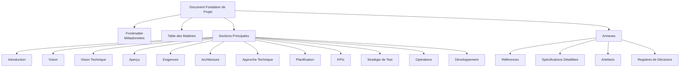

## Triade Documentaire et Flux Agile

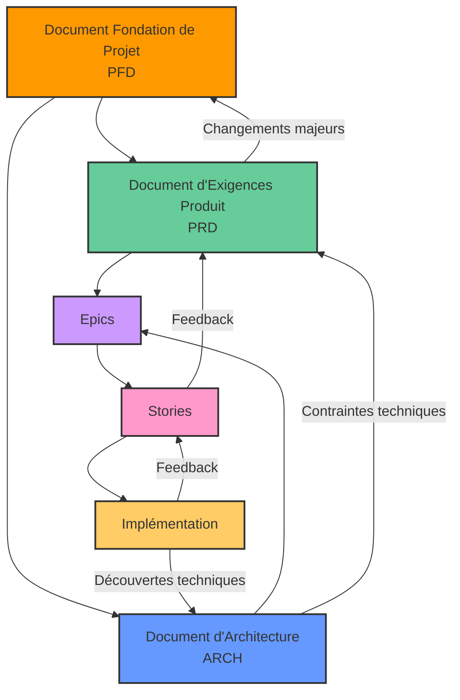

## Organisation des Documents Agiles

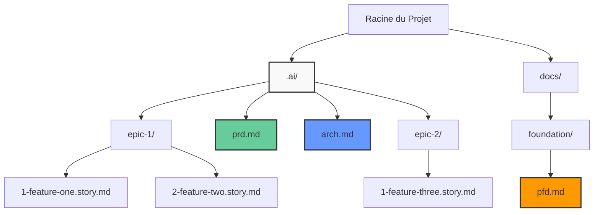

## Relation Entre les Sections Clés

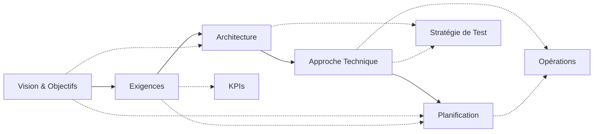

## Structure des Décisions Architecturales

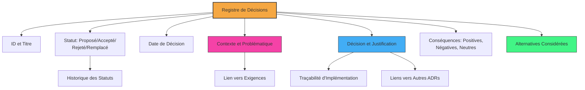

## Transition de Phases du Projet et le PFD

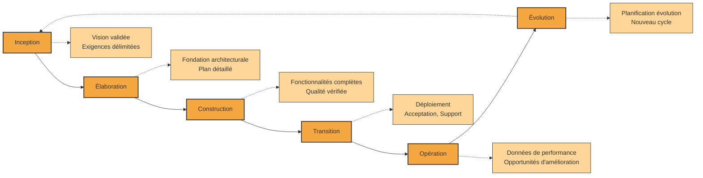

## Processus de Création du PFD

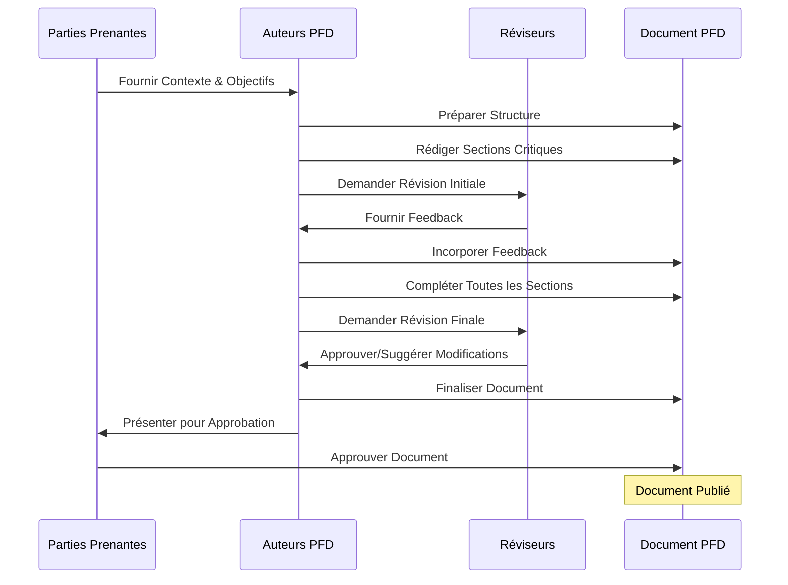

## Cycle de Vie Agile du PFD

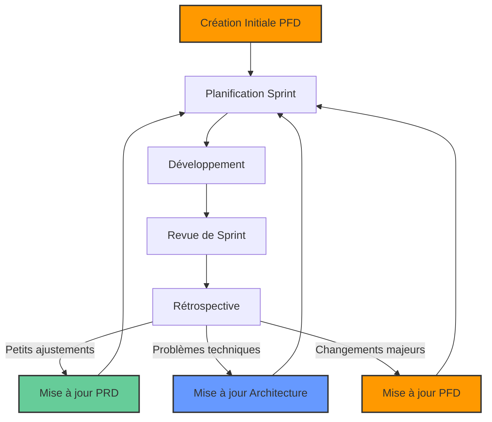

## Adaptation à la Taille de l'Équipe

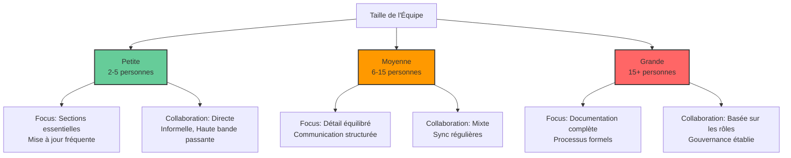

## Métriques et Suivi

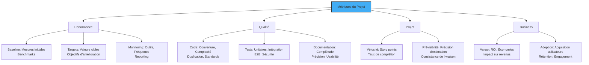

## Pratiques de Documentation

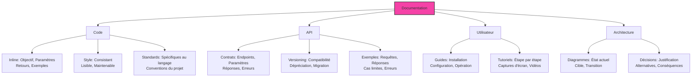

## Principes de Développement SOLID

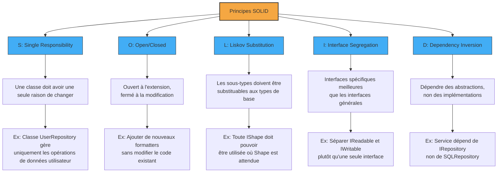

## Autres Principes de Design

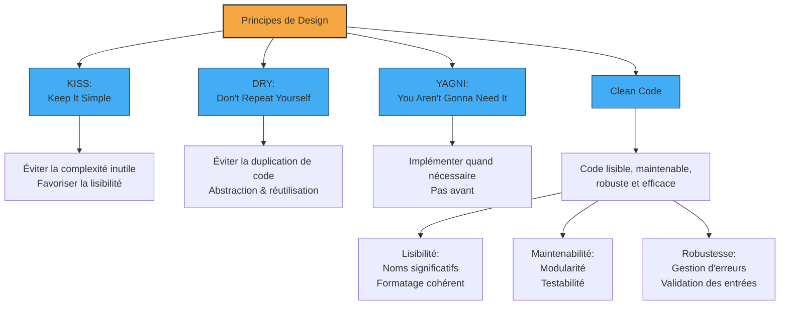

## Conventions de Nommage et Standards

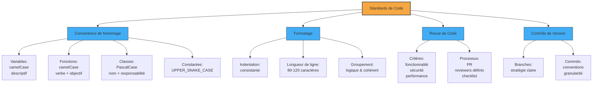

## Stratégie de Contrôle de Version

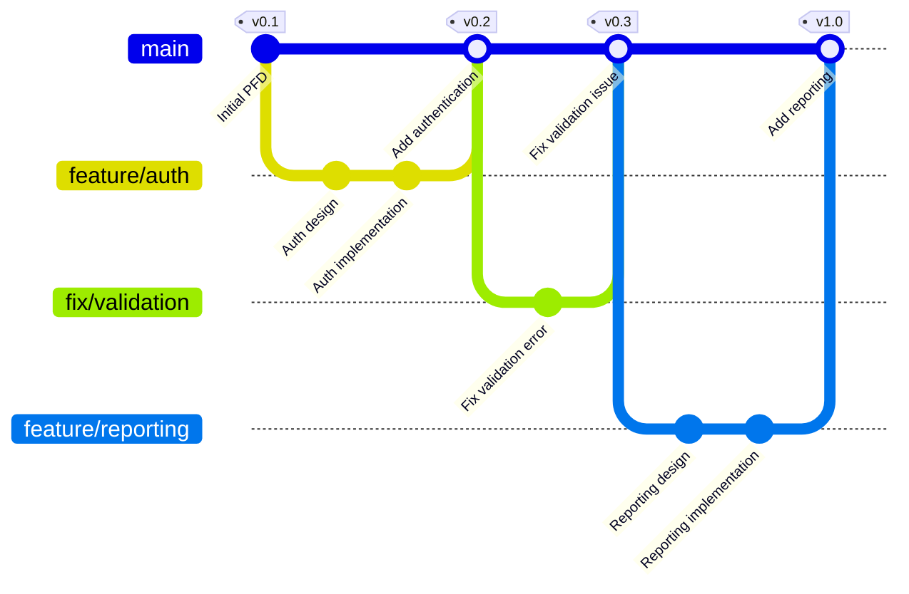

## Vue d'Ensemble des Symboles

| Symbole | Nom                     | Signification dans le PFD                  |
| ------- | ----------------------- | ------------------------------------------ |
| `Σ`     | Sigma                   | Contexte, Agrégation, Validation           |
| `Ω`     | Omega                   | Architecture du Document, Cadre de Contenu |
| `Λ`     | Lambda                  | Enrichissement de Contenu                  |
| `Δ`     | Delta                   | Validation de Qualité                      |
| `↹`     | Tab                     | Structure ou Concept Principal             |
| `⊕`     | Plus Cerclé             | Composant ou Section à Inclure             |
| `→`     | Flèche                  | Flux, Direction, Transformation            |
| `⇌`     | Flèche Bidirectionnelle | Relation Bidirectionnelle                  |
| `ϴ`     | Theta                   | Processus de Création                      |
| `Φ`     | Phi                     | Adaptation du Modèle                       |
| `Ψ`     | Psi                     | Cycle de Vie du Document                   |
| `•`     | Point Médian            | Connexion de Concepts Liés                 |
| `+`     | Plus                    | Combinaison d'Éléments Similaires          |
| `Γ`     | Gamma                   | Relations entre Documents                  |

## Checklist de Qualité PFD Étendue

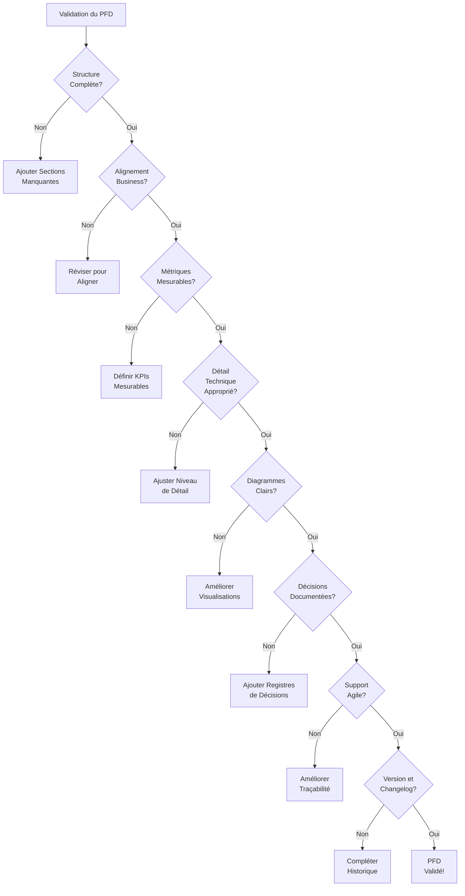

## Structure d'une Story Issue du PFD

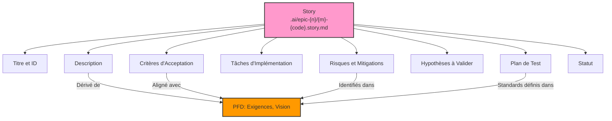

## Types de Projets et Emphases PFD

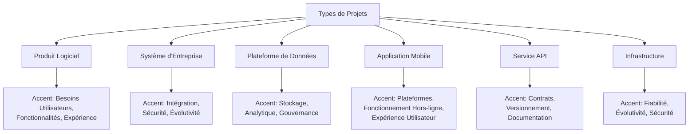

## Adaptation aux Méthodologies

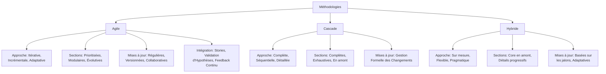

## Cérémonies Agiles et Impact sur le PFD

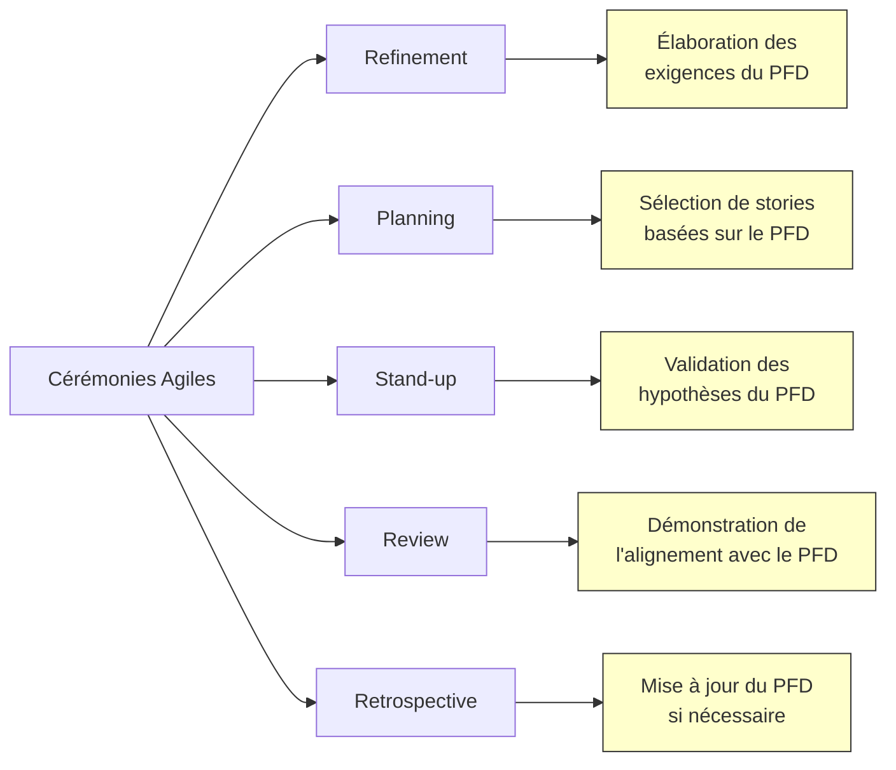

## Exemple d'Organisation de Fichiers PFD

```
docs/
└── foundation/
    ├── project-a/
    │   ├── pfd.md                   # Document principal
    │   ├── diagrams/                # Diagrammes et visuels
    │   │   ├── architecture.png
    │   │   ├── data-model.png
    │   │   └── user-flow.png
    │   └── supplements/             # Documents supplémentaires
    │       ├── risk-assessment.md
    │       ├── api-spec.md
    │       ├── ui-mockups.md
    │       └── decisions/           # Registres de décisions
    │           ├── ADR-001-architecture.md
    │           └── ADR-002-technology.md
    └── project-b/
        ├── pfd.md
        ├── diagrams/
        └── supplements/

.ai/                                # Dossier agile
├── prd.md                          # Document d'exigences produit
├── arch.md                         # Document d'architecture
├── epic-1/                         # Premier epic
│   ├── 1-user-auth.story.md        # Story 1
│   └── 2-profile-mgmt.story.md     # Story 2
└── epic-2/                         # Deuxième epic
    └── 1-data-export.story.md      # Story 1
```

## Conseils pour un PFD Efficace

1. **Commencez par la vision** - Assurez-vous que les objectifs commerciaux sont clairs avant de définir les aspects techniques
2. **Impliquez toutes les parties prenantes clés** dès le début pour garantir l'alignement
3. **Utilisez des exemples concrets** pour illustrer les concepts abstraits
4. **Équilibrez détail et clarté** - Trop de détails peut obscurcir les points importants
5. **Mettez à jour régulièrement** - Un PFD doit évoluer avec le projet
6. **Priorisez visuellement** - Utilisez des diagrammes pour communiquer des concepts complexes
7. **Liez explicitement** les exigences aux objectifs commerciaux
8. **Assurez l'accessibilité** - Le document doit être compréhensible par les équipes techniques et non techniques
9. **Incluez des métriques quantifiables** pour mesurer le succès
10. **Documentez les décisions clés** et les alternatives considérées, pas seulement le résultat final
11. **Établissez clairement la traçabilité** entre le PFD, le PRD, l'Architecture et les Stories
12. **Validez les hypothèses critiques** aussi tôt que possible dans le cycle de développement
13. **Prévoyez des points de synchronisation** avec les cycles agiles pour maintenir l'alignement
14. **Dérivez les stories** directement des sections pertinentes du PFD pour assurer la cohérence
15. **Adaptez le niveau de détail** en fonction de la taille de l'équipe et de la complexité du projet
16. **Maintenez un registre de décisions** pour documenter les choix architecturaux et techniques
17. **Intégrez une méthodologie de suivi des métriques** pour mesurer objectivement la progression
18. **Documentez l'historique des versions** pour suivre l'évolution du document

---

## Guide de Référence Rapide - Sections PFD

### 1. Introduction

- **Purpose**: Objectifs et usage du document
- **Scope**: Inclusions, exclusions, limites
- **Glossary**: Terminologie, acronymes, définitions

### 2. Vision

- **Statement**: Proposition de valeur concise
- **Strategic Alignment**: Lien avec les objectifs commerciaux
- **Success Criteria**: Résultats mesurables attendus

### 3. Vision Technique

- **Principles**: Valeurs architecturales et directives
- **Quality Attributes**: Performance, sécurité, évolutivité, maintenabilité
- **Constraints**: Contraintes techniques, commerciales, réglementaires

### 4. Aperçu

- **Context**: Contexte, justification, objectif
- **Objectives**: Objectifs SMART
- **Audience**: Types d'utilisateurs, parties prenantes, besoins

### 5. Exigences

- **Functional**: Capacités, fonctionnalités, user stories
- **Non-functional**: Qualités, contraintes, critères de performance
- **Use Cases**: Acteur, flux, résultats
- **Priorities**: Haute, moyenne, basse avec justification

### 6. Architecture

- **System**: Composants, interfaces, patterns
- **Data**: Entités, relations, stockage
- **UI**: Layouts, interactions, wireframes
- **Views**: Vue logique, physique, processus, développement

### 7. Approche Technique

- **Stack**: Frontend, backend, infrastructure
- **Integrations**: APIs, services, tiers
- **Security**: Authentication, autorisation, protection des données
- **Versions**: Versions spécifiques et compatibilité

### 8-12. [Suite des sections...]

### 13. Annexes

- **References**: Sources, standards, inspiration
- **Detailed Specs**: Approfondissements techniques
- **Artifacts**: Modèles, diagrammes, prototypes
- **Decision Records**: Décisions architecturales, justification, statut

---

Ce guide visuel peut être utilisé avec la documentation principale pour faciliter la compréhension et l'application de la règle `@5000-workflow-foundation-document-pfd.mdc`.
