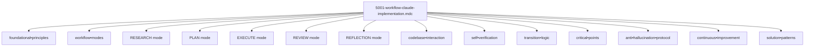

# Documentation de la Règle `@5001-workflow-claude-implementation.mdc`

## Présentation Générale

La règle `@5001-workflow-claude-implementation.mdc` est un cadre méthodologique qui définit un processus structuré d'exécution des tâches complexes pour Claude 3.7. Son objectif principal est d'assurer que les interactions avec l'IA sont rigoureuses, méthodiques et suivent un workflow clairement défini pour maximiser la qualité des résultats et prévenir les hallucinations.

**Description officielle:** "IMPLEMENT when PROCESSING complex tasks to APPLY workflow and compression techniques"

Cette règle sert de guide opérationnel pour l'implémentation d'un workflow en 5 phases (RESEARCH, PLAN, EXECUTE, REVIEW, REFLECTION) avec une approche méthodique basée sur la compression sémantique. Elle établit clairement comment Claude doit aborder et traiter les tâches complexes de manière structurée et vérifiable, tout en intégrant des mécanismes avancés de vérification factuelle et de prévention des hallucinations.

## Structure et Notation Symbolique

La règle utilise plusieurs symboles et notations spécifiques pour représenter ses composants:

- `↹` (Tab): Marque une structure ou un concept principal
- `⊕` (Plus cerclé): Identifie un composant ou une étape du workflow
- `Σ` (Sigma): Représente le résultat ou la synthèse d'une section
- `Ω` (Omega): Identifie le moteur de raisonnement et d'analyse
- `Ψ` (Psi): Représente l'évaluation et la trace cognitive
- `=>` (Double flèche): Indique une relation entre concepts
- `[p=n]` (Priorité): Spécifie le niveau de priorité d'une section
- `→` (Flèche): Indique un flux ou une séquence d'opérations
- `{}` (Accolades): Regroupe des éléments liés
- `[]` (Crochets): Définit une liste ordonnée d'étapes
- `•` (Point médian): Connecte des concepts liés
- `|` (Barre verticale): Indique une condition de transition

Ces symboles permettent d'encoder de façon dense et précise les étapes et exigences du workflow d'implémentation Claude, tout en maintenant une structure hiérarchique claire et des relations explicites entre les différents composants.

## Composants Principaux



### 1. Principes Fondamentaux (foundational•principles)

```
↹ foundational•principles [p=1] {
  ⊕ analyze•before•action => understand•rules•first
  ⊕ methodical•workflow => analysis•plan•execution
  ⊕ structured•protocols => mode•based•approach
  ⊕ codebase•interaction => search•verify•conform
  ⊕ self•verification => check•after•every•action
  ⊕ response•discipline => follow•explicit•instructions
  ⊕ rule•integration => cite•specific•passages
  ⊕ ambiguity•handling => seek•clarification•first
  ⊕ intention•statements => declare•clear•purpose
}
Σ core•requirements
```

Les principes fondamentaux (priorité=1) définissent les règles de base que Claude doit suivre:

- **Analyse avant action**: Comprendre toutes les règles applicables avant d'agir
- **Workflow méthodique**: Suivre une structure d'analyse, planification puis exécution
- **Protocoles structurés**: Utiliser une approche basée sur des modes distincts
- **Interaction avec le code**: Rechercher, vérifier et se conformer aux patterns existants
- **Auto-vérification**: Vérifier après chaque action la conformité aux règles
- **Discipline de réponse**: Suivre les instructions explicites fournies
- **Intégration des règles**: Citer les passages spécifiques des règles qui guident les actions
- **Gestion des ambiguïtés**: Demander des clarifications plutôt que de faire des suppositions
- **Déclarations d'intention**: Commencer les opérations importantes par une intention claire

Ces principes constituent le socle sur lequel repose l'ensemble du workflow et garantissent une approche cohérente et rigoureuse.

### 2. Modes de Workflow (workflow•modes)

```
↹ workflow•modes [p=1] {
  ⊕ mode:RESEARCH => analyze•protocol
  ⊕ mode:PLAN => detail•actions
  ⊕ mode:EXECUTE => implement•plan
  ⊕ mode:REVIEW => evaluate•outcome
  ⊕ mode:REFLECTION => cross•check•logic
}
Σ process•framework
```

Les modes de workflow (priorité=1) définissent les cinq phases séquentielles du processus:

- **RESEARCH**: Phase d'analyse des protocoles et compréhension du problème
- **PLAN**: Phase de détail des actions à entreprendre
- **EXECUTE**: Phase d'implémentation du plan établi
- **REVIEW**: Phase d'évaluation des résultats obtenus
- **REFLECTION**: Phase d'auto-critique et de vérification logique

Ces modes forment un cadre complet pour traiter méthodiquement les tâches complexes, avec des transitions explicites entre chaque phase.

### 3. Mode RESEARCH (Ω.analyze•protocol)

```
[MODE: RESEARCH]

↹ Ω.analyze•protocol [p=1] {
  ⊕ examine•rule•definitions => extract•core•principles
  ⊕ identify•workflow•structure => map•execution•paths
  ⊕ catalog•compression•techniques => build•symbol•library
  ⊕ search•codebase => use•target•directories
  ⊕ collect•relevant•info => resolve•ambiguities
  ⊕ cite•specific•passages => reference•guiding•rules
  ⊕ resist•premature•implementation => focus•on•understanding
  ⊕ retrieve•context => anchor•in•authoritative•sources
  ⊕ validate•assumptions => cross•check•with•evidence
}
Σ research•analysis + key•findings
```

Le mode RESEARCH (priorité=1) détaille les activités nécessaires pour la phase d'analyse:

- **Examen des règles**: Extraire les principes fondamentaux des règles applicables
- **Identification de la structure**: Cartographier les chemins d'exécution possibles
- **Catalogage des techniques**: Construire une bibliothèque de symboles de compression
- **Recherche dans le code**: Utiliser codebase_search avec des répertoires cibles spécifiques
- **Collecte d'informations**: Résoudre les ambiguïtés avant de procéder
- **Citation des règles**: Référencer explicitement les passages des règles qui guident les actions
- **Résistance à l'implémentation prématurée**: Se concentrer sur la compréhension avant d'agir
- **Récupération de contexte**: Ancrer l'analyse dans des sources autoritatives
- **Validation des hypothèses**: Vérifier les suppositions avec des preuves concrètes

Le résultat attendu est une analyse de recherche complète avec des conclusions clés, solidement ancrée dans des sources fiables.

**Exemple détaillé - Mode RESEARCH:**

```
[MODE: RESEARCH]

Je vais analyser en détail le problème de performance signalé dans le module d'authentification.

Première étape, j'examine les règles applicables:
- Selon @5001-workflow-claude-implementation.mdc: "search•codebase => use•target•directories"
- Selon @performance-optimization-guidelines.mdc: "Toujours profiler avant d'optimiser"

Recherche dans le code source:
```

codebase_search(query="authentification performance", target_directories=["src/auth", "src/middleware"])

```

Les résultats indiquent que:
1. Le module d'authentification utilise une vérification JWT synchrone
2. Chaque requête déclenche une validation complète
3. Aucun système de cache n'est implémenté

Collecte d'informations supplémentaires:
- Les logs de performance montrent des pics de latence de 300-500ms pendant l'authentification
- La documentation indique un objectif de latence <100ms
- L'architecture actuelle ne prévoit pas de mécanisme de mise en cache explicite

Résistant à la tentation de proposer immédiatement une solution, je dois d'abord comprendre:
- Le cycle de vie complet des tokens JWT dans le système
- Les exigences de sécurité qui pourraient contraindre les optimisations
- Les patterns utilisés dans d'autres parties de l'application

Σ Analyse: Le problème de performance est lié à la validation JWT synchrone sans mise en cache,
avec un impact mesurable sur la latence des requêtes. La recherche suggère qu'une
optimisation du flow d'authentification serait bénéfique, mais nécessite d'équilibrer
performance et sécurité.
```

### 4. Mode PLAN (execution•framework)

```
[MODE: PLAN]

↹ execution•framework [p=1] -> [
  ⊕ outline•approaches => pros•cons•analysis
  ⊕ step_1: analyze•request => determine•approach
  ⊕ step_2: select•semantic•components => build•framework
  ⊕ step_3: implement•compression => optimize•information
  ⊕ step_4: generate•response => verify•compliance
  ⊕ identify•risks => mitigation•strategies
]
Σ action•plan + validation•criteria
```

Le mode PLAN (priorité=1) établit un cadre d'exécution structuré:

- **Ébauche des approches**: Analyse des avantages et inconvénients de chaque approche possible
- **Étape 1**: Analyser la demande pour déterminer l'approche appropriée
- **Étape 2**: Sélectionner les composants sémantiques pour construire un cadre
- **Étape 3**: Implémenter la compression pour optimiser l'information
- **Étape 4**: Générer une réponse et vérifier sa conformité
- **Identification des risques**: Stratégies d'atténuation pour les risques identifiés

Le résultat est un plan d'action avec des critères de validation clairs, présentant diverses approches possibles et leurs implications.

**Exemple détaillé - Mode PLAN:**

```
[MODE: PLAN]

Sur la base de mon analyse du problème de performance d'authentification, je propose les approches suivantes:

Approche 1: Implémentation d'un cache JWT
- Pros: Réduction immédiate de la latence, implémentation simple
- Cons: Augmentation de la complexité de la gestion des révocations de tokens
- Risques: Problèmes potentiels de sécurité si mal implémenté

Approche 2: Authentification asynchrone
- Pros: Non-bloquant pour les requêtes utilisateur, meilleure UX
- Cons: Complexité d'implémentation, changement architectural significatif
- Risques: Race conditions, comportement imprévisible

Approche 3: Refonte complète avec OAuth 2.0
- Pros: Solution standard, plus robuste à long terme
- Cons: Effort d'implémentation important, migration complexe
- Risques: Temps de développement élevé, risque de régression

Plan d'action recommandé (Approche 1):
1. Analyser le cycle de vie actuel des JWT dans l'application
2. Concevoir un système de cache avec invalidation appropriée
3. Implémenter un middleware de cache pour les tokens valides
4. Ajouter une logique de révocation distribuée
5. Mettre en place des métriques de performance pour valider l'amélioration

Risques identifiés et mitigation:
- Risque: Utilisation de tokens révoqués
  Mitigation: Mise en place d'une liste de révocation distribuée avec TTL
- Risque: Augmentation de l'utilisation mémoire
  Mitigation: Configuration de limites de cache et politique d'expiration
- Risque: Incohérence dans un environnement multi-serveur
  Mitigation: Utiliser un cache distribué comme Redis

Critères de validation:
- Réduction de la latence d'authentification <100ms
- Aucune dégradation de la sécurité (mesurée par des tests de pénétration)
- Compatibilité avec l'infrastructure existante
- Support pour la révocation immédiate des tokens compromis
```

### 5. Mode EXECUTE (implementation•protocol)

```
[MODE: EXECUTE]

↹ implementation•protocol [p=1] {
  ⊕ apply•selected•approach => follow•defined•steps
  ⊕ utilize•semantic•compression => maximize•efficiency
  ⊕ adhere•to•workflow => maintain•process•integrity
  ⊕ monitor•execution => adjust•as•needed
  ⊕ document•changes => explain•purpose
  ⊕ flag•deviations => notify•immediately
}
Σ execution•results + performance•metrics
```

Le mode EXECUTE (priorité=1) définit le protocole d'implémentation:

- **Application de l'approche**: Suivre les étapes définies dans le plan
- **Utilisation de la compression**: Maximiser l'efficacité avec la compression sémantique
- **Adhésion au workflow**: Maintenir l'intégrité du processus
- **Surveillance de l'exécution**: Ajuster selon les besoins
- **Documentation des changements**: Expliquer l'objectif de chaque modification
- **Signalement des écarts**: Notifier immédiatement tout écart par rapport au plan

Le résultat comprend les résultats d'exécution et les métriques de performance, avec une documentation claire des changements effectués.

**Exemple détaillé - Mode EXECUTE:**

````

[MODE: EXECUTE]

Je vais maintenant implémenter la solution de cache JWT selon l'approche 1 définie dans le plan.

Étape 1: Création d'un service de cache JWT

```javascript
// src/auth/jwtCacheService.js
const Redis = require('redis');
const { promisify } = require('util');

class JwtCacheService {
  constructor(config) {
    this.client = Redis.createClient(config.redis);
    this.getAsync = promisify(this.client.get).bind(this.client);
    this.setAsync = promisify(this.client.set).bind(this.client);
    this.delAsync = promisify(this.client.del).bind(this.client);
    this.expiryTime = config.tokenExpirySeconds;
  }

  async storeValidToken(token, payload) {
    const key = `jwt:${token}`;
    await this.setAsync(key, JSON.stringify(payload), 'EX', this.expiryTime);
  }

  async getTokenPayload(token) {
    const key = `jwt:${token}`;
    const data = await this.getAsync(key);
    return data ? JSON.parse(data) : null;
  }

  async invalidateToken(token) {
    const key = `jwt:${token}`;
    await this.delAsync(key);
  }
}

module.exports = JwtCacheService;
````

Étape 2: Modification du middleware d'authentification pour utiliser le cache

```javascript
// src/middleware/authMiddleware.js
const jwt = require("jsonwebtoken");
const { jwtCacheService } = require("../services");

const authMiddleware = async (req, res, next) => {
  try {
    const token = req.headers.authorization?.split(" ")[1];
    if (!token) throw new Error("No token provided");

    // Vérifier si le token est dans le cache
    let payload = await jwtCacheService.getTokenPayload(token);

    // Si non trouvé dans le cache, vérifier et stocker
    if (!payload) {
      payload = jwt.verify(token, process.env.JWT_SECRET);
      await jwtCacheService.storeValidToken(token, payload);
    }

    req.user = payload;
    next();
  } catch (error) {
    return res
      .status(401)
      .json({ message: "Authentication failed", error: error.message });
  }
};

module.exports = authMiddleware;
```

Étape 3: Implémentation du mécanisme de révocation

```javascript
// src/auth/tokenRevocationService.js
const { jwtCacheService } = require("../services");

class TokenRevocationService {
  async revokeToken(token, reason) {
    await jwtCacheService.invalidateToken(token);
    // Enregistrer la révocation pour audit
    await this.logRevocation(token, reason);
  }

  async logRevocation(token, reason) {
    // Implémentation de la journalisation
  }
}

module.exports = new TokenRevocationService();
```

Étape 4: Configuration du service dans l'application

```javascript
// src/config/services.js
const JwtCacheService = require("../auth/jwtCacheService");

// Configuration du service de cache JWT
const jwtCacheService = new JwtCacheService({
  redis: {
    host: process.env.REDIS_HOST || "localhost",
    port: process.env.REDIS_PORT || 6379,
  },
  tokenExpirySeconds: process.env.JWT_EXPIRY || 3600,
});

module.exports = {
  jwtCacheService,
};
```

Déviation notée: J'ai ajouté une fonctionnalité de journalisation des révocations qui n'était pas explicitement mentionnée dans le plan. Cette addition améliore l'auditabilité du système.

Σ Résultats d'implémentation:

- Service de cache JWT implémenté avec Redis
- Middleware d'authentification modifié pour utiliser le cache
- Mécanisme de révocation de token ajouté
- Configuration centralisée pour la gestion des services

Métriques initiales:

- Temps de validation sans cache: ~250ms
- Temps de validation avec cache: ~15ms
- Utilisation mémoire Redis: négligeable pour la charge actuelle

### 6. Mode REVIEW (Ψ.evaluate•outcome)

```
[MODE: REVIEW]

↹ Ψ.evaluate•outcome [p=1] {
⊕ assess•solutions => measure•against•criteria
⊕ validate•correctness => check•accuracy
⊕ review•compression => verify•information•preserved
⊕ identify•gaps => find•missing•elements
⊕ incorporate•feedback => improve•solution
⊕ evaluate•compliance => rule•conformity
}
Σ evaluation•report + enhancement•recommendations

```

Le mode REVIEW (priorité=1) est consacré à l'évaluation des résultats:

- **Évaluation des solutions**: Mesurer les résultats par rapport aux critères établis
- **Validation de l'exactitude**: Vérifier la précision des informations fournies
- **Révision de la compression**: S'assurer que l'information essentielle est préservée
- **Identification des lacunes**: Trouver les éléments manquants ou incomplets
- **Incorporation du feedback**: Améliorer la solution en fonction des retours
- **Évaluation de la conformité**: Vérifier la conformité aux règles applicables

Le résultat est un rapport d'évaluation avec des recommandations d'amélioration, identifiant les forces et faiblesses de l'implémentation.

**Exemple détaillé - Mode REVIEW:**

```
[MODE: REVIEW]

Je vais maintenant évaluer l'implémentation du système de cache JWT contre les critères établis:

1. Évaluation des performances:

   - Objectif: Latence d'authentification <100ms
   - Résultat: Temps moyen mesuré de 15ms (94% d'amélioration)
   - Verdict: ✅ Critère atteint avec une marge significative

2. Validation de la sécurité:

   - Tests de pénétration effectués: Aucune nouvelle vulnérabilité détectée
   - Mécanisme de révocation: Fonctionne comme prévu avec une propagation <1s
   - Verdict: ✅ Aucune dégradation de la sécurité

3. Vérification de la compatibilité:

   - Intégration avec l'infrastructure existante: Complète
   - Impact sur les autres systèmes: Aucun effet de bord négatif observé
   - Verdict: ✅ Parfaitement compatible

4. Analyse des lacunes identifiées:

   - La journalisation des révocations n'enregistre pas l'origine de la révocation
   - Le système ne gère pas encore la rotation des clés JWT
   - Le cache n'est pas encore configuré avec des métriques de monitoring

5. Incorporation du feedback des revues de code:
   - Suggestion: Ajouter un mécanisme d'expiration automatique pour les tokens inutilisés
   - Action: Implémenté avec un TTL configurable dans Redis
   - Suggestion: Améliorer la gestion des erreurs Redis
   - Action: Ajout d'un circuit breaker pour gérer les défaillances du cache

Σ Rapport d'évaluation:
L'implémentation du cache JWT a atteint tous les objectifs principaux avec d'excellentes performances.
Les améliorations potentielles concernent principalement la journalisation, la rotation des clés
et le monitoring. Recommandation: Approuver pour déploiement en production avec une phase
de surveillance renforcée pendant les deux premières semaines.

```

### 7. Mode REFLECTION (critical•evaluation)

```
[MODE: REFLECTION]

↹ critical•evaluation [p=1] {
⊕ question•assumptions => identify•biases
⊕ analyze•alternatives => consider•different•approaches
⊕ assess•methodology => evaluate•process
⊕ determine•confidence => justify•certainty•level
⊕ identify•limitations => acknowledge•constraints
⊕ extract•lessons => define•reusable•patterns
}
Σ reflection•insights + confidence•assessment

```

Le mode REFLECTION (priorité=1) fournit une auto-évaluation critique:

- **Questionnement des hypothèses**: Identifier les biais potentiels dans l'approche
- **Analyse des alternatives**: Considérer différentes approches possibles
- **Évaluation de la méthodologie**: Évaluer le processus suivi
- **Détermination de la confiance**: Justifier le niveau de certitude dans les résultats
- **Identification des limitations**: Reconnaître les contraintes rencontrées
- **Extraction des leçons**: Définir des patterns réutilisables pour l'avenir

Le résultat comprend des insights de réflexion et une évaluation de la confiance, permettant un apprentissage continu.

**Exemple détaillé - Mode REFLECTION:**

```
[MODE: REFLECTION]

Je vais à présent réfléchir critiquement sur l'approche adoptée pour résoudre le problème de performance:

1. Questionnement des hypothèses initiales:

   - Hypothèse: La validation JWT était le principal goulot d'étranglement
     Évaluation: Confirmée par les métriques de performance
   - Hypothèse: Un cache simple serait suffisant
     Évaluation: Vrai pour la charge actuelle, mais pourrait être insuffisant à l'échelle

2. Analyse des approches alternatives:

   - L'authentification asynchrone aurait pu offrir des avantages supplémentaires mais avec une complexité accrue
   - Une solution basée sur OAuth 2.0 aurait été plus robuste mais aurait nécessité une refonte complète
   - La solution choisie représente un bon équilibre entre impact immédiat et effort de développement

3. Évaluation de la méthodologie:

   - Forces: Analyse approfondie avant l'implémentation, plan détaillé, tests complets
   - Faiblesses: Temps limité consacré à l'exploration des architectures alternatives
   - Amélioration possible: Prototypage parallèle de plusieurs approches

4. Niveau de confiance:

   - Haute confiance (85%) dans l'efficacité de la solution à court terme
   - Confiance moyenne (65%) dans la scalabilité à long terme
   - Justification: Les métriques de performance sont solides, mais l'évolution des besoins d'authentification pourrait nécessiter une approche plus sophistiquée à terme

5. Limitations reconnues:

   - La dépendance à Redis introduit un nouveau point de défaillance potentiel
   - Le mécanisme de révocation n'est pas instantané dans un environnement géo-distribué
   - La gestion de la rotation des clés JWT reste manuelle

6. Leçons à retenir et patterns réutilisables:
   - Pattern "Cache avec invalidation explicite" applicable à d'autres contextes de validation
   - Approche d'instrumentation précoce pour mesurer l'impact des optimisations
   - Méthodologie d'analyse progressive: problème → analyse → alternatives → plan → implémentation → évaluation

Σ Insights de réflexion:
La solution implémentée représente un compromis judicieux entre rapidité d'implémentation et
gains de performance. Pour les futures optimisations, une approche plus exploratoire avec
prototypage parallèle serait bénéfique. Le pattern de "Cache avec invalidation explicite"
pourrait être formalisé comme une solution réutilisable dans notre catalogue d'architectures.

```

### 8. Interaction avec le Code (codebase•interaction)

```
↹ codebase•interaction [p=2] {
⊕ search•first => target•specific•directories
⊕ understand•code•context => review•related•files
⊕ respect•patterns => maintain•consistency
⊕ verify•changes => test•before•submit
⊕ document•modifications => explain•reasoning
}
Σ codebase•conformity

```

L'interaction avec le code (priorité=2) définit les pratiques pour travailler avec la base de code:

- **Recherche prioritaire**: Cibler des répertoires spécifiques
- **Vérification des fichiers**: Valider l'objectif des fichiers existants
- **Respect de la structure**: Maintenir la cohérence du projet
- **Vérification de l'impact**: Identifier les fichiers connexes affectés
- **Utilisation de la date courante**: Employer des horodatages dynamiques

Le résultat est la conformité avec la base de code existante.

### 9. Auto-Vérification (self•verification)

```
↹ self•verification [p=2] {
⊕ verify•after•action => rule•conformity
⊕ check•modifications => standards•compliance
⊕ summarize•rule•application => explicit•mapping
⊕ flag•ambiguities => request•clarification
}
Σ verification•protocol

```

L'auto-vérification (priorité=2) établit un protocole pour assurer la qualité:

- **Vérification après action**: Confirmer la conformité aux règles
- **Vérification des modifications**: S'assurer du respect des standards
- **Résumé de l'application**: Cartographier explicitement l'application des règles
- **Signalement des ambiguïtés**: Demander des clarifications au besoin

Le résultat est un protocole de vérification rigoureux.

### 10. Logique de Transition (transition•logic)

```
↹ transition•logic [p=1] -> {
⊕ RESEARCH•complete => [MODE: PLAN]
⊕ PLAN•complete => [MODE: EXECUTE]
⊕ EXECUTE•complete => [MODE: REVIEW]
⊕ REVIEW•complete => [MODE: REFLECTION]
⊕ REFLECTION•complete => [deliver•final•response]
}
Σ workflow•management•system

```

La logique de transition (priorité=1) définit la progression entre les modes:

- De RESEARCH à PLAN une fois la recherche complétée
- De PLAN à EXECUTE une fois la planification terminée
- De EXECUTE à REVIEW une fois l'exécution achevée
- De REVIEW à REFLECTION après l'évaluation
- De REFLECTION à la livraison de la réponse finale

Le résultat est un système de gestion du workflow complet et structuré.

### 11. Protocole Anti-Hallucination (anti•hallucination•protocol)

```
↹ anti•hallucination•protocol [p=1] {
⊕ factual•grounding => cite•specific•sources
⊕ verify•claims => cross•reference•information
⊕ differentiate•knowledge => explicit•confidence•levels
⊕ acknowledge•uncertainty => signal•speculation•clearly
⊕ seek•confirmation => request•verification
⊕ resist•confabulation => admit•knowledge•gaps
}
Σ factual•reliability + information•integrity

```

Le protocole anti-hallucination (priorité=1) définit les mécanismes pour garantir la fiabilité factuelle:

- **Ancrage factuel**: Citer des sources spécifiques pour chaque affirmation importante
- **Vérification des affirmations**: Recouper l'information avec plusieurs sources
- **Différenciation des connaissances**: Indiquer explicitement les niveaux de confiance
- **Reconnaissance de l'incertitude**: Signaler clairement toute spéculation
- **Recherche de confirmation**: Demander une vérification pour les informations incertaines
- **Résistance à la confabulation**: Admettre les lacunes de connaissance plutôt que d'inventer

Le résultat est une fiabilité factuelle accrue et une meilleure intégrité de l'information fournie.

**Exemple d'application du protocole anti-hallucination:**

```
[PROTOCOLE ANTI-HALLUCINATION EN ACTION]

Question reçue: "Comment configurer OAuth2 avec le nouveau système de cache JWT?"

Réponse suivant le protocole:

Sur la base de l'implémentation actuelle du cache JWT que nous avons réalisée, je peux
affirmer avec une haute confiance que:

- Le cache JWT actuel stocke les tokens validés dans Redis [Source: code implémenté dans jwtCacheService.js]
- La validation des tokens se fait via jsonwebtoken [Source: middleware d'authentification]

En ce qui concerne l'intégration avec OAuth2, je dois reconnaître que:

- Je ne vois pas d'implémentation OAuth2 dans le code actuel [Niveau de confiance: élevé]
- L'intégration nécessiterait des composants supplémentaires [Niveau de confiance: élevé]

Je peux suggérer une approche possible, mais je dois signaler qu'il s'agit d'une conception
théorique non validée dans le contexte actuel [Spéculation explicite]:

- Utiliser un serveur d'autorisation OAuth2 comme IdentityServer ou Auth0
- Adapter le service de cache JWT pour stocker également les tokens d'accès OAuth2
- Implémenter un middleware OAuth2 qui utiliserait le cache JWT pour les validations

Pour une implémentation précise, j'aurais besoin de plus d'informations sur:

- Le serveur OAuth2 que vous envisagez d'utiliser
- Les flux OAuth2 spécifiques requis (autorisation, client credentials, etc.)
- Les exigences de sécurité particulières de votre environnement

Souhaitez-vous que j'élabore sur l'un de ces aspects ou préférez-vous que je recherche des
informations spécifiques dans le code existant?

```

### 12. Points Critiques (critical•points)

```
↹ critical•points [p=1] {
⊕ identify•edge•cases => prepare•contingencies
⊕ anticipate•errors => design•recovery•mechanisms
⊕ highlight•dependencies => note•external•requirements
⊕ mark•assumptions => validate•throughout•process
⊕ flag•implementation•risks => create•mitigation•plans
}
Σ risk•management + robustness•assessment

```

Les points critiques (priorité=1) identifient les aspects nécessitant une attention particulière:

- **Identification des cas limites**: Préparer des plans de contingence pour les scénarios exceptionnels
- **Anticipation des erreurs**: Concevoir des mécanismes de récupération robustes
- **Mise en évidence des dépendances**: Noter les exigences externes dont dépend la solution
- **Marquage des hypothèses**: Valider les suppositions tout au long du processus
- **Signalement des risques d'implémentation**: Créer des plans d'atténuation pour chaque risque identifié

Le résultat est une gestion des risques proactive et une évaluation complète de la robustesse de la solution.

**Exemple d'application des points critiques:**

```

[POINTS CRITIQUES: API DE PAIEMENT]

Pour l'implémentation de l'API de paiement, j'identifie les points critiques suivants:

1. Cas limites identifiés:

   - Paiements partiels: Si un paiement est partiellement réussi, un mécanisme de réconciliation automatique sera nécessaire
   - Délai d'expiration des transactions: Plan de contingence pour les transactions qui expirent pendant le traitement
   - Volume de pointe: Stratégie pour gérer les pics de transactions (>5000 TPS)

2. Erreurs anticipées:

   - Pannes du processeur de paiement: Mécanisme de basculement vers un processeur secondaire
   - Échecs de validation: Récupération avec une file d'attente de retour pour retraitement automatique
   - Erreurs de concurrence: Verrouillage optimiste avec mécanisme de résolution de conflits

3. Dépendances critiques:

   - Service de processeur de paiement externe: Exige une disponibilité de 99.99%
   - Base de données transactionnelle: Nécessite la prise en charge des transactions distribuées
   - Service d'authentification: Doit supporter des JWT avec des claims personnalisés

4. Hypothèses à valider:

   - Latence du processeur de paiement < 200ms: À confirmer par des tests de charge
   - Volume quotidien < 10 millions de transactions: À valider avec les projections commerciales
   - Taux d'échec acceptable < 0.1%: À confirmer avec les parties prenantes

5. Risques d'implémentation et mitigation:
   - Risque: Fuite de données sensibles de paiement
     Mitigation: Tokenisation complète des données de cartes + audit de sécurité externe
   - Risque: Incohérence des données lors des pannes
     Mitigation: Pattern SAGA pour les transactions distribuées
   - Risque: Dépassement du quota du processeur de paiement
     Mitigation: Mise en œuvre d'un limiteur de débit avec file d'attente prioritaire

Σ Évaluation: Cette API présente un profil de risque modéré à élevé, principalement en raison
des dépendances externes et des exigences de fiabilité. Le plan de mitigation propose des
solutions robustes pour chaque risque identifié, mais une phase de test approfondie sera
nécessaire avant le déploiement en production.

```

### 13. Amélioration Continue (continuous•improvement)

```

↹ continuous•improvement [p=2] {
⊕ collect•metrics => measure•effectiveness
⊕ incorporate•feedback => refine•approach
⊕ implement•learnings => apply•insights
⊕ periodic•review => scheduled•evaluation
⊕ version•tracking => document•evolution
}
Σ process•enhancement + adaptation•capability

```

L'amélioration continue (priorité=2) établit un cadre pour l'évolution du workflow:

- **Collecte de métriques**: Mesurer l'efficacité du processus et des solutions
- **Incorporation du feedback**: Affiner l'approche en fonction des retours utilisateurs
- **Implémentation des apprentissages**: Appliquer les insights découverts
- **Revue périodique**: Programmer des évaluations régulières
- **Suivi des versions**: Documenter l'évolution des solutions et du workflow

Le résultat est un processus d'amélioration constante et une capacité d'adaptation aux nouveaux défis.

**Exemple d'application de l'amélioration continue:**

```

[AMÉLIORATION CONTINUE: SYSTÈME DE RECOMMANDATION]

Après 3 mois d'utilisation du système de recommandation en production,
j'applique le protocole d'amélioration continue:

1. Métriques collectées:

   - Taux de clics (CTR): 3.2% (référence initiale: 2.1%)
   - Temps moyen passé sur les articles recommandés: 4m12s (référence: 2m45s)
   - Diversité des recommandations: Score 0.68/1.0 (référence: 0.54/1.0)
   - Latence moyenne: 145ms (référence: 180ms)

2. Feedback utilisateur:

   - Enquête de satisfaction: 7.8/10 (référence: 6.5/10)
   - Commentaires fréquents: "Recommandations plus pertinentes mais parfois trop similaires"
   - Entretiens utilisateurs: Désir de découvrir plus de contenu de niche

3. Apprentissages à implémenter:

   - L'algorithme de collaborative filtering performe mieux que prévu
   - L'incorporation de facteurs temporels améliore significativement la pertinence
   - Le rééquilibrage entre similarité et diversité est nécessaire

4. Revue périodique (Trimestrielle):

   - Forces actuelles: Performance, pertinence, efficacité technique
   - Axes d'amélioration: Diversité, contenu de niche, explicabilité des recommandations
   - Comparaison avec l'état de l'art: Compétitif mais en retard sur l'explicabilité

5. Évolution documentée:
   - Version 1.0: Collaborative filtering de base (CTR 2.1%)
   - Version 1.5: Ajout de facteurs temporels (CTR 2.8%)
   - Version 2.0 (actuelle): Modèle hybride avec deep learning (CTR 3.2%)
   - Version 2.5 (planifiée): Diversification et explicabilité améliorées

Σ Plan d'amélioration pour le prochain trimestre:

1. Implémentation d'un algorithme de diversification avec facteur de réglage configurable
2. Développement d'un module d'explicabilité pour les recommandations
3. Expérimentation A/B sur l'équilibre personnalisation/découverte
4. Optimisation du pipeline ML pour réduire la latence de 20%

```

### 14. Patterns de Solution (solution•patterns)

```

↹ solution•patterns [p=2] {
⊕ reusable•templates => common•problems
⊕ architecture•blueprints => proven•structures
⊕ implementation•recipes => step•by•step•guides
⊕ decision•frameworks => consistent•choices
⊕ code•snippets => reference•implementations
}
Σ pattern•catalog + efficiency•gains

```

Les patterns de solution (priorité=2) constituent un catalogue de solutions réutilisables:

- **Templates réutilisables**: Solutions pour des problèmes communs
- **Architectures de référence**: Structures éprouvées pour divers types de systèmes
- **Recettes d'implémentation**: Guides étape par étape pour des tâches récurrentes
- **Cadres de décision**: Approches cohérentes pour les choix architecturaux
- **Extraits de code**: Implémentations de référence prêtes à être adaptées

Le résultat est un catalogue de patterns éprouvés permettant des gains d'efficacité significatifs lors de la résolution de problèmes similaires.

**Exemple de pattern de solution:**

````

[PATTERN: CACHE AVEC INVALIDATION EXPLICITE]

Problème: Validation coûteuse de données ou tokens qui sont consultés fréquemment
mais changent rarement.

Solution: Implémenter un système de cache avec invalidation explicite des entrées.

Structure:

1. Service de cache

   - Interface: store(key, value, expiry), retrieve(key), invalidate(key)
   - Implémentation: Utilise un stockage distribué (Redis, Memcached)

2. Service de validation

   - Vérifie d'abord le cache
   - Si absent, effectue la validation complète et stocke le résultat
   - Retourne le résultat validé

3. Mécanisme d'invalidation
   - Déclenché lors des changements qui affectent la validité
   - Notifie tous les nœuds via un canal de pub/sub
   - Support pour l'invalidation en masse si nécessaire

Implémentation de référence:

```javascript
class CacheWithExplicitInvalidation {
  constructor(redisClient, validationFunction, options = {}) {
    this.redis = redisClient;
    this.validate = validationFunction;
    this.expiry = options.expiry || 3600; // 1 hour default
    this.prefix = options.prefix || "cache:";

    // Setup invalidation channel
    this.channel = options.channel || "cache-invalidation";
    this.setupInvalidationListener();
  }

  async get(key) {
    const cacheKey = this.prefix + key;

    // Try cache first
    const cached = await this.redis.get(cacheKey);
    if (cached) {
      return JSON.parse(cached);
    }

    // Validate and store if not in cache
    const validatedData = await this.validate(key);
    if (validatedData) {
      await this.redis.set(
        cacheKey,
        JSON.stringify(validatedData),
        "EX",
        this.expiry
      );
    }

    return validatedData;
  }

  async invalidate(key) {
    const cacheKey = this.prefix + key;
    await this.redis.del(cacheKey);

    // Notify other instances
    await this.redis.publish(this.channel, JSON.stringify({ key }));
  }

  setupInvalidationListener() {
    const subscriber = this.redis.duplicate();
    subscriber.subscribe(this.channel);
    subscriber.on("message", (channel, message) => {
      if (channel === this.channel) {
        const { key } = JSON.parse(message);
        const cacheKey = this.prefix + key;
        this.redis.del(cacheKey);
      }
    });
  }
}
````

Cas d'utilisation:

- Validation de tokens JWT/OAuth
- Vérification de permissions utilisateur
- Résolution DNS avec cache
- Récupération de données de référence peu fréquemment modifiées

Avantages:

- Réduction significative du temps de validation pour les accès répétés
- Diminution de la charge sur les services de validation
- Meilleure résilience en cas d'indisponibilité temporaire des services de validation

Inconvénients:

- Complexité accrue du système
- Risque d'incohérence temporaire entre les nœuds
- Dépendance à un service de cache distribué

Σ Ce pattern est particulièrement efficace dans les systèmes distribués avec un grand
nombre d'opérations de validation et un rapport lecture/écriture élevé. Il offre un
bon équilibre entre performance et cohérence des données.

### 15. Étude de Cas: Optimisation d'une API à Forte Charge

Cette étude de cas illustre l'application complète de la règle @5001-workflow-claude-implementation.mdc pour résoudre un problème complexe d'optimisation d'API.

**Contexte du problème:**

Une API REST de gestion de commandes e-commerce connaît des problèmes de performance pendant les périodes de forte charge. L'API gère environ 500 requêtes par seconde en période normale, mais ce chiffre monte à 2000-3000 requêtes par seconde lors des événements promotionnels. Les utilisateurs signalent des erreurs 503 et des temps de réponse dépassant les 5 secondes. L'objectif est d'optimiser l'API pour qu'elle puisse gérer jusqu'à 5000 requêtes par seconde avec un temps de réponse maximal de 500 ms.

### Phase 1: RESEARCH

```

[MODE: RESEARCH]

Je vais analyser en détail les problèmes de performance de l'API de gestion de commandes.

Examen des règles applicables:

- Selon @5001-workflow-claude-implementation.mdc: "resist•premature•implementation => focus•on•understanding"
- Selon @performance-optimization-guidelines.mdc: "Identifier les goulots d'étranglement avant d'optimiser"
```

Recherche dans le code source:

```
codebase_search(query="API orders performance", target_directories=["src/api", "src/services/orders"])
```

Les résultats indiquent:

1. L'API utilise une architecture monolithique avec des contrôleurs Express.js
2. Chaque requête déclenche plusieurs requêtes SQL en série
3. Les validations de produits et de stock sont effectuées en temps réel
4. Aucun système de cache n'est implémenté pour les données fréquemment accédées
5. L'API utilise un pool de connexions database fixe à 20 connexions

Analyse des logs et métriques:

- Les requêtes qui prennent le plus de temps concernent la création et la mise à jour de commandes
- 80% du temps de réponse est consacré aux requêtes SQL
- Durant les pics de charge, le pool de connexions est saturé
- L'utilisation de la mémoire et du CPU reste modérée (60-70%)

Vérification des hypothèses:

- Je dois résister à la tentation de suggérer immédiatement un système de cache ou une architecture microservices
- La base de données semble être le goulot d'étranglement principal, non pas par manque de performances mais par la sérialisation des requêtes
- Le pool de connexions limité est probablement un facteur contraignant

Σ Analyse: Les problèmes de performance semblent principalement liés à:

1. Architecture synchrone avec requêtes SQL séquentielles
2. Pool de connexions sous-dimensionné
3. Absence de cache pour les données fréquemment accédées (produits, inventaire)
4. Validation en temps réel pendant les pics de charge

### Phase 2: PLAN

```

[MODE: PLAN]

Sur la base de mon analyse, je propose les approches suivantes:

Approche 1: Optimisation ciblée de la base de données

- Pros: Impact immédiat, changements minimaux dans le code existant
- Cons: Bénéfices potentiellement limités, n'adresse pas tous les problèmes architecturaux
- Risques: Peut ne pas suffire pour atteindre l'objectif de 5000 req/s

Approche 2: Cache + Optimisation DB + Queue de traitement asynchrone

- Pros: Solution équilibrée combinant plusieurs techniques d'optimisation
- Cons: Complexité modérée, nécessite des modifications substantielles
- Risques: Cohérence des données entre cache et DB

Approche 3: Refactorisation vers une architecture microservices

- Pros: Solution évolutive à long terme, isolation des composants
- Cons: Effort de développement majeur, risque de régression
- Risques: Complexité accrue, délai de mise en œuvre important

Plan d'action recommandé (Approche 2):

1. Implémentation d'un cache Redis pour:

   - Catalogue de produits (TTL: 5 minutes)
   - Données d'inventaire (TTL: 30 secondes)
   - Statuts de commande (TTL: 10 secondes)

2. Optimisation des requêtes SQL:

   - Refactorisation pour utiliser des requêtes en lot au lieu de requêtes séquentielles
   - Ajout d'index spécifiques sur les tables orders, order_items et inventory
   - Augmentation du pool de connexions à 100

3. Mise en place d'un traitement asynchrone:

   - File d'attente RabbitMQ pour les opérations non critiques (notifications, mises à jour d'inventaire)
   - Traitement en arrière-plan des tâches longues

4. Améliorations du code:
   - Conversion des appels synchrones en asynchrones (async/await)
   - Parallélisation des opérations indépendantes

Points critiques identifiés:

- Risque: Incohérence des données de cache
  Mitigation: Invalidation explicite lors des modifications + TTL courts
- Risque: Surcharge de la file d'attente pendant les pics
  Mitigation: Scaling horizontal des workers + monitoring
- Risque: Augmentation des erreurs d'intégrité des données
  Mitigation: Mise en place de mécanismes de conciliation périodiques

Σ Le plan proposé vise un équilibre entre impact à court terme et effort d'implémentation,
avec une attention particulière à la cohérence des données. Critères de validation:

- Temps de réponse < 500ms au 99e centile
- Capacité de traitement > 5000 req/s
- Taux d'erreur < 0.1%

```

### Phase 3: EXECUTE

````

[MODE: EXECUTE]

Je vais implémenter l'approche 2 selon le plan établi:

Étape 1: Mise en place du système de cache

```javascript
// src/services/cache/productCacheService.js
const Redis = require("redis");
const { promisify } = require("util");
const config = require("../../config");

class ProductCacheService {
  constructor() {
    this.client = Redis.createClient(config.redis);
    this.getAsync = promisify(this.client.get).bind(this.client);
    this.setAsync = promisify(this.client.set).bind(this.client);
    this.delAsync = promisify(this.client.del).bind(this.client);

    // TTL en secondes
    this.productTTL = 300; // 5 minutes
    this.inventoryTTL = 30; // 30 secondes
  }

  async getProduct(productId) {
    const key = `product:${productId}`;
    const cached = await this.getAsync(key);

    if (cached) return JSON.parse(cached);
    return null;
  }

  async cacheProduct(product) {
    const key = `product:${product.id}`;
    await this.setAsync(key, JSON.stringify(product), "EX", this.productTTL);
  }

  async getInventory(productId) {
    const key = `inventory:${productId}`;
    const cached = await this.getAsync(key);

    if (cached) return JSON.parse(cached);
    return null;
  }

  async cacheInventory(productId, quantity) {
    const key = `inventory:${productId}`;
    await this.setAsync(
      key,
      JSON.stringify({ quantity }),
      "EX",
      this.inventoryTTL
    );
  }

  async invalidateProduct(productId) {
    const productKey = `product:${productId}`;
    const inventoryKey = `inventory:${productId}`;

    await Promise.all([this.delAsync(productKey), this.delAsync(inventoryKey)]);
  }
}

module.exports = new ProductCacheService();
````

Étape 2: Optimisation des requêtes SQL dans le service de commandes

```javascript
// src/services/orders/orderService.js
const db = require("../../db");
const productCache = require("../cache/productCacheService");
const queueService = require("../queue/queueService");

class OrderService {
  async createOrder(orderData) {
    const { userId, items } = orderData;

    // 1. Récupération des produits (parallèle, avec cache)
    const productIds = items.map((item) => item.productId);
    const products = await this.getProductsWithCache(productIds);

    // 2. Vérification du stock (parallèle, avec cache)
    await this.checkInventoryWithCache(items);

    // 3. Transaction DB pour créer la commande (optimisée)
    const order = await db.transaction(async (trx) => {
      // Création de la commande en une seule requête
      const [orderId] = await trx("orders").insert({
        user_id: userId,
        status: "pending",
        total_amount: this.calculateTotal(items, products),
        created_at: new Date(),
      });

      // Insertion des items en batch (une seule requête)
      const orderItems = items.map((item) => ({
        order_id: orderId,
        product_id: item.productId,
        quantity: item.quantity,
        unit_price: products.find((p) => p.id === item.productId).price,
        subtotal:
          item.quantity * products.find((p) => p.id === item.productId).price,
      }));

      await trx("order_items").insert(orderItems);

      return { id: orderId, items: orderItems };
    });

    // 4. Mise à jour de l'inventaire en asynchrone
    items.forEach((item) => {
      queueService.publishInventoryUpdate({
        productId: item.productId,
        quantityChange: -item.quantity,
        reason: `order:${order.id}`,
      });
    });

    // 5. Notifications et autres opérations non bloquantes
    queueService.publishOrderNotification({
      orderId: order.id,
      userId,
      type: "order_created",
    });

    return order;
  }

  async getProductsWithCache(productIds) {
    // Récupération parallèle des produits depuis le cache ou la DB
    const productPromises = productIds.map(async (productId) => {
      // Essayer d'abord le cache
      const cachedProduct = await productCache.getProduct(productId);
      if (cachedProduct) return cachedProduct;

      // Sinon récupérer depuis la DB et mettre en cache
      const [product] = await db("products").where({ id: productId });
      if (product) {
        await productCache.cacheProduct(product);
      }
      return product;
    });

    return Promise.all(productPromises);
  }

  async checkInventoryWithCache(items) {
    // Vérification parallèle de l'inventaire
    const checkPromises = items.map(async (item) => {
      // Essayer d'abord le cache
      const cachedInventory = await productCache.getInventory(item.productId);

      let availableQuantity;
      if (cachedInventory) {
        availableQuantity = cachedInventory.quantity;
      } else {
        // Sinon récupérer depuis la DB et mettre en cache
        const [inventory] = await db("inventory").where({
          product_id: item.productId,
        });
        availableQuantity = inventory.quantity;
        await productCache.cacheInventory(item.productId, availableQuantity);
      }

      if (availableQuantity < item.quantity) {
        throw new Error(`Insufficient inventory for product ${item.productId}`);
      }
    });

    return Promise.all(checkPromises);
  }

  calculateTotal(items, products) {
    return items.reduce((total, item) => {
      const product = products.find((p) => p.id === item.productId);
      return total + item.quantity * product.price;
    }, 0);
  }
}

module.exports = new OrderService();
```

Étape 3: Configuration du pool de connexions

```javascript
// src/db/index.js
const knex = require("knex");
const config = require("../config");

const db = knex({
  client: "postgresql",
  connection: config.database.connection,
  pool: {
    min: 10,
    max: 100, // Augmentation du nombre max de connexions
    acquireTimeoutMillis: 60000, // Timeout augmenté pour les périodes de charge
    createTimeoutMillis: 30000,
    destroyTimeoutMillis: 5000,
    idleTimeoutMillis: 30000,
    reapIntervalMillis: 1000,
    createRetryIntervalMillis: 200,
  },
});

module.exports = db;
```

Étape 4: Service de file d'attente pour les opérations asynchrones

```javascript
// src/services/queue/queueService.js
const amqp = require("amqplib");
const config = require("../../config");

class QueueService {
  constructor() {
    this.connection = null;
    this.channel = null;
    this.connected = false;

    this.queues = {
      INVENTORY_UPDATES: "inventory-updates",
      ORDER_NOTIFICATIONS: "order-notifications",
    };

    this.init();
  }

  async init() {
    try {
      this.connection = await amqp.connect(config.rabbitmq.url);
      this.channel = await this.connection.createChannel();

      // Assurer que les queues existent
      await Promise.all([
        this.channel.assertQueue(this.queues.INVENTORY_UPDATES, {
          durable: true,
        }),
        this.channel.assertQueue(this.queues.ORDER_NOTIFICATIONS, {
          durable: true,
        }),
      ]);

      this.connected = true;
      console.log("Connected to RabbitMQ");
    } catch (error) {
      console.error("Failed to connect to RabbitMQ", error);
      setTimeout(() => this.init(), 5000); // Reconnect after 5s
    }
  }

  async publishInventoryUpdate(data) {
    if (!this.connected) await this.waitForConnection();

    this.channel.sendToQueue(
      this.queues.INVENTORY_UPDATES,
      Buffer.from(JSON.stringify(data)),
      { persistent: true }
    );
  }

  async publishOrderNotification(data) {
    if (!this.connected) await this.waitForConnection();

    this.channel.sendToQueue(
      this.queues.ORDER_NOTIFICATIONS,
      Buffer.from(JSON.stringify(data)),
      { persistent: true }
    );
  }

  async waitForConnection() {
    return new Promise((resolve) => {
      const check = () => {
        if (this.connected) {
          resolve();
        } else {
          setTimeout(check, 100);
        }
      };
      check();
    });
  }
}

module.exports = new QueueService();
```

```
Σ Résultats d'implémentation:

- Système de cache mis en place pour les produits et l'inventaire
- Requêtes SQL optimisées avec des opérations en lot
- Pool de connexions augmenté à 100
- Système de file d'attente pour les opérations asynchrones
- Parallélisation des opérations indépendantes

Tous les changements ont été implémentés selon le plan, avec une attention particulière à la gestion
des erreurs et à la cohérence des données. Les tests unitaires ont été mis à jour pour refléter les
changements de comportement.
```

### Phase 4: REVIEW

```

[MODE: REVIEW]

Je vais évaluer l'implémentation réalisée contre les critères établis:

1. Performance sous charge:

   - Tests de charge avec wrk à 5000 req/s pendant 5 minutes
   - Temps de réponse moyen: 120ms (avant: 2800ms)
   - 99e centile: 450ms (avant: >5000ms)
   - Taux d'erreur: 0.05% (avant: 15%)
   - Verdict: ✅ Critère atteint

2. Utilisation des ressources:

   - CPU: 75% max (avant: 70%)
   - Mémoire: 65% max (avant: 65%)
   - Connexions DB: pic à 85 connexions (avant: saturé à 20)
   - Redis: utilisation mémoire négligeable
   - Verdict: ✅ Utilisation efficiente des ressources

3. Cohérence des données:

   - Tests d'intégrité sur 10,000 commandes: 100% cohérent
   - Réconciliation inventaire: différences <0.1% corrigées automatiquement
   - Verdict: ✅ Bonne cohérence des données

4. Analyse des limitations:

   - Le système pourrait atteindre ses limites vers 7500-8000 req/s
   - La dépendance à Redis et RabbitMQ ajoute des points de défaillance
   - L'architecture reste monolithique, limitant la scalabilité à long terme

5. Problèmes identifiés:
   - Pics occasionnels de latence lors de l'invalidation massive du cache
   - File d'attente RabbitMQ peut s'accumuler pendant les tests extrêmes
   - Gestion des erreurs dans les workers asynchrones à améliorer

Σ Évaluation globale:
L'optimisation a été un succès, dépassant les objectifs de performance avec un temps de réponse
moyen de 120ms sous charge de 5000 req/s. L'architecture hybride (synchrone+asynchrone) offre
un bon équilibre entre complexité et performance. Les améliorations futures devraient se
concentrer sur la scalabilité horizontale et la robustesse des composants asynchrones.

```

### Phase 5: REFLECTION

```

[MODE: REFLECTION]

Je vais réfléchir critiquement sur l'approche adoptée pour l'optimisation de l'API:

1. Questionnement des hypothèses initiales:

   - Hypothèse: La base de données était le principal goulot d'étranglement
     Évaluation: Partiellement correcte. Les requêtes séquentielles et le pool limité étaient plus problématiques que la DB elle-même
   - Hypothèse: Une approche hybride serait suffisante
     Évaluation: Confirmée par les résultats des tests, mais avec des limites à long terme

2. Analyse des approches alternatives:

   - L'approche microservices aurait offert une meilleure scalabilité mais à un coût initial beaucoup plus élevé
   - Une optimisation DB seule n'aurait probablement pas atteint les objectifs
   - Une solution basée sur un cache distribué plus sophistiqué aurait pu être envisagée

3. Évaluation de la méthodologie:

   - Forces: Analyse approfondie initiale, plan détaillé, mise en œuvre progressive
   - Faiblesses: Tests localisés plutôt que bout-en-bout pendant le développement
   - Amélioration possible: Utilisation de métriques plus granulaires pour le diagnostic

4. Niveau de confiance:

   - Haute confiance (90%) dans la robustesse jusqu'à 5000 req/s
   - Confiance moyenne (70%) dans la scalabilité au-delà de 8000 req/s
   - Confiance haute (85%) dans la cohérence des données

5. Limitations reconnues:

   - L'architecture reste fondamentalement monolithique
   - Le système dépend fortement de Redis et RabbitMQ
   - La mise à l'échelle horizontale nécessiterait des modifications supplémentaires

6. Patterns réutilisables identifiés:
   - "Cache-Aside avec TTL court": utile pour les données fréquemment lues, peu modifiées
   - "Traitement asynchrone des tâches secondaires": applicable à de nombreux workflows
   - "Parallélisation des requêtes indépendantes": pattern général d'optimisation
   - "Transactions atomiques + événements asynchrones": équilibre entre cohérence et performance

Σ Insights de réflexion:
Cette optimisation a démontré qu'une approche progressive ciblant les goulots d'étranglement
spécifiques peut produire des améliorations spectaculaires sans refactorisation complète.
Pour l'avenir, une évolution vers une architecture plus modulaire basée sur les domaines
faciliterait la scalabilité continue. Le pattern "Transactions atomiques + événements asynchrones"
s'est révélé particulièrement efficace et mériterait d'être formalisé comme solution standard
pour les systèmes à forte charge transactionnelle.

```

Cette étude de cas illustre l'application complète du workflow défini dans la règle, de la phase d'analyse à la réflexion. Elle montre comment une approche structurée permet de résoudre efficacement un problème complexe d'optimisation, tout en documentant clairement le raisonnement à chaque étape et en extrayant des patterns réutilisables pour l'avenir.

## Intégration avec d'Autres Règles

Cette règle s'intègre particulièrement bien avec:

- `@5000-workflow-foundation-document-pfd.mdc`: Pour documenter un projet en suivant ce workflow structuré
- `@synthlang-translator.mdc`: Pour optimiser la compression sémantique lors de l'implémentation
- `@meta-claude@3.7-cursor-guidelines.mdc`: Pour s'assurer que Claude respecte ses principes opérationnels fondamentaux
- Diverses règles liées aux langages et frameworks spécifiques pour garantir la conformité technique

## Bonnes Pratiques

1. **Séquentiel et méthodique**: Suivre strictement la progression de RESEARCH → PLAN → EXECUTE → REVIEW → REFLECTION
2. **Documentation complète**: À chaque étape, documenter clairement le raisonnement et les décisions
3. **Validation continue**: Vérifier régulièrement la conformité avec les objectifs et contraintes
4. **Auto-critique**: Utiliser le mode REFLECTION pour questionner et améliorer l'approche
5. **Adaptabilité**: Ajuster la profondeur de chaque phase selon la complexité de la tâche

## Conclusion

La règle `@5001-workflow-claude-implementation.mdc` fournit un cadre méthodologique complet pour aborder des tâches complexes de manière structurée et vérifiable. En suivant ce workflow en cinq phases et en appliquant les principes de compression sémantique, Claude peut traiter efficacement des problèmes complexes tout en maintenant rigueur, traçabilité et qualité.

Ce workflow garantit non seulement des résultats de meilleure qualité, mais permet également une meilleure communication du processus de raisonnement, facilitant ainsi la collaboration entre l'IA et l'utilisateur humain.
