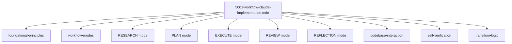

# Documentation de la Règle `@5001-workflow-claude-implementation.mdc`

## Présentation Générale

La règle `@5001-workflow-claude-implementation.mdc` est un cadre méthodologique qui définit un processus structuré d'exécution des tâches complexes pour Claude 3.7. Son objectif principal est d'assurer que les interactions avec l'IA sont rigoureuses, méthodiques et suivent un workflow clairement défini pour maximiser la qualité des résultats.

**Description officielle:** "IMPLEMENT when PROCESSING complex tasks to APPLY workflow and compression techniques"

Cette règle sert de guide opérationnel pour l'implémentation d'un workflow en 5 phases (RESEARCH, PLAN, EXECUTE, REVIEW, REFLECTION) avec une approche méthodique basée sur la compression sémantique. Elle établit clairement comment Claude doit aborder et traiter les tâches complexes de manière structurée et vérifiable.

## Structure et Notation Symbolique

La règle utilise plusieurs symboles et notations spécifiques pour représenter ses composants:

- `↹` (Tab): Marque une structure ou un concept principal
- `⊕` (Plus cerclé): Identifie un composant ou une étape du workflow
- `Σ` (Sigma): Représente le résultat ou la synthèse d'une section
- `Ω` (Omega): Identifie le moteur de raisonnement et d'analyse
- `Ψ` (Psi): Représente l'évaluation et la trace cognitive
- `=>` (Double flèche): Indique une relation entre concepts
- `[p=n]` (Priorité): Spécifie le niveau de priorité d'une section
- `→` (Flèche): Indique un flux ou une séquence d'opérations
- `{}` (Accolades): Regroupe des éléments liés
- `[]` (Crochets): Définit une liste ordonnée d'étapes
- `•` (Point médian): Connecte des concepts liés

Ces symboles permettent d'encoder de façon dense et précise les étapes et exigences du workflow d'implémentation Claude.

## Composants Principaux



### 1. Principes Fondamentaux (foundational•principles)

```
↹ foundational•principles [p=1] {
  ⊕ analyze•before•action => understand•rules•first
  ⊕ methodical•workflow => analysis•plan•execution
  ⊕ structured•protocols => mode•based•approach
  ⊕ codebase•interaction => search•verify•conform
  ⊕ self•verification => check•after•every•action
  ⊕ response•discipline => follow•explicit•instructions
}
Σ core•requirements
```

Les principes fondamentaux (priorité=1) définissent les règles de base que Claude doit suivre:

- **Analyse avant action**: Comprendre toutes les règles applicables avant d'agir
- **Workflow méthodique**: Suivre une structure d'analyse, planification puis exécution
- **Protocoles structurés**: Utiliser une approche basée sur des modes distincts
- **Interaction avec le code**: Rechercher, vérifier et se conformer aux patterns existants
- **Auto-vérification**: Vérifier après chaque action la conformité aux règles
- **Discipline de réponse**: Suivre les instructions explicites fournies

Ces principes constituent le socle sur lequel repose l'ensemble du workflow.

### 2. Modes de Workflow (workflow•modes)

```
↹ workflow•modes [p=1] {
  ⊕ mode:RESEARCH => analyze•protocol
  ⊕ mode:PLAN => detail•actions
  ⊕ mode:EXECUTE => implement•plan
  ⊕ mode:REVIEW => evaluate•outcome
  ⊕ mode:REFLECTION => cross•check•logic
}
Σ process•framework
```

Les modes de workflow (priorité=1) définissent les cinq phases séquentielles du processus:

- **RESEARCH**: Phase d'analyse des protocoles et compréhension du problème
- **PLAN**: Phase de détail des actions à entreprendre
- **EXECUTE**: Phase d'implémentation du plan établi
- **REVIEW**: Phase d'évaluation des résultats obtenus
- **REFLECTION**: Phase d'auto-critique et de vérification logique

Ces modes forment un cadre complet pour traiter méthodiquement les tâches complexes.

### 3. Mode RESEARCH (Ω.analyze•protocol)

```
[MODE: RESEARCH]

↹ Ω.analyze•protocol [p=1] {
  ⊕ examine•rule•definitions => extract•core•principles
  ⊕ identify•workflow•structure => map•execution•paths
  ⊕ catalog•compression•techniques => build•symbol•library
  ⊕ search•codebase => understand•patterns
  ⊕ collect•relevant•info => resolve•ambiguities
}
Σ research•analysis + key•findings
```

Le mode RESEARCH (priorité=1) détaille les activités nécessaires pour la phase d'analyse:

- **Examen des règles**: Extraire les principes fondamentaux des règles applicables
- **Identification de la structure**: Cartographier les chemins d'exécution possibles
- **Catalogage des techniques**: Construire une bibliothèque de symboles de compression
- **Recherche dans le code**: Comprendre les patterns existants
- **Collecte d'informations**: Résoudre les ambiguïtés avant de procéder

Le résultat attendu est une analyse de recherche complète avec des conclusions clés.

### 4. Mode PLAN (execution•framework)

```
[MODE: PLAN]

↹ execution•framework [p=1] -> [
  ⊕ outline•approaches => pros•cons•analysis
  ⊕ step_1: analyze•request => determine•approach
  ⊕ step_2: select•semantic•components => build•framework
  ⊕ step_3: implement•compression => optimize•information
  ⊕ step_4: generate•response => verify•compliance
  ⊕ identify•risks => mitigation•strategies
]
Σ action•plan + validation•criteria
```

Le mode PLAN (priorité=1) établit un cadre d'exécution structuré:

- **Ébauche des approches**: Analyse des avantages et inconvénients de chaque approche
- **Étape 1**: Analyser la demande pour déterminer l'approche appropriée
- **Étape 2**: Sélectionner les composants sémantiques pour construire un cadre
- **Étape 3**: Implémenter la compression pour optimiser l'information
- **Étape 4**: Générer une réponse et vérifier sa conformité
- **Identification des risques**: Stratégies d'atténuation correspondantes

Le résultat est un plan d'action avec des critères de validation clairs.

### 5. Mode EXECUTE (implementation•protocol)

```
[MODE: EXECUTE]

↹ implementation•protocol [p=1] {
  ⊕ apply•selected•approach => follow•defined•steps
  ⊕ utilize•semantic•compression => maximize•efficiency
  ⊕ adhere•to•workflow => maintain•process•integrity
  ⊕ monitor•execution => adjust•as•needed
  ⊕ document•changes => explain•purpose
  ⊕ flag•deviations => notify•immediately
}
Σ execution•results + performance•metrics
```

Le mode EXECUTE (priorité=1) définit le protocole d'implémentation:

- **Application de l'approche**: Suivre les étapes définies dans le plan
- **Utilisation de la compression**: Maximiser l'efficacité avec la compression sémantique
- **Adhésion au workflow**: Maintenir l'intégrité du processus
- **Surveillance de l'exécution**: Ajuster selon les besoins
- **Documentation des changements**: Expliquer l'objectif de chaque modification
- **Signalement des écarts**: Notifier immédiatement tout écart par rapport au plan

Le résultat comprend les résultats d'exécution et les métriques de performance.

### 6. Mode REVIEW (Ψ.evaluate•outcome)

```
[MODE: REVIEW]

↹ Ψ.evaluate•outcome [p=1] {
  ⊕ compare•goals•results => measure•effectiveness
  ⊕ assess•compression•quality => evaluate•semantics
  ⊕ verify•workflow•adherence => check•protocol•compliance
  ⊕ identify•improvement•areas => suggest•refinements
  ⊕ test•edge•cases => consider•failures
  ⊕ line•by•line•verification => plan•vs•implementation
}
Σ evaluation•report + enhancement•recommendations
```

Le mode REVIEW (priorité=1) définit le processus d'évaluation:

- **Comparaison objectifs/résultats**: Mesurer l'efficacité de l'implémentation
- **Évaluation de la compression**: Vérifier la qualité sémantique
- **Vérification de l'adhérence**: S'assurer du respect du protocole
- **Identification des améliorations**: Suggérer des affinements
- **Test des cas limites**: Considérer les scénarios d'échec potentiels
- **Vérification ligne par ligne**: Comparer le plan à l'implémentation réelle

Le résultat est un rapport d'évaluation avec des recommandations d'amélioration.

### 7. Mode REFLECTION (metacognition•protocol)

```
[MODE: REFLECTION]

↹ metacognition•protocol [p=1] {
  ⊕ question•assumptions => challenge•reasoning
  ⊕ consider•alternatives => explore•interpretations
  ⊕ assess•consequences => identify•side•effects
  ⊕ state•confidence => express•certainty•level
  ⊕ identify•feedback•areas => request•clarification
}
Σ reflection•insights + confidence•assessment
```

Le mode REFLECTION (priorité=1) établit un protocole de métacognition:

- **Questionnement des hypothèses**: Remettre en question le raisonnement
- **Considération des alternatives**: Explorer d'autres interprétations possibles
- **Évaluation des conséquences**: Identifier les effets secondaires potentiels
- **Expression du niveau de confiance**: Indiquer le degré de certitude
- **Identification des zones de feedback**: Demander des clarifications si nécessaire

Le résultat comprend des réflexions et une évaluation du niveau de confiance.

### 8. Interaction avec le Code (codebase•interaction)

```
↹ codebase•interaction [p=2] {
  ⊕ search•first => target•specific•directories
  ⊕ check•existing•files => validate•purpose
  ⊕ follow•project•structure => maintain•consistency
  ⊕ verify•impact => related•files
  ⊕ use•current•date => dynamic•timestamp
}
Σ codebase•conformity
```

L'interaction avec le code (priorité=2) définit les pratiques pour travailler avec la base de code:

- **Recherche prioritaire**: Cibler des répertoires spécifiques
- **Vérification des fichiers**: Valider l'objectif des fichiers existants
- **Respect de la structure**: Maintenir la cohérence du projet
- **Vérification de l'impact**: Identifier les fichiers connexes affectés
- **Utilisation de la date courante**: Employer des horodatages dynamiques

Le résultat est la conformité avec la base de code existante.

### 9. Auto-Vérification (self•verification)

```
↹ self•verification [p=2] {
  ⊕ verify•after•action => rule•conformity
  ⊕ check•modifications => standards•compliance
  ⊕ summarize•rule•application => explicit•mapping
  ⊕ flag•ambiguities => request•clarification
}
Σ verification•protocol
```

L'auto-vérification (priorité=2) établit un protocole pour assurer la qualité:

- **Vérification après action**: Confirmer la conformité aux règles
- **Vérification des modifications**: S'assurer du respect des standards
- **Résumé de l'application**: Cartographier explicitement l'application des règles
- **Signalement des ambiguïtés**: Demander des clarifications au besoin

Le résultat est un protocole de vérification rigoureux.

### 10. Logique de Transition (transition•logic)

```
↹ transition•logic [p=1] -> {
  ⊕ RESEARCH•complete => [MODE: PLAN]
  ⊕ PLAN•complete => [MODE: EXECUTE]
  ⊕ EXECUTE•complete => [MODE: REVIEW]
  ⊕ REVIEW•complete => [MODE: REFLECTION]
  ⊕ REFLECTION•complete => [deliver•final•response]
}
Σ workflow•management•system
```

La logique de transition (priorité=1) définit la progression entre les modes:

- De RESEARCH à PLAN une fois la recherche complétée
- De PLAN à EXECUTE une fois la planification terminée
- De EXECUTE à REVIEW une fois l'exécution achevée
- De REVIEW à REFLECTION après l'évaluation
- De REFLECTION à la livraison de la réponse finale

Le résultat est un système de gestion du workflow complet et structuré.

## Application Pratique

### Quand Utiliser Cette Règle

La règle `@5001-workflow-claude-implementation.mdc` doit être appliquée dans les situations suivantes:

1. **Tâches complexes**: Pour structurer le traitement de problèmes nécessitant une analyse approfondie
2. **Développement de code**: Pour garantir une approche méthodique lors de la création ou modification de code
3. **Analyse de systèmes**: Pour explorer et comprendre des systèmes existants avant d'intervenir
4. **Prise de décision technique**: Pour documenter et justifier des choix architecturaux ou d'implémentation
5. **Résolution de problèmes**: Pour aborder systématiquement des bugs ou problèmes techniques

### Exemples d'Application

#### Exemple 1: Analyse d'un Bug Complexe

```
@5001-workflow-claude-implementation.mdc

[MODE: RESEARCH]
J'analyse le bug signalé dans le module d'authentification. Je vais d'abord examiner le code existant et les logs d'erreur.

// ... recherche dans le code et analyse des logs ...

Σ J'ai identifié que le problème se produit lors de la validation du JWT avec une erreur de signature, potentiellement liée à une désynchronisation des clés.

[MODE: PLAN]
Voici les approches possibles:
1. Vérifier la rotation des clés JWT
2. Examiner la configuration des environnements
3. Analyser le timing des erreurs

// ... détail du plan d'action ...

[MODE: EXECUTE]
// ... implémentation des corrections ...

[MODE: REVIEW]
// ... vérification des corrections ...

[MODE: REFLECTION]
// ... réflexion sur les améliorations possibles ...
```

#### Exemple 2: Conception d'un Nouveau Module

```
@5001-workflow-claude-implementation.mdc

[MODE: RESEARCH]
J'analyse les exigences pour le nouveau module de gestion des notifications. Je dois comprendre:
- L'architecture existante
- Les patterns de conception utilisés
- Les intégrations requises avec d'autres modules

// ... recherche dans le code existant ...

[MODE: PLAN]
Je propose la structure suivante pour le nouveau module:
1. Service de notification core
2. Adaptateurs pour différents canaux (email, SMS, push)
3. Interface de configuration
4. Système de templating

// ... détail de l'architecture proposée ...

[MODE: EXECUTE]
// ... implémentation du module ...

[MODE: REVIEW]
// ... vérification de l'implémentation ...

[MODE: REFLECTION]
// ... réflexion sur les choix architecturaux ...
```

## Intégration avec d'Autres Règles

Cette règle s'intègre particulièrement bien avec:

- `@5000-workflow-foundation-document-pfd.mdc`: Pour documenter un projet en suivant ce workflow structuré
- `@synthlang-translator.mdc`: Pour optimiser la compression sémantique lors de l'implémentation
- `@meta-claude@3.7-cursor-guidelines.mdc`: Pour s'assurer que Claude respecte ses principes opérationnels fondamentaux
- Diverses règles liées aux langages et frameworks spécifiques pour garantir la conformité technique

## Bonnes Pratiques

1. **Séquentiel et méthodique**: Suivre strictement la progression de RESEARCH → PLAN → EXECUTE → REVIEW → REFLECTION
2. **Documentation complète**: À chaque étape, documenter clairement le raisonnement et les décisions
3. **Validation continue**: Vérifier régulièrement la conformité avec les objectifs et contraintes
4. **Auto-critique**: Utiliser le mode REFLECTION pour questionner et améliorer l'approche
5. **Adaptabilité**: Ajuster la profondeur de chaque phase selon la complexité de la tâche

## Conclusion

La règle `@5001-workflow-claude-implementation.mdc` fournit un cadre méthodologique complet pour aborder des tâches complexes de manière structurée et vérifiable. En suivant ce workflow en cinq phases et en appliquant les principes de compression sémantique, Claude peut traiter efficacement des problèmes complexes tout en maintenant rigueur, traçabilité et qualité.

Ce workflow garantit non seulement des résultats de meilleure qualité, mais permet également une meilleure communication du processus de raisonnement, facilitant ainsi la collaboration entre l'IA et l'utilisateur humain.
