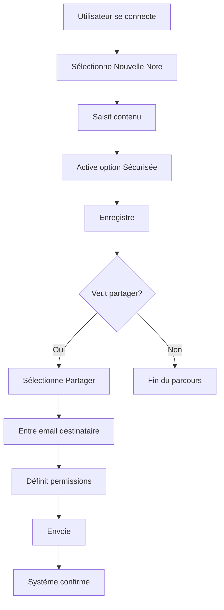
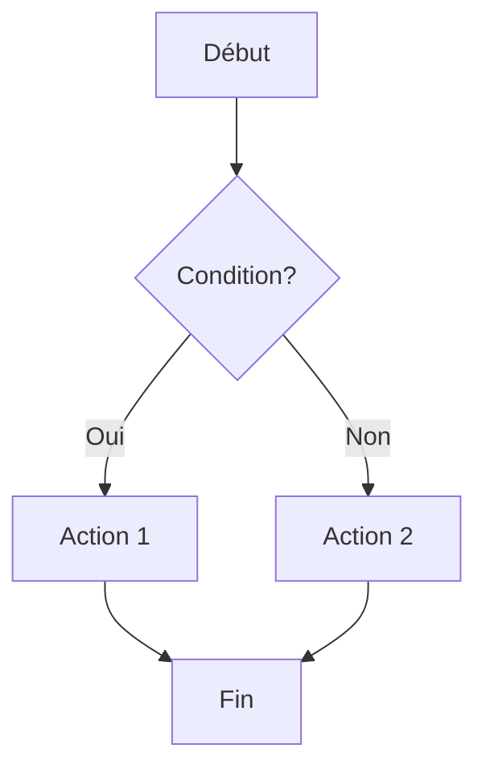
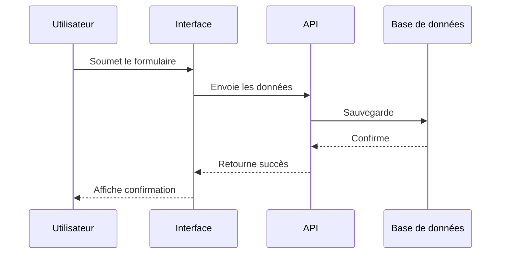
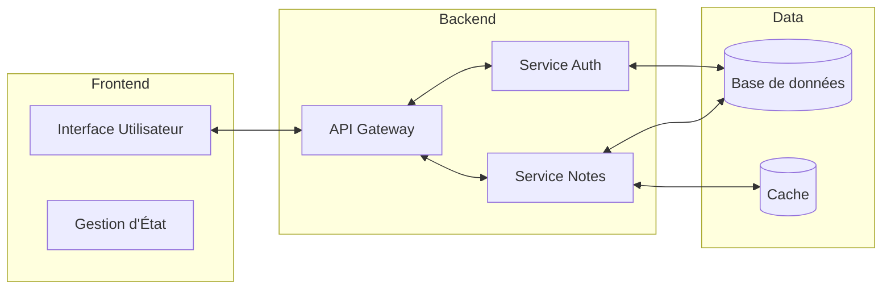
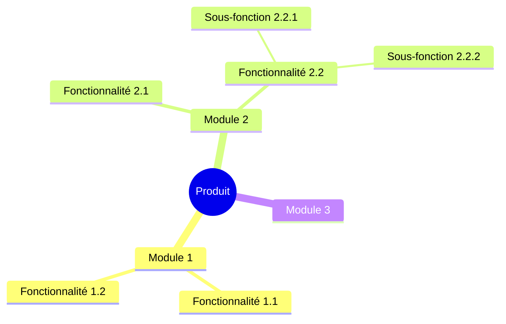

# Guide Complet - Document d'Exigences Produit (PRD)

Ce guide détaille l'utilisation de la règle `@5002-workflow-product-requirements-document.mdc` pour créer des Documents d'Exigences Produit (PRD) efficaces, complets et structurés. Un PRD bien conçu traduit la vision du projet en exigences concrètes, mesurables et implémentables.

## Table des Matières

```
A. Introduction et Fondamentaux
  1. Qu'est-ce qu'un PRD
  2. Objectif et Valeur du PRD
  3. Relation avec le PFD
  4. Public Cible et Utilisateurs

B. Structure du Document
  1. Vue d'Ensemble de la Structure
  2. Métadonnées et Frontmatter
  3. Sections Principales
  4. Annexes et Matériel de Support

C. Contenu du PRD
  1. Introduction et Contexte
  2. Objectifs et Critères de Succès
  3. Parcours Utilisateur
  4. Exigences
  5. Spécifications Techniques
  6. Plan d'Implémentation
  7. Évaluation des Risques
  8. Annexes et Glossaire

D. Bonnes Pratiques
  1. Écriture des Exigences
  2. Visualisations Efficaces
  3. Priorisation
  4. Validation et Vérification
  5. Maintenance et Mise à Jour

E. Intégration dans le Flux Agile
  1. Du PRD aux Epics et Stories
  2. Évolution du PRD durant les Sprints
  3. Relation avec les Revues et Rétrospectives

F. Outils et Techniques
  1. Diagrammes et Visualisations
  2. Templates et Modèles
  3. Checklists et Validation
  4. Intégration dans l'Écosystème de Documentation
```

## A. Introduction et Fondamentaux

### 1. Qu'est-ce qu'un PRD

Un **Document d'Exigences Produit (PRD)** est une spécification détaillée qui documente les fonctionnalités, comportements, contraintes et exigences d'un produit ou d'une fonctionnalité. Il constitue le pont entre la vision de haut niveau définie dans le Document Fondation de Projet (PFD) et l'implémentation technique concrète.

Le PRD est :

- Une **spécification détaillée** des caractéristiques, fonctionnalités et contraintes
- Un **guide d'implémentation** pour les équipes de développement, design et test
- Une **référence** pour la validation et l'acceptance des fonctionnalités
- Un **outil de communication** entre parties prenantes business et techniques
- Un **document vivant** qui évolue avec le projet

Le PRD n'est pas :

- Un document technique détaillant l'implémentation spécifique
- Une liste exhaustive de tâches de développement
- Un remplacement pour la communication directe entre équipes
- Un document figé qui ne peut évoluer
- Un simple document administratif sans valeur pratique

### 2. Objectif et Valeur du PRD

**Objectifs principaux** :

- Transformer la vision de haut niveau en exigences concrètes et implémentables
- Établir un référentiel commun pour toutes les parties prenantes
- Fournir une base pour l'estimation, la planification et la priorisation
- Définir clairement ce qui sera construit et ce qui ne le sera pas
- Établir des critères de succès mesurables pour les fonctionnalités

**Valeur ajoutée** :

- **Clarté et alignement** : Assure que toutes les parties prenantes partagent la même compréhension
- **Réduction des risques** : Identifie les problèmes potentiels avant l'implémentation
- **Meilleure estimation** : Permet une planification plus précise
- **Traçabilité** : Lie les exigences aux objectifs business et aux stories implémentées
- **Meilleure qualité** : Établit des critères clairs pour l'acceptance et le test
- **Communication efficace** : Réduit les malentendus et les hypothèses incorrectes
- **Prise de décision** : Fournit une base pour résoudre les conflits et prioriser

### 3. Relation avec le PFD

Le PRD s'inscrit dans une hiérarchie documentaire où :

1. **PFD (Project Foundation Document)** : Définit la vision globale, les objectifs stratégiques, les contraintes de haut niveau et le contexte business
2. **PRD (Product Requirements Document)** : Détaille les exigences spécifiques, les fonctionnalités et les comportements attendus
3. **Documents Techniques** : Spécifient l'implémentation, l'architecture et les détails techniques
4. **Stories et Tâches** : Décomposent les exigences en unités de travail implémentables

Cette relation peut être décrite comme suit :

- Le PFD **répond au "Pourquoi"** (vision, objectifs, valeur business)
- Le PRD **répond au "Quoi"** (fonctionnalités, exigences, comportements)
- Les docs techniques **répondent au "Comment"** (architecture, design, implémentation)
- Les stories **répondent au "Concrètement"** (unités de travail spécifiques)

**Flux d'information** :

- Le PRD **consomme** la vision, les objectifs et les contraintes du PFD
- Le PRD **transforme** ces objectifs de haut niveau en exigences détaillées
- Le PRD **maintient** l'alignement avec la valeur business définie dans le PFD
- Le PRD **informe** les décisions d'architecture et d'implémentation technique
- Le PRD **guide** la création des épics et stories agiles

### 4. Public Cible et Utilisateurs

Le PRD s'adresse à plusieurs audiences, chacune avec des besoins et attentes spécifiques :

**Parties prenantes business** :

- Obtenir confirmation que leurs besoins sont correctement capturés
- Valider l'alignement avec les objectifs business
- Comprendre l'envergure et les limites du produit

**Équipes produit** :

- Traduire les besoins business en exigences précises
- Prioriser les fonctionnalités
- Définir des critères de succès mesurables

**Équipes de développement** :

- Comprendre ce qui doit être construit
- Estimer l'effort requis
- Identifier les dépendances et contraintes

**Équipes UX/UI** :

- Comprendre les parcours utilisateur requis
- Identifier les besoins d'interface utilisateur
- Aligner le design avec les exigences

**Équipes de test et QA** :

- Dériver des cas de test à partir des exigences
- Établir des critères d'acceptance
- Valider que les fonctionnalités répondent aux exigences

**Équipes d'exploitation/opérations** :

- Comprendre les exigences de performance, sécurité, et maintien
- Planifier les déploiements et la maintenance
- Anticiper les besoins en infrastructure

## B. Structure du Document

### 1. Vue d'Ensemble de la Structure

Un PRD bien structuré suit une organisation logique qui facilite la compréhension, la navigation et l'évolution du document. La structure recommandée par la règle `@5002-workflow-product-requirements-document.mdc` comprend :

```
PRD
├── Frontmatter (Métadonnées)
├── Introduction
│   ├── Description du Projet
│   ├── Contexte et Motivation Business
│   ├── Public Cible et Parties Prenantes
│   └── Énoncé du Problème
├── Objectifs
│   ├── Objectifs Primaires
│   ├── Critères de Succès
│   ├── KPIs
│   └── Méthodes de Mesure
├── Parcours Utilisateur
│   ├── Parcours Primaires
│   ├── Parcours Secondaires
│   └── Diagrammes de Flux Utilisateur
├── Exigences et Fonctionnalités
│   ├── Classification MoSCoW
│   ├── Exigences Fonctionnelles
│   ├── Exigences Non-Fonctionnelles
│   ├── Exigences UX/UI
│   └── Fonctionnalités Explicitement Exclues
├── Spécifications Techniques
│   ├── Vision Technique
│   ├── Stack Technologique
│   ├── Architecture
│   ├── Contraintes Techniques
│   └── Principes de Développement
├── Plan d'Implémentation
│   ├── État Actuel
│   ├── Phases et Jalons
│   ├── Phases Techniques
│   ├── Dépendances
│   └── Ressources Requises
├── Évaluation des Risques
│   ├── Risques Business
│   ├── Risques Techniques
│   ├── Stratégies d'Atténuation
│   └── Alternatives Considérées
└── Annexes
    ├── Documents Connexes
    ├── Glossaire
    └── Matériel de Référence
```

Cette structure assure que le PRD :

- Commence par le contexte et les objectifs
- Détaille les exigences du point de vue utilisateur et technique
- Inclut l'approche d'implémentation et les considérations de risque
- Fournit du matériel supplémentaire pour référence

### 2. Métadonnées et Frontmatter

Le frontmatter d'un PRD contient des métadonnées essentielles qui identifient et contextualisent le document. Ces informations doivent être placées au début du document au format YAML :

```yaml
---
title: "Product Requirements Document - [Nom du Produit]"
description: "Description concise du contenu et de l'objectif"
version: "1.0.0"
status: "Draft|Review|Approved"
date: "YYYY-MM-DD"
author: "Nom de l'auteur"
tags: ["tag1", "tag2", "tag3"]
related_documents:
  - title: "Project Foundation Document"
    path: "/chemin/vers/pfd.md"
  - title: "Architecture Document"
    path: "/chemin/vers/architecture.md"
---
```

**Éléments requis :**

- **title**: Combine le nom du produit et le type de document
- **description**: Résumé concis du contenu (1-2 phrases)
- **version**: Numéro de version sémantique (MAJOR.MINOR.PATCH)
- **status**: État actuel du document
- **date**: Date de dernière modification au format YYYY-MM-DD
- **author**: Personne(s) responsable(s) du document
- **tags**: Mots-clés pertinents pour le classement et la recherche
- **related_documents**: Liens vers les documents connexes, notamment le PFD

**Gestion des versions :**

- Utiliser le versionnage sémantique :
  - MAJOR : Changements majeurs dans la portée ou les objectifs
  - MINOR : Ajout de nouvelles exigences ou fonctionnalités
  - PATCH : Corrections, clarifications ou mises à jour mineures
- Maintenir un historique des modifications dans le document

### 3. Sections Principales

Chaque section principale du PRD a un objectif et un contenu spécifiques :

**Introduction**

- Présente le contexte, la motivation et l'énoncé du problème
- Définit le public cible et les parties prenantes
- Établit le positionnement et la différenciation du produit

**Objectifs**

- Définit les objectifs primaires du produit
- Établit des critères de succès mesurables
- Spécifie les KPIs et les méthodes de mesure

**Parcours Utilisateur**

- Décrit les flux utilisateur principaux et secondaires
- Inclut des diagrammes visuels des parcours
- Identifie les points de décision et les actions utilisateur

**Exigences et Fonctionnalités**

- Utilise la classification MoSCoW pour prioriser
- Détaille les exigences fonctionnelles et non-fonctionnelles
- Spécifie les exigences UX/UI
- Identifie explicitement ce qui est exclu

**Spécifications Techniques**

- Présente la vision technique globale
- Définit la stack technologique et les versions
- Décrit l'architecture et les composants
- Identifie les contraintes techniques
- Établit les principes de développement

**Plan d'Implémentation**

- Documente l'état actuel du développement
- Définit les phases et jalons
- Détaille les phases techniques
- Identifie les dépendances
- Spécifie les ressources requises

**Évaluation des Risques**

- Identifie et évalue les risques business et techniques
- Propose des stratégies d'atténuation
- Documente les alternatives considérées

### 4. Annexes et Matériel de Support

Les annexes complètent le corps principal du PRD avec des informations détaillées ou supplémentaires :

**Documents Connexes**

- Liens vers le PFD, les documents d'architecture, etc.
- Références aux ressources externes pertinentes
- Documents de recherche utilisateur ou d'analyse concurrentielle

**Glossaire**

- Définition des termes techniques et du domaine
- Acronymes utilisés dans le document
- Termes spécifiques au projet ou à l'entreprise

**Matériel de Référence**

- Standards ou normes appliqués
- Recherches ou études pertinentes
- Documentation technique de référence
- Exemples, maquettes ou prototypes

**Autres annexes potentielles**

- Résultats d'études utilisateurs
- Détails techniques approfondis
- Analyses concurrentielles
- Considérations de migration ou de compatibilité
- Questions ouvertes nécessitant une exploration future

## C. Contenu du PRD

### 1. Introduction et Contexte

L'introduction d'un PRD établit le contexte et la portée du document. Elle doit être claire, concise et fournir suffisamment d'informations pour comprendre le produit et son objectif.

**Description du Projet**

Cette section présente une vue d'ensemble concise du produit :

- **Objectif principal** du produit ou de la fonctionnalité
- **Proposition de valeur** et avantages clés
- **Positionnement** dans le portefeuille produit ou sur le marché
- **Portée générale** de la fonctionnalité ou du projet

Exemple :

```
Le "Gestionnaire de Notes Sécurisé" est une application qui permet aux utilisateurs de créer, organiser et partager des notes sensibles avec un chiffrement de bout en bout. L'application offre une interface intuitive accessible depuis tous les appareils, tout en garantissant la confidentialité des données grâce à des mécanismes de sécurité avancés.
```

**Contexte et Motivation Business**

Cette section explique le "pourquoi" derrière le produit :

- **Contexte marché** et tendances pertinentes
- **Problèmes business** à résoudre
- **Opportunités** à exploiter
- **Objectifs stratégiques** auxquels le produit contribue
- **Analyse concurrentielle** succincte

La section doit faire référence au PFD pour maintenir l'alignement avec la vision globale du projet.

**Positionnement et Différenciation**

Cette sous-section explique comment le produit se positionne :

- **Proposition unique de valeur**
- **Différenciateurs clés** par rapport aux alternatives
- **Public cible** principal et secondaire
- **Segments de marché** adressés

**Public Cible et Parties Prenantes**

Définit clairement qui utilisera le produit et qui est impliqué :

- **Types d'utilisateurs** principaux et secondaires
- **Personas** détaillés avec besoins et comportements
- **Parties prenantes** internes et externes
- **Besoins spécifiques** de chaque groupe d'utilisateurs

Des personas bien définis permettent de rendre les exigences plus concrètes et centrées sur l'utilisateur.

**Énoncé du Problème**

Cette section articule clairement les problèmes que le produit vise à résoudre :

- **Défis actuels** rencontrés par les utilisateurs
- **Lacunes** dans les solutions existantes
- **Opportunités** d'amélioration
- **Impact** des problèmes sur les utilisateurs et l'entreprise

Une formulation claire du problème aide à justifier les exigences et à maintenir l'alignement sur les objectifs.

### 2. Objectifs et Critères de Succès

Cette section définit ce que le produit doit accomplir et comment son succès sera mesuré.

**Objectifs Primaires**

Des objectifs clairs, spécifiques et mesurables :

- Formulés selon le principe SMART (Spécifiques, Mesurables, Atteignables, Réalistes, Temporels)
- Alignés avec les objectifs stratégiques du PFD
- Priorisés par importance
- Quantifiés lorsque possible

Exemple :

```
1. Réduire le temps nécessaire pour trouver et accéder à une note de 45 secondes à moins de 10 secondes.
2. Permettre le partage sécurisé de notes avec des utilisateurs externes sans nécessiter de compte.
3. Atteindre un taux d'adoption de 80% parmi les équipes cibles dans les 3 mois suivant le lancement.
```

**Critères de Succès**

Définit des critères concrets pour évaluer si le produit atteint ses objectifs :

- **Résultats attendus** quantifiables
- **Seuils de performance** à atteindre
- **Comportements utilisateurs** souhaités
- **Impacts business** recherchés

Les critères doivent être objectifs, mesurables et vérifiables.

**KPIs (Indicateurs Clés de Performance)**

Spécifie les métriques qui seront utilisées pour mesurer le succès :

- **Métriques d'utilisation** (ex: rétention, engagement)
- **Métriques de performance** (ex: temps de réponse, disponibilité)
- **Métriques business** (ex: conversion, revenue)
- **Métriques de satisfaction** (ex: NPS, satisfaction utilisateur)

Pour chaque KPI, définir :

- La définition précise
- La méthode de mesure
- La valeur cible
- La fréquence de mesure

**Méthodes de Mesure**

Détaille comment les KPIs et critères de succès seront mesurés :

- **Outils et technologies** de mesure
- **Sources de données** et méthodes de collecte
- **Processus d'analyse** et de reporting
- **Fréquence** des mesures et évaluations
- **Responsabilités** pour le suivi et l'analyse

### 3. Parcours Utilisateur

Cette section décrit comment les utilisateurs interagiront avec le produit pour atteindre leurs objectifs.

**Parcours Primaires**

Détaille les flux principaux des utilisateurs, étape par étape :

- Scénarios les plus fréquents ou importants
- Décrit chaque étape du point de vue de l'utilisateur
- Inclut les interactions utilisateur-système
- Se concentre sur "ce que l'utilisateur fait" et non sur l'implémentation technique

Exemple de format :

```
Parcours: Création et partage d'une note sécurisée

1. L'utilisateur se connecte à l'application
2. L'utilisateur sélectionne "Nouvelle Note"
3. L'utilisateur saisit le titre et le contenu de la note
4. L'utilisateur active l'option "Sécurisée"
5. L'utilisateur sélectionne "Enregistrer"
6. Le système confirme l'enregistrement et le chiffrement
7. L'utilisateur sélectionne "Partager"
8. L'utilisateur entre l'adresse email du destinataire
9. L'utilisateur définit les permissions (lecture seule, édition)
10. L'utilisateur sélectionne "Envoyer"
11. Le système confirme le partage et envoie une notification
```

**Parcours Secondaires**

Documente les flux alternatifs ou moins fréquents :

- Cas d'utilisation secondaires mais importants
- Chemins alternatifs dans les parcours principaux
- Gestion des exceptions et cas d'erreur
- Décrit chaque étape comme pour les parcours primaires

**Diagrammes de Flux Utilisateur**

Inclut des représentations visuelles des parcours :

- Utilise des diagrammes de flux (flowcharts)
- Montre clairement les points de décision et chemins alternatifs
- Inclut les interactions système et les retours utilisateur
- Se concentre sur la clarté et la lisibilité

Exemple de diagramme Mermaid :



**Points de Décision et Interactions Clés**

Identifie les moments importants dans les parcours :

- Les points où l'utilisateur doit prendre une décision
- Les interactions critiques qui influencent l'expérience
- Les moments où le système fournit des retours importants
- Les transitions entre différentes parties du système

### 4. Exigences

Cette section constitue le cœur du PRD, détaillant ce que le produit doit faire et comment il doit se comporter.

**Classification MoSCoW**

Organise les exigences selon leur priorité :

- **Must Have** : Exigences essentielles, sans lesquelles le produit ne peut pas fonctionner
- **Should Have** : Exigences importantes qui apportent une valeur significative
- **Could Have** : Exigences souhaitables mais non critiques
- **Won't Have** : Exigences explicitement exclues de cette version

Cette classification aide à la priorisation et à la gestion de l'envergure du projet.

**Exigences Fonctionnelles**

Détaille ce que le système doit faire :

- Organisées par domaine fonctionnel ou module
- Décrites de manière claire, précise et testable
- Formulées avec des verbes d'action (le système doit...)
- Numérotées pour faciliter la référence

Format recommandé :

```
F1. Gestion des Notes
  F1.1. Le système doit permettre aux utilisateurs de créer de nouvelles notes avec titre et contenu.
  F1.2. Le système doit sauvegarder automatiquement les notes toutes les 30 secondes.
  F1.3. Le système doit permettre l'organisation des notes en dossiers et sous-dossiers.
```

**Exigences Non-Fonctionnelles**

Spécifie les qualités et contraintes du système :

- **Performance** : temps de réponse, capacité, efficacité
- **Sécurité** : authentification, autorisation, protection des données
- **Fiabilité** : disponibilité, récupération, tolérance aux pannes
- **Utilisabilité** : facilité d'apprentissage, efficacité d'utilisation
- **Compatibilité** : navigateurs, appareils, intégrations
- **Maintenance** : supportabilité, évolutivité
- **Conformité** : standards, réglementations, accessibilité

Chaque exigence non-fonctionnelle doit être mesurable et vérifiable.

**Exigences UX/UI**

Définit les aspects relatifs à l'expérience utilisateur :

- **Principes de design** à suivre
- **Standards d'interface** à respecter
- **Comportements d'interaction** attendus
- **Accessibilité** et inclusivité
- **Réactivité** et adaptation aux différents appareils
- **Cohérence** visuelle et comportementale

**Fonctionnalités Explicitement Exclues**

Liste clairement ce qui ne sera pas inclus dans le périmètre :

- Fonctionnalités envisagées mais reportées à une version ultérieure
- Capacités qui ont été considérées mais rejetées
- Limites intentionnelles du produit
- Justification de ces exclusions

Cette section est essentielle pour gérer les attentes et éviter les confusions sur le périmètre.

### 5. Spécifications Techniques

Cette section traduit les exigences en orientations techniques plus concrètes, sans pour autant détailler l'implémentation.

**Vision Technique**

Présente l'approche technique globale :

- **Principes d'architecture** qui guideront l'implémentation
- **Approche technique** générale
- **Compromis techniques** acceptés
- **Qualités architecturales** prioritaires

**Stack Technologique**

Spécifie les technologies à utiliser :

- **Langages de programmation** et versions
- **Frameworks et bibliothèques** avec versions
- **Bases de données** et systèmes de stockage
- **Services cloud** ou infrastructure
- **Outils de développement** essentiels

Chaque choix technologique doit être justifié en lien avec les exigences.

**Architecture**

Présente une vue d'ensemble de l'architecture sans entrer dans les détails d'implémentation :

- **Composants principaux** et leurs responsabilités
- **Interfaces** et points d'intégration
- **Flux de données** entre composants
- **Patterns architecturaux** à appliquer
- **Diagrammes** illustrant l'architecture proposée

**Contraintes Techniques**

Identifie les limitations et contraintes techniques :

- **Limitations** de performance, scalabilité ou capacité
- **Dépendances** externes et leurs contraintes
- **Compatibilité** requise avec systèmes existants
- **Contraintes d'environnement** (cloud, on-premise)
- **Limites** de technologies spécifiques

**Principes de Développement**

Établit les principes et pratiques à suivre :

- **Standards de code** et conventions
- **Pratiques de test** attendues
- **Approche de sécurité** à appliquer
- **Considérations de performance**
- **Principes de conception** (SOLID, DRY, etc.)

### 6. Plan d'Implémentation

Cette section aborde comment le produit sera développé et livré.

**État Actuel**

Résume l'état actuel du développement :

- **Travail déjà complété** ou en cours
- **Composants existants** réutilisables
- **Point de départ** pour le développement
- **Progrès par rapport aux phases définies**

**Phases et Jalons**

Décrit l'approche de mise en œuvre progressive :

- **Phases logiques** de développement
- **Jalons clés** avec critères d'achèvement
- **Fonctionnalités** livrées à chaque phase
- **Calendrier approximatif** ou priorités relatives

L'objectif est de fournir une feuille de route claire sans micromanager l'implémentation.

**Phases Techniques**

Détaille les aspects techniques de l'implémentation :

- **Séquence de développement** recommandée
- **Approche technique** pour chaque phase
- **Défis techniques** anticipés et approches
- **Points de vérification** techniques

**Dépendances**

Identifie les dépendances qui pourraient affecter l'implémentation :

- **Dépendances externes** (API, services tiers, etc.)
- **Dépendances internes** (autres projets, composants)
- **Dépendances temporelles** (séquence obligatoire)
- **Risques liés** aux dépendances

**Ressources Requises**

Estime les ressources nécessaires à l'implémentation :

- **Compétences techniques** requises
- **Taille d'équipe** recommandée
- **Outils et environnements** nécessaires
- **Autres ressources** (infrastructures, licences, etc.)

### 7. Évaluation des Risques

Cette section anticipe les défis potentiels et propose des stratégies d'atténuation.

**Risques Business**

Identifie les risques liés aux aspects business :

- **Risques de marché** et d'adoption
- **Risques concurrentiels**
- **Risques financiers** ou de ROI
- **Risques réglementaires** ou de conformité

Pour chaque risque, spécifier :

- **Description** claire du risque
- **Impact potentiel** (Haut/Moyen/Bas)
- **Probabilité** d'occurrence (Haute/Moyenne/Basse)
- **Stratégie d'atténuation** proposée

**Risques Techniques**

Identifie les défis techniques potentiels :

- **Risques d'architecture** ou de conception
- **Risques de performance** ou de scalabilité
- **Risques de sécurité** ou de protection des données
- **Risques d'intégration** avec systèmes existants
- **Risques d'implémentation** ou de faisabilité technique

Comme pour les risques business, spécifier impact, probabilité et atténuation.

**Stratégies d'Atténuation**

Propose des approches proactives pour gérer les risques :

- **Mesures préventives** pour éviter les risques
- **Plans de contingence** si les risques se matérialisent
- **Techniques de monitoring** pour détecter les problèmes tôt
- **Approches d'adaptation** si les conditions changent

**Alternatives Considérées**

Documente les autres approches envisagées :

- **Solutions alternatives** évaluées
- **Analyse comparative** des options
- **Critères de décision** utilisés
- **Justification** des choix finaux

Cette section démontre la rigueur de la réflexion et fournit un contexte précieux si les conditions changent.

### 8. Annexes et Glossaire

Cette section fournit des informations complémentaires qui enrichissent la compréhension du document principal.

**Documents Connexes**

Liste et liens vers d'autres documents pertinents :

- **PFD** correspondant
- **Documents d'architecture** détaillés
- **Études utilisateurs** ou recherches
- **Analyses de marché** ou concurrentielles
- **Prototypes ou maquettes**

**Glossaire**

Définit les termes techniques, du domaine métier ou spécifiques au projet :

- **Termes métier** utilisés dans le document
- **Acronymes** et abréviations
- **Terminologie technique** spécifique
- **Concepts clés** qui pourraient être ambigus

Un glossaire bien fait améliore considérablement la clarté du document pour tous les lecteurs.

**Matériel de Référence**

Liste les sources d'information externes :

- **Standards** ou spécifications suivis
- **Articles de recherche** ou études
- **Documentation de référence** technique
- **Benchmarks** ou études comparatives

## D. Bonnes Pratiques

### 1. Écriture des Exigences

Pour des exigences claires, précises et efficaces :

**Clarté et Précision**

- Utiliser un langage simple et direct
- Éviter l'ambiguïté et le jargon non défini
- Une exigence = un concept ou comportement
- Être spécifique sur le "quoi", pas le "comment"

**Testabilité**

- Formuler de manière à pouvoir vérifier objectivement
- Inclure des critères d'acceptance explicites
- Utiliser des valeurs mesurables plutôt que des termes vagues
- Éviter les termes subjectifs (facile, intuitif, rapide)

**Structure et Organisation**

- Grouper par domaine fonctionnel ou module
- Utiliser une numérotation cohérente (F1.1, F1.2, etc.)
- Maintenir une granularité appropriée
- Identifier clairement les dépendances entre exigences

**Formulation Recommandée**

- "Le système **doit** ..." pour les exigences obligatoires
- "Le système **devrait** ..." pour les exigences importantes
- "Le système **pourrait** ..." pour les exigences optionnelles
- Utiliser le présent plutôt que le futur ou le conditionnel

### 2. Visualisations Efficaces

Les visualisations peuvent considérablement améliorer la compréhension du PRD :

**Diagrammes de Flux Utilisateur**

- Utiliser des diagrammes Mermaid flowchart
- Montrer clairement les chemins principaux et alternatifs
- Inclure les points de décision et retours système
- Maintenir un niveau de détail approprié

**Diagrammes d'Architecture**

- Utiliser des diagrammes de composants ou C4
- Montrer les principales interactions et flux de données
- Adapter le niveau de détail à l'audience
- Inclure des légendes claires

**Maquettes et Wireframes**

- Inclure des représentations visuelles de l'interface
- Utiliser le niveau de fidélité approprié
- Lier clairement aux exigences correspondantes
- Éviter de sur-spécifier les détails visuels

**Tableaux et Matrices**

- Utiliser pour présenter des informations comparatives
- Structurer clairement avec en-têtes explicites
- Limiter la complexité et la taille
- Assurer la lisibilité même imprimé ou en PDF

### 3. Priorisation

Une priorisation efficace est essentielle pour guider l'implémentation :

**Méthode MoSCoW**

- **Must Have** : Exigences sans lesquelles le produit n'a pas de valeur
- **Should Have** : Exigences importantes qui ajoutent une valeur significative
- **Could Have** : Exigences qui améliorent l'expérience mais ne sont pas critiques
- **Won't Have** : Exigences explicitement exclues de cette version

**Critères de Priorisation**

- **Valeur business** : Impact sur les objectifs commerciaux
- **Nécessité technique** : Fondations requises pour d'autres fonctionnalités
- **Effort d'implémentation** : Estimation relative de la complexité
- **Risque** : Probabilité et impact des problèmes potentiels
- **Dépendances** : Contraintes imposées par les relations entre exigences

**Techniques de Priorisation**

- Matrice de priorisation (valeur vs effort)
- Vote par points (dot voting) avec les parties prenantes
- Méthode Kano pour classifier les fonctionnalités
- Analyse de retour sur investissement (ROI)

### 4. Validation et Vérification

Assurer que le PRD est complet, cohérent et de haute qualité :

**Revue par les Parties Prenantes**

- Impliquer les représentants business, techniques et utilisateurs
- Organiser des sessions de revue structurées
- Documenter et suivre les retours
- Obtenir des approbations formelles

**Vérification de Cohérence**

- Aligner avec les objectifs du PFD
- Vérifier la cohérence interne des exigences
- S'assurer que tous les parcours utilisateur sont couverts
- Vérifier que les exigences sont réalisables

**Checklist de Qualité**

- Utiliser la checklist PRD fournie
- Évaluer l'exhaustivité de chaque section
- Vérifier la clarté et la testabilité des exigences
- Identifier les lacunes ou ambiguïtés

### 5. Maintenance et Mise à Jour

Le PRD est un document vivant qui doit évoluer avec le projet :

**Gestion des Versions**

- Utiliser le versionnage sémantique
- Maintenir un historique des modifications
- Indiquer clairement le statut (Brouillon, Revue, Approuvé)
- Suivre les modifications significatives

**Processus de Mise à Jour**

- Définir un processus clair pour proposer des changements
- Évaluer l'impact des modifications sur le périmètre
- Obtenir les approbations nécessaires
- Communiquer les changements aux parties prenantes

**Traçabilité**

- Maintenir des liens bidirectionnels entre exigences et implémentation
- Suivre l'état d'avancement de chaque exigence
- Documenter les décisions qui ont conduit à des modifications
- Assurer la cohérence avec les autres documents (PFD, architecture)

## E. Intégration dans le Flux Agile

### 1. Du PRD aux Epics et Stories

Le PRD sert de source pour la création d'éléments de backlog agile :

**Décomposition en Epics**

- Chaque section majeure du PRD peut générer un ou plusieurs epics
- Un epic représente un ensemble cohérent de fonctionnalités
- Les epics doivent rester alignés avec les objectifs du PRD
- Exemple : "Gestion des Notes Sécurisées" peut devenir un epic

**Création de User Stories**

- Dériver des stories à partir des exigences fonctionnelles
- Utiliser le format "En tant que [rôle], je veux [action] afin de [bénéfice]"
- Ajouter des critères d'acceptance basés sur le PRD
- Maintenir la traçabilité vers les exigences d'origine

**Estimation et Priorisation**

- Utiliser la classification MoSCoW pour guider la priorisation
- Les exigences "Must Have" deviennent des stories de haute priorité
- Estimer l'effort relatif pour chaque story
- Planifier les releases en fonction des priorités et dépendances

**Exemple de Décomposition**

```
PRD:
  F1.2: Le système doit permettre de partager des notes avec des permissions spécifiques.

Epic:
  "Partage et Collaboration"

User Stories:
  "En tant qu'utilisateur, je veux partager une note en lecture seule afin de permettre
   à d'autres personnes de consulter mon contenu sans le modifier."

  "En tant qu'utilisateur, je veux partager une note en mode édition afin de collaborer
   sur le contenu avec des collègues."

  "En tant qu'utilisateur, je veux révoquer l'accès à une note partagée afin de contrôler
   qui peut y accéder dans le temps."
```

### 2. Évolution du PRD durant les Sprints

Le PRD n'est pas figé après le début du développement :

**Mises à Jour Incrémentales**

- Affiner progressivement les détails des exigences
- Incorporer les apprentissages des sprints précédents
- Documenter les changements de direction ou de scope
- Maintenir la cohérence entre le PRD et le backlog

**Gestion du Changement**

- Établir un processus clair pour les modifications significatives
- Évaluer l'impact des changements sur le planning et les ressources
- Obtenir l'approbation des parties prenantes pour les changements majeurs
- Communiquer les modifications à toutes les équipes concernées

**Modèle de Développement**

- Le PRD initial peut être à haut niveau pour les parties futures
- Détailler progressivement les sections pertinentes pour les prochains sprints
- Maintenir les principes directeurs et les objectifs stables
- Adapter les détails d'implémentation en fonction du feedback

### 3. Relation avec les Revues et Rétrospectives

Les cérémonies agiles peuvent influencer l'évolution du PRD :

**Revues de Sprint**

- Valider que les fonctionnalités implémentées répondent aux exigences du PRD
- Identifier les écarts entre l'implémentation et les spécifications
- Recueillir le feedback des parties prenantes
- Mettre à jour le PRD si des modifications sont approuvées

**Rétrospectives**

- Évaluer si le niveau de détail du PRD est approprié
- Identifier les ambiguïtés ou manques dans les exigences
- Améliorer le processus de création et maintien du PRD
- Ajuster l'approche pour les futures exigences

**Planification de Release**

- Utiliser le PRD comme référence pour planifier les releases
- Évaluer l'atteinte des objectifs et critères de succès
- Ajuster les priorités en fonction des retours et de l'évolution du marché
- Planifier les futures évolutions du produit

## F. Outils et Techniques

### 1. Diagrammes et Visualisations

Les diagrammes améliorent considérablement la compréhension du PRD :

**Flowcharts (Mermaid)**

Pour représenter les parcours utilisateur et processus :



**Diagrammes de Séquence (Mermaid)**

Pour illustrer les interactions entre composants :



**Diagrammes de Composants**

Pour visualiser l'architecture technique :



**Mindmaps**

Pour organiser hiérarchiquement les fonctionnalités :



### 2. Templates et Modèles

Utiliser des templates améliore la cohérence et l'exhaustivité du PRD :

**Template de PRD**

Le template fourni dans `.cursor/rules/examples/product-requirements-document-template.md` offre :

- Une structure complète et cohérente
- Des instructions et exemples pour chaque section
- Des placeholders clairement identifiés
- Un format professionnel et lisible

**Templates d'Exigences**

Formats recommandés pour différents types d'exigences :

1. Exigences Fonctionnelles :

```
F1.1. Le système doit [action] lorsque [condition] afin de [résultat attendu].
```

2. Exigences Non-Fonctionnelles :

```
NF2.3. Le système doit [qualité] avec [métrique mesurable] dans [conditions].
```

3. Contraintes :

```
C3.2. Le système doit respecter [contrainte] en raison de [justification].
```

**Templates de User Stories**

Format standard avec critères d'acceptance :

```
Story: [Identifiant]

En tant que [rôle],
Je veux [action/fonctionnalité]
Afin de [bénéfice/valeur]

Critères d'acceptance:
1. [Critère vérifiable 1]
2. [Critère vérifiable 2]
3. [Critère vérifiable 3]

Notes:
- [Informations supplémentaires]
- [Considérations techniques]
```

### 3. Checklists et Validation

Les checklists garantissent la qualité et l'exhaustivité du PRD :

**Checklist PRD Complète**

Utiliser la checklist détaillée dans `.cursor/documentation/5002-workflow-product-requirements-document-checklist.md` pour :

- Évaluer chaque section du document
- Vérifier la qualité des exigences
- Assurer l'alignement business et technique
- Valider la mesurabilité et l'objectivité
- Confirmer la clarté et l'accessibilité

**Checklist des Exigences**

Pour chaque exigence, vérifier :

- Est-elle claire et non ambiguë ?
- Est-elle testable et vérifiable ?
- Est-elle réaliste et réalisable ?
- Est-elle nécessaire et apporte-t-elle de la valeur ?
- Est-elle cohérente avec les autres exigences ?
- Sa priorité est-elle clairement indiquée ?
- Les dépendances sont-elles identifiées ?

**Validation par les Parties Prenantes**

Processus de validation recommandé :

1. Revue individuelle par les parties prenantes clés
2. Session de revue collective pour discuter des points majeurs
3. Consolidation des retours et ajustements
4. Approbation formelle du document finalisé
5. Communication du PRD approuvé à toutes les équipes concernées

### 4. Intégration dans l'Écosystème de Documentation

Le PRD s'inscrit dans une hiérarchie documentaire cohérente :

**Hiérarchie Documentaire**

```
Documents Stratégiques
├── PFD (Project Foundation Document)
│   └── Vision, objectifs, contexte business
│
Documents de Spécification
├── PRD (Product Requirements Document)
│   └── Exigences détaillées, fonctionnalités
├── Document d'Architecture
│   └── Design technique, patterns, composants
│
Documents d'Implémentation
├── Backlog Agile
│   ├── Epics
│   └── User Stories
├── Documentation Technique
│   └── APIs, modèles de données, etc.
├── Documentation Utilisateur
    └── Guides, tutoriels, FAQ
```

**Organisation des Fichiers**

Structure recommandée pour le stockage des documents :

```
.ai/                       # Dossier principal pour les documents AI-assisted
├── pfd.md                 # Document Fondation de Projet
├── prd.md                 # Document d'Exigences Produit
├── arch.md                # Document d'Architecture
├── epic-1/                # Dossier pour l'Epic 1
│   ├── 1-feature-a.story.md
│   └── 2-feature-b.story.md
├── epic-2/                # Dossier pour l'Epic 2
│   └── ...
└── references/            # Documents de référence
    ├── research-results.md
    └── competitor-analysis.md
```

**Conventions de Nommage**

Standards recommandés :

- `project-name-prd.md` pour le document principal
- `project-name-prd-appendix-X.md` pour les annexes volumineuses
- `epic-{n}/{m}-{feature-name}.story.md` pour les stories dérivées
- Version dans le frontmatter et éventuellement dans le nom de fichier pour les versions majeures

**Outils de Gestion Documentaire**

Approches recommandées :

- Systèmes de contrôle de version (Git) pour suivre l'évolution
- Wikis ou portails de documentation pour une navigation facile
- Outils de feedback intégrés pour faciliter les commentaires
- Matrices de traçabilité pour lier les exigences aux implémentations

---

## Conclusion

Un Document d'Exigences Produit (PRD) bien conçu est essentiel pour traduire la vision d'un projet en spécifications concrètes et implémentables. En suivant les principes, la structure et les bonnes pratiques décrits dans ce guide, vous créerez des PRDs qui :

- Alignent toutes les parties prenantes sur une compréhension commune
- Guident efficacement les équipes de développement
- Établissent des critères clairs pour la validation
- Évoluent naturellement avec le projet
- S'intègrent harmonieusement dans un flux de travail agile

Le PRD n'est pas une simple formalité documentaire, mais un outil vivant qui facilite la communication, réduit les risques et augmente les chances de succès du projet.

Pour plus d'informations et d'outils complémentaires, consultez :

- La checklist PRD pour validation
- Le template PRD pour démarrer rapidement
- Le guide visuel PRD pour des exemples de visualisations
- La documentation du PFD pour comprendre la relation entre ces documents
