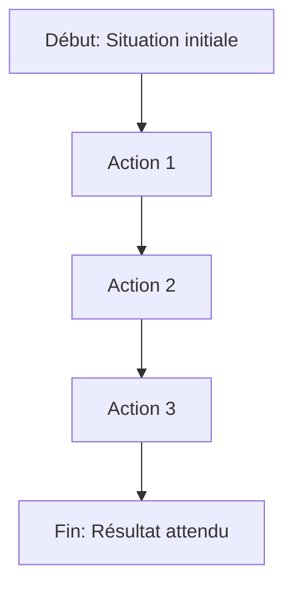
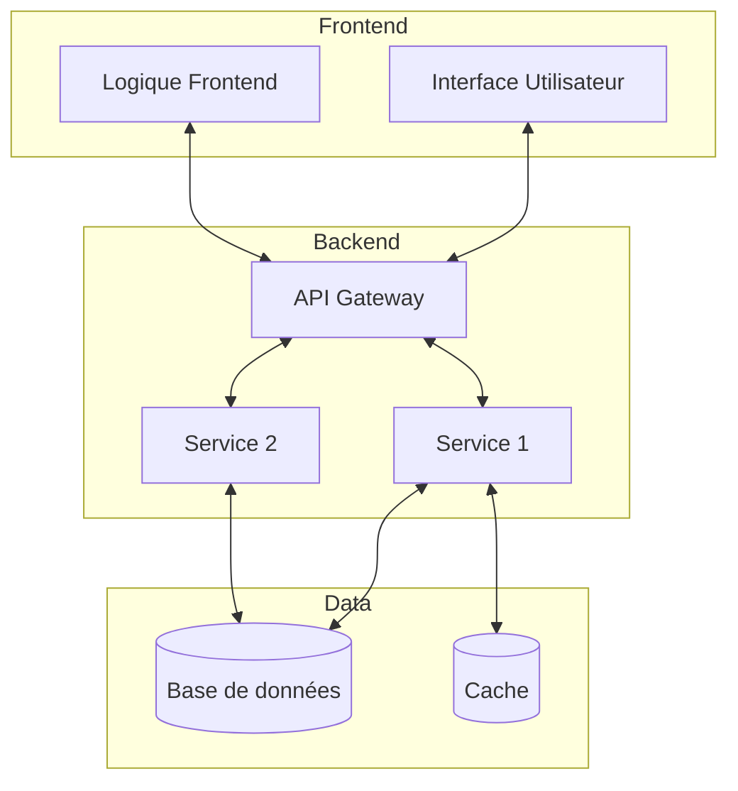
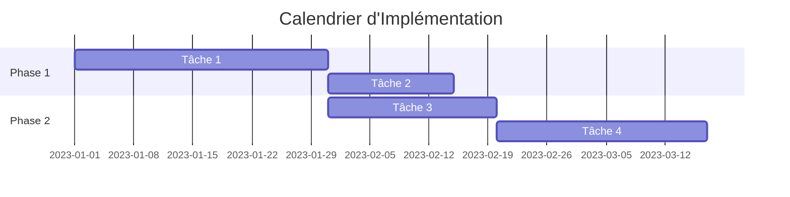

# Document d'Exigences Produit: [Nom du Produit/Fonctionnalité]

## Table des Matières

<!-- Table des matières générée automatiquement -->

## 1. Introduction

### 1.1 Objectif du Document

Ce document définit les exigences détaillées pour [Nom du Produit/Fonctionnalité]. Il sert de référence pour toutes les parties prenantes impliquées dans le développement et traduit les objectifs business définis dans le PFD en spécifications concrètes. Le PRD est le document de référence pour les équipes de développement, de test et de design UI/UX.

### 1.2 Portée du Produit

#### Inclusions

- [Liste des fonctionnalités/modules/composants inclus]
- [...]

#### Exclusions

- [Liste des éléments explicitement exclus]
- [...]

#### Limites

- [Définition des frontières du produit]
- [...]

### 1.3 Glossaire

| Terme/Acronyme | Définition                   |
| -------------- | ---------------------------- |
| [Terme 1]      | [Définition claire]          |
| [Terme 2]      | [Définition claire]          |
| [Acronyme 1]   | [Signification + définition] |

## 2. Contexte et Énoncé du Problème

### 2.1 Contexte Business

[Description du contexte business, du marché, des tendances et des opportunités qui justifient ce produit. Faire référence au PFD pour l'alignement stratégique.]

### 2.2 Énoncé du Problème

[Description claire et concise du problème ou du besoin que ce produit vise à résoudre. Identifier les défis actuels, les lacunes dans les solutions existantes et l'impact de ces problèmes sur les utilisateurs/l'entreprise.]

### 2.3 Opportunité

[Description de l'opportunité que représente la résolution de ce problème. Inclure l'impact attendu sur les utilisateurs, l'entreprise et potentiellement le marché.]

### 2.4 Positionnement du Produit

| Aspect           | Description                                       |
| ---------------- | ------------------------------------------------- |
| Pour             | [Public cible principal]                          |
| Qui              | [Besoin ou problème spécifique]                   |
| Le [Nom Produit] | [Type de produit/solution]                        |
| Qui              | [Bénéfice principal/proposition de valeur unique] |
| Contrairement à  | [Alternatives principales/concurrence]            |
| Notre produit    | [Différenciateurs clés]                           |

## 3. Public Cible et Parties Prenantes

### 3.1 Personas Principaux

#### Persona 1: [Nom]

- **Profil**: [Âge, profession, contexte pertinent]
- **Objectifs**: [Ce que cette personne essaie d'accomplir]
- **Frustrations**: [Problèmes/défis actuels]
- **Motivations**: [Ce qui motive cette personne]
- **Comportements**: [Habitudes pertinentes, niveau de familiarité technologique]
- **Scénarios d'utilisation**: [Comment et quand cette personne utiliserait le produit]

#### Persona 2: [Nom]

- **Profil**: [Âge, profession, contexte pertinent]
- **Objectifs**: [Ce que cette personne essaie d'accomplir]
- **Frustrations**: [Problèmes/défis actuels]
- **Motivations**: [Ce qui motive cette personne]
- **Comportements**: [Habitudes pertinentes, niveau de familiarité technologique]
- **Scénarios d'utilisation**: [Comment et quand cette personne utiliserait le produit]

### 3.2 Parties Prenantes

| Partie Prenante     | Intérêts/Préoccupations                | Implication                      |
| ------------------- | -------------------------------------- | -------------------------------- |
| [Partie prenante 1] | [Intérêts spécifiques dans ce produit] | [Comment et quand les impliquer] |
| [Partie prenante 2] | [Intérêts spécifiques dans ce produit] | [Comment et quand les impliquer] |
| [Partie prenante 3] | [Intérêts spécifiques dans ce produit] | [Comment et quand les impliquer] |

## 4. Objectifs et Indicateurs de Succès

### 4.1 Objectifs Produit

1. [Objectif SMART 1]
2. [Objectif SMART 2]
3. [Objectif SMART 3]

### 4.2 Indicateurs Clés de Performance (KPIs)

| KPI     | Description             | Métrique Actuelle | Cible    | Méthode de Mesure        |
| ------- | ----------------------- | ----------------- | -------- | ------------------------ |
| [KPI 1] | [Description détaillée] | [Valeur]          | [Valeur] | [Comment ce sera mesuré] |
| [KPI 2] | [Description détaillée] | [Valeur]          | [Valeur] | [Comment ce sera mesuré] |
| [KPI 3] | [Description détaillée] | [Valeur]          | [Valeur] | [Comment ce sera mesuré] |

### 4.3 Critères de Succès

| Critère     | Description             | Méthode de Validation    |
| ----------- | ----------------------- | ------------------------ |
| [Critère 1] | [Description détaillée] | [Comment ce sera validé] |
| [Critère 2] | [Description détaillée] | [Comment ce sera validé] |
| [Critère 3] | [Description détaillée] | [Comment ce sera validé] |

## 5. Parcours Utilisateur

### 5.1 Parcours Primaires

#### Parcours 1: [Nom du Parcours]

1. **Situation initiale**: [État initial de l'utilisateur]
2. **Action 1**: [Description de l'action utilisateur]
   - **Réponse système**: [Comment le système répond]
3. **Action 2**: [Description de l'action utilisateur]
   - **Réponse système**: [Comment le système répond]
4. ...
5. **Résultat final**: [État final ou objectif atteint]

#### Parcours 2: [Nom du Parcours]

1. **Situation initiale**: [État initial de l'utilisateur]
2. **Action 1**: [Description de l'action utilisateur]
   - **Réponse système**: [Comment le système répond]
3. **Action 2**: [Description de l'action utilisateur]
   - **Réponse système**: [Comment le système répond]
4. ...
5. **Résultat final**: [État final ou objectif atteint]

### 5.2 Parcours Secondaires et Cas Alternatifs

#### Alternatif 1: [Nom du Parcours]

[Description du cas alternatif, quand et pourquoi il se produit]

1. **Point de divergence**: [À partir de quelle étape du parcours principal]
2. **Action alternative 1**: [Description]
   - **Réponse système**: [Comment le système répond]
3. ...
4. **Résolution**: [Comment ce parcours alternatif se résout]

#### Gestion d'Erreur 1: [Nom du Scénario d'Erreur]

[Description du scénario d'erreur]

1. **Condition d'erreur**: [Quand cette erreur se produit]
2. **Message d'erreur**: [Ce que voit l'utilisateur]
3. **Options de récupération**: [Comment l'utilisateur peut résoudre le problème]
4. **Prévention**: [Comment le système aide à éviter cette erreur]

### 5.3 Points de Décision Clés

| Point de Décision | Options                     | Critères de Décision           | Impact                   |
| ----------------- | --------------------------- | ------------------------------ | ------------------------ |
| [Décision 1]      | [Option A], [Option B], ... | [Comment l'utilisateur décide] | [Impact sur le parcours] |
| [Décision 2]      | [Option A], [Option B], ... | [Comment l'utilisateur décide] | [Impact sur le parcours] |

## 6. Exigences

### 6.1 Classification des Exigences (MoSCoW)

#### Must Have (Obligatoire)

- [Exigence M1]
- [Exigence M2]
- ...

#### Should Have (Devrait avoir)

- [Exigence S1]
- [Exigence S2]
- ...

#### Could Have (Pourrait avoir)

- [Exigence C1]
- [Exigence C2]
- ...

#### Won't Have (N'aura pas dans cette version)

- [Exigence W1]
- [Exigence W2]
- ...

### 6.2 Exigences Fonctionnelles

#### [Domaine Fonctionnel 1]

| ID   | Description                                         | Priorité | User Story                                              | Critères d'Acceptation             |
| ---- | --------------------------------------------------- | -------- | ------------------------------------------------------- | ---------------------------------- |
| F1.1 | [Description détaillée de l'exigence fonctionnelle] | [M/S/C]  | En tant que [rôle], je veux [action] afin de [bénéfice] | [Liste des critères d'acceptation] |
| F1.2 | [Description détaillée de l'exigence fonctionnelle] | [M/S/C]  | En tant que [rôle], je veux [action] afin de [bénéfice] | [Liste des critères d'acceptation] |

#### [Domaine Fonctionnel 2]

| ID   | Description                                         | Priorité | User Story                                              | Critères d'Acceptation             |
| ---- | --------------------------------------------------- | -------- | ------------------------------------------------------- | ---------------------------------- |
| F2.1 | [Description détaillée de l'exigence fonctionnelle] | [M/S/C]  | En tant que [rôle], je veux [action] afin de [bénéfice] | [Liste des critères d'acceptation] |
| F2.2 | [Description détaillée de l'exigence fonctionnelle] | [M/S/C]  | En tant que [rôle], je veux [action] afin de [bénéfice] | [Liste des critères d'acceptation] |

### 6.3 Exigences Non-Fonctionnelles

#### Performance

| ID    | Description                                | Métrique              | Cible    | Méthode de Mesure        |
| ----- | ------------------------------------------ | --------------------- | -------- | ------------------------ |
| NF1.1 | [Description de l'exigence de performance] | [Métrique spécifique] | [Valeur] | [Comment ce sera mesuré] |
| NF1.2 | [Description de l'exigence de performance] | [Métrique spécifique] | [Valeur] | [Comment ce sera mesuré] |

#### Sécurité

| ID    | Description                             | Critères de Conformité           |
| ----- | --------------------------------------- | -------------------------------- |
| NF2.1 | [Description de l'exigence de sécurité] | [Comment vérifier la conformité] |
| NF2.2 | [Description de l'exigence de sécurité] | [Comment vérifier la conformité] |

#### Fiabilité

| ID    | Description                              | Métrique              | Cible    | Méthode de Mesure        |
| ----- | ---------------------------------------- | --------------------- | -------- | ------------------------ |
| NF3.1 | [Description de l'exigence de fiabilité] | [Métrique spécifique] | [Valeur] | [Comment ce sera mesuré] |
| NF3.2 | [Description de l'exigence de fiabilité] | [Métrique spécifique] | [Valeur] | [Comment ce sera mesuré] |

#### Utilisabilité

| ID    | Description                                 | Critères d'Évaluation |
| ----- | ------------------------------------------- | --------------------- |
| NF4.1 | [Description de l'exigence d'utilisabilité] | [Comment évaluer]     |
| NF4.2 | [Description de l'exigence d'utilisabilité] | [Comment évaluer]     |

#### Compatibilité

| ID    | Description                                  | Environnements Supportés   |
| ----- | -------------------------------------------- | -------------------------- |
| NF5.1 | [Description de l'exigence de compatibilité] | [Liste des environnements] |
| NF5.2 | [Description de l'exigence de compatibilité] | [Liste des environnements] |

### 6.4 Exigences d'Expérience Utilisateur (UX/UI)

#### Principes de Design

- **[Principe 1]**: [Description et justification]
- **[Principe 2]**: [Description et justification]
- **[Principe 3]**: [Description et justification]

#### Standards d'Interface

| Type d'Élément     | Standards/Guidelines                    |
| ------------------ | --------------------------------------- |
| [Type d'élément 1] | [Description des standards à respecter] |
| [Type d'élément 2] | [Description des standards à respecter] |
| [Type d'élément 3] | [Description des standards à respecter] |

#### Wireframes et Maquettes

[Insérer des wireframes, maquettes ou références à ces documents]

#### Accessibilité

| ID  | Exigence d'Accessibilité                    | Standard/Niveau   |
| --- | ------------------------------------------- | ----------------- |
| A1  | [Description de l'exigence d'accessibilité] | [ex: WCAG 2.1 AA] |
| A2  | [Description de l'exigence d'accessibilité] | [ex: WCAG 2.1 AA] |

### 6.5 Fonctionnalités Explicitement Exclues

| Fonctionnalité     | Justification                              | Version Future Potentielle            |
| ------------------ | ------------------------------------------ | ------------------------------------- |
| [Fonctionnalité 1] | [Pourquoi cette fonctionnalité est exclue] | [Quand elle pourrait être considérée] |
| [Fonctionnalité 2] | [Pourquoi cette fonctionnalité est exclue] | [Quand elle pourrait être considérée] |

## 7. Spécifications Techniques

### 7.1 Vision Technique

[Description de l'approche technique globale, des principes d'architecture qui guideront l'implémentation, et des qualités architecturales prioritaires]

### 7.2 Stack Technologique

#### Frontend

| Technologie     | Version | Justification                            |
| --------------- | ------- | ---------------------------------------- |
| [Technologie 1] | [x.y.z] | [Pourquoi cette technologie est choisie] |
| [Technologie 2] | [x.y.z] | [Pourquoi cette technologie est choisie] |

#### Backend

| Technologie     | Version | Justification                            |
| --------------- | ------- | ---------------------------------------- |
| [Technologie 1] | [x.y.z] | [Pourquoi cette technologie est choisie] |
| [Technologie 2] | [x.y.z] | [Pourquoi cette technologie est choisie] |

#### Infrastructure

| Technologie     | Version | Justification                            |
| --------------- | ------- | ---------------------------------------- |
| [Technologie 1] | [x.y.z] | [Pourquoi cette technologie est choisie] |
| [Technologie 2] | [x.y.z] | [Pourquoi cette technologie est choisie] |

### 7.3 Architecture

[Description de l'architecture, des composants principaux et de leurs responsabilités, des interfaces et points d'intégration, des flux de données, etc.]

### 7.4 Contraintes Techniques

| Contrainte     | Description                              | Impact sur l'Implémentation             |
| -------------- | ---------------------------------------- | --------------------------------------- |
| [Contrainte 1] | [Description détaillée de la contrainte] | [Comment cela affecte l'implémentation] |
| [Contrainte 2] | [Description détaillée de la contrainte] | [Comment cela affecte l'implémentation] |

### 7.5 Principes de Développement

- **[Principe 1]**: [Description et application spécifique au projet]
- **[Principe 2]**: [Description et application spécifique au projet]
- **[Principe 3]**: [Description et application spécifique au projet]

### 7.6 Intégrations

| Système Externe | Type d'Intégration       | Données Échangées                  | Considérations Particulières               |
| --------------- | ------------------------ | ---------------------------------- | ------------------------------------------ |
| [Système 1]     | [API/Webhook/Batch/etc.] | [Types de données envoyées/reçues] | [Considérations de sécurité, volume, etc.] |
| [Système 2]     | [API/Webhook/Batch/etc.] | [Types de données envoyées/reçues] | [Considérations de sécurité, volume, etc.] |

## 8. Plan d'Implémentation

### 8.1 État Actuel

[Description de l'état actuel du développement, du travail déjà complété, des composants existants réutilisables, etc.]

### 8.2 Phases et Jalons

#### Phase 1: [Nom]

- **Durée estimée**: [Estimation]
- **Objectif**: [Objectif principal de cette phase]
- **Livrables**:
  - [Livrable 1]
  - [Livrable 2]
  - ...
- **Fonctionnalités couvertes**:
  - [Liste des fonctionnalités implémentées dans cette phase]
- **Critères de passage**: [Conditions pour considérer cette phase terminée]

#### Phase 2: [Nom]

- **Durée estimée**: [Estimation]
- **Objectif**: [Objectif principal de cette phase]
- **Livrables**:
  - [Livrable 1]
  - [Livrable 2]
  - ...
- **Fonctionnalités couvertes**:
  - [Liste des fonctionnalités implémentées dans cette phase]
- **Critères de passage**: [Conditions pour considérer cette phase terminée]

### 8.3 Séquence Technique

[Description de la séquence de développement recommandée, des approches techniques pour chaque phase, des défis techniques anticipés, etc.]

### 8.4 Dépendances

| Dépendance     | Type              | Description                              | Impact si Non Résolue                 |
| -------------- | ----------------- | ---------------------------------------- | ------------------------------------- |
| [Dépendance 1] | [Externe/Interne] | [Description détaillée de la dépendance] | [Impact sur le projet si non résolue] |
| [Dépendance 2] | [Externe/Interne] | [Description détaillée de la dépendance] | [Impact sur le projet si non résolue] |

### 8.5 Ressources Requises

| Type de Ressource     | Description             | Quantité/Période                    |
| --------------------- | ----------------------- | ----------------------------------- |
| [Type de ressource 1] | [Description détaillée] | [Estimation de la quantité/période] |
| [Type de ressource 2] | [Description détaillée] | [Estimation de la quantité/période] |

## 9. Évaluation des Risques

### 9.1 Risques Business

| Risque     | Probabilité (H/M/L) | Impact (H/M/L) | Description                       | Stratégie d'Atténuation          |
| ---------- | ------------------- | -------------- | --------------------------------- | -------------------------------- |
| [Risque 1] | [H/M/L]             | [H/M/L]        | [Description détaillée du risque] | [Comment ce risque sera atténué] |
| [Risque 2] | [H/M/L]             | [H/M/L]        | [Description détaillée du risque] | [Comment ce risque sera atténué] |

### 9.2 Risques Techniques

| Risque     | Probabilité (H/M/L) | Impact (H/M/L) | Description                       | Stratégie d'Atténuation          |
| ---------- | ------------------- | -------------- | --------------------------------- | -------------------------------- |
| [Risque 1] | [H/M/L]             | [H/M/L]        | [Description détaillée du risque] | [Comment ce risque sera atténué] |
| [Risque 2] | [H/M/L]             | [H/M/L]        | [Description détaillée du risque] | [Comment ce risque sera atténué] |

### 9.3 Stratégies d'Atténuation

[Description plus détaillée des stratégies d'atténuation pour les risques majeurs, incluant des plans de contingence, des techniques de monitoring, etc.]

### 9.4 Alternatives Considérées

| Alternative     | Avantages             | Inconvénients             | Justification du Rejet                     |
| --------------- | --------------------- | ------------------------- | ------------------------------------------ |
| [Alternative 1] | [Liste des avantages] | [Liste des inconvénients] | [Pourquoi cette alternative a été rejetée] |
| [Alternative 2] | [Liste des avantages] | [Liste des inconvénients] | [Pourquoi cette alternative a été rejetée] |

## 10. Questions Ouvertes

| ID  | Question                                      | Impact                 | Propriétaire           | Date Cible      | Statut   |
| --- | --------------------------------------------- | ---------------------- | ---------------------- | --------------- | -------- |
| Q1  | [Question ouverte nécessitant une résolution] | [Impact sur le projet] | [Personne responsable] | [Date attendue] | [Statut] |
| Q2  | [Question ouverte nécessitant une résolution] | [Impact sur le projet] | [Personne responsable] | [Date attendue] | [Statut] |

## 11. Annexes

### 11.1 Documents Connexes

| Document     | Lien/Référence                  | Description                                         |
| ------------ | ------------------------------- | --------------------------------------------------- |
| [Document 1] | [Lien ou référence au document] | [Brève description du document et de sa pertinence] |
| [Document 2] | [Lien ou référence au document] | [Brève description du document et de sa pertinence] |

### 11.2 Glossaire

| Terme/Acronyme | Définition                   |
| -------------- | ---------------------------- |
| [Terme 1]      | [Définition claire]          |
| [Terme 2]      | [Définition claire]          |
| [Acronyme 1]   | [Signification + définition] |

### 11.3 Recherches et Études

[Résumé des recherches, études utilisateurs, tests, ou autres activités ayant informé ce PRD]

### 11.4 Matériel de Référence

[Références à des standards, patterns, ou autres documents externes utilisés pour informer ce PRD]

## 12. Historique des Modifications

| Version | Date       | Auteur | Description des Modifications                              |
| ------- | ---------- | ------ | ---------------------------------------------------------- |
| 0.1     | YYYY-MM-DD | [Nom]  | Version initiale                                           |
| 0.2     | YYYY-MM-DD | [Nom]  | [Description des changements depuis la version précédente] |

## 13. Approbation

| Rôle   | Nom   | Signature              | Date       |
| ------ | ----- | ---------------------- | ---------- |
| [Rôle] | [Nom] | **\*\***\_\_\_**\*\*** | YYYY-MM-DD |
| [Rôle] | [Nom] | **\*\***\_\_\_**\*\*** | YYYY-MM-DD |

---

## Instructions d'Utilisation du Template

1. Ce template est conçu pour être utilisé en conjonction avec la règle Cursor `@5002-workflow-product-requirements-document.mdc`.
2. Complétez chaque section en remplaçant les éléments entre crochets [Exemple] par les informations spécifiques à votre produit.
3. Supprimez ou modifiez les sections qui ne sont pas pertinentes pour votre projet.
4. Les diagrammes Mermaid peuvent être modifiés directement dans le markdown, ils seront rendus automatiquement.
5. Conservez cette section d'instructions lors de la création initiale du document, puis supprimez-la avant la finalisation.
6. Utilisez la checklist de validation PRD pour vérifier l'exhaustivité du document avant soumission.

### Notes sur les sections spécifiques:

- **Parcours Utilisateur**: Concentrez-vous sur les parcours du point de vue de l'utilisateur, pas sur les détails techniques.
- **Exigences**: Assurez-vous que chaque exigence est testable, réalisable et clairement priorisée.
- **MoSCoW**: Soyez rigoureux dans la priorisation - tout ne peut pas être "Must Have".
- **Spécifications Techniques**: Trouvez le bon équilibre entre guider l'implémentation et laisser de la flexibilité à l'équipe technique.
- **Plan d'Implémentation**: Restez à un niveau assez élevé, le détail précis sera élaboré dans les sprints.

### Conseils pour un PRD efficace:

1. **Clarté avant tout**: Évitez le jargon non défini et les termes ambigus.
2. **Concret et mesurable**: Chaque exigence doit être vérifiable objectivement.
3. **Centré utilisateur**: Les exigences doivent toujours se rattacher aux besoins des utilisateurs.
4. **Aligné au business**: Assurez-vous que le PRD soutient clairement les objectifs définis dans le PFD.
5. **Visuellement explicite**: Utilisez des diagrammes, tableaux et autres visualisations pour clarifier les concepts complexes.
6. **Complet mais concis**: Incluez toutes les informations nécessaires, mais évitez les répétitions et les détails superflus.
7. **Document vivant**: Prévoyez de mettre à jour le PRD au fur et à mesure que le projet évolue.
