# Guide Visuel - Document d'Exigences Produit (PRD)

Ce guide visuel propose des représentations graphiques pour comprendre la structure, l'utilisation et l'intégration du PRD dans le flux de travail agile.

## 1. Position du PRD dans l'Écosystème Documentaire

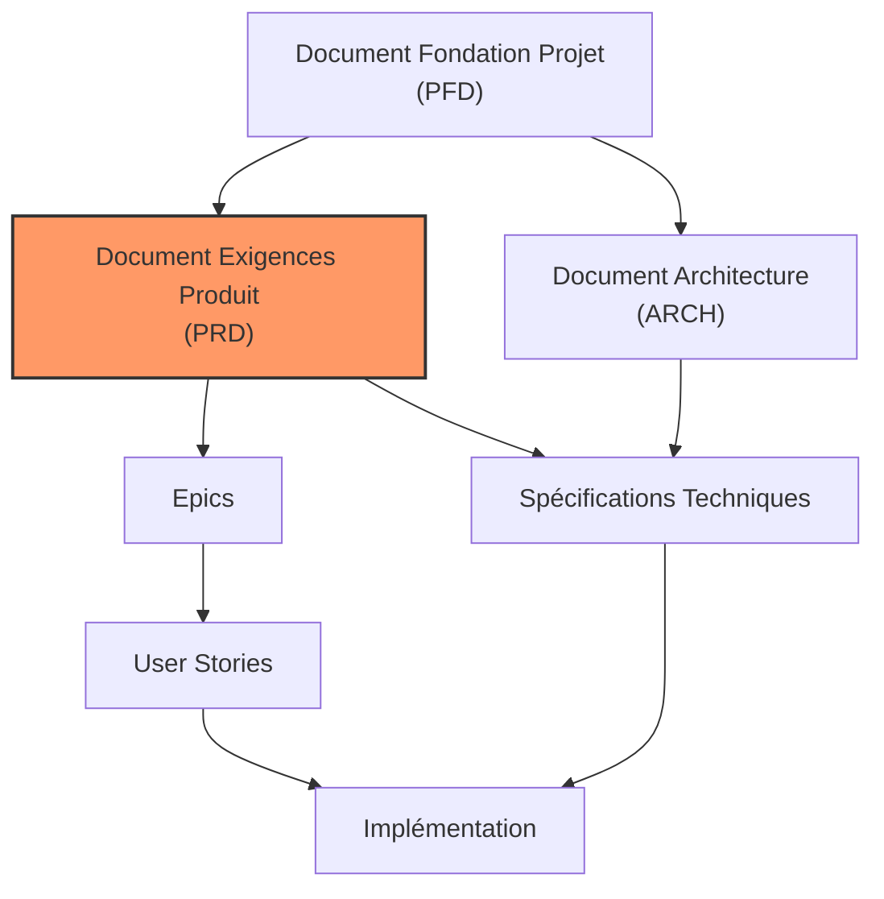

## 2. Structure du Document PRD

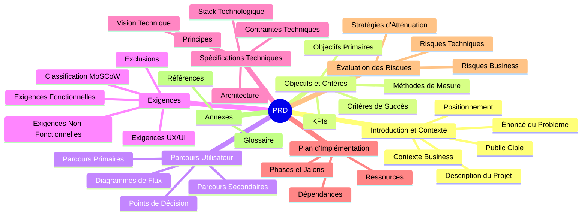

## 3. Cycle de Vie du PRD

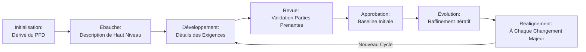

## 4. Relation PFD-PRD

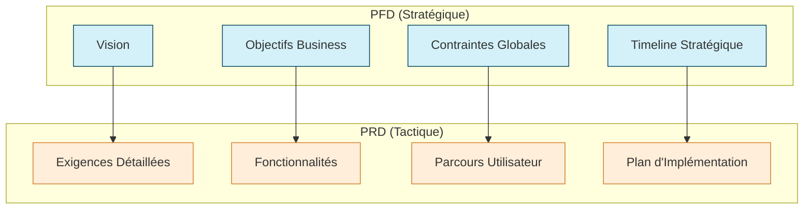

## 5. Du PRD au Backlog Agile

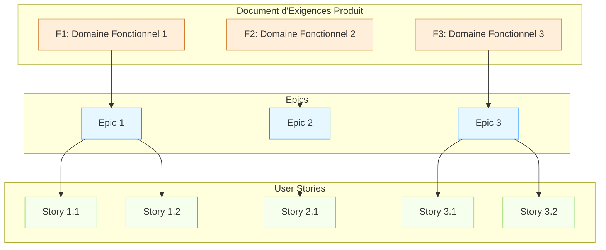

## 6. Classification MoSCoW des Exigences

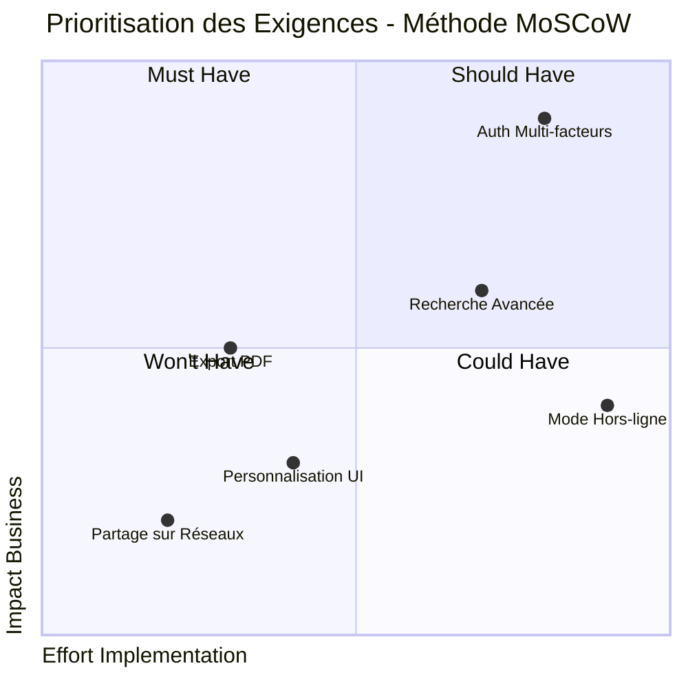

## 7. Parcours Utilisateur Type

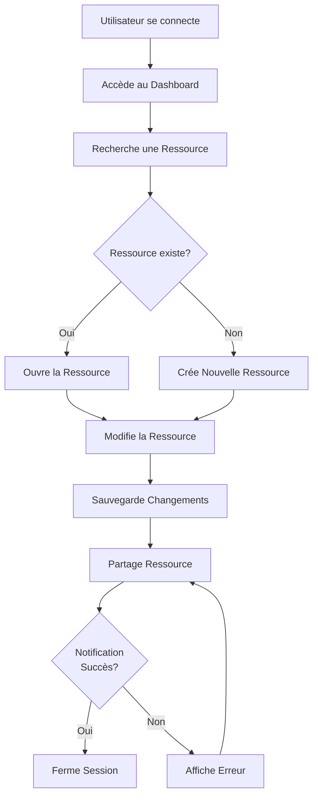

## 8. Relation avec les Sprints Agiles

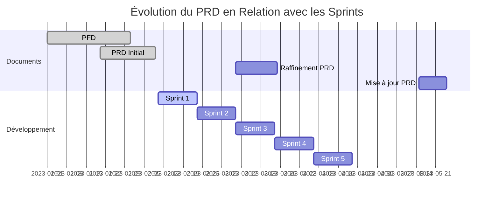

## 9. Modèle de Matrice de Traçabilité

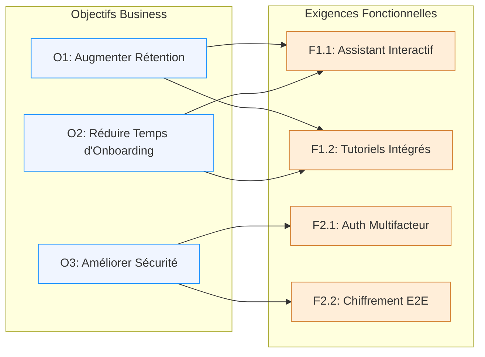

## 10. Architecture Simplifiée du Produit

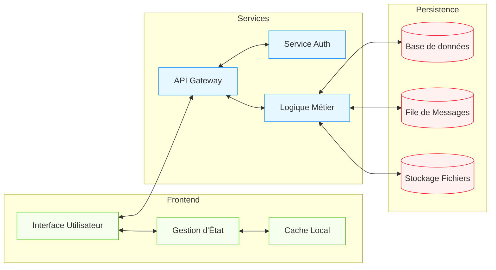

## 11. Processus de Validation des Exigences

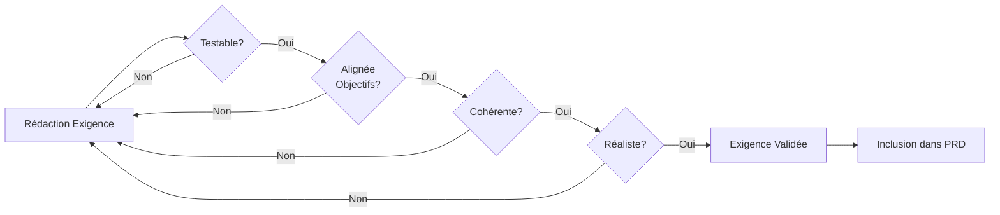

## 12. Processus de Priorisation MoSCoW

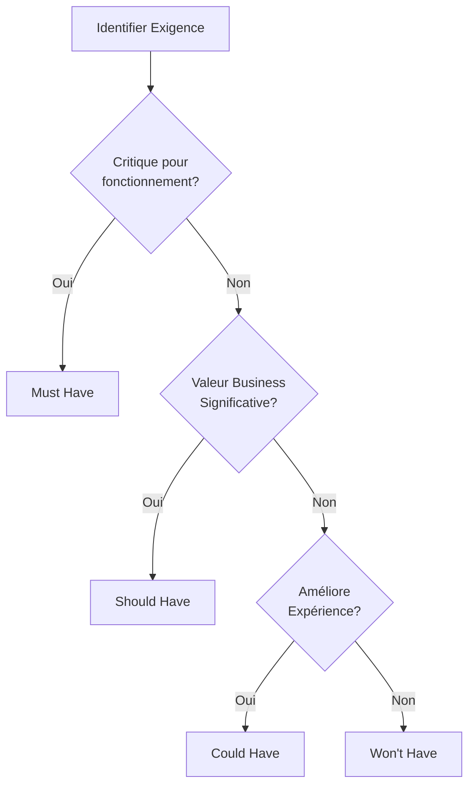

## 13. Diagramme d'État du Document PRD

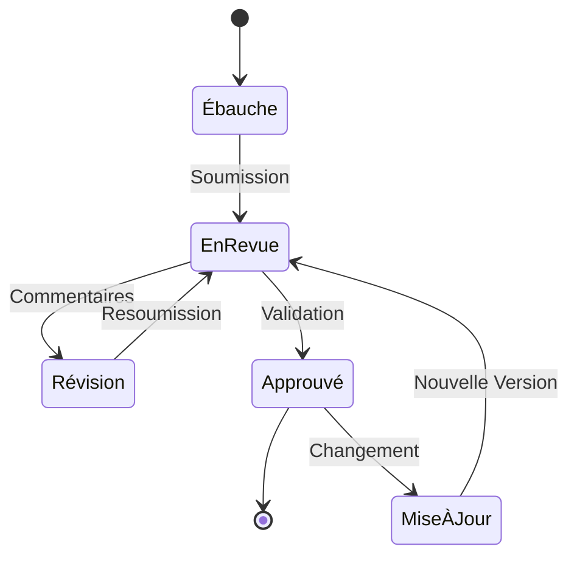

## 14. Checklist Visuelle PRD

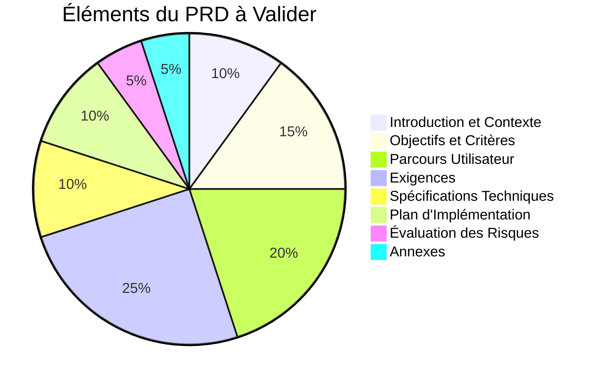

## 15. Évolution et Raffinement du PRD

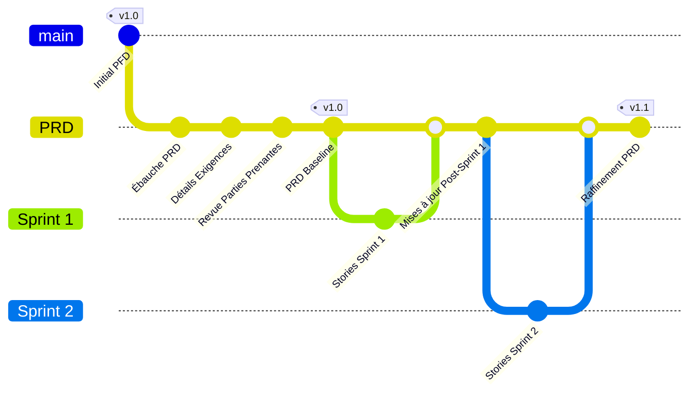

## Conclusion

Ces visualisations illustrent les concepts clés du Document d'Exigences Produit (PRD) et son intégration dans le flux de travail de développement produit. Un bon PRD sert de pont entre la vision stratégique du PFD et l'implémentation concrète, en fournissant une spécification détaillée et actionnable des exigences.
