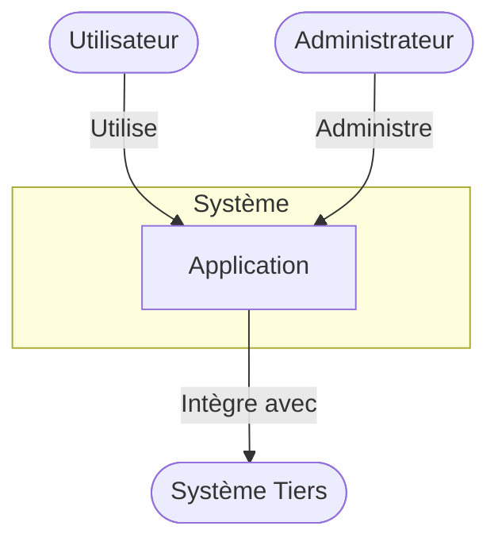
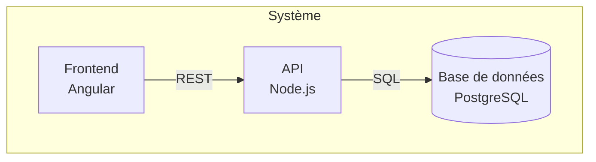
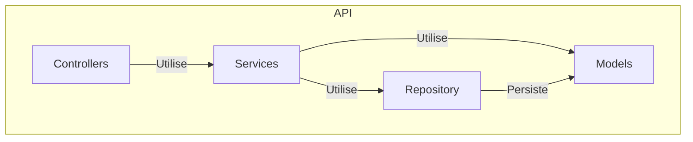
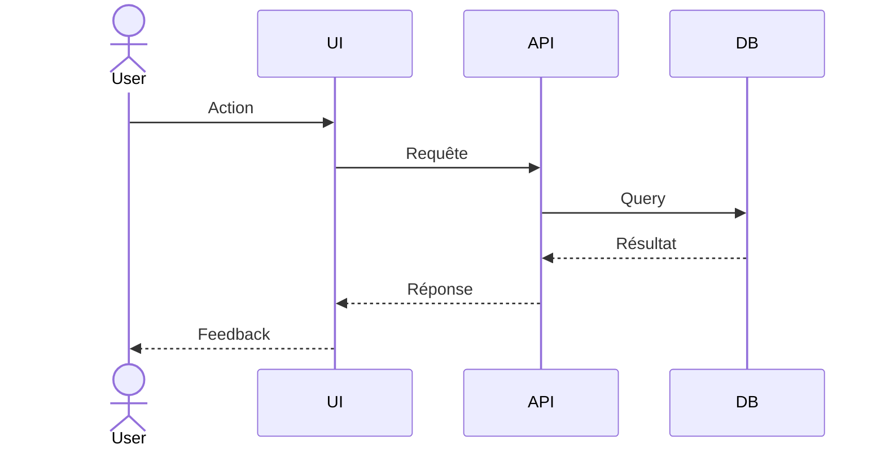

# Documentation du Document d'Architecture

## Introduction

Cette documentation explique comment utiliser la règle `@5003-workflow-architecture-document.mdc` pour créer des documents d'architecture de haute qualité. Le Document d'Architecture est une composante essentielle de la triade documentaire, avec le Document Fondation de Projet (PFD) et le Document d'Exigences Produit (PRD). Il traduit les exigences et contraintes business en une conception technique précise et implémentable.

## Position dans la Triade Documentaire

Le Document d'Architecture (ARCH) se positionne après le PFD et le PRD dans le flux documentaire :

1. **PFD** : Établit la vision, les objectifs et les contraintes globales du projet
2. **PRD** : Détaille les exigences fonctionnelles et non fonctionnelles
3. **ARCH** : Transforme ces exigences en solutions techniques concrètes

Cette séquence assure une traçabilité complète depuis les objectifs business jusqu'à l'implémentation technique.

## Objectifs du Document d'Architecture

Le Document d'Architecture vise à :

- Fournir un plan technique complet pour l'implémentation
- Documenter les décisions techniques clés et leurs justifications
- Établir une compréhension commune de la structure du système
- Servir de référence pour le développement, les tests et la maintenance
- Faciliter l'onboarding des nouveaux membres de l'équipe
- Permettre l'analyse d'impact pour les évolutions futures

## L'Approche Multi-Niveaux (C4 Model)

La règle adopte une approche inspirée du modèle C4 pour structurer la documentation d'architecture :

1. **Niveau 1 - Contexte** : Le système dans son ensemble et ses interactions externes
2. **Niveau 2 - Conteneur** : Les composants/packages de haut niveau du système
3. **Niveau 3 - Composant** : Les éléments internes des conteneurs
4. (**Niveau 4 - Code** : Généralement couvert par la documentation de code, non le document d'architecture)

Cette progression des niveaux permet une divulgation graduelle des détails, rendant le document accessible à différentes audiences.

## Structure du Document d'Architecture

### Métadonnées (Frontmatter)

```yaml
---
title: "System Architecture - [Nom du Système]"
version: "1.0.0"
date: "YYYY-MM-DD"
status: "Draft|Review|Approved"
authors: ["Architecte 1", "Architecte 2"]
related_documents:
  - document_type: "PFD"
    path: ".ai/pfd.md"
    version: "x.y.z"
  - document_type: "PRD"
    path: ".ai/prd.md"
    version: "x.y.z"
---
```

### Sections Principales

1. **Introduction**

   - Objectif du document
   - Portée et limites
   - Relation avec le PFD et le PRD

2. **Niveaux d'Abstraction**

   - Explication de l'approche multi-niveaux
   - Guide de lecture du document

3. **Niveau 1: Contexte**

   - Diagramme de contexte du système
   - Description des utilisateurs
   - Description des systèmes externes
   - Flux de données de haut niveau

4. **Niveau 2: Conteneur**

   - Diagramme des conteneurs/packages
   - Description des composants majeurs
   - Technologies utilisées
   - Interfaces entre conteneurs
   - Dépendances et direction des flux

5. **Niveau 3: Composant**

   - Diagrammes de composants pour les conteneurs clés
   - Interfaces et contrats
   - Structures de données importantes
   - Patterns de conception utilisés
   - Détails d'implémentation significatifs

6. **Préoccupations Transversales**

   - Gestion des erreurs
   - Journalisation (logging)
   - Sécurité
   - Internationalisation
   - Accessibilité
   - Configuration

7. **Flux de Données**

   - Diagrammes de séquence pour les scénarios clés
   - Transitions d'état
   - Chemins d'erreur et récupération

8. **Décisions Techniques**

   - Style architectural global (monolithe, microservices, etc.)
   - Patterns appliqués et contexte d'utilisation
   - Choix de frameworks et technologies
   - Alternatives considérées et raisons du choix
   - Contraintes techniques

9. **Évolution**

   - Dette technique actuelle et plans de remédiation
   - Feuille de route technique
   - Stratégie de versionnement
   - Considérations futures pour la scalabilité et l'extensibilité

10. **Spécificités Techniques**

    - Architecture de sécurité
    - Considérations de performance
    - Stratégie de mise à l'échelle
    - Optimisations mobiles
    - Implémentation de l'accessibilité

11. **Annexes**
    - Stack technologique détaillée avec versions
    - Glossaire des termes techniques
    - Références aux standards et patterns utilisés
    - Historique du document

## Types de Diagrammes

La règle accorde une importance particulière aux diagrammes pour communiquer efficacement la conception architecturale :

### Diagrammes de Contexte (Niveau 1)



### Diagrammes de Conteneur (Niveau 2)



### Diagrammes de Composant (Niveau 3)



### Diagrammes de Séquence



## Préoccupations Transversales

Il est essentiel de documenter comment les aspects qui traversent l'ensemble du système sont gérés :

### Gestion des Erreurs

- Stratégie globale de gestion des erreurs
- Patterns utilisés (Result/Option, exceptions, etc.)
- Catégorisation des erreurs
- Mécanismes de récupération

### Sécurité

- Authentification et autorisation
- Protection des données
- Sécurité des communications
- Défense en profondeur

### Internationalisation et Accessibilité

- Approche pour le support multilingue
- Standards d'accessibilité suivis (WCAG, etc.)
- Techniques d'implémentation

## Décisions Techniques

Documenter non seulement les choix mais aussi leur justification :

### Format Recommandé

Pour chaque décision significative :

- **Contexte** : Situation qui nécessite une décision
- **Options** : Alternatives considérées
- **Décision** : Option choisie
- **Justification** : Pourquoi cette option a été sélectionnée
- **Conséquences** : Implications positives et négatives
- **Traçabilité** : Lien vers les exigences ou contraintes du PFD/PRD

## Evolution et Dette Technique

Un système n'est jamais figé, il est important de documenter :

- La dette technique existante et son impact
- Les plans de remédiation avec priorités
- La feuille de route d'amélioration technique
- La stratégie d'évolution du système

## Styles Architecturaux

La règle fournit des templates pour trois styles architecturaux courants :

### Architecture à 3 Niveaux (3-Tier)

- **Couche Présentation** : UI, gestion d'état, routage
- **Couche Application** : Logique métier, services, contrôleurs
- **Couche Données** : Persistance, modèles, intégrations

### Architecture Clean

- **Entités** : Objets et règles métier, objets valeur
- **Cas d'Utilisation** : Interacteurs, ports d'entrée/sortie
- **Adaptateurs d'Interface** : Contrôleurs, présentateurs, repositories
- **Frameworks** : UI, web, persistence, externes

### Architecture Microservices

- **Frontières des Services** : Décomposition par domaine
- **Communication Inter-Services** : Synchrone vs asynchrone
- **Gestion des Données** : Base de données par service
- **Aspects Opérationnels** : Déploiement, monitoring, résilience

## Relation avec l'Implémentation

Le Document d'Architecture doit guider directement l'implémentation :

- Chaque décision documentée doit se refléter dans le code
- Les structures décrites doivent être implémentées de manière cohérente
- Les interfaces définies doivent être respectées
- Les patterns choisis doivent être appliqués systématiquement

## Conseils Pratiques

### Pour les Petites Équipes (2-5 personnes)

- Concentrez-vous sur les diagrammes de contexte et de conteneur
- Documentez en priorité les interfaces critiques et les décisions majeures
- Utilisez un style plus informel mais assurez la clarté des décisions

### Pour les Équipes Moyennes (6-15 personnes)

- Détaillez davantage les composants critiques du système
- Documentez systématiquement toutes les interfaces entre composants
- Incluez des diagrammes de séquence pour les flux principaux

### Pour les Grandes Équipes (15+ personnes)

- Documentation complète avec tous les niveaux de détail
- Formalisation des interfaces et contrats entre composants
- Documentation détaillée des standards et patterns à suivre
- Traçabilité rigoureuse avec les exigences

## Processus de Création et Maintenance

1. **Préparation**

   - Étudier le PFD et le PRD en profondeur
   - Identifier les exigences techniques et non-fonctionnelles
   - Recueillir les contraintes techniques

2. **Création**

   - Commencer par le diagramme de contexte
   - Progresser vers les conteneurs puis les composants
   - Valider les choix architecturaux avec l'équipe
   - Documenter les décisions et justifications

3. **Validation**

   - Effectuer une revue technique par les pairs
   - Vérifier l'alignement avec le PFD et le PRD
   - Confirmer la faisabilité technique
   - Valider la couverture des exigences non-fonctionnelles

4. **Maintenance**
   - Mettre à jour lors de changements architecturaux significatifs
   - Réviser périodiquement pour refléter l'état actuel
   - Actualiser en fonction des leçons apprises pendant l'implémentation
   - Garder la traçabilité avec les évolutions du PFD et PRD

## Vérification de la Qualité

Utilisez la checklist fournie dans `.cursor/documentation/5003-workflow-architecture-document-checklist.md` pour évaluer la qualité de votre document d'architecture.

## Ressources Complémentaires

- Le guide visuel `.cursor/documentation/5003-workflow-architecture-document-visual-guide.md` avec des exemples de diagrammes
- Le modèle C4 : [https://c4model.com/](https://c4model.com/)
- Patterns d'architecture : [https://martinfowler.com/architecture/](https://martinfowler.com/architecture/)
- Documentation comme code : [https://adr.github.io/](https://adr.github.io/) (Architecture Decision Records)
