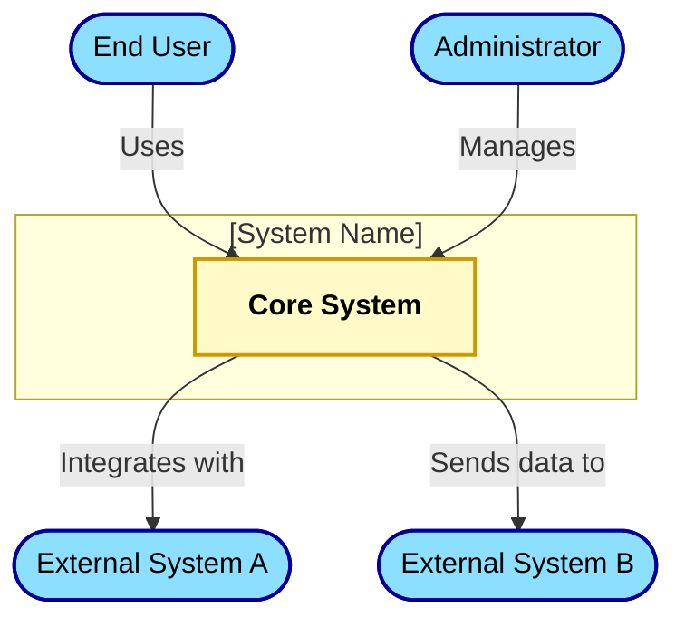
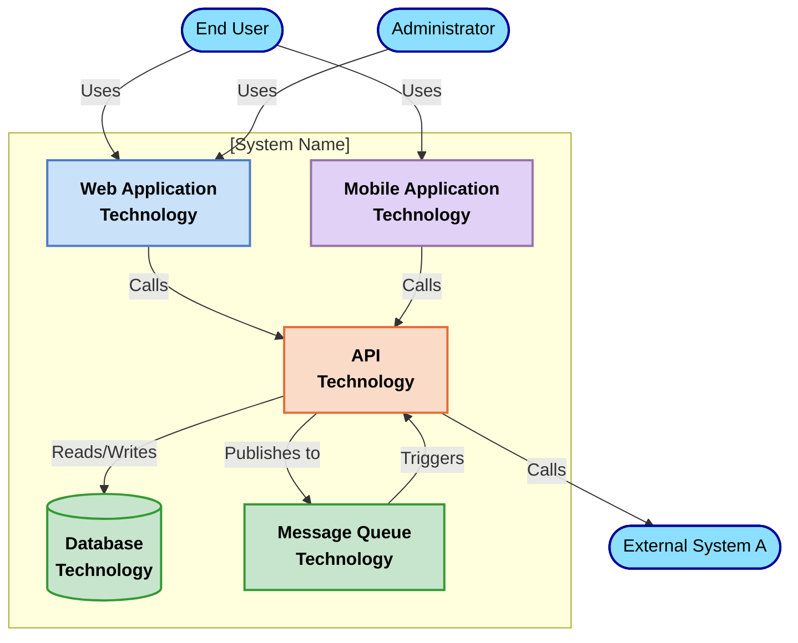
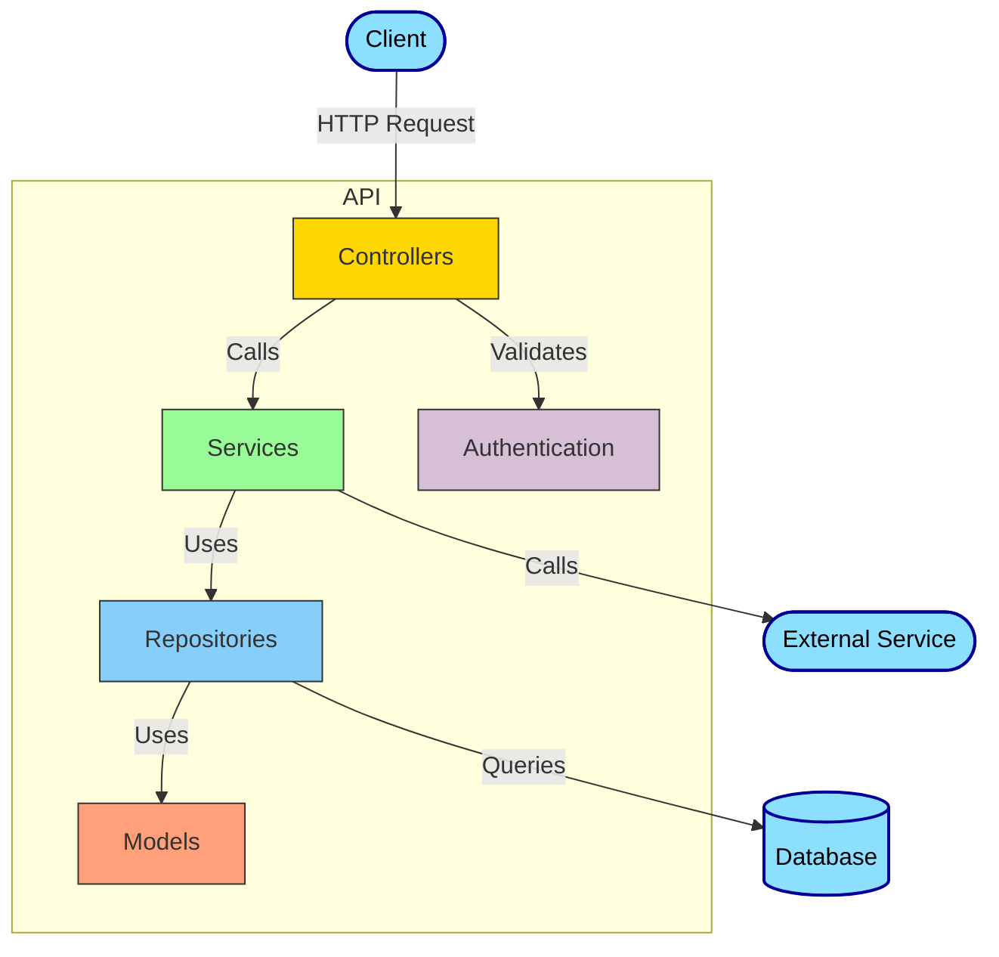
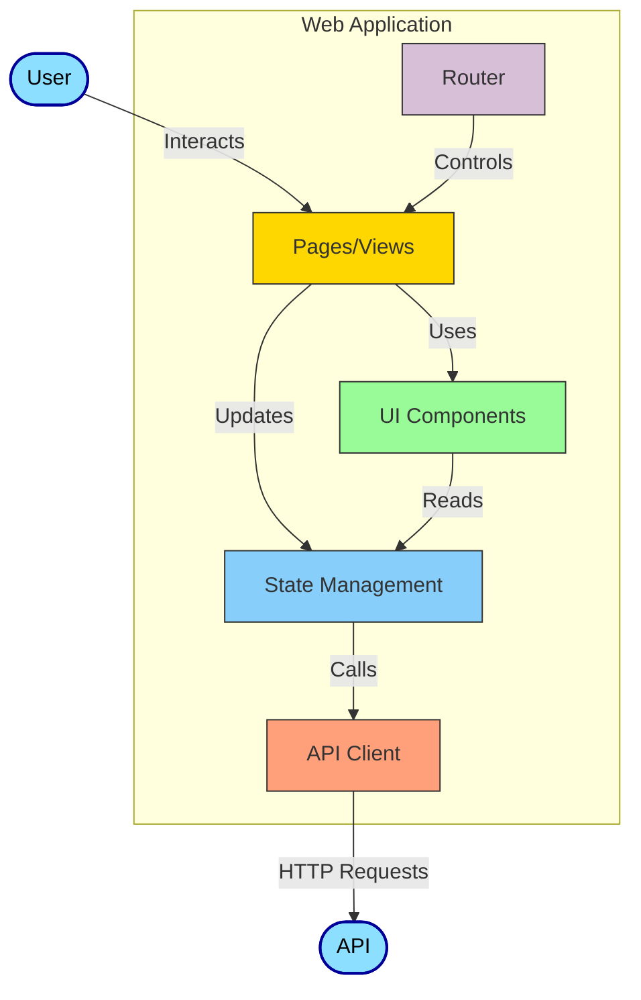
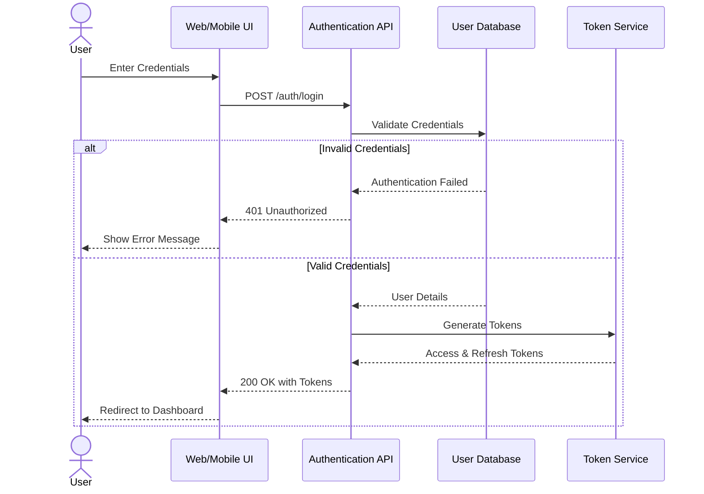
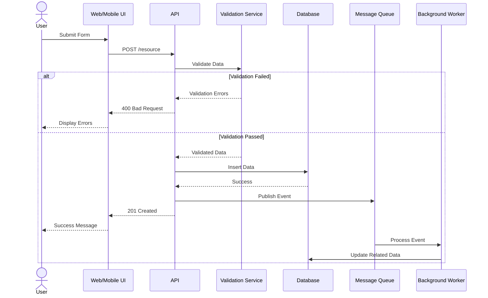
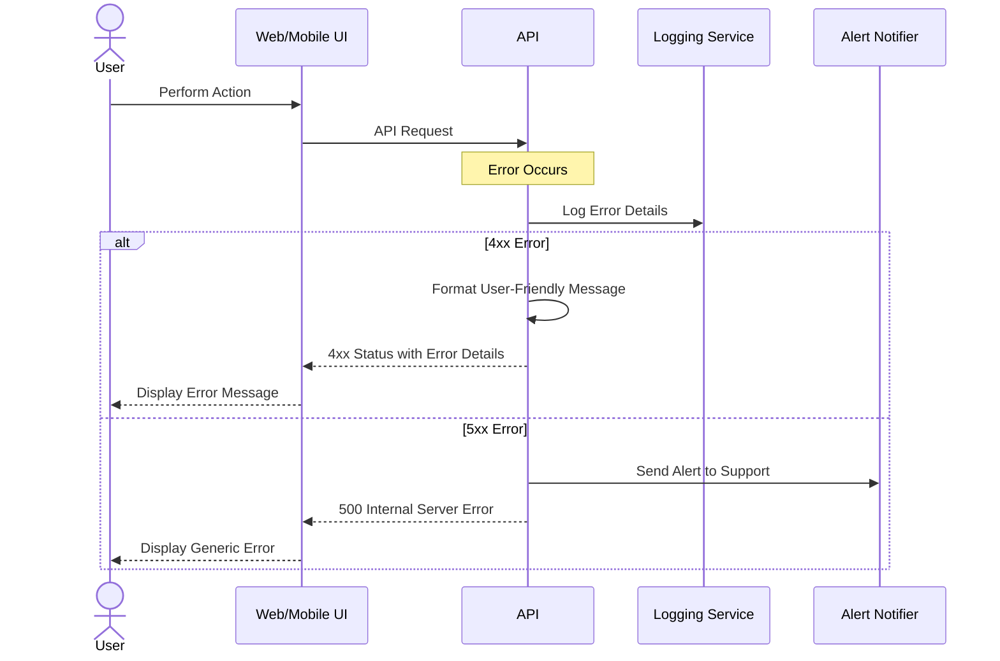
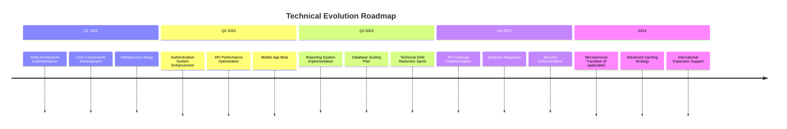

# [System Name] Architecture

## 1. Introduction

This document describes the architecture of the [System Name] system, providing a comprehensive view of the technical structure, components, and interactions. It serves as a blueprint for implementation, maintenance, and evolution of the system.

### 1.1 Purpose

This architecture documentation aims to:

- Provide a clear understanding of the system structure and components
- Document key technical decisions and their rationales
- Establish a foundation for implementation and future development
- Serve as a reference for all technical stakeholders

### 1.2 Scope

This document covers:

- System context and external integrations
- High-level component structure
- Detailed component design and interactions
- Cross-cutting concerns and technical approaches
- Implementation guidance and technical standards

### 1.3 Alignment with Business Goals

This architecture supports the business goals defined in the Project Foundation Document (PFD) by:

- [Explain how the architecture supports specific business goals from the PFD]
- [Describe how technical decisions align with business priorities]
- [Note how architecture addresses key constraints from the PFD]

### 1.4 Alignment with Requirements

This architecture fulfills the requirements specified in the Product Requirements Document (PRD) by:

- [Explain how the architecture supports key functional requirements]
- [Describe how architecture meets non-functional requirements]
- [Note any technical constraints derived from the PRD]

## 2. Levels of Abstraction

This document uses a multi-level approach to describe the architecture, starting with a high-level overview and progressively disclosing more detail. This approach is inspired by the C4 model (Context, Container, Component, Code).

### 2.1 Reading Guide

- **Level 1 - Context**: Describes the system in relation to its users and external systems
- **Level 2 - Container**: Outlines the high-level components/packages that make up the system
- **Level 3 - Component**: Details the internal structure of the main containers

Each level builds upon the previous one, adding more technical detail. Readers can stop at any level based on their needs:

- Business stakeholders may focus on Level 1
- Project managers and technical leads may focus on Levels 1-2
- Developers and QA engineers will benefit from all three levels

## 3. Level 1: System Context

The Context diagram shows [System Name] in relation to its users and external systems.

### 3.1 Context Elements

#### End Users

- **Description**: [Describe primary users]
- **Interactions**: [Detail how users interact with the system]
- **Requirements**: [Note key user requirements impacting architecture]

#### Administrators

- **Description**: [Describe administrative users]
- **Interactions**: [Detail how administrators interact with the system]
- **Requirements**: [Note key administrative requirements]

#### External System A

- **Description**: [Describe external system]
- **Interactions**: [Detail interactions with this system]
- **Integration Points**: [Specify integration mechanisms (APIs, events, etc.)]
- **Data Exchanged**: [Describe data flowing to/from this system]

#### External System B

- **Description**: [Describe external system]
- **Interactions**: [Detail interactions with this system]
- **Integration Points**: [Specify integration mechanisms]
- **Data Exchanged**: [Describe data flowing to/from this system]

## 4. Level 2: Container Diagram

The Container diagram shows the high-level technical components that make up the [System Name] system.

### 4.1 Container Elements

#### Web Application

- **Technology**: [Specify technology stack]
- **Responsibility**: [Describe main responsibility]
- **Key Features**: [List principal features]
- **User Interface**: [Describe UI approach]
- **Dependencies**: [List dependencies on other containers]

#### Mobile Application

- **Technology**: [Specify technology stack]
- **Responsibility**: [Describe main responsibility]
- **Key Features**: [List principal features]
- **Platforms**: [Specify supported platforms]
- **Dependencies**: [List dependencies on other containers]

#### API

- **Technology**: [Specify technology stack]
- **Responsibility**: [Describe main responsibility]
- **Key Endpoints**: [Summarize main API categories]
- **Authentication**: [Describe authentication mechanism]
- **Dependencies**: [List dependencies on other components]

#### Database

- **Technology**: [Specify database technology]
- **Data Storage**: [Describe main data entities]
- **Scalability Approach**: [Describe scaling strategy]
- **Backup Strategy**: [Summarize backup approach]

#### Message Queue

- **Technology**: [Specify message queue technology]
- **Responsibility**: [Describe main responsibility]
- **Message Types**: [List main message categories]
- **Processing Approach**: [Describe how messages are processed]

## 5. Level 3: Component Diagrams

### 5.1 API Components

#### Controllers

- **Responsibility**: Handle HTTP requests, validate inputs, coordinate responses
- **Components**:
  - `UserController`: Manages user-related operations
  - `ProductController`: Handles product-related operations
  - [List other significant controllers]
- **Interfaces**:
  - [Describe main interfaces]
- **Design Considerations**:
  - [Note key design decisions]

#### Services

- **Responsibility**: Implement business logic and orchestrate operations
- **Components**:
  - `UserService`: Implements user business logic
  - `ProductService`: Implements product business logic
  - [List other significant services]
- **Interfaces**:
  - [Describe main interfaces]
- **Design Considerations**:
  - [Note key design decisions]

#### Repositories

- **Responsibility**: Provide data access abstraction
- **Components**:
  - `UserRepository`: Manages user data persistence
  - `ProductRepository`: Manages product data persistence
  - [List other significant repositories]
- **Interfaces**:
  - [Describe main interfaces]
- **Design Considerations**:
  - [Note key design decisions]

### 5.2 Web Application Components

#### Pages/Views

- **Responsibility**: Represent main application screens
- **Components**:
  - `HomePage`: Main landing page
  - `UserProfile`: User profile management
  - [List other significant pages]
- **Design Considerations**:
  - [Note key design decisions]

#### UI Components

- **Responsibility**: Reusable UI elements
- **Components**:
  - `Button`: Custom button component
  - `Form`: Form handling component
  - [List other significant components]
- **Design Considerations**:
  - [Note key design decisions]

[Continue with other components...]

## 6. Cross-Cutting Concerns

### 6.1 Error Handling

#### Strategy

- **Global Approach**: [Describe overall error handling strategy]
- **Error Categorization**: [List error categories and how they're handled]
- **Client-Side Handling**: [Describe frontend approach]
- **Server-Side Handling**: [Describe backend approach]

#### Implementation

- **Error Types**:
  - `ValidationError`: [Description]
  - `AuthenticationError`: [Description]
  - [Other error types]
- **Logging**: [Describe error logging approach]
- **User Feedback**: [Describe how errors are communicated to users]

### 6.2 Logging

- **Logging Framework**: [Specify technology]
- **Log Levels**: [List and describe log levels]
- **Log Storage**: [Describe where logs are stored]
- **Log Format**: [Describe log structure]
- **Monitoring Integration**: [Describe any monitoring tools integration]

### 6.3 Security

#### Authentication

- **Mechanism**: [Describe authentication approach (OAuth, JWT, etc.)]
- **User Management**: [Describe user identity handling]
- **Session Management**: [Describe session handling]

#### Authorization

- **Access Control Model**: [Describe authorization model (RBAC, ABAC, etc.)]
- **Permission Enforcement**: [Describe how permissions are enforced]
- **Resource Protection**: [Describe how resources are protected]

#### Data Protection

- **Encryption at Rest**: [Describe database encryption]
- **Encryption in Transit**: [Describe communication encryption]
- **Sensitive Data Handling**: [Describe PII/sensitive data approaches]

### 6.4 Internationalization

- **Approach**: [Describe i18n strategy]
- **Supported Languages**: [List supported languages]
- **Implementation**: [Describe technology and approach]
- **Localization Process**: [Describe how new translations are added]

### 6.5 Accessibility

- **Standards**: [Specify accessibility standards followed (WCAG 2.1 AA, etc.)]
- **Implementation**: [Describe accessibility features]
- **Testing Approach**: [Describe accessibility testing]

### 6.6 Configuration

- **Configuration Sources**: [Describe where configuration comes from]
- **Environment Variables**: [List key environment variables]
- **Configuration Management**: [Describe how configuration is managed across environments]
- **Secrets Management**: [Describe how secrets are handled]

## 7. Data Flows

### 7.1 User Authentication Flow

### 7.2 Data Creation Flow

### 7.3 Error Handling Flow

## 8. Technical Decisions

### 8.1 Architecture Style

- **Decision**: [Specify chosen architecture style (e.g., Microservices, Monolith, etc.)]
- **Context**: [Describe the context that led to this decision]
- **Considered Alternatives**:
  - **Alternative 1**: [Description, pros, cons]
  - **Alternative 2**: [Description, pros, cons]
- **Rationale**: [Explain why the chosen option was selected]
- **Consequences**:
  - **Positive**: [List positive outcomes]
  - **Negative**: [List challenges or negative aspects]
- **Related Requirements**: [Reference to PFD/PRD requirements]

### 8.2 Frontend Framework

- **Decision**: [Specify chosen frontend framework]
- **Context**: [Describe the context that led to this decision]
- **Considered Alternatives**:
  - **Alternative 1**: [Description, pros, cons]
  - **Alternative 2**: [Description, pros, cons]
- **Rationale**: [Explain why the chosen option was selected]
- **Consequences**:
  - **Positive**: [List positive outcomes]
  - **Negative**: [List challenges or negative aspects]
- **Related Requirements**: [Reference to PFD/PRD requirements]

### 8.3 Backend Framework

- **Decision**: [Specify chosen backend framework]
- **Context**: [Describe the context that led to this decision]
- **Considered Alternatives**:
  - **Alternative 1**: [Description, pros, cons]
  - **Alternative 2**: [Description, pros, cons]
- **Rationale**: [Explain why the chosen option was selected]
- **Consequences**:
  - **Positive**: [List positive outcomes]
  - **Negative**: [List challenges or negative aspects]
- **Related Requirements**: [Reference to PFD/PRD requirements]

### 8.4 Database Technology

- **Decision**: [Specify chosen database technology]
- **Context**: [Describe the context that led to this decision]
- **Considered Alternatives**:
  - **Alternative 1**: [Description, pros, cons]
  - **Alternative 2**: [Description, pros, cons]
- **Rationale**: [Explain why the chosen option was selected]
- **Consequences**:
  - **Positive**: [List positive outcomes]
  - **Negative**: [List challenges or negative aspects]
- **Related Requirements**: [Reference to PFD/PRD requirements]

### 8.5 Authentication Approach

- **Decision**: [Specify chosen authentication approach]
- **Context**: [Describe the context that led to this decision]
- **Considered Alternatives**:
  - **Alternative 1**: [Description, pros, cons]
  - **Alternative 2**: [Description, pros, cons]
- **Rationale**: [Explain why the chosen option was selected]
- **Consequences**:
  - **Positive**: [List positive outcomes]
  - **Negative**: [List challenges or negative aspects]
- **Related Requirements**: [Reference to PFD/PRD requirements]

## 9. Evolution and Technical Debt

### 9.1 Current Technical Debt

| Item     | Description   | Impact   | Remediation Plan | Priority          |
| -------- | ------------- | -------- | ---------------- | ----------------- |
| [Item 1] | [Description] | [Impact] | [Plan]           | [High/Medium/Low] |
| [Item 2] | [Description] | [Impact] | [Plan]           | [High/Medium/Low] |
| [Item 3] | [Description] | [Impact] | [Plan]           | [High/Medium/Low] |

### 9.2 Technical Roadmap

### 9.3 Version Strategy

- **Versioning Scheme**: [Describe versioning approach (SemVer, etc.)]
- **API Versioning**: [Describe API versioning strategy]
- **Backward Compatibility**: [Describe approach to maintaining compatibility]
- **Deprecation Policy**: [Describe how features are deprecated]

### 9.4 Future Considerations

- **Scalability**: [Describe scalability plans]
- **New Technologies**: [Describe planned technology adoptions]
- **Major Architectural Changes**: [Describe any planned architectural shifts]
- **Advanced Features**: [Describe major feature enhancements]

## 10. Specialized Details

### 10.1 Security Architecture

#### Defense in Depth Strategy

- **Perimeter Security**: [Describe perimeter protections]
- **Application Security**: [Describe application layer security]
- **Data Security**: [Describe data protection mechanisms]
- **Identity Security**: [Describe identity management approach]

#### Security Testing

- **SAST**: [Describe static application security testing]
- **DAST**: [Describe dynamic application security testing]
- **Penetration Testing**: [Describe penetration testing approach]
- **Security Monitoring**: [Describe runtime security monitoring]

### 10.2 Performance Considerations

- **Performance Goals**: [List specific performance targets]
- **Bottleneck Analysis**: [Describe identified bottlenecks]
- **Optimization Techniques**: [Describe performance optimization approaches]
- **Caching Strategy**: [Describe caching implementation]
- **Monitoring Approach**: [Describe performance monitoring]

### 10.3 Scaling Strategy

- **Horizontal Scaling**: [Describe horizontal scaling approach]
- **Vertical Scaling**: [Describe vertical scaling approach]
- **Load Balancing**: [Describe load balancing implementation]
- **Database Scaling**: [Describe database scaling strategy]
- **Capacity Planning**: [Describe capacity planning approach]

### 10.4 Mobile Considerations

- **Responsive Design**: [Describe responsive approach]
- **Native vs. Hybrid**: [Describe mobile implementation strategy]
- **Offline Capabilities**: [Describe offline support]
- **Device Compatibility**: [Describe device support strategy]
- **Mobile-Specific Features**: [Describe mobile-unique considerations]

### 10.5 Accessibility Implementation

- **WCAG Compliance**: [Describe compliance level and approach]
- **Screen Reader Support**: [Describe screen reader compatibility]
- **Keyboard Navigation**: [Describe keyboard accessibility]
- **Color Contrast**: [Describe color contrast standards]
- **Testing Methodology**: [Describe accessibility testing]

## 11. Appendix

### 11.1 Technology Stack Summary

| Component            | Technology   | Version   | Purpose   |
| -------------------- | ------------ | --------- | --------- |
| Frontend Framework   | [Technology] | [Version] | [Purpose] |
| UI Component Library | [Technology] | [Version] | [Purpose] |
| State Management     | [Technology] | [Version] | [Purpose] |
| Backend Framework    | [Technology] | [Version] | [Purpose] |
| API Documentation    | [Technology] | [Version] | [Purpose] |
| Database             | [Technology] | [Version] | [Purpose] |
| ORM/Data Access      | [Technology] | [Version] | [Purpose] |
| Authentication       | [Technology] | [Version] | [Purpose] |
| Message Queue        | [Technology] | [Version] | [Purpose] |
| Caching              | [Technology] | [Version] | [Purpose] |
| Testing Framework    | [Technology] | [Version] | [Purpose] |
| CI/CD                | [Technology] | [Version] | [Purpose] |
| Monitoring           | [Technology] | [Version] | [Purpose] |
| Containerization     | [Technology] | [Version] | [Purpose] |
| Hosting/Cloud        | [Technology] | [Version] | [Purpose] |

### 11.2 Glossary

| Term     | Definition   |
| -------- | ------------ |
| [Term 1] | [Definition] |
| [Term 2] | [Definition] |
| [Term 3] | [Definition] |
| [Term 4] | [Definition] |
| [Term 5] | [Definition] |

### 11.3 References

- [Reference 1]: [Description and link]
- [Reference 2]: [Description and link]
- [Reference 3]: [Description and link]
- [Reference 4]: [Description and link]
- [Reference 5]: [Description and link]

### 11.4 Document History

| Version   | Date   | Author   | Changes       |
| --------- | ------ | -------- | ------------- |
| 0.1.0     | [Date] | [Author] | Initial draft |
| [Version] | [Date] | [Author] | [Changes]     |
| [Version] | [Date] | [Author] | [Changes]     |
