# Guide Visuel - Document d'Architecture (Architecture Document)

Ce guide visuel est un complément à la documentation principale de la règle `@5003-workflow-architecture-document.mdc`. Il vise à fournir une représentation visuelle des structures, relations et approches pour créer des Documents d'Architecture efficaces.

## Structure Globale d'un Document d'Architecture

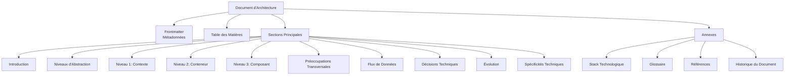

## Triade Documentaire et Relations

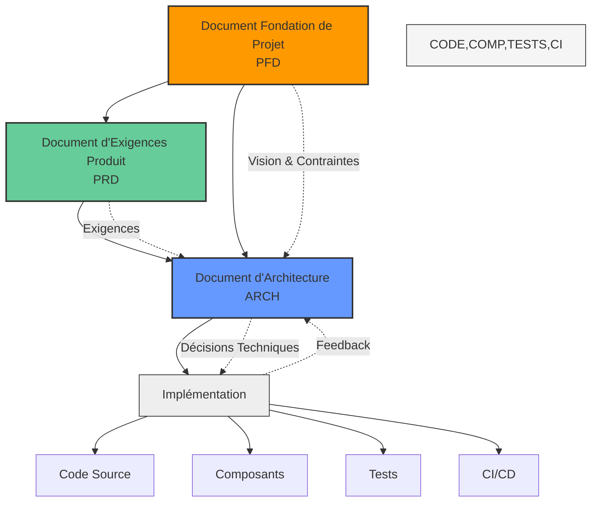

## Approche C4 pour la Documentation d'Architecture

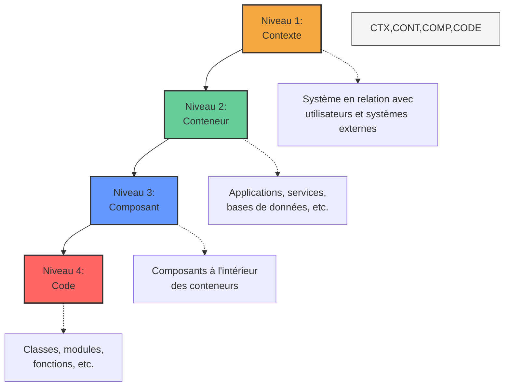

## Exemple de Diagramme de Contexte (Niveau 1)

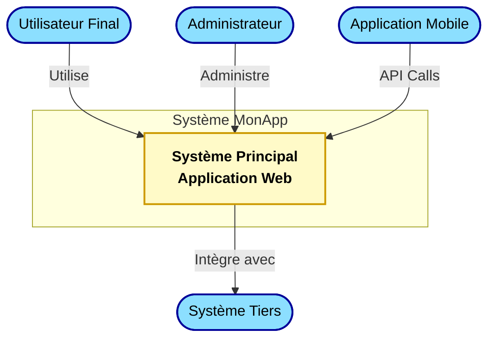

## Exemple de Diagramme de Conteneur (Niveau 2)

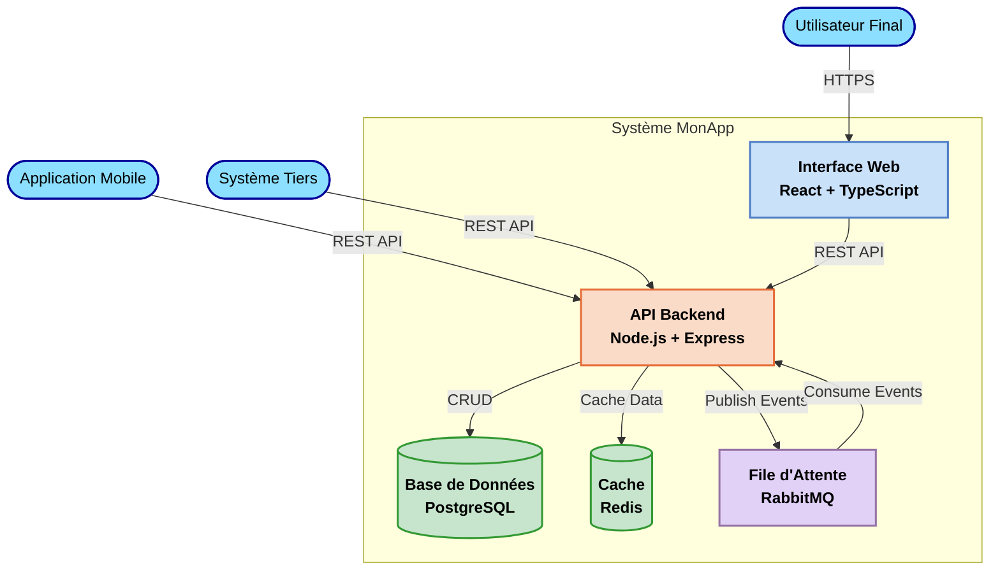

## Exemple de Diagramme de Composant (Niveau 3)

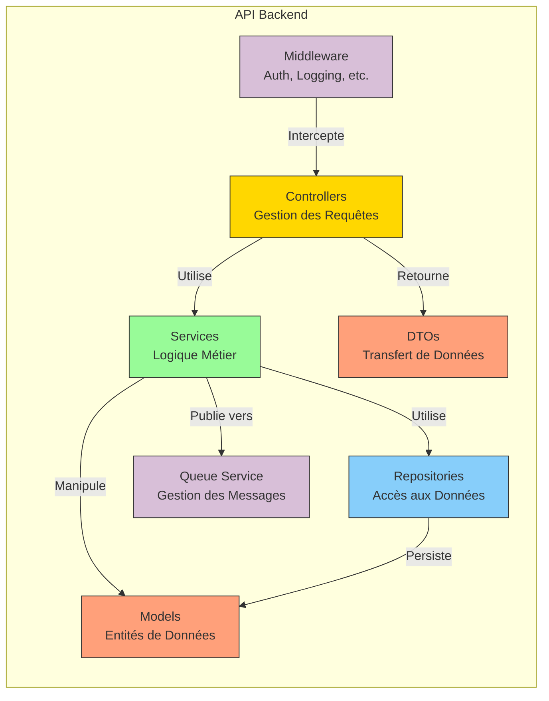

## Exemple de Diagramme de Séquence pour un Flux de Données

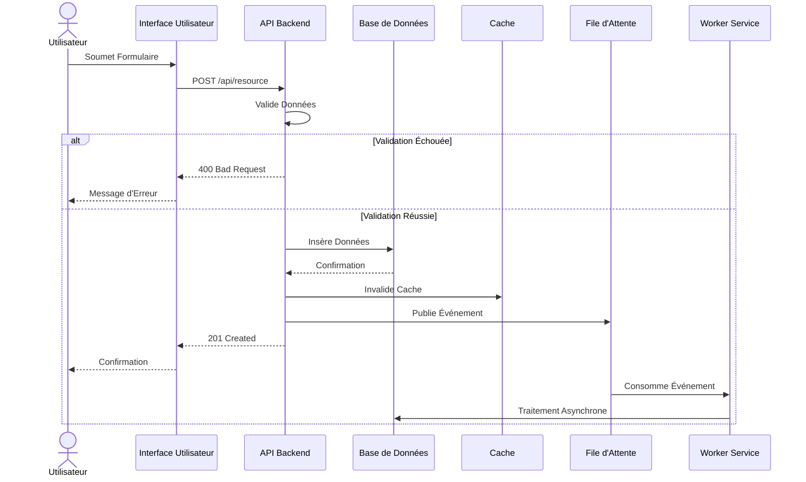

## Architecture à 3 Niveaux (3-Tier)

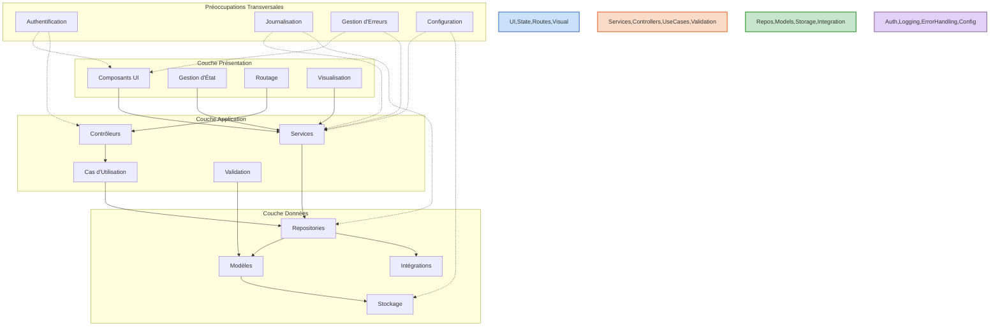

## Architecture Clean

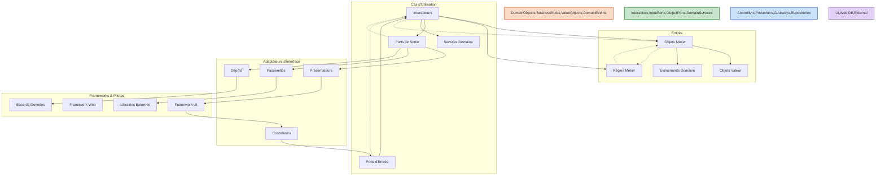

## Architecture Microservices

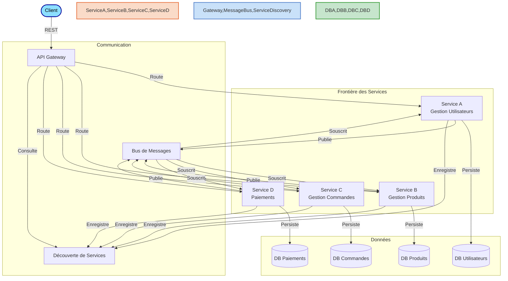

## Préoccupations Transversales

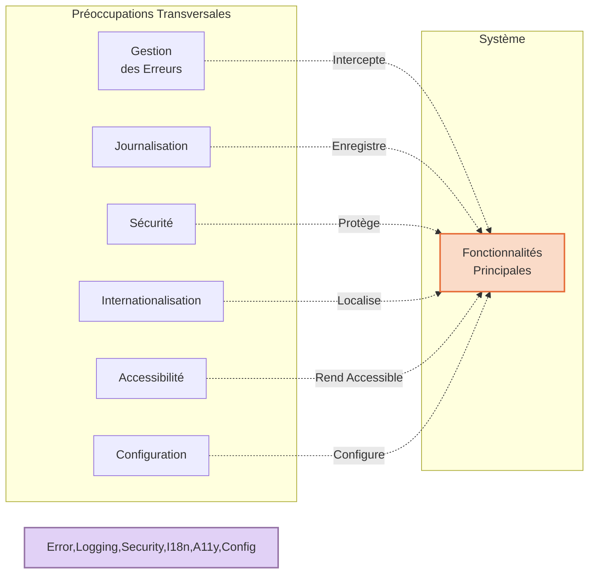

## Dette Technique et Évolution

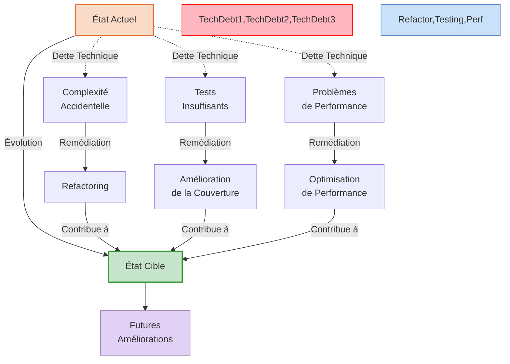

## Considérations de Performance

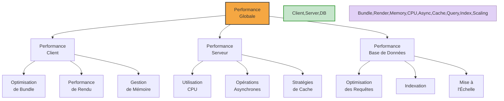

## Architecture de Sécurité

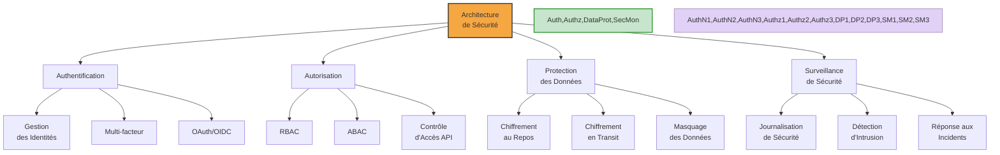

## Processus de Création du Document d'Architecture

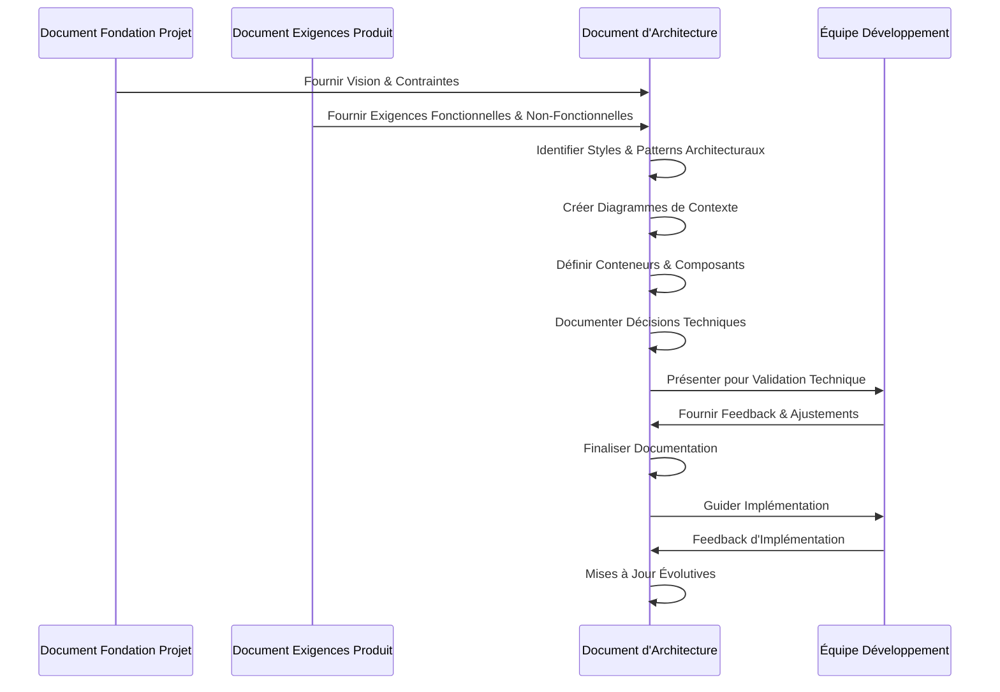

## Conseils pour un Document d'Architecture Efficace

1. **Commencez par comprendre le contexte** - Familiarisez-vous avec le PFD et le PRD avant de concevoir l'architecture
2. **Adoptez l'approche multi-niveaux** - Utilisez l'approche C4 pour une présentation progressive des détails
3. **Privilégiez la visualisation** - Un bon diagramme vaut mieux que de longues explications textuelles
4. **Documentez les décisions** - Expliquez le "pourquoi" derrière chaque choix architectural important
5. **Équilibrez largeur et profondeur** - Couvrez l'ensemble du système tout en détaillant les composants critiques
6. **Restez aligné avec les exigences** - Chaque choix architectural doit répondre à une ou plusieurs exigences
7. **Identifiez les compromis** - Reconnaissez les forces et faiblesses de vos choix architecturaux
8. **Pensez à l'évolution** - Documentez comment l'architecture évoluera pour répondre aux besoins futurs
9. **Adressez les préoccupations transversales** - N'oubliez pas la sécurité, la performance, l'accessibilité, etc.
10. **Utilisez une terminologie cohérente** - Maintenez un glossaire pour assurer une compréhension commune
11. **Documentez les API et interfaces** - Les points d'intégration sont critiques pour comprendre le système
12. **Intégrez des exemples concrets** - Illustrez les patterns abstraits avec des exemples spécifiques
13. **Validez avec l'équipe** - Impliquez les développeurs pour assurer la faisabilité et l'acceptation
14. **Maintenez le document** - L'architecture évolue, assurez-vous que la documentation reste à jour
15. **Représentez les flux de données** - Montrez comment l'information circule à travers le système
16. **Documentez les dépendances externes** - Clarifiez les interactions avec les systèmes tiers

---

## Guide de Référence Rapide - Sections d'Architecture

### 1. Introduction

- **Purpose**: Objectifs et audience du document
- **Scope**: Limites et composants inclus
- **Alignment**: Relation avec le PFD et le PRD

### 2. Niveaux d'Abstraction

- **Approche**: Modèle C4 ou similaire
- **Rationale**: Divulgation progressive des détails
- **Structure**: Vue d'ensemble des sections

### 3. Niveau 1: Contexte

- **System Context**: Système en relation avec les utilisateurs et systèmes externes
- **Actors**: Utilisateurs primaires et secondaires
- **External Systems**: Intégrations et dépendances
- **Data Flows**: Échanges de haut niveau

### 4. Niveau 2: Conteneur

- **Containers**: Applications, services, bases de données
- **Technologies**: Choix technologiques par conteneur
- **Interfaces**: Points d'interaction entre conteneurs
- **Dependencies**: Relations et direction des dépendances

### 5. Niveau 3: Composant

- **Components**: Classes, modules, fonctions clés
- **Interfaces**: API publiques et contrats
- **Data Structures**: Entités et objets principaux
- **Design Patterns**: Patterns architecturaux utilisés

### 6. Préoccupations Transversales

- **Error Handling**: Stratégie et patterns
- **Logging**: Approche et niveaux
- **Security**: Authentification, autorisation, protection des données
- **Internationalization**: Support multilingue
- **Accessibility**: Standards d'accessibilité

### 7. Flux de Données

- **Key Scenarios**: Cas d'utilisation principaux
- **Sequence Diagrams**: Interactions étape par étape
- **State Transitions**: Changements d'état clés
- **Error Paths**: Gestion des exceptions

### 8-10. [Suite des sections...]

### 11. Annexes

- **Technology Stack**: Versions détaillées
- **Glossary**: Terminologie et définitions
- **References**: Standards et inspiration
- **History**: Log des modifications

---

Ce guide visuel peut être utilisé avec la documentation principale pour faciliter la compréhension et l'application de la règle `@5003-workflow-architecture-document.mdc`.
