# Modern Agile Workflow Documentation

## Table of Contents

1. [Introduction](#introduction)
2. [Purpose and Scope](#purpose-and-scope)
3. [Rule Structure](#rule-structure)
4. [Core Principles](#core-principles)
5. [Workflow Phases](#workflow-phases)
   - [Inception Phase](#inception-phase)
   - [Planning Phase](#planning-phase)
   - [Execution Phase](#execution-phase)
   - [Review Phase](#review-phase)
   - [Reflection Phase](#reflection-phase)
6. [Transitions and Hooks](#transitions-and-hooks)
7. [Directory Structure](#directory-structure)
8. [Critical Requirements](#critical-requirements)
9. [Implementation Guidelines](#implementation-guidelines)
10. [Examples](#examples)
11. [Integration with Other Rules](#integration-with-other-rules)
12. [FAQ](#faq)

---

## Introduction

The Modern Agile Workflow rule (`5020-workflow-agile-modern.mdc`) establishes a comprehensive framework for structuring and executing agile development processes. Using semantic compression techniques, it encodes a complete set of practices, workflows, and guidelines that ensure consistent, high-quality delivery of software projects.

This rule represents an evolution of traditional agile methodologies, emphasizing documentation, test-driven development, and continuous improvement while maintaining the agility and adaptability that are central to modern software development.

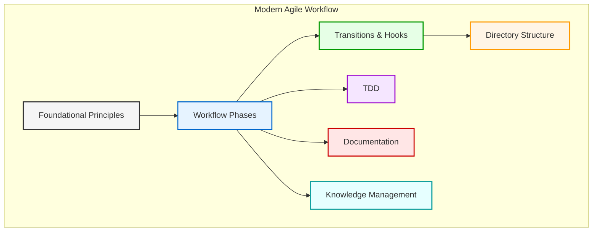

## Purpose and Scope

**Purpose**: To provide a structured, reproducible approach to agile software development that balances rigor and flexibility while emphasizing quality, documentation, and continuous improvement.

**When to Apply**: This rule should be implemented when developing any software project that requires a structured approach to planning, execution, and delivery.

**Benefits**:

- Ensures comprehensive planning and documentation
- Establishes clear approval gates and transitions
- Promotes test-driven development practices
- Creates a standardized repository of project knowledge
- Facilitates continuous improvement through structured reflection
- Maintains traceability from requirements to implementation

## Rule Structure

The Modern Agile Workflow rule uses semantic compression techniques to encode complex information in a concise, structured format. Understanding the notation used in the rule is essential to applying it correctly:

**Core Notation Elements**:

- `↹` (Focus): Indicates main tasks or components
- `⊕` (Combine): Indicates a task or component definition
- `Σ` (Summarize): Indicates a summarization of the preceding section
- `=>` (Results in): Shows the outcome or purpose of a component
- `->` (Sequence): Indicates ordered operations or transitions
- `{...}` (Grouping): Groups related elements
- `[p=n]` (Priority): Sets the importance level (1 is highest)

**Special Symbols**:

- `Ω` (Omega): Used for foundation and project establishment
- `Φ` (Phi): Used for design and architecture components
- `Ψ` (Psi): Used for implementation and execution components

The rule is organized into distinct phases, each containing specialized components and protocols that govern specific aspects of the development process.

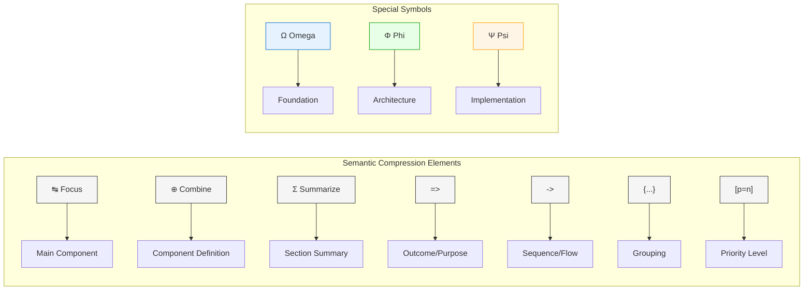

## Core Principles

The Modern Agile Workflow is built upon eight foundational principles that guide all development activities:

1. **Iterate Incrementally**: Deliver value in small, frequent increments rather than attempting large, monolithic deliveries.
2. **Document Thoroughly**: Maintain comprehensive documentation to preserve knowledge and context throughout the project lifecycle.
3. **Test-Driven Development**: Write tests before implementing features to ensure quality and correctness from the start.
4. **User-Centered**: Focus on delivering value to users and meeting their needs rather than just implementing features.
5. **Adapt Rapidly**: Respond quickly to changing requirements and new information, adjusting course as needed.
6. **Collaborate Effectively**: Foster communication and cooperation between team members and stakeholders.
7. **Technical Excellence**: Maintain high standards of code quality and architectural integrity.
8. **Simplicity Essential**: Focus on the simplest solution that meets requirements, avoiding unnecessary complexity.

These principles should be applied consistently throughout all phases of the workflow.

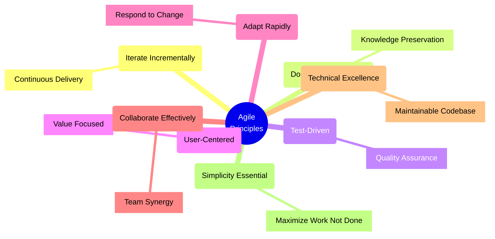

## Workflow Phases

The Modern Agile Workflow is structured into five distinct phases, each with specific activities, deliverables, and success criteria.

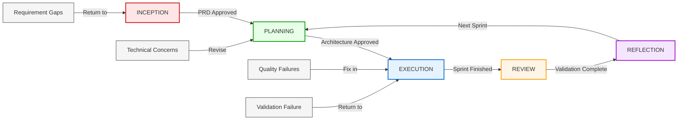

### Inception Phase

The Inception phase focuses on establishing a solid foundation for the project by defining its scope, objectives, and requirements.

**Key Components**:

1. **Project Foundation** (`Ω.project•foundation`):

   - Verify if a Product Requirements Document (PRD) exists at `.ai/prd.md`
   - Create a comprehensive PRD if none exists
   - Refine the document collaboratively with stakeholders
   - Ensure completeness of all required elements
   - Obtain formal approval before proceeding

2. **PRD Components** (`prd•components`):
   - Objective statement that defines the problem, solution, and value
   - Detailed functional and non-functional requirements
   - User stories following the persona-need-benefit format
   - Technical constraints including platforms, integrations, and limitations
   - Success criteria and measurable outcomes
   - Risk assessment identifying known unknowns
   - Timeline with clear milestones

**Exit Criteria**: The Inception phase is complete when a comprehensive PRD has been approved by all stakeholders.

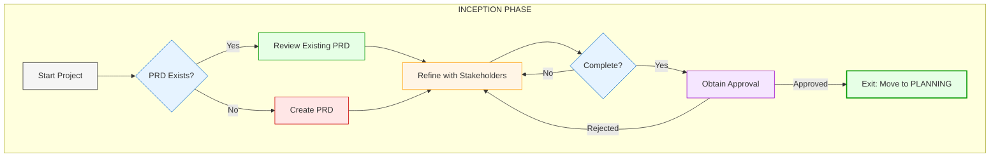

### Planning Phase

The Planning phase transforms requirements into a structured technical solution and work breakdown.

**Key Components**:

1. **Architecture Design** (`Φ.architecture•design`):

   - Create an architecture document at `.ai/arch.md`
   - Define high-level components and system structure
   - Specify component interactions and data flows
   - Include visual diagrams (preferably using Mermaid)
   - Identify reusable patterns and solutions
   - Document technical decisions with rationales
   - Obtain approval on the architectural approach

2. **Backlog Creation** (`backlog•creation`):
   - Establish an epic structure in the `.ai/epic-{n}/` directory
   - Decompose requirements into user stories
   - Prioritize stories based on business value and technical risk
   - Estimate complexity using relative sizing
   - Define testable acceptance criteria
   - Sequence stories based on dependencies

**Exit Criteria**: The Planning phase is complete when the architecture has been documented and approved, and an initial backlog of prioritized stories has been created.

```mermaid
flowchart TB
    subgraph "PLANNING PHASE"
        A[PRD Approved] --> B[Create Architecture Document]
        B --> C[Define Components & Structure]
        C --> D[Document Interactions & Flows]
        D --> E[Include Visual Diagrams]
        E --> F[Document Technical Decisions]
        F --> G[Obtain Architecture Approval]

        G -->|Approved| H[Create Epic Structure]
        H --> I[Decompose into Stories]
        I --> J[Prioritize Stories]
        J --> K[Estimate Complexity]
        K --> L[Define Acceptance Criteria]
        L --> M[Sequence Dependencies]
        M --> N[Exit: Move to EXECUTION]

        G -->|Rejected| O[Revise Architecture]
        O --> F
    end

    style A fill:#e6ffe6,stroke:#009900,stroke-width:2px
    style B fill:#f5f5f5,stroke:#333,stroke-width:1px
    style G fill:#e6f3ff,stroke:#0066cc,stroke-width:1px
    style N fill:#e6f3ff,stroke:#0066cc,stroke-width:2px
    style O fill:#ffe6e6,stroke:#cc0000,stroke-width:1px
```

### Execution Phase

The Execution phase is where the actual development work takes place, following a test-driven approach.

**Key Components**:

1. **Development Cycle** (`Ψ.development•cycle`):

   - Create a story file with a standardized format
   - Initialize a git branch for the feature
   - Implement using test-driven development (TDD)
     - Write failing tests that define the expected behavior
     - Implement the solution to make tests pass
     - Refactor to improve design while maintaining test passage
   - Update progress in the story file
   - Conduct code reviews
   - Integrate code frequently to minimize merge conflicts

2. **Story Template** (`story•template`):

   - Metadata section with ID, title, status, priority, and complexity
   - Details section with description, acceptance criteria, tasks, and dependencies
   - Progress section tracking completed tasks, blockers, notes, and time

3. **Quality Gates** (`quality•gates`):
   - Maintain minimum 80% test coverage
   - Meet code quality standards enforced by linters
   - Meet performance thresholds for response times
   - Pass security compliance and vulnerability scans
   - Keep documentation updated

**Exit Criteria**: The Execution phase for a story is complete when all tasks are done, tests pass, quality gates are met, and the code has been reviewed and merged.

```mermaid
flowchart TB
    subgraph "EXECUTION PHASE"
        A[Architecture Approved] --> B[Create Story File]
        B --> C[Initialize Git Branch]

        subgraph "TDD Cycle"
            D[Write Failing Test] --> E[Implement Solution]
            E --> F[Tests Pass?]
            F -->|No| E
            F -->|Yes| G[Refactor Code]
            G --> H[Tests Still Pass?]
            H -->|No| G
            H -->|Yes| I[Next Feature/Test]
            I --> D
        end

        C --> D
        I --> J[Update Progress]
        J --> K[Code Review]
        K --> L{Review Passed?}
        L -->|No| M[Address Feedback]
        M --> K
        L -->|Yes| N[Merge Code]
        N --> O[Quality Gates Check]
        O --> P{All Gates Passed?}
        P -->|No| Q[Fix Issues]
        Q --> O
        P -->|Yes| R[Story Complete]
        R --> S[Exit: Move to REVIEW]
    end

    style A fill:#e6ffe6,stroke:#009900,stroke-width:2px
    style D fill:#ffe6e6,stroke:#cc0000,stroke-width:1px
    style E fill:#fff5e6,stroke:#ff9900,stroke-width:1px
    style F fill:#e6f3ff,stroke:#0066cc,stroke-width:1px
    style G fill:#e6ffe6,stroke:#009900,stroke-width:1px
    style H fill:#e6f3ff,stroke:#0066cc,stroke-width:1px
    style S fill:#f5e6ff,stroke:#9900cc,stroke-width:2px
```

### Review Phase

The Review phase validates the completed work against requirements and collects feedback.

**Key Components**:

1. **Verification Protocol** (`verification•protocol`):

   - Verify that all acceptance criteria have been met
   - Conduct demonstrations with stakeholders
   - Collect feedback for potential improvements
   - Measure implementation against defined metrics
   - Document outcomes and conclusions

2. **Sprint Review** (`sprint•review`):
   - Create a review document at `.ai/reviews/sprint_{n}.md`
   - Summarize completed work and story statuses
   - Highlight significant achievements
   - Analyze metrics for velocity, quality, and satisfaction
   - Identify learnings from the sprint
   - Plan adjustments for the next sprint

**Exit Criteria**: The Review phase is complete when all completed work has been validated and feedback has been documented.

```mermaid
flowchart TB
    subgraph "REVIEW PHASE"
        A[Sprint Finished] --> B[Verify Acceptance Criteria]
        B --> C{All Criteria Met?}
        C -->|No| D[Return to Execution]
        C -->|Yes| E[Conduct Demo]
        E --> F[Collect Feedback]
        F --> G[Measure Against Metrics]
        G --> H[Document Outcomes]

        H --> I[Create Sprint Review Document]
        I --> J[Summarize Completed Work]
        J --> K[Highlight Achievements]
        K --> L[Analyze Metrics]
        L --> M[Identify Learnings]
        M --> N[Plan Adjustments]
        N --> O[Exit: Move to REFLECTION]
    end

    style A fill:#e6f3ff,stroke:#0066cc,stroke-width:2px
    style C fill:#e6f3ff,stroke:#0066cc,stroke-width:1px
    style D fill:#ffe6e6,stroke:#cc0000,stroke-width:1px
    style O fill:#f5e6ff,stroke:#9900cc,stroke-width:2px
```

### Reflection Phase

The Reflection phase focuses on learning from experiences and improving processes.

**Key Components**:

1. **Continuous Improvement** (`continuous•improvement`):

   - Conduct retrospectives and document at `.ai/retros/retro_{n}.md`
   - Analyze process efficiency to identify bottlenecks
   - Identify patterns in recurring challenges
   - Extract best practices that can be replicated
   - Implement actionable improvements
   - Update documentation with new knowledge

2. **Knowledge Management** (`knowledge•management`):
   - Update architecture documents to reflect implementation realities
   - Document decisions with context and reasoning
   - Maintain a technical debt log for planned refactoring
   - Capture lessons learned to avoid repeating mistakes
   - Share knowledge among team members

**Exit Criteria**: The Reflection phase is complete when retrospectives have been conducted, improvements identified, and documentation updated.


## Transitions and Hooks

### Transition Logic

The Modern Agile Workflow defines clear transitions between phases, with explicit conditions that must be met:

1. **Standard Transitions**:

   - INCEPTION → PLANNING: When PRD is approved
   - PLANNING → EXECUTION: When architecture is approved
   - EXECUTION → REVIEW: When sprint is finished
   - REVIEW → REFLECTION: After validation
   - REFLECTION → PLANNING: For the next sprint cycle

2. **Exception Handling**:
   - Return to INCEPTION: When requirement gaps are identified
   - Revise PLANNING: When technical concerns arise
   - Fix in EXECUTION: When quality failures occur
   - Return to EXECUTION: When validation fails

### Process Automation Hooks

The workflow defines triggers that activate specific processes:

1. **Project Lifecycle Hooks**:

   - `on_project_start`: Triggers project foundation setup and directory verification
   - `on_prd_approval`: Initiates architecture design and backlog creation
   - `on_architecture_approval`: Starts sprint planning and first story creation
   - `on_sprint_complete`: Triggers review and improvement processes

2. **Story Lifecycle Hooks**:

   - `on_story_start`: Initiates development cycle and status updates
   - `on_story_complete`: Triggers verification and backlog updates
   - `on_blockers_identified`: Documents issues and prioritizes resolution

3. **Change Management Hooks**:
   - `on_requirements_change`: Updates PRD and assesses impact
   - `on_technical_debt_threshold`: Schedules refactoring sprints

These hooks ensure that appropriate actions are taken at the right time, maintaining the integrity of the workflow.

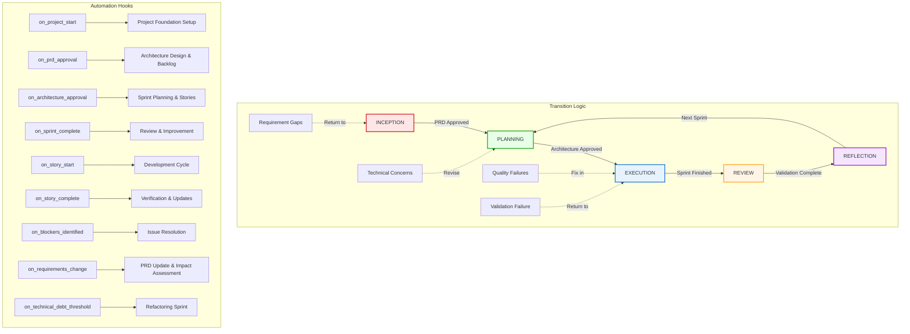

## Directory Structure

The Modern Agile Workflow requires a standardized directory structure in the `.ai` folder to maintain all project documentation and artifacts:

```
.ai/
├── prd.md                             # Product Requirements Document
├── arch.md                            # Architecture Document
├── epic-1/                            # Epic 1 folder
│   ├── 1-user-authentication.story.md # Story 1-1
│   ├── 2-user-profile.story.md        # Story 1-2
│   └── ...
├── epic-2/                            # Epic 2 folder
│   └── ...
├── reviews/                           # Sprint reviews
│   ├── sprint_1.md
│   └── ...
├── retros/                            # Retrospectives
│   ├── retro_1.md
│   └── ...
├── decisions/                         # Decision records
│   └── ...
└── patterns/                          # Reusable patterns
    └── ...
```

This structure ensures that all project knowledge is organized consistently and can be easily located and referenced throughout the project lifecycle.

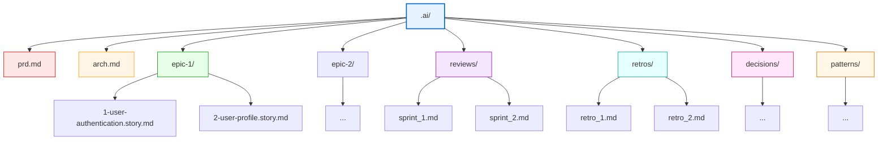

## Critical Requirements

The Modern Agile Workflow defines several non-negotiable requirements that must be followed:

1. **Never skip documentation**: All required documentation must be created and maintained to preserve context and knowledge.

2. **Always test first**: Follow test-driven development practices to ensure quality from the start.

3. **Maintain .ai directory**: Keep all project artifacts in the designated directory structure.

4. **Obtain explicit approval**: Get formal approval at defined checkpoints before proceeding.

5. **Update progress continuously**: Keep story status and tracking information current.

6. **Integrate frequently**: Merge code often to reduce integration problems.

7. **Communicate blockers immediately**: Don't wait to report issues that might impact progress.

8. **Respect definition of done**: Ensure all quality criteria are met before considering work complete.

Failing to adhere to these requirements compromises the integrity of the workflow and may lead to quality, communication, or delivery issues.

```mermaid
graph TB
    subgraph "Critical Requirements"
        A[Never Skip Documentation] --- B[Always Test First]
        B --- C[Maintain .ai Directory]
        C --- D[Obtain Explicit Approval]
        D --- E[Update Progress Continuously]
        E --- F[Integrate Frequently]
        F --- G[Communicate Blockers Immediately]
        G --- H[Respect Definition of Done]
        H --- A
    end

    style A fill:#ffe6e6,stroke:#cc0000,stroke-width:1px
    style B fill:#e6ffe6,stroke:#009900,stroke-width:1px
    style C fill:#e6f3ff,stroke:#0066cc,stroke-width:1px
    style D fill:#fff5e6,stroke:#ff9900,stroke-width:1px
    style E fill:#f5e6ff,stroke:#9900cc,stroke-width:1px
    style F fill:#e6ffff,stroke:#009999,stroke-width:1px
    style G fill:#ffe6f9,stroke:#cc0066,stroke-width:1px
    style H fill:#fff8e6,stroke:#cc6600,stroke-width:1px
```

## Implementation Guidelines

The Modern Agile Workflow includes specific implementation patterns to guide development activities:

1. **Minimal Viable**: Start with the simplest solution that satisfies requirements.

2. **Progressive Enhancement**: Build on a working base, adding capabilities incrementally.

3. **Continuous Refactoring**: Improve code design and structure as you go.

4. **Defensive Coding**: Validate inputs and handle errors appropriately.

5. **Component Isolation**: Minimize dependencies between components for better maintainability.

6. **Code Readability**: Write self-documenting code when possible, with clear naming and structure.

These guidelines should be applied during the Execution phase to ensure high-quality, maintainable code.

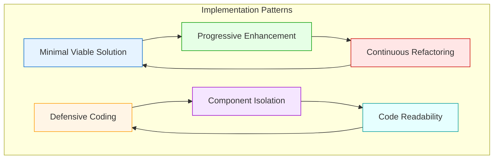

## Examples

### Proper Implementation Example

```
At project start:
- "I see we're starting a new project. Let me check if we have a PRD in place."
- "I don't see a PRD. Let's develop a comprehensive PRD that captures all project requirements."
- "Here's a draft PRD following our template. Let's review and refine it together."

After PRD approval:
- "Now that the PRD is approved, I'll create an architecture document with component diagrams and technical decisions."
- "With the architecture approved, I'll organize our work into epics and user stories."

During development:
- "I've created the story file `.ai/epic-1/1-user-authentication.story.md` with all required details."
- "Let's start with tests for the authentication flow before implementing the actual code."
- "The login functionality is now complete with 92% test coverage. I've updated the story status."

At sprint completion:
- "Let's review what we completed this sprint and document it in `.ai/reviews/sprint_1.md`"
- "What went well and what could we improve for our next sprint?"
- "Based on our learnings, here's the proposed plan for the next sprint."
```

### Problematic Implementation Example

```
Starting without foundation:
- "Let me start implementing the login screen right away."
- "We can document later when we have more time."

No testing approach:
- "Let's build everything first and then write some tests at the end."
- "We'll check if it works by trying it manually."

Poor progress tracking:
- "I'm working on multiple features simultaneously."
- "It's mostly done, just a few things left."

No reflection or improvement:
- "Let's just move on to the next features."
- "We always have issues with estimation, that's just how it is."
```

## Integration with Other Rules

The Modern Agile Workflow rule integrates with and complements several other rules:

1. **5000-workflow-foundation-document-pfd**: Provides foundational guidelines for project documentation that align with the documentation requirements in the Modern Agile Workflow.

2. **5001-workflow-claude-implementation**: Offers a structured approach to processing complex tasks that can be applied during the implementation of agile workflow activities.

3. **5002-workflow-product-requirements-document**: Provides detailed guidance for PRD creation that supports the Inception phase requirements.

4. **5003-workflow-architecture-document**: Offers comprehensive architecture documentation guidelines that support the Planning phase requirements.

When implementing the Modern Agile Workflow, these related rules should be consulted for more detailed guidance on specific components and deliverables.

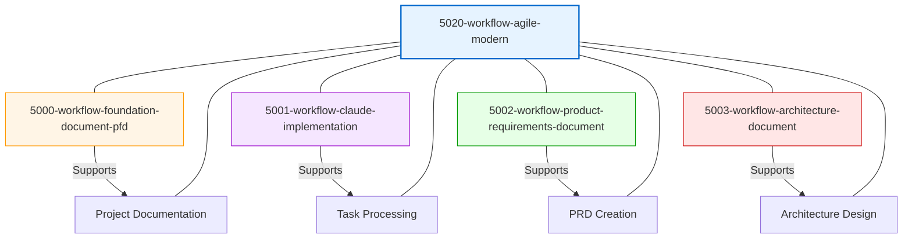

## FAQ

### Q: Must every project strictly follow all phases in sequence?

A: While the general sequence should be followed, the workflow allows for adaptability. The transition logic includes provisions for returning to earlier phases when necessary. The key requirement is to meet the exit criteria for each phase before formally transitioning to the next.

### Q: How strictly should we adhere to the 80% test coverage requirement?

A: The 80% test coverage is a minimum requirement, not a target. Critical components may require higher coverage. The focus should be on meaningful tests that verify important behavior, not just achieving a number.

### Q: Can we modify the .ai directory structure to fit our project's specific needs?

A: The core structure should be maintained for consistency, but additional directories or files can be added as needed. If structural changes are required, they should be documented in the architecture document.

### Q: What if our project is small and doesn't seem to warrant full documentation?

A: Even small projects benefit from clear requirements, architecture, and tracking. The level of detail may be adjusted based on project size and complexity, but the basic structure should be maintained. This ensures consistent practices and makes it easier to scale if the project grows.

### Q: How do we handle urgent hotfixes within this workflow?

A: Urgent fixes should still follow a streamlined version of the workflow. Create a minimal story, implement with tests, review, and document. The reflection phase is particularly important for hotfixes to understand and prevent similar issues in the future.

### Q: Can this workflow be used for non-software projects?

A: The core principles and phases can be adapted for other types of projects, but the specific implementation details (like TDD and git practices) are software-focused. The documentation structure and approval gates translate well to many project types.

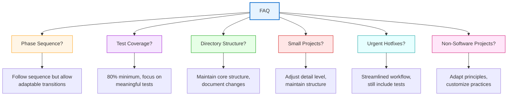
