# Guide Visuel - Epic & Story Management

Ce guide visuel est un complément à la documentation principale de la règle `@5905-epic-story-management.mdc`. Il vise à fournir une représentation visuelle des structures, relations et processus pour créer et gérer des Epics et Stories de manière efficace.

## Structure Hiérarchique

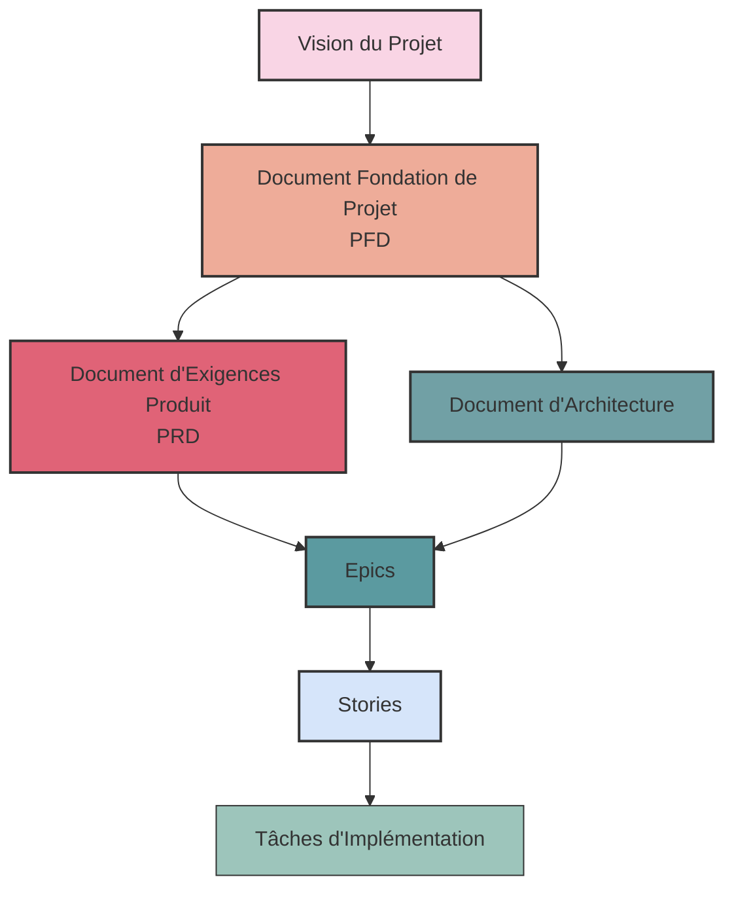

## Relation Documents-Epics-Stories

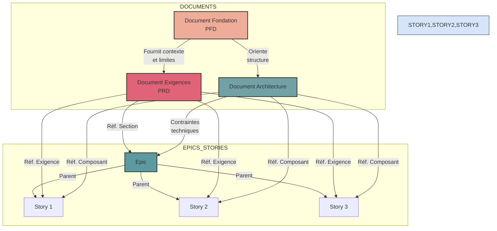

## Organisation des Fichiers

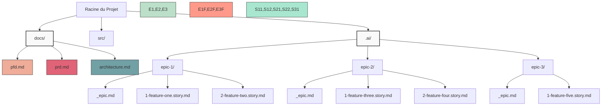

## Anatomie d'un Epic

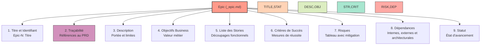

## Anatomie d'une Story

```mermaid
graph TD
    STORY["Story (m-code.story.md)"] --> TITLE[1. Titre et Références\nLien vers Epic parent]
    STORY --> TRACE[2. Traçabilité\nRéférences PRD et Architecture]
    STORY --> DESC[3. Description\nFormat User Story]
    STORY --> STAT[4. Statut\nÉtat d'avancement]
    STORY --> CTX[5. Contexte\nRelation avec Epic]
    STORY --> ARCH[6. Considérations Architecturales\nContraintes techniques]
    STORY --> EST[7. Estimation\nPoints de complexité]
    STORY --> ACC[8. Critères d'Acceptation\nFormat Given-When-Then]
    STORY --> TASK[9. Tâches\nListe hiérarchique]
    STORY --> PRIN[10. Principes\nConseils techniques]
    STORY --> NOTE[11. Notes Techniques\nDétails d'implémentation]
    STORY --> COMM[12. Communication\nHistorique des décisions]

    style STORY fill:#a8e6cf,stroke:#333,stroke-width:2px
    style TITLE,STAT fill:#fdffab,stroke:#333,stroke-width:1px
    style TRACE fill:#d291bc,stroke:#333,stroke-width:1px
    style DESC,CTX fill:#ffcfdf,stroke:#333,stroke-width:1px
    style ARCH fill:#97c1a9,stroke:#333,stroke-width:1px
    style EST,ACC fill:#e0bbe4,stroke:#333,stroke-width:1px
    style TASK,PRIN fill:#957dad,stroke:#333,stroke-width:1px
    style NOTE,COMM fill:#fec8d8,stroke:#333,stroke-width:1px
```

## Format de Description de Story

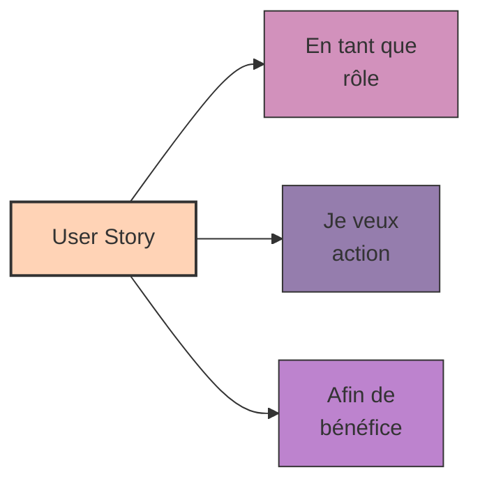

## Cycle de Vie d'une Story

```mermaid
graph LR
    A[Création\nBrouillon] --> B[Refinement\nDétails & Estimation]
    B --> C[Validation\nCritères INVEST]
    C --> D1[Validation PRD\nAlignement exigences]
    D1 --> D2[Validation Architecture\nConformité technique]
    D2 --> E[Approbation\nPrête pour développement]
    E --> F[Implémentation\nEn cours]
    F --> G[Vérification\nCritères d'acceptation]
    G --> H[Complétion\nMise à jour doc]

    style A fill:#ffaaa5,stroke:#333,stroke-width:1px
    style B fill:#ffd3b6,stroke:#333,stroke-width:1px
    style C fill:#dcedc1,stroke:#333,stroke-width:1px
    style D1 fill:#e06377,stroke:#333,stroke-width:1px
    style D2 fill:#71a0a5,stroke:#333,stroke-width:1px
    style E fill:#a8e6cf,stroke:#333,stroke-width:1px
    style F fill:#a8e6cf,stroke:#333,stroke-width:1px
    style G fill:#dcedc1,stroke:#333,stroke-width:1px
    style H fill:#ffd3b6,stroke:#333,stroke-width:1px
```

## Principes INVEST

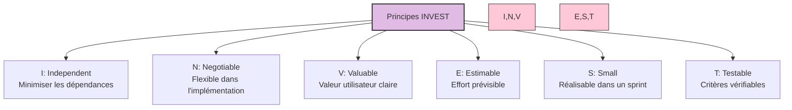

## Déclencheurs pour le Découpage de Stories

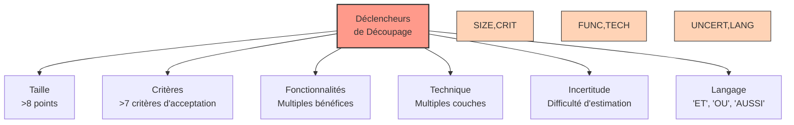

## Technique de Découpage SPIDR

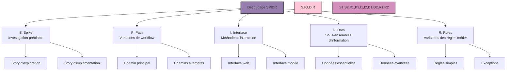

## Découpage par CRUD

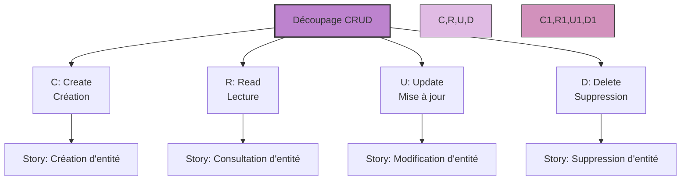

## Workflow de Découpage

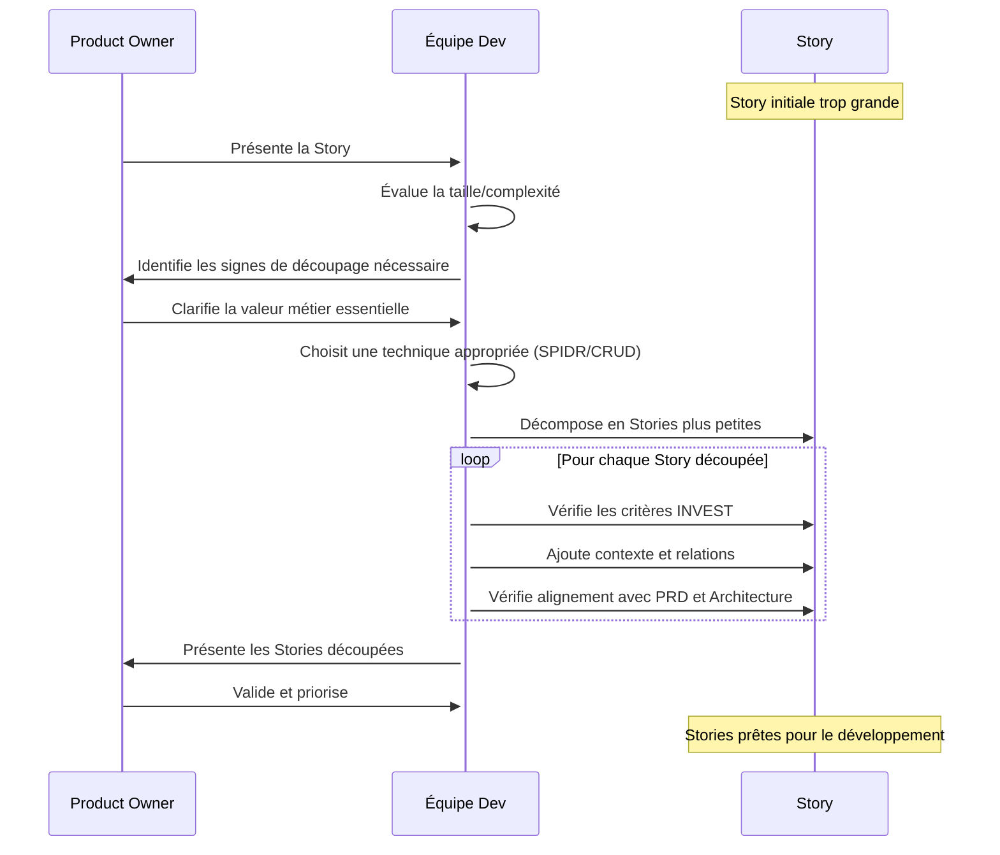

## Processus de Validation Documentaire

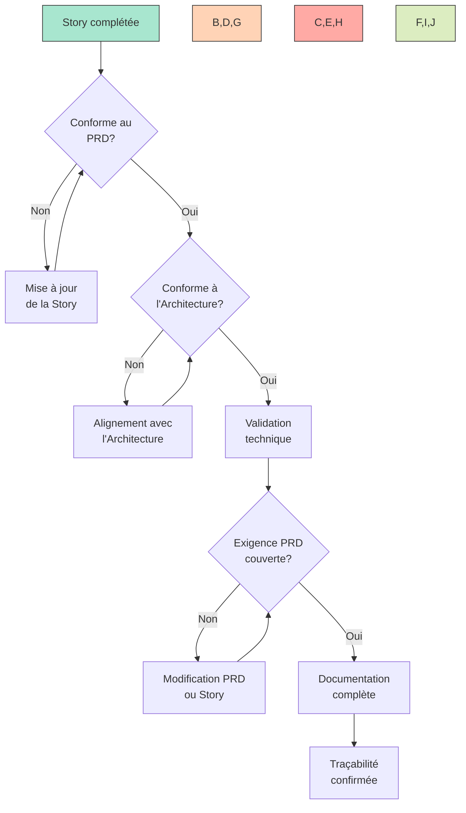

## Processus de Création Complet

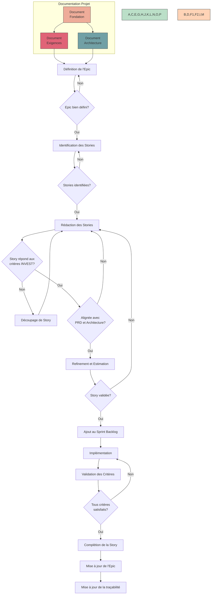

## Anti-Patterns à Éviter

```mermaid
graph TD
    ANTI["Anti-Patterns"] --> A["Stories techniques\nsans valeur utilisateur"]
    ANTI --> B["Découpage horizontal\npar couches techniques"]
    ANTI --> C["Incréments sans\nbénéfice autonome"]
    ANTI --> D["Critères d'acceptation\nambigus"]
    ANTI --> E["Chaînes de dépendances\nséquentielles"]
    ANTI --> F["Estimation arbitraire\nnon consensuelle"]
    ANTI --> G["Statut non mis à jour"]
    ANTI --> H["Stories orphelines\nsans Epic parent"]
    ANTI --> I["Lacunes dans la\ndocumentation"]
    ANTI --> J["Niveau de détail\nincohérent"]
    ANTI --> K["Documentation déconnectée\nabsence de traçabilité"]
    ANTI --> L["Scope creep\najout de fonctionnalités\nnon spécifiées dans le PRD"]

    style ANTI fill:#ff9a8b,stroke:#333,stroke-width:2px
    style A,B,C,D,E,F fill:#ffd3b6,stroke:#333,stroke-width:1px
    style G,H,I,J,K,L fill:#ffd3b6,stroke:#333,stroke-width:1px
```

## Bonnes Pratiques

```mermaid
graph TD
    BEST["Bonnes Pratiques"] --> A["Création collaborative\nImplication de l'équipe"]
    BEST --> B["Priorisation par\nvaleur business"]
    BEST --> C["Suivi des décisions\net communications"]
    BEST --> D["Révision périodique\ndes Epics et Stories"]
    BEST --> E["Exemples concrets\npour les scénarios"]
    BEST --> F["Décomposition technique\npost-validation"]
    BEST --> G["Cohérence verticale\nPFD → PRD → Architecture → Epics → Stories"]
    BEST --> H["Mise à jour\ndes statuts en temps réel"]
    BEST --> I["Cartographie visuelle\ndes relations"]
    BEST --> J["Validation de qualité\npré-développement"]
    BEST --> K["Traçabilité\nbidirectionnelle"]
    BEST --> L["Analyse d'impact\nlors des modifications"]

    style BEST fill:#a8e6cf,stroke:#333,stroke-width:2px
    style A,B,C,D,E,F fill:#dcedc1,stroke:#333,stroke-width:1px
    style G,H,I,J,K,L fill:#dcedc1,stroke:#333,stroke-width:1px
```

## Exemple de Découpage d'une Story Trop Grande

### Avant: Story Monolithique

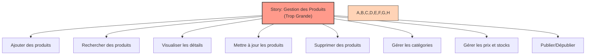

### Après: Stories Découpées

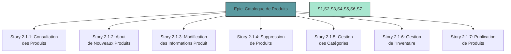

## Story Map Visuelle avec Traçabilité

```mermaid
graph TD
    classDef document fill:#eeac99,stroke:#333,stroke-width:2px
    classDef prd fill:#e06377,stroke:#333,stroke-width:2px
    classDef arch fill:#71a0a5,stroke:#333,stroke-width:2px
    classDef epic fill:#5b9aa0,stroke:#333,stroke-width:2px
    classDef story fill:#a8e6cf,stroke:#333,stroke-width:1px
    classDef backbone fill:#ffaaa5,stroke:#333,stroke-width:2px,stroke-dasharray:5 5
    classDef walking fill:#ffd3b6,stroke:#333,stroke-width:2px,stroke-dasharray:5 5

    %% Documents
    PRD["PRD: Exigences Produit"]:::prd
    ARCH["Architecture: Structure Technique"]:::arch

    %% Backbone - Parcours Utilisateur
    Journey["PARCOURS UTILISATEUR"]:::backbone

    %% Activités utilisateur
    A1["Authentification"]:::walking
    A2["Exploration Catalogue"]:::walking
    A3["Commande"]:::walking

    %% Epics
    E1["Epic 1: Authentification"]:::epic
    E2["Epic 2: Catalogue Produits"]:::epic
    E3["Epic 3: Panier & Commande"]:::epic

    %% Stories - Première ligne
    S11["S1.1: Inscription"]:::story
    S12["S1.2: Connexion"]:::story
    S13["S1.3: Récupération MDP"]:::story
    S21["S2.1: Consultation"]:::story
    S22["S2.2: Recherche"]:::story
    S23["S2.3: Filtrage"]:::story
    S31["S3.1: Ajout Panier"]:::story
    S32["S3.2: Gestion Panier"]:::story

    %% Stories - Deuxième ligne
    S14["S1.4: Profil Utilisateur"]:::story
    S24["S2.4: Détails Produit"]:::story
    S33["S3.3: Processus Commande"]:::story
    S34["S3.4: Confirmation"]:::story

    %% Hiérarchie du parcours utilisateur
    Journey --> A1
    Journey --> A2
    Journey --> A3

    %% Relations Activités-Epics
    A1 --> E1
    A2 --> E2
    A3 --> E3

    %% Relations Epics-Stories (première ligne)
    E1 --> S11
    E1 --> S12
    E1 --> S13
    E2 --> S21
    E2 --> S22
    E2 --> S23
    E3 --> S31
    E3 --> S32

    %% Relations Epics-Stories (deuxième ligne)
    E1 -.-> S14
    E2 -.-> S24
    E3 -.-> S33
    E3 -.-> S34

    %% Traçabilité PRD
    PRD -- "REQ-1" --> E1
    PRD -- "REQ-2" --> E2
    PRD -- "REQ-3" --> E3

    PRD -. "REQ-1.1" .-> S11
    PRD -. "REQ-1.2" .-> S12
    PRD -. "REQ-1.3" .-> S13
    PRD -. "REQ-1.4" .-> S14

    PRD -. "REQ-2.1" .-> S21
    PRD -. "REQ-2.2" .-> S22
    PRD -. "REQ-2.3" .-> S23
    PRD -. "REQ-2.4" .-> S24

    PRD -. "REQ-3.1" .-> S31
    PRD -. "REQ-3.2" .-> S32
    PRD -. "REQ-3.3" .-> S33
    PRD -. "REQ-3.4" .-> S34

    %% Traçabilité Architecture
    ARCH -- "Auth" --> E1
    ARCH -- "Catalog" --> E2
    ARCH -- "Order" --> E3

    %% Structure verticale pour aligner visuellement
    subgraph PREMIERE_LIGNE["Priorité Haute"]
        S11
        S12
        S13
        S21
        S22
        S23
        S31
        S32
    end

    subgraph DEUXIEME_LIGNE["Priorité Moyenne"]
        S14
        S24
        S33
        S34
    end
```

### Explications de la Story Map

La **Story Map** ci-dessus est organisée selon les principes de Jeff Patton, avec :

1. **Parcours Utilisateur** : En haut, représentant le flux global d'utilisation du système
2. **Activités Principales** : Regroupées par domaine fonctionnel (Authentification, Catalogue, Commande)
3. **Epics** : Alignés sous les activités qu'ils soutiennent
4. **Stories** : Organisées horizontalement par fonctionnalité et verticalement par priorité

Les lignes pointillées montrent la **traçabilité** avec :

- Le PRD (Document d'Exigences) : Référence aux exigences spécifiques
- L'Architecture : Composants techniques concernés

Cette organisation permet de visualiser simultanément :

- L'expérience utilisateur de haut niveau
- La décomposition en fonctionnalités implémentables
- La priorité relative des stories (horizontalement)
- Les liens avec la documentation technique et fonctionnelle

## Intégration avec le Workflow Agile

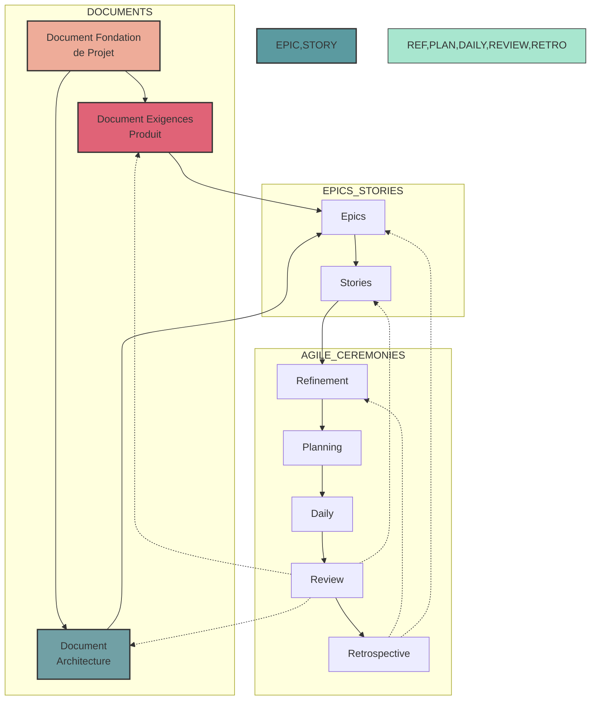

## Relation entre Criterès d'Acceptation et Tests

```mermaid
graph TD
    PRD["Exigence PRD"] --> CA["Critères d'Acceptation"]
    CA --> CA1["1. Étant donné...\nquand...\nalors..."]
    CA --> CA2["2. Étant donné...\nquand...\nalors..."]
    CA --> CA3["3. Étant donné...\nquand...\nalors..."]

    CA1 --> T1["Test Automatisé 1"]
    CA2 --> T2["Test Automatisé 2"]
    CA3 --> T3["Test Automatisé 3"]

    T1 --> COV["Couverture\nde Test"]
    T2 --> COV
    T3 --> COV

    PRD -.->|Validation| COV

    style PRD fill:#e06377,stroke:#333,stroke-width:2px
    style CA fill:#e0bbe4,stroke:#333,stroke-width:2px
    style CA1,CA2,CA3 fill:#fec8d8,stroke:#333,stroke-width:1px
    style T1,T2,T3 fill:#c6def1,stroke:#333,stroke-width:1px
    style COV fill:#cbf078,stroke:#333,stroke-width:1px
```

## Conseils pour une Gestion Efficace

1. **Créez des Epics cohérents et ciblés** qui regroupent des fonctionnalités liées avec un objectif commun.

2. **Rédigez des Stories selon le format utilisateur** (En tant que..., je veux..., afin de...) pour maintenir le focus sur la valeur utilisateur.

3. **Appliquez les principes INVEST** à chaque Story pour garantir qu'elle est prête pour le développement.

4. **N'hésitez pas à découper les Stories trop grandes** en utilisant les techniques SPIDR, CRUD ou d'autres méthodes appropriées.

5. **Utilisez des critères d'acceptation clairs et vérifiables** qui peuvent être directement transformés en tests.

6. **Maintenez la traçabilité complète** entre tous les niveaux de documentation (PFD → PRD → Architecture → Epics → Stories → Tâches).

7. **Privilégiez le découpage vertical (par fonctionnalité)** plutôt que horizontal (par couche technique).

8. **Impliquez l'équipe entière** dans la création et le raffinement des Stories pour une compréhension commune.

9. **Documentez les décisions importantes** dans la section Communication de chaque Story.

10. **Vérifiez systématiquement la conformité** avec le PRD et l'Architecture avant de valider une Story.

11. **Mettez à jour les statuts en temps réel** pour refléter l'avancement réel du travail.

12. **Analysez l'impact des modifications** sur l'ensemble de la chaîne documentaire (PRD, Architecture, autres Epics/Stories).

13. **Utilisez un outil de visualisation** pour maintenir une vue d'ensemble des relations entre documents, Epics et Stories.

14. **Assurez une traçabilité bidirectionnelle** entre tous les artefacts pour faciliter les audits et l'analyse d'impact.
