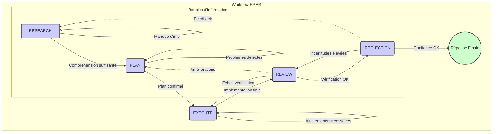
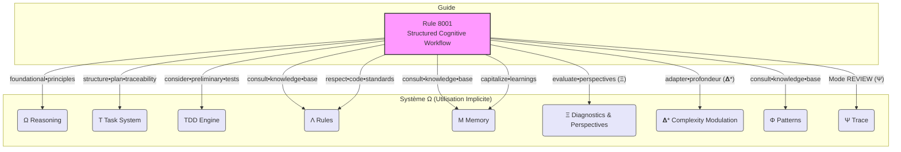

# Documentation : Règle 8001-Workflow-Cognitif-Structure

## Métadonnées

- **Nom de la Règle :** `8001-Structured-Cognitive-Workflow`
- **Description :** APPLIQUER sur demande pour TRAITER les tâches complexes avec un workflow structuré et des techniques de compression.
- **Activation :** Sur demande de l'utilisateur, typiquement via des mots-clés indiquant une tâche complexe ou un besoin d'analyse approfondie (voir section Utilisation). `alwaysApply: false`.

## 1. Objectif et Portée

Cette règle fournit un cadre structuré et méthodique pour guider l'IA (assistant cognitif) dans le traitement de tâches considérées comme complexes. Elle vise à assurer une approche rigoureuse, décomposée en phases logiques, tout en intégrant les meilleures pratiques d'interaction avec la base de code, d'auto-vérification, et de gestion de l'information.

Elle est conçue pour être activée lorsque la demande utilisateur dépasse une simple requête d'information ou une modification triviale, nécessitant une analyse, une planification, une exécution et une réflexion structurées.

## 2. Principes Fondamentaux (`foundational•principles`)

La règle repose sur des principes clés qui doivent guider l'action de l'IA à chaque étape :

- `⊕ analyze•before•action => understand•rules•first` : Toujours comprendre les règles et le contexte avant d'agir.
- `⊕ methodical•workflow => analysis•plan•execution` : Suivre une séquence logique : Analyse → Plan → Exécution → Revue → Réflexion.
- `⊕ structured•protocols => mode•based•approach` : Adhérer à l'approche basée sur les modes définis.
- `⊕ codebase•interaction => search•verify•conform` : Rechercher, vérifier et se conformer aux standards du projet.
- `⊕ self•verification => check•after•every•action` : Contrôler le travail après chaque action significative.
- `⊕ response•discipline => follow•explicit•instructions` : Suivre les instructions explicites fournies.
- `⊕ rule•integration => cite•specific•passages` : Citer ou se référer aux règles spécifiques qui guident l'action.
- `⊕ ambiguity•handling => seek•clarification•first` : Chercher la clarification avant de procéder en cas de doute.
- `⊕ intention•statements => declare•clear•purpose` : Annoncer clairement le but de l'action entreprise.
- `⊕ adapter•profondeur•analyse•à•complexité (𝚫*) => adjust•effort•based•on•need` : Ajuster la profondeur de l'analyse et l'effort cognitif en fonction de la complexité perçue de la tâche (concept issu de `raisonnement.txt`).

➡️ **Output:** `core•requirements`

## 3. Workflow RPER (Recherche, Plan, Exécution, Revue, Réflexion)

_Diagramme 1 : Séquence et transitions principales du workflow RPER._

La règle structure le travail de l'IA en cinq modes séquentiels, avec une logique de transition adaptative.

### 3.1. Modes (`workflow•modes`)

- **`mode:RESEARCH` :** Analyse du problème, des règles, du contexte, et de la base de connaissances.
- **`mode:PLAN` :** Définition détaillée des étapes d'action, des approches envisagées, et des critères de validation.
- **`mode:EXECUTE` :** Mise en œuvre concrète du plan.
- **`mode:REVIEW` :** Évaluation des résultats par rapport aux objectifs et aux standards.
- **`mode:REFLECTION` :** Analyse critique du processus, des hypothèses, et identification des apprentissages.

➡️ **Output:** `process•framework`

### 3.2. Détail des Modes

- **[MODE: RESEARCH] (`Ω.analyze•protocol`) :**

  - **Objectif :** Comprendre en profondeur la demande, le contexte, les contraintes et les connaissances disponibles.
  - **Instructions Clés (Extraits) :** `examine•rule•definitions`, `search•codebase`, `collect•relevant•info`, `retrieve•context`, `consider•memory•information`, `consult•knowledge•base (Λ, M, Φ)`, `validate•assumptions`.
  - ➡️ **Output:** `research•analysis + key•findings`.

- **[MODE: PLAN] (`execution•framework`) :**

  - **Objectif :** Définir une stratégie claire et des étapes d'action précises.
  - **Instructions Clés (Extraits) :** `outline•approaches`, `select•semantic•components`, `verify•plan•compliance`, `structure•plan•for•traceability•and•validation` (guide vers T), `consider•preliminary•tests (TDD)` (guide vers TDD), `identify•risks`.
  - ➡️ **Output:** `action•plan + validation•criteria`.

- **[MODE: EXECUTE] (`implementation•protocol`) :**

  - **Objectif :** Réaliser les actions planifiées de manière efficace et conforme.
  - **Instructions Clés (Extraits) :** `apply•selected•approach`, `adhere•to•workflow`, `respect•code•standards (Λ)` (guide vers Λ), `monitor•execution`, `document•changes`.
  - ➡️ **Output:** `execution•results + performance•metrics`.

- **[MODE: REVIEW] (`Ψ.evaluate•outcome`) :**

  - **Objectif :** Évaluer la qualité et la conformité du résultat produit.
  - **Instructions Clés (Extraits) :** `compare•goals•results`, `verify•workflow•adherence`, `identify•improvement•areas`, `line•by•line•verification`, `capitalize•learnings (M)` (guide vers M).
  - ➡️ **Output:** `evaluation•report + enhancement•recommendations`.

- **[MODE: REFLECTION] (`metacognition•protocol`) :**
  - **Objectif :** Prendre du recul sur le processus et le raisonnement pour identifier des améliorations plus profondes.
  - **Instructions Clés (Extraits) :** `question•assumptions`, `consider•alternatives`, `evaluate•alternative•perspectives (Ξ)` (guide vers Ξ étendu), `assess•consequences`, `state•confidence`.
  - ➡️ **Output:** `reflection•insights + confidence•assessment`.

### 3.3. Logique de Transition (`transition•logic`)

- Définit comment passer d'un mode à l'autre en fonction de l'état d'avancement et des problèmes rencontrés (ex: revenir à RESEARCH si manque d'info, réviser PLAN si problèmes détectés, etc.).
- ➡️ **Output:** `adaptive•workflow•management`.

## 4. Protocoles Intégrés (Potentiellement Modulaires)

Ces sections définissent des bonnes pratiques transversales appliquées durant le workflow. _(Note : Elles sont actuellement intégrées mais marquées comme candidates à être extraites dans des règles Λ dédiées dans le futur pour améliorer la modularité)._

- **`codebase•interaction` :**

  - Définit comment interagir avec la base de code : `search•first`, `check•existing•files`, `follow•project•structure`, `verify•impact`, etc.
  - `(%% Candidate for Λ rule 8101-Codebase-Interaction-Protocol.mdc %%)`
  - ➡️ **Output:** `multi•dimensional•verification•protocol` (Note: le nom de l'output semble incohérent ici dans la règle source, il devrait probablement être `codebase•interaction•compliance` ou similaire).

- **`self•verification` :**
  - Détaille le processus d'auto-vérification : `verify•after•action`, `check•modifications`, `summarize•rule•application`, `fact•check`, `logic•verification`, etc.
  - `(%% Candidate for Λ rule 8102-Self-Verification-Protocol.mdc %%)`
  - ➡️ **Output:** `multi•dimensional•verification•protocol`.

## 5. Points Critiques & Garde-fous

- **`critical•points` :** Rappelle les exigences non négociables (`always•analyze•rules•first`, `follow•mode•sequence`, `search•before•creation`, etc.).
  - ➡️ **Output:** `non•negotiable•requirements`.
- **`anti•hallucination•protocol` :** Vise à assurer la fiabilité factuelle des réponses (`retrieve•before•generate`, `fact•check•outputs`, `cite•sources`, etc.).
  - ➡️ **Output:** `factual•reliability•framework`.

## 6. Intégration Implicite avec le Système Ω

_Diagramme 2 : Illustration de comment la Règle 8001 guide l'utilisation implicite des composants du Système Ω._

Conformément à notre brainstorming, cette règle n'appelle pas _explicitement_ les fonctions techniques du système Ω (`M.retrieval`, `T.update_task_progress`, etc.). Cependant, elle est conçue pour **guider implicitement** l'IA vers l'utilisation de ces capacités :

- **Mémoire (M) :** L'instruction `consider•memory•information` et `consult•knowledge•base` incite à utiliser `M.retrieval`. `capitalize•learnings` incite à utiliser `M.sync`.
- **Système de Tâches (T) :** L'instruction `structure•plan•for•traceability•and•validation` suggère la création d'artefacts traçables, comme les fichiers `step_n.md` gérés par T.
- **TDD :** L'instruction `consider•preliminary•tests (TDD)` pousse à considérer le workflow TDD pour le code.
- **Règles (Λ) :** L'instruction `respect•code•standards (Λ)` et `consult•knowledge•base` pointent vers l'application des règles Λ pertinentes.
- **Diagnostic & Perspectives (Ξ) :** L'instruction `evaluate•alternative•perspectives (Ξ)` fait allusion au rôle élargi de Ξ (analyse + diagnostic implicite en cas d'échec de vérification).
- **Modulation par Complexité (𝚫\*) :** Le principe `adapter•profondeur•analyse•à•complexité (𝚫*)` guide l'IA pour ajuster son effort global.

Cette approche vise un équilibre entre guidage structuré et autonomie intelligente de l'IA.

## 7. Stratégies et Amélioration Continue

- **`solution•patterns` :** Liste des approches générales de résolution de problèmes (`pattern:incremental`, `pattern:comparative`, etc.) que l'IA peut envisager.
  - ➡️ **Output:** `reusable•problem•solving•approaches`.
- **`continuous•improvement` :** Définit un cadre pour l'évolution de la règle elle-même (`periodic•review`, `effectiveness•metrics`, `feedback•integration`, etc.).
  - ➡️ **Output:** `evolving•capability•framework`.

## 8. Guide d'Utilisation

Cette section explique comment et quand utiliser la règle `8001-Structured-Cognitive-Workflow`.

**Quand l'utiliser ?**

Cette règle est conçue pour les situations où une simple réponse directe ne suffit pas. Utilisez-la lorsque votre demande implique :

- Une analyse complexe d'informations ou de code.
- La nécessité de comparer plusieurs options ou approches.
- La planification détaillée d'une séquence d'actions.
- La génération de contenu structuré ou de code nécessitant une réflexion approfondie.
- Un besoin explicite de suivre un processus méthodique et vérifiable.

En bref, dès que la tâche dépasse une simple question/réponse ou une modification mineure, l'activation de ce workflow est recommandée.

**Comment l'activer ?**

La règle n'étant pas activée par défaut (`alwaysApply: false`), vous devez indiquer votre intention d'utiliser ce workflow structuré dans votre requête. Incluez des mots-clés ou des phrases qui expriment ce besoin. Voici des exemples de déclencheurs potentiels (l'IA doit être configurée pour les reconnaître) :

- "Utilise le **workflow structuré** pour analyser..."
- "J'ai besoin d'une **analyse approfondie** et d'un **plan détaillé** pour..."
- "Peux-tu traiter cette **tâche complexe** en suivant le **processus RPER** ?"
- "Applique une **approche méthodique** pour concevoir..."
- "Gérons cette **complexité** avec le **workflow 8001**."

**À quoi s'attendre ?**

Une fois activée, l'IA suivra les modes séquentiels RPER (Recherche, Plan, Exécution, Revue, Réflexion) définis dans la règle :

1.  **Recherche :** L'IA commencera par analyser la demande, consulter les règles, la mémoire (M), les patterns (Φ), et potentiellement le codebase pour bien comprendre le contexte.
2.  **Planification :** Elle proposera ensuite un plan d'action détaillé, décrivant l'approche choisie et les étapes envisagées. Elle devrait structurer ce plan pour la traçabilité (potentiellement en créant des étapes dans le système T) et envisager les tests si du code est impliqué (TDD).
3.  **Exécution :** L'IA mettra en œuvre le plan, en respectant les standards (Λ) et en documentant les changements.
4.  **Revue :** Elle évaluera le résultat par rapport aux objectifs et aux critères définis, en capitalisant les apprentissages (M).
5.  **Réflexion :** Enfin, elle prendra du recul, évaluera les perspectives alternatives (Ξ), et indiquera son niveau de confiance.

L'IA devrait idéalement signaler les transitions entre ces modes ou les principaux livrables de chaque phase (ex: "Phase de Planification terminée, voici le plan...", "Phase d'Exécution terminée...").

**Votre Rôle :**

- **Clarté :** Formulez votre demande initiale de manière aussi claire que possible.
- **Précisions :** Soyez prêt à répondre aux questions de clarification de l'IA, notamment si elle détecte des ambiguïtés (conformément au principe `ambiguity•handling`).
- **Feedback :** Votre feedback lors des phases de Revue ou de Réflexion est précieux pour l'amélioration continue.

## 9. Relation avec Autres Règles

- Cette règle est un workflow de haut niveau qui **guide implicitement** l'application d'autres règles Λ (standards de code, etc.) via des instructions comme `respect•code•standards (Λ)` ou `consult•knowledge•base`.
- Les sections `codebase•interaction` et `self•verification` sont marquées comme candidates (`%% ... %%`) pour une extraction future en règles Λ dédiées (potentiellement `8101-...` et `8102-...`).
