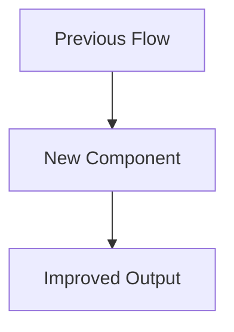

# CHANGELOG Structure Guide

This guide outlines the recommended structure for project CHANGELOG.md files to ensure consistent documentation of project evolution and clear communication to users and developers.

## Core Structure

### 1. Frontmatter

At the beginning of the CHANGELOG.md file, include metadata in YAML format:

```markdown
---
title: Project Name Changelog
author: Organization/Team Name
date: YYYY-MM-DD (last updated)
status: maintained
version: X.Y.Z (current project version)
---
```

This provides essential context about the project and helps with automated processing.

### 2. Introduction

Immediately after the frontmatter, include a brief introduction:

```markdown
# Changelog

> ℹ️ **Note:** This file follows the recommendations of [Keep a Changelog](https://keepachangelog.com/) and adheres to [Semantic Versioning](https://semver.org/).
```

This introduction sets expectations and references the standards being followed.

### 3. Unreleased Section

Always maintain an "Unreleased" section at the top of the version list:

```markdown
## [Unreleased]

### Planned Features 🔮

- Feature A coming soon
- Feature B under development

### In Progress 🚧

- Feature C implementation
```

This section helps communicate upcoming changes and development progress.

### 4. Version Sections

List versions in reverse chronological order (newest first), each with a release date:

```markdown
## [1.2.0] - 2024-05-20

### Added 🎉

- Feature X
- Feature Y

### Fixed 🐛

- Bug Z

## [1.1.0] - 2024-04-15

...
```

Each version heading should:

- Use the format `## [X.Y.Z] - YYYY-MM-DD`
- Be linked to a comparison URL at the bottom of the file
- Follow semantic versioning principles

### 5. Change Categories

Within each version section, group changes by category:

| Category   | Emoji | Description                                        |
| ---------- | ----- | -------------------------------------------------- |
| Added      | 🎉    | New features or capabilities                       |
| Changed    | 🔄    | Changes to existing functionality                  |
| Deprecated | ⚠️    | Features that will be removed in upcoming releases |
| Removed    | 🗑️    | Features that were removed                         |
| Fixed      | 🐛    | Bug fixes                                          |
| Security   | 🔒    | Security vulnerability fixes                       |
| Technical  | 🔧    | Technical details and implementation notes         |

### 6. Version Comparison Links

At the bottom of the CHANGELOG, include reference-style links for each version:

```markdown
[Unreleased]: https://github.com/username/project/compare/v1.2.0...HEAD
[1.2.0]: https://github.com/username/project/compare/v1.1.0...v1.2.0
[1.1.0]: https://github.com/username/project/compare/v1.0.0...v1.1.0
[1.0.0]: https://github.com/username/project/releases/tag/v1.0.0
```

These links allow users to easily see the exact changes between each version.

## Entry Format

Each entry within a category should:

1. Start with a dash and a space (`- `)
2. Use present tense, active voice
3. Be specific about what changed and why
4. Reference issues or pull requests when applicable
5. Credit contributors when appropriate

**Examples:**

```markdown
- Add export to PDF feature (#123)
- Fix memory leak in data processing pipeline
- Update dependency X to v2.1.0 for security patches
- Refactor authentication module for better performance (thanks to @username)
```

## Advanced Structure Elements

### Technical Details Sections

For complex changes, consider adding implementation details:

````markdown
### Technical Details 🔧

> 💡 **Implementation Notes**
>
> ```typescript
> // Example code or configuration showing the change
> class Result<T> {
>   // ...
> }
> ```
````

### Tables for Feature Status

When applicable, use tables to show feature status:

```markdown
| Feature       | Status | Notes                         |
| ------------- | :----: | ----------------------------- |
| API v2        |   ✅   | Fully implemented             |
| Export Module |   🚧   | In progress, partial support  |
| Legacy Import |   ⚠️   | Deprecated, removal in v2.0.0 |
```

### Diagrams for Complex Changes

For architecture changes or complex features, consider including Mermaid diagrams:

````markdown

````

## Recommended Order of Sections

The recommended order of sections within each version is:

1. Added 🎉
2. Changed 🔄
3. Deprecated ⚠️
4. Removed 🗑️
5. Fixed 🐛
6. Security 🔒
7. Technical Details 🔧

This order reflects the common priority of changes for most users, putting new features and significant changes at the top.

## Templates

For project-specific templates and examples, see:

- [Basic Changelog Template](.cursor/kb/1002-changelog-standards/templates/basic_changelog.md)
- [Detailed Changelog Template](.cursor/kb/1002-changelog-standards/templates/detailed_changelog.md)
- [Library Changelog Template](.cursor/kb/1002-changelog-standards/templates/library_changelog.md)
- [Application Changelog Template](.cursor/kb/1002-changelog-standards/templates/application_changelog.md)
