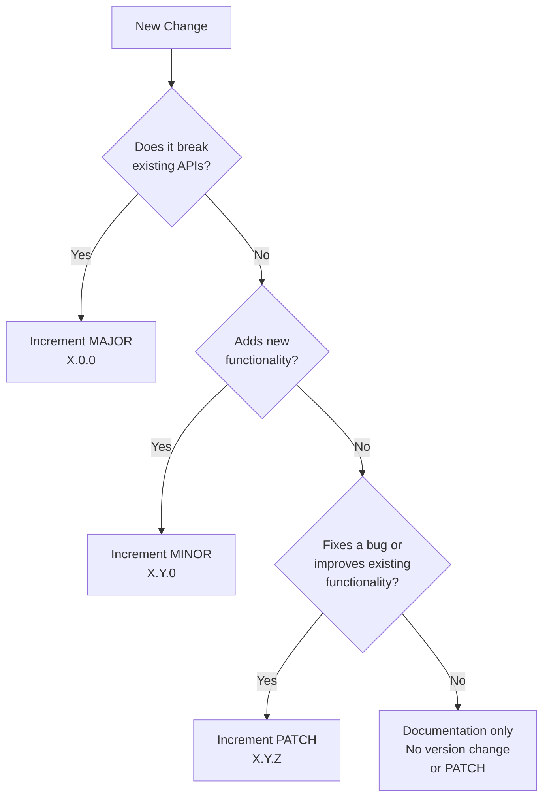

# Semantic Versioning Guide for Changelogs

This guide explains how to properly implement semantic versioning (SemVer) in your CHANGELOG.md files to ensure clarity and consistency in version numbering.

## Semantic Versioning Overview

Semantic Versioning follows the format: **MAJOR.MINOR.PATCH** (e.g., 2.1.0)

| Component | Increment When                                       |
| --------- | ---------------------------------------------------- |
| MAJOR     | Making incompatible API changes (breaking changes)   |
| MINOR     | Adding functionality in a backward-compatible manner |
| PATCH     | Making backward-compatible bug fixes                 |

## Determining Version Increments

### MAJOR Version Increment (X.0.0)

Increment the MAJOR version when you make incompatible changes that require users to modify their code or usage patterns.

**Examples:**

- Removing or renaming public API methods, classes, or modules
- Changing method signatures or return types
- Restructuring the project architecture
- Changing the minimum supported language version
- Modifying the behavior of existing functionality in a way that could break client code

**Changelog Entry Examples:**

```markdown
## [2.0.0] - 2024-05-15

### Breaking Changes 💥

- Remove deprecated `legacyMethod()` API
- Change authentication flow to require API tokens
- Rename `UserManager` to `UserService` for consistency
```

### MINOR Version Increment (X.Y.0)

Increment the MINOR version when you add functionality in a backward-compatible manner.

**Examples:**

- Adding new features, methods, or classes
- Deprecating functionality (marking as planned for removal in a future MAJOR version)
- Adding new optional parameters to existing methods
- Expanding supported formats or platforms

**Changelog Entry Examples:**

```markdown
## [1.2.0] - 2024-05-15

### Added 🎉

- Add PDF export functionality
- Add support for dark mode
- Add new validation options for form inputs
```

### PATCH Version Increment (X.Y.Z)

Increment the PATCH version when you make backward-compatible bug fixes.

**Examples:**

- Fixing bugs or issues
- Performance improvements
- Internal refactoring that doesn't affect the public API
- Documentation updates
- Dependency updates (when they don't affect the API)

**Changelog Entry Examples:**

```markdown
## [1.1.1] - 2024-05-15

### Fixed 🐛

- Fix memory leak in data processing
- Fix incorrect calculation in reporting module
- Fix CSS layout issues in mobile views
```

## Pre-release Versions

For pre-release versions, append a hyphen and identifiers:

| Pre-release Type  | Format        | Example       | Description                                        |
| ----------------- | ------------- | ------------- | -------------------------------------------------- |
| Alpha             | X.Y.Z-alpha.N | 2.0.0-alpha.1 | Very early, unstable version with breaking changes |
| Beta              | X.Y.Z-beta.N  | 2.0.0-beta.2  | Feature complete but still testing                 |
| Release Candidate | X.Y.Z-rc.N    | 2.0.0-rc.1    | Potential final version unless bugs are found      |

**Changelog Entry Examples:**

```markdown
## [2.0.0-beta.1] - 2024-05-15

### Added 🎉

- Complete rewrite of the core engine
- New API design (backward-incompatible)

### Known Issues ⚠️

- Performance degradation with large datasets
- Some UI components not fully styled
```

## Build Metadata

For build metadata, append a plus sign and identifiers:

```
1.0.0+20240515103015
```

This doesn't affect version precedence and is typically used for internal tracking.

## Version Ordering in Changelogs

Always maintain reverse chronological order in your changelog:

1. Unreleased (if any)
2. Latest stable version
3. Pre-release versions of the next major (if any)
4. Earlier stable versions
5. Earlier pre-releases

**Example:**

```markdown
# Changelog

## [Unreleased]

## [2.1.0] - 2024-05-25

## [2.0.0-rc.2] - 2024-05-20

## [2.0.0-rc.1] - 2024-05-15

## [2.0.0-beta.3] - 2024-05-01

## [1.9.2] - 2024-04-10
```

## Version Increment Decision Tree

Use this decision tree to determine which version component to increment:



## Common Versioning Mistakes to Avoid

1. **Incrementing multiple components simultaneously**  
   ❌ 1.1.1 → 2.2.0  
   ✅ 1.1.1 → 2.0.0

2. **Skipping versions**  
   ❌ 1.1.0 → 1.3.0 (without releasing 1.2.0)  
   ✅ 1.1.0 → 1.2.0 → 1.3.0

3. **Resetting PATCH on MINOR increment**  
   ✅ 1.1.1 → 1.2.0 (correct: reset PATCH)  
   ❌ 1.1.1 → 1.2.1 (incorrect: PATCH should reset)

4. **Resetting MINOR on MAJOR increment**  
   ✅ 1.9.5 → 2.0.0 (correct: reset MINOR and PATCH)  
   ❌ 1.9.5 → 2.9.0 (incorrect: MINOR should reset)

5. **Treating version numbers as decimals**  
   ❌ "Version 1.10 comes after 1.9"  
   ✅ "Version 1.10.0 comes after 1.9.0"

## Communicating Version Changes

When documenting version changes, clearly indicate the nature of the change:

1. **For MAJOR changes:**  
   Include a "Breaking Changes" or "Major Changes" section at the top of the version entry.
2. **For MINOR changes:**  
   Emphasize new features in the "Added" section.
3. **For PATCH changes:**  
   Focus on the "Fixed" section.

## Initial Development

During initial development (v0.y.z), the API should be considered unstable and anything may change at any time:

- Start with 0.1.0 for the first development release
- Increment the MINOR version for each significant milestone
- Use PATCH for bug fixes and minor improvements

Once you release 1.0.0, semantic versioning rules apply strictly.

## References

For more details on Semantic Versioning, refer to:

- [SemVer Official Specification](https://semver.org/)
- [Keep a Changelog](https://keepachangelog.com/)
