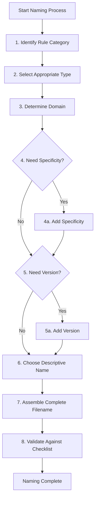

# 📝 Cursor Rules Naming Convention

## 📋 Overview

This rule defines the official naming convention for all Cursor rules. It implements a standardized structure that ensures coherence, discoverability, and scalability as the number of rules increases. This convention facilitates organization, maintenance, and efficient search across all rules.

> ⚠️ **Warning**: This is a critical meta-rule that applies to ALL rules. Strict adherence is required for consistency across the system.

## 🎯 Objectives

- Define a clear, unambiguous standard for naming all Cursor rules
- Improve discoverability through a systematic and intuitive naming scheme
- Support efficient grouping and categorization of related rules
- Enable easy versioning and evolution of the rules system
- Facilitate management of a large number of rules across diverse domains

## 🏗️ Rules System Architecture

The following diagram shows the overall structure of the rule categorization system:

```mermaid
flowchart TD
    Root[Rules System] --> Meta[1000: Meta Rules]
    Root --> Lang[2000: Languages]
    Root --> Frame[3000: Frameworks]
    Root --> Tools[4000: Tools]
    Root --> Work[5000: Workflows]
    Root --> Templ[6000: Templates]
    Root --> QA[7000: Quality Assurance]
    Root --> Domain[8000: Domain-Specific]
    Root --> Ext[9000: Extensions]

    Meta --> MetaFormat[1010: Format Standards]
    Meta --> MetaNaming[1000: Naming Convention]
    Meta --> MetaRef[1001: Naming Reference]

    Lang --> JS[2000: JavaScript]
    Lang --> TS[2100: TypeScript]
    Lang --> Python[2200: Python]

    Frame --> React[3000: React]
    Frame --> Vue[3100: Vue]
    Frame --> Angular[3200: Angular]

    Tools --> ESLint[4000: ESLint]
    Tools --> Git[4100: Git]
    Tools --> Docker[4200: Docker]

    Work --> Agile[5000: Agile]
    Work --> Review[5100: Code Review]

    Templ --> Arch[6000: Architecture]
    Templ --> Doc[6100: Documentation]
    Templ --> User[6200: User Stories]

    style Root fill:#f9f,stroke:#333,stroke-width:2px
    style Meta fill:#bbf,stroke:#333,stroke-width:2px
    style Lang fill:#bfb,stroke:#333,stroke-width:2px
    style Frame fill:#fbf,stroke:#333,stroke-width:2px
    style Tools fill:#bff,stroke:#333,stroke-width:2px
    style Work fill:#ffb,stroke:#333,stroke-width:2px
    style Templ fill:#fbb,stroke:#333,stroke-width:2px
    style QA fill:#9ff,stroke:#333,stroke-width:2px
    style Domain fill:#f99,stroke:#333,stroke-width:2px
    style Ext fill:#ddd,stroke:#333,stroke-width:2px
```



## 📄 Standard Naming Format

### Complete Filename Structure

All rule files must follow this exact structure:

```
XXXX-type-domain[-specificity][@version][-name].mdc
```

The following diagram illustrates how each component fits in the filename structure:

```mermaid
flowchart LR
    A[XXXX] --"Category"--> B[type] --"Type"--> C[domain]
    C --"Domain"--> D[specificity]
    D --"Optional"--> E[@version]
    E --"Optional"--> F[name]
    F --"Name"--> G[.mdc]

    style A fill:#f9f,stroke:#333,stroke-width:2px
    style B fill:#bbf,stroke:#333,stroke-width:2px
    style C fill:#bfb,stroke:#333,stroke-width:2px
    style D fill:#fbb,stroke:#333,stroke-width:2px,stroke-dasharray: 5 5
    style E fill:#fbf,stroke:#333,stroke-width:2px,stroke-dasharray: 5 5
    style F fill:#bff,stroke:#333,stroke-width:2px
    style G fill:#ddd,stroke:#333,stroke-width:2px
```

Where:

- `XXXX`: Four-digit numeric prefix for categorization (mandatory)
- `type`: Rule type identifier (mandatory)
- `domain`: Primary domain of application (mandatory)
- `specificity`: Additional precision on domain (optional)
- `@version`: Version specification when necessary (optional)
- `name`: Descriptive name using kebab-case (mandatory)
- `.mdc`: File extension for markdown cursor rules (mandatory)

## 🔢 Numeric Categories (XXXX)

Each rule must start with a four-digit number that indicates its category and position in the hierarchy:

| Range     | Category                 | Examples                         |
| --------- | ------------------------ | -------------------------------- |
| 1000-1999 | Meta-rules and standards | Naming, formatting, structure    |
| 2000-2999 | Programming languages    | JavaScript, TypeScript, Python   |
| 3000-3999 | Frameworks and libraries | React, Vue, Angular, Next.js     |
| 4000-4999 | Tools and configurations | Git, ESLint, Webpack, Docker     |
| 5000-5999 | Workflows and processes  | PR reviews, deployment, CI/CD    |
| 6000-6999 | Templates and models     | Project templates, PRDs, READMEs |
| 7000-7999 | Quality assurance        | Testing, security, performance   |
| 8000-8999 | Domain-specific rules    | E-commerce, finance, healthcare  |
| 9000-9999 | Reserved for extensions  | Custom categories                |

Within each range, use a logical subgrouping:

- XX00-XX99: Subcategories (e.g., 2100-2199 for TypeScript within languages)
- XX00, XX10, XX20: Major rules in each subcategory
- XX01, XX02, XX03: Minor rules or variations of a major rule

### Numeric Category Organization Example

Let's take the 3000-3999 range (Frameworks and Libraries) as an example:

| Range     | Framework/Library |
| --------- | ----------------- |
| 3000-3099 | React             |
| 3100-3199 | Vue               |
| 3200-3299 | Angular           |
| 3300-3399 | Svelte            |
| 3400-3499 | Next.js           |

Within the React subcategory (3000-3099):

| ID   | Purpose                  |
| ---- | ------------------------ |
| 3000 | Core React standards     |
| 3010 | React hooks patterns     |
| 3020 | React component patterns |
| 3030 | React state management   |
| 3040 | React performance        |

### Numeric Category with Expanded Subcategories

1000-1999: Meta-rules and standards

| Range     | Subcategory                   | Examples                                   |
| --------- | ----------------------------- | ------------------------------------------ |
| 1000-1099 | Core meta-rules               | Naming conventions, format standards       |
| 1100-1199 | Global coding standards       | Code style, comments, formatting           |
| 1200-1299 | Documentation standards       | Markdown, JSDoc, comments                  |
| 1300-1399 | Project organization          | Directory structure, file organization     |
| 1400-1499 | Version control meta-rules    | Branching, commits, PR templates           |
| 1500-1599 | Team collaboration standards  | Code reviews, pair programming             |
| 1600-1699 | Rule templates and generators | Template generation, rule creation tools   |
| 1700-1799 | Rule discovery and search     | Rule indexing, search optimization         |
| 1800-1899 | Rule integration with tools   | Rule linting, validation, auto-formatting  |
| 1900-1999 | Rule migration and versioning | Deprecation policies, migration strategies |

2000-2999: Programming languages

| Range     | Subcategory     | Examples                                    |
| --------- | --------------- | ------------------------------------------- |
| 2000-2099 | JavaScript      | ES modules, async patterns, object patterns |
| 2100-2199 | TypeScript      | Types, interfaces, generics, enums          |
| 2200-2299 | Python          | Type hints, imports, project structure      |
| 2300-2399 | Go              | Error handling, interfaces, concurrency     |
| 2400-2499 | Rust            | Memory management, traits, error handling   |
| 2500-2599 | Java/Kotlin     | Classes, interfaces, functional extensions  |
| 2600-2699 | C/C++           | Memory management, templates, STL           |
| 2700-2799 | Swift           | Optionals, protocols, extensions            |
| 2800-2899 | Ruby            | Classes, modules, metaprogramming           |
| 2900-2999 | Other languages | PHP, Scala, Haskell, Clojure                |

3000-3999: Frameworks and libraries

| Range     | Subcategory               | Examples                                  |
| --------- | ------------------------- | ----------------------------------------- |
| 3000-3099 | React                     | Hooks, components, state management       |
| 3100-3199 | Vue                       | Components, composables, Pinia            |
| 3200-3299 | Angular                   | Components, services, modules             |
| 3300-3399 | Svelte                    | Components, stores, animations            |
| 3400-3499 | Next.js/Nuxt.js           | SSR, routing, data fetching               |
| 3500-3599 | Backend frameworks        | Express, NestJS, Django, Flask            |
| 3600-3699 | Mobile frameworks         | React Native, Flutter, Native Android/iOS |
| 3700-3799 | Desktop frameworks        | Electron, Tauri, Qt                       |
| 3800-3899 | Data processing libraries | Pandas, NumPy, TensorFlow, PyTorch        |
| 3900-3999 | UI component libraries    | Material UI, Tailwind, Bootstrap          |

4000-4999: Tools and configurations

| Range     | Subcategory                      | Examples                          |
| --------- | -------------------------------- | --------------------------------- |
| 4000-4099 | Linters & formatters             | ESLint, Prettier, Black, Rubocop  |
| 4100-4199 | Version control tools            | Git, SVN, Mercurial               |
| 4200-4299 | Containerization                 | Docker, Kubernetes, Podman        |
| 4300-4399 | Build tools                      | Webpack, Vite, Rollup, Bazel      |
| 4400-4499 | Package managers                 | NPM, Yarn, Pip, Cargo             |
| 4500-4599 | IDEs & editors                   | VSCode, IntelliJ, Vim, Emacs      |
| 4600-4699 | Infrastructure as code           | Terraform, CloudFormation, Pulumi |
| 4700-4799 | Monitoring & observability tools | Prometheus, Grafana, Datadog      |
| 4800-4899 | CI/CD tools                      | GitHub Actions, Jenkins, CircleCI |
| 4900-4999 | Documentation tools              | Storybook, Swagger, Docusaurus    |

5000-5999: Workflows and processes

| Range     | Subcategory             | Examples                                 |
| --------- | ----------------------- | ---------------------------------------- |
| 5000-5099 | Agile methodologies     | Scrum, Kanban, sprint planning           |
| 5100-5199 | Code review processes   | PR reviews, code quality checks          |
| 5200-5299 | Testing workflows       | TDD, BDD, integration testing workflow   |
| 5300-5399 | Deployment processes    | Blue/green, canary, progressive rollouts |
| 5400-5499 | Release management      | Version control, releases, changelogs    |
| 5500-5599 | DevOps practices        | Infrastructure automation, SRE practices |
| 5600-5699 | Incident management     | On-call, incident response, postmortems  |
| 5700-5799 | Project management      | Planning, tracking, retrospectives       |
| 5800-5899 | Development lifecycles  | Requirements, design, implementation, QA |
| 5900-5999 | Documentation processes | Technical writing, knowledge management  |

6000-6999: Templates and models

| Range     | Subcategory                 | Examples                                   |
| --------- | --------------------------- | ------------------------------------------ |
| 6000-6099 | Architecture documents      | System design, component diagrams          |
| 6100-6199 | Documentation templates     | README, API docs, technical docs           |
| 6200-6299 | User stories & requirements | Story templates, acceptance criteria       |
| 6300-6399 | Project planning templates  | Roadmaps, sprint plans, backlogs           |
| 6400-6499 | Code templates              | Boilerplates, file templates, snippets     |
| 6500-6599 | Implementation guides       | Step-by-step guides, tutorials             |
| 6600-6699 | Decision records            | ADRs, technical decision memos             |
| 6700-6799 | Project structure templates | Monorepo, microservices, modular structure |
| 6800-6899 | Infrastructure templates    | Cloud setup, local development             |
| 6900-6999 | Process templates           | Incident reports, release checklists       |

7000-7999: Quality assurance

| Range     | Subcategory                       | Examples                                  |
| --------- | --------------------------------- | ----------------------------------------- |
| 7000-7099 | Testing standards                 | Unit testing, integration, e2e testing    |
| 7100-7199 | Security practices                | OWASP, input validation, authentication   |
| 7200-7299 | Performance optimization          | Load testing, benchmarking, profiling     |
| 7300-7399 | Accessibility standards           | WCAG, keyboard navigation, screen readers |
| 7400-7499 | Code quality metrics              | Complexity, maintainability, coverage     |
| 7500-7599 | Error handling                    | Logging, monitoring, recovery strategies  |
| 7600-7699 | Internationalization/localization | i18n frameworks, translation management   |
| 7700-7799 | Compliance & regulations          | GDPR, HIPAA, SOC2, standards adherence    |
| 7800-7899 | Audit & traceability              | Logging standards, audit trails           |
| 7900-7999 | Risk management                   | Risk assessment, mitigation strategies    |

8000-8999: Domain-specific rules

| Range     | Subcategory                | Examples                                     |
| --------- | -------------------------- | -------------------------------------------- |
| 8000-8099 | E-commerce                 | Cart systems, payment processing, catalogs   |
| 8100-8199 | Finance & banking          | Transactions, ledgers, compliance            |
| 8200-8299 | Healthcare                 | Patient data, clinical systems, compliance   |
| 8300-8399 | Media & entertainment      | Streaming, content management, metadata      |
| 8400-8499 | Education                  | Learning systems, student management         |
| 8500-8599 | Government & public sector | Civic tech, public data, compliance          |
| 8600-8699 | Manufacturing & IoT        | Device management, sensor data, automation   |
| 8700-8799 | Retail & logistics         | Inventory, supply chain, order management    |
| 8800-8899 | Travel & hospitality       | Booking systems, itineraries, loyalty        |
| 8900-8999 | Social & communication     | User profiles, messaging, content moderation |

9000-9999: Reserved for extensions

| Range     | Subcategory                      | Examples                                  |
| --------- | -------------------------------- | ----------------------------------------- |
| 9000-9099 | Emerging technologies            | AR/VR, blockchain, quantum computing      |
| 9100-9199 | Experimental practices           | New programming paradigms, methodologies  |
| 9200-9299 | Organization-specific extensions | Company-specific standards, practices     |
| 9300-9399 | Industry-specific extensions     | Industry standards not covered elsewhere  |
| 9400-9499 | Platform-specific extensions     | Cloud platforms, specialized environments |
| 9500-9799 | Reserved for future expansion    | -                                         |
| 9800-9899 | Custom cross-cutting concerns    | Multi-domain, multi-technology concerns   |
| 9900-9999 | Meta-extensions and overrides    | Rules about extending the rule system     |

## 🏷️ Rule Types

The type element must be one of these standard identifiers:

| Type | Description                           | Usage examples                               |
| ---- | ------------------------------------- | -------------------------------------------- |
| std  | Standard - Best practices/conventions | std-js-syntax, std-react-components          |
| cfg  | Configuration - Tool setup            | cfg-eslint-react, cfg-webpack-optimization   |
| tpl  | Template - Models to follow           | tpl-architecture-document, tpl-component     |
| wf   | Workflow - Process to follow          | wf-agile-sprint, wf-git-flow                 |
| prc  | Procedure - Detailed instructions     | prc-deployment-aws, prc-review-checklist     |
| pat  | Pattern - Design patterns             | pat-react-composition, pat-state-management  |
| lib  | Library - Library usage               | lib-lodash-usage, lib-axios-interceptors     |
| api  | API - API interaction                 | api-rest-versioning, api-graphql-schema      |
| sec  | Security - Security practices         | sec-input-validation, sec-authentication     |
| perf | Performance - Optimizations           | perf-react-memoization, perf-db-indexing     |
| doc  | Documentation - Doc standards         | doc-jsdoc-usage, doc-swagger-api             |
| ql   | Quality - Quality assurance           | ql-testing-coverage, ql-complexity           |
| db   | Database - DB practices               | db-sql-queries, db-mongodb-schema            |
| ui   | User interface - UI standards         | ui-components-accessibility, ui-responsive   |
| a11y | Accessibility - A11y standards        | a11y-aria-usage, a11y-contrast               |
| i18n | Internationalization - i18n standards | i18n-translation-keys, i18n-rtl-support      |
| meta | Meta - Rules about rules              | meta-rules-naming, meta-rules-structure      |
| proj | Project - Project-specific            | proj-ecommerce-architecture, proj-crm-api    |
| dev  | Development - Dev environment setup   | dev-local-setup, dev-editor-config           |
| dep  | Deployment - Deployment practices     | dep-azure-pipeline, dep-kubernetes           |
| test | Testing - Testing methodologies       | test-unit-structure, test-e2e-guidelines     |
| ci   | CI - Continuous integration           | ci-github-actions, ci-jenkins-pipeline       |
| cd   | CD - Continuous delivery/deployment   | cd-release-process, cd-blue-green            |
| mon  | Monitoring - System monitoring        | mon-metrics-collection, mon-alert-thresholds |
| log  | Logging - Logging standards           | log-structure, log-level-usage               |
| err  | Error - Error handling practices      | err-boundary-react, err-global-handler       |
| arch | Architecture - System architecture    | arch-microservices, arch-event-driven        |
| int  | Integration - System integration      | int-third-party, int-service-communication   |
| ver  | Version - Version control practices   | ver-semantic, ver-git-commit                 |
| pkg  | Package - Package management          | pkg-npm-strategy, pkg-dependency-policy      |
| data | Data - Data handling practices        | data-schema-design, data-migration           |
| auth | Authentication - Auth practices       | auth-oauth-flow, auth-jwt-usage              |
| cmp  | Compliance - Regulatory compliance    | cmp-gdpr, cmp-hipaa                          |
| seo  | SEO - Search engine optimization      | seo-metadata, seo-structure                  |
| loc  | Localization - Content localization   | loc-date-format, loc-currency                |
| inf  | Infrastructure - Infrastructure setup | inf-terraform, inf-ansible                   |
| scl  | Scalability - Scaling practices       | scl-horizontal, scl-load-balancing           |
| res  | Resilience - System resilience        | res-circuit-breaker, res-retries             |
| gov  | Governance - Project governance       | gov-review-process, gov-decision-making      |
| col  | Collaboration - Team collaboration    | col-pr-review, col-pair-programming          |

## 🌐 Domain and Specificity

The domain element indicates the primary technology, tool, or concept the rule applies to:

- Use lowercase and single-word identifiers where possible
- For programming languages: `js`, `ts`, `py`, `go`, etc.
- For frameworks: `react`, `vue`, `angular`, etc.
- For general applicability: `global`
- For specific tools: `git`, `eslint`, `webpack`, etc.

The optional specificity element provides additional precision:

- `react-hooks`, `ts-types`, `git-workflow`
- Use only when necessary to distinguish between similar rules

## 📊 Version Specification

When a rule is specific to a particular version of a technology, add the version after the domain with an @ symbol:

- Format: `@X` or `@X.Y` or `@name`
- Examples: `js@es2022`, `react@18.2`, `ts@5`
- Only include when practices differ significantly between versions

## 📝 Descriptive Name

The name element should be descriptive, concise, and use kebab-case:

- Use only lowercase letters
- Separate words with hyphens
- Be descriptive but concise (3-5 words max)
- Focus on the key concept or function
- Examples: `naming-convention`, `component-structure`, `error-handling`

## 🚀 Rule Naming Decision Process

When naming a new rule, follow this decision process:



## 📋 Complete Examples

### Standard Examples by Category

| Filename                                 | Description                                     |
| ---------------------------------------- | ----------------------------------------------- |
| `1000-meta-rules-naming-convention.mdc`  | The convention for naming rules (this document) |
| `2100-std-ts@5-type-safety.mdc`          | TypeScript v5 type safety standards             |
| `3010-std-react@18.2-hooks-patterns.mdc` | React 18.2 hook usage patterns                  |
| `4110-cfg-git@2-configuration.mdc`       | Git v2 configuration standards                  |
| `5010-wf-agile-sprint-planning.mdc`      | Sprint planning workflow                        |
| `6210-tpl-project-readme.mdc`            | Project README template                         |

### Extended Examples for Various Categories

| Filename                                  | Description                                     |
| ----------------------------------------- | ----------------------------------------------- |
| `1010-std-global-code-quality.mdc`        | Global code quality standards                   |
| `2010-std-js@es2022-modules-usage.mdc`    | Standard for module usage in JavaScript ES2022  |
| `2110-std-ts@5.0-types-definition.mdc`    | Standard for type definitions in TypeScript 5.0 |
| `2210-std-py@3.11-type-hints.mdc`         | Standard for type annotations in Python 3.11    |
| `3020-cfg-react@18.2-eslint-config.mdc`   | ESLint configuration for React 18.2             |
| `3110-std-vue@3-composables.mdc`          | Standards for composables in Vue 3              |
| `4010-cfg-eslint@8-base-config.mdc`       | Base configuration for ESLint 8                 |
| `4110-cfg-git@2.40-commit-messages.mdc`   | Configuration for Git 2.40 commit messages      |
| `5010-wf-agile-story-splitting.mdc`       | Workflow for Agile story splitting              |
| `6010-tpl-architecture-document.mdc`      | Template for architecture documents             |
| `7010-ql-testing-coverage-thresholds.mdc` | Quality standards for test coverage             |
| `8010-std-ecommerce-api-structure.mdc`    | E-commerce API structure standards              |

## 🧩 Step-by-Step Naming Example

Let's walk through an example of naming a rule for React component best practices:

1. **Identify Category**: This is a framework-specific rule → 3000-3999 range
2. **Refine Category**: It's specifically for React → 3000-3099 range
3. **Select Type**: It defines best practices → "std" type
4. **Determine Domain**: The rule is for React → "react" domain
5. **Need Version?**: It applies to React 18.2 specifically → "@18.2"
6. **Choose Name**: It's about component architecture → "component-architecture"
7. **Assemble Filename**: 3020-std-react@18.2-component-architecture.mdc

## ⚠️ Common Mistakes and Corrections

| ❌ Incorrect                             | ✅ Correct                               | Issue                                |
| ---------------------------------------- | ---------------------------------------- | ------------------------------------ |
| `3000-React-components.mdc`              | `3020-std-react-component-patterns.mdc`  | Missing type, uppercase domain       |
| `std-react-hooks.mdc`                    | `3010-std-react-hooks-patterns.mdc`      | Missing category number              |
| `3010_std_react_hooks.mdc`               | `3010-std-react-hooks-patterns.mdc`      | Using underscores instead of hyphens |
| `3000-react-component standards.mdc`     | `3020-std-react-component-standards.mdc` | Space in filename                    |
| `3010-react-std-hooks-patterns.mdc`      | `3010-std-react-hooks-patterns.mdc`      | Incorrect element order              |
| `3010-std-React@18.2-hooks-patterns.mdc` | `3010-std-react@18.2-hooks-patterns.mdc` | Uppercase domain                     |
| `3010std-react-hooks.mdc`                | `3010-std-react-hooks-patterns.mdc`      | Missing hyphen between elements      |

## 🔄 Version Management

### Evolution of Rules

When a rule evolves significantly:

1. Increment the version number in the frontmatter
2. Add a version history section at the end of the document
3. Document major changes between versions

### Version-Specific Rules

For technology-specific versions:

1. Include the version in the filename if practices differ significantly
2. Use the `@version` format described above
3. Consider maintaining separate files for major version differences

## 🔎 Discoverability and Search

This naming convention enables powerful search capabilities:

- Find all rules of a specific type: `*-std-*`
- Find all rules for a technology: `*-*-react@*-*`
- Find all rules in a category: `30??-*`
- Find all template rules: `*-tpl-*`
- Find all workflow rules for agile: `*-wf-agile-*`

### Search Query Examples

| To find                        | Use this search pattern |
| ------------------------------ | ----------------------- |
| All JavaScript standards       | `2000-std-js*`          |
| All React rules                | `30??-*-react*`         |
| All configuration files        | `*-cfg-*`               |
| All TypeScript 5.x rules       | `*-*-ts@5*`             |
| All template files             | `*-tpl-*`               |
| All workflow files             | `*-wf-*`                |
| All rules in the meta category | `10??-*`                |
| All ESLint configurations      | `*-cfg-eslint*`         |
| All accessibility standards    | `*-a11y-*`              |

## ⚠️ Critical Points

<critical>
- ALWAYS use the exact four-digit numeric prefix for the correct category
- ALWAYS choose the most appropriate type identifier
- ALWAYS use lowercase and hyphens for all elements
- NEVER use spaces or underscores in filenames
- NEVER reuse an existing numeric identifier for a different rule
- ALWAYS place rules in the correct section of the documentation hierarchy
</critical>

## ✅ Best Practices

When creating or updating rules:

- Check existing rules to avoid duplication
- Use the template generator (`1003-meta-rules-template-generator.mdc`)
- Ensure the numeric identifier is not already in use
- Keep the filename elements as concise as possible
- Use meaningful and descriptive names
- Include appropriate tags in the frontmatter
- Follow the frontmatter standards defined in `1010-meta-rules-format-standard.mdc`

## 🔗 References

- [Naming Convention Rule](1000-meta-rules-naming-convention.mdc)
- [Standard Format for Cursor Rules](1001-meta-rules-format-standard.mdc)
- [Standard Format for Cursor Rules](0000-cursor-rulesd.md)
- [Cursor Documentation on Rules](https://docs.cursor.com/context/rules-for-ai)
