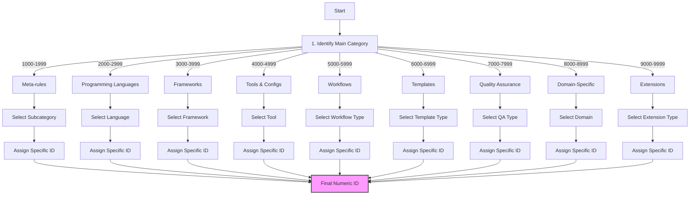
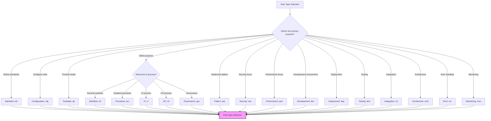
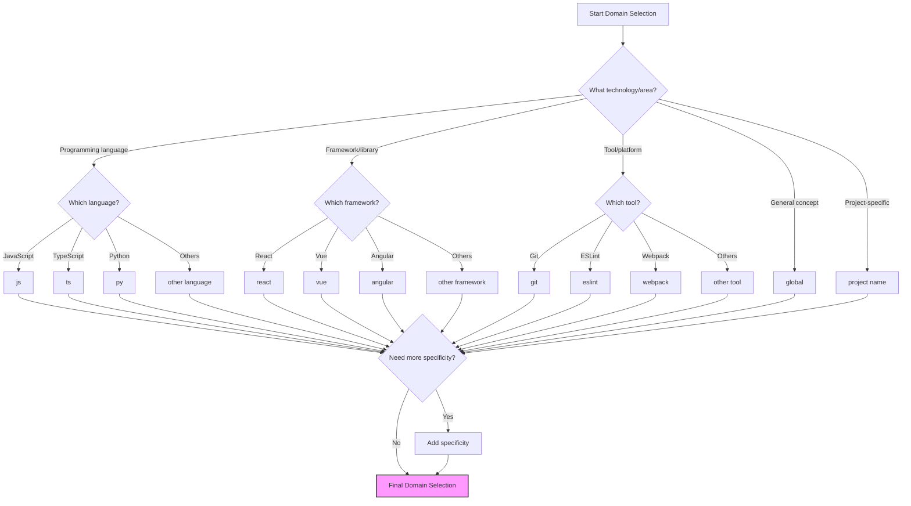
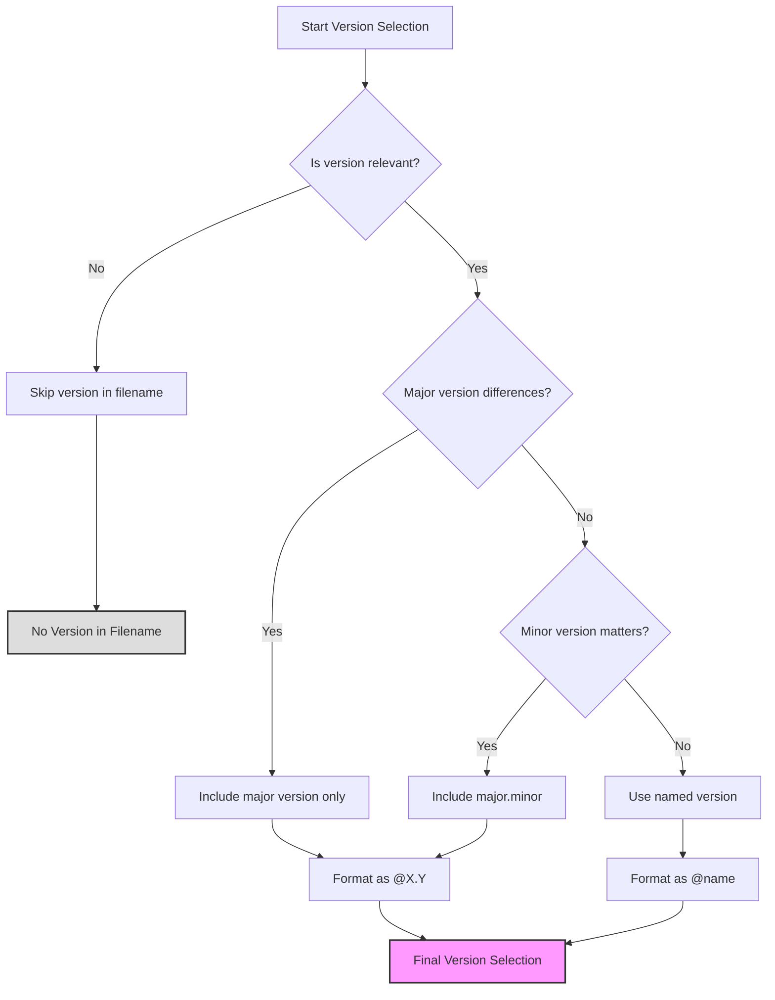

# 📚 Cursor Rules Naming Reference

## 📋 Overview

This rule provides detailed reference and concrete examples for applying the naming convention defined in `1000-meta-rules-naming-convention.mdc`. It is designed as a practical guide to facilitate the creation of new rules and their proper categorization.

> ⚠️ **Warning**: This rule complements the main naming rule `1000-meta-rules-naming-convention.mdc` which should be consulted first.

<requires>1000-meta-rules-naming-convention</requires>

## 🎯 Objective

Provide concrete examples, templates, and detailed guidelines for the consistent application of the Cursor rules naming convention.

## 🔢 Numeric Identifier Assignment

### XXXX Prefix Selection Process



1. Identify the main category (1000-9999)
2. Select the appropriate sub-range
3. Assign a specific identifier within that range

### Assignment Guidelines

- Reserve identifiers ending in 00 for fundamental rules in each subcategory
- Use increments of 10 for major rules (e.g., 1010, 1020, 1030)
- Use increments of 1 for variations or extensions of major rules
- Leave space for potential future related rules

### Detailed Category Allocation Example

Here's a detailed breakdown of the React subcategory (3000-3099):

| ID Range  | Subcategory         | Example IDs | Purpose                |
| --------- | ------------------- | ----------- | ---------------------- |
| 3000-3009 | Core React Concepts | 3000        | Core standards         |
|           |                     | 3001        | Project structure      |
|           |                     | 3002        | File organization      |
| 3010-3019 | React Hooks         | 3010        | Hooks patterns         |
|           |                     | 3011        | Custom hooks           |
|           |                     | 3012        | Hooks performance      |
| 3020-3029 | React Components    | 3020        | Component patterns     |
|           |                     | 3021        | Component composition  |
|           |                     | 3022        | Reusable components    |
| 3030-3039 | State Management    | 3030        | State patterns         |
|           |                     | 3031        | Redux integration      |
|           |                     | 3032        | Context API            |
| 3040-3049 | Performance         | 3040        | Memoization            |
|           |                     | 3041        | Rendering optimization |
|           |                     | 3042        | Code splitting         |

> 📌 **Note**: For a complete and exhaustive list of all subcategories for each main category (1000-9999), please refer to the "Numeric Category with Expanded Subcategories" section in `1000-meta-rules-naming-convention.mdc`. That document contains the definitive reference for all category assignments.

## 🏷️ Type Selection Guide

### Type Decision Tree



### Type Determination Questions

To choose the appropriate type, ask yourself the following questions:

1. **What is the main purpose of the rule?**

   - Define general best practices → `std`
   - Configure a tool or environment → `cfg`
   - Provide a model to follow → `tpl`
   - Define a process → `wf` or `prc`
   - Document a design pattern → `pat`
   - Secure systems/code → `sec`
   - Optimize performance → `perf`
   - Set up development environment → `dev`
   - Manage deployments → `dep`
   - Establish testing practices → `test`
   - Define system architecture → `arch`
   - Handle errors → `err`
   - Monitor systems → `mon`

2. **How will the rule be used?**
   - As a reference for code → `std`, `pat`, `lib`, `err`
   - As a configuration to apply → `cfg`
   - As a template to copy/adapt → `tpl`
   - As a process to follow → `wf`, `prc`, `ci`, `cd`, `gov`
   - As an integration guide → `int`
   - As a deployment strategy → `dep`
   - As a monitoring setup → `mon`

### Differences Between Similar Types

- `wf` vs `prc`: `wf` defines a global workflow, `prc` details precise steps
- `std` vs `pat`: `std` defines general rules, `pat` defines specific patterns
- `tpl` vs `std`: `tpl` provides a concrete model, `std` defines principles
- `ci` vs `cd`: `ci` focuses on integration testing, `cd` on deployment
- `dev` vs `dep`: `dev` addresses local development, `dep` addresses production deployment
- `arch` vs `pat`: `arch` covers system-level architecture, `pat` covers code-level patterns
- `mon` vs `log`: `mon` focuses on system monitoring, `log` on logging practices

### Type Selection Examples

| Rule Purpose                       | Recommended Type | Example Filename                      |
| ---------------------------------- | ---------------- | ------------------------------------- |
| JavaScript coding standards        | `std`            | `2010-std-js-coding-standards.mdc`    |
| ESLint configuration template      | `cfg`            | `4010-cfg-eslint@8-base-config.mdc`   |
| React component structure template | `tpl`            | `3020-tpl-react-component.mdc`        |
| Git workflow process               | `wf`             | `4110-wf-git-workflow.mdc`            |
| Security validation procedure      | `prc`            | `7100-prc-security-validation.mdc`    |
| React hooks pattern                | `pat`            | `3010-pat-react-hooks-custom.mdc`     |
| API documentation standard         | `doc`            | `2500-doc-api-documentation.mdc`      |
| Database query optimization        | `perf`           | `7200-perf-db-query-optimization.mdc` |
| Local development setup            | `dev`            | `4500-dev-vscode-setup.mdc`           |
| Kubernetes deployment              | `dep`            | `5300-dep-kubernetes-cluster.mdc`     |
| Unit testing methodology           | `test`           | `7010-test-unit-structure.mdc`        |
| GitHub Actions CI pipeline         | `ci`             | `4810-ci-github-actions-node.mdc`     |
| Blue/Green deployment              | `cd`             | `5310-cd-blue-green-strategy.mdc`     |
| Prometheus monitoring              | `mon`            | `4710-mon-prometheus-setup.mdc`       |
| Global error handling              | `err`            | `7510-err-global-handler.mdc`         |
| Microservice architecture          | `arch`           | `6010-arch-microservices.mdc`         |
| Third-party service integration    | `int`            | `3510-int-third-party-auth.mdc`       |
| Semantic versioning                | `ver`            | `1410-ver-semantic-releases.mdc`      |
| Log structure and format           | `log`            | `7520-log-structured-format.mdc`      |
| Data migration guidelines          | `data`           | `8010-data-migration-strategy.mdc`    |
| Code review process                | `gov`            | `5110-gov-review-process.mdc`         |

## 🌐 Domain and Specificity Selection Guide

### Domain Selection Framework



### Standard Domains

- `global`: Rules applicable to the entire project
- `js`, `ts`, `py`, etc.: Programming languages
- `react`, `vue`, `angular`, etc.: Frameworks
- `node`, `deno`, etc.: Runtime environments
- `aws`, `azure`, `gcp`, etc.: Cloud platforms
- `ci`, `cd`, `devops`: Integration and deployment processes
- `db`, `sql`, `nosql`: Databases

### Recommended Specificities

- For languages: `syntax`, `modules`, `async`, `types`, etc.
- For frameworks: `components`, `state`, `routing`, `hooks`, etc.
- For tools: `config`, `plugins`, `extensions`, etc.
- For workflows: `planning`, `review`, `testing`, `deployment`, etc.

### Specificity Examples

| Domain   | Possible Specificities              | Example                           |
| -------- | ----------------------------------- | --------------------------------- |
| `js`     | `syntax`, `modules`, `async`, `es6` | `js-modules`, `js-async`          |
| `ts`     | `types`, `interfaces`, `generics`   | `ts-types`, `ts-interfaces`       |
| `react`  | `hooks`, `components`, `state`      | `react-hooks`, `react-components` |
| `git`    | `workflow`, `commits`, `branching`  | `git-workflow`, `git-commits`     |
| `eslint` | `config`, `plugins`, `rules`        | `eslint-plugins`, `eslint-config` |
| `agile`  | `sprint`, `planning`, `stories`     | `agile-sprint`, `agile-stories`   |
| `global` | `error`, `logging`, `naming`        | `global-error`, `global-naming`   |

## 📊 Version Management Guide

### Version Decision Process



### When to Include a Version

- When the rule is specific to a particular version of a technology
- When practices differ significantly between versions
- When compatibility is limited to certain versions

### Recommended Version Formats

- Major version only: `@3`, `@4`
- Major.minor version: `@3.1`, `@18.2`
- With specificity: `@es2022`, `@typescript5`

### Version Usage Examples

- `js@es2022`: JavaScript with ES2022 features
- `react@18.2`: Specific to React 18.2
- `node@18`: For Node.js version 18.x
- `eslint@8`: Configuration for ESLint version 8.x

### When to Omit Version

Version should be omitted when:

- The rule applies to all versions of the technology
- The differences between versions are not significant
- The rule describes general principles not tied to a specific version

## 📝 Naming Guide

### Name Conventions

- Use only lowercase letters
- Separate words with hyphens (`-`)
- Be concise but descriptive
- Avoid non-standard abbreviations
- Limit to 3-5 words maximum

### Recommended Name Structure

- Start with the main subject
- Followed by the specific aspect
- End with the purpose or action if necessary

### Examples of Good Names

- `hooks-patterns`: Hook usage patterns
- `component-architecture`: Component architecture
- `error-handling`: Error handling
- `state-management`: State management
- `commit-messages`: Commit message format

### Naming Do's and Don'ts

| ✅ Do                     | ❌ Don't                      | Reason                      |
| ------------------------- | ----------------------------- | --------------------------- |
| Use descriptive names     | Use abbreviations             | Improves readability        |
| Keep names concise        | Use unnecessarily long names  | Improves filename usability |
| Use kebab-case (hyphens)  | Use camelCase or snake_case   | Convention consistency      |
| Focus on the key concept  | Include auxiliary information | Keeps names focused         |
| Include purpose or action | Be vague or too general       | Clarifies the rule's intent |
| Use standard terms        | Invent new terminology        | Improves discoverability    |

## 📋 Ready-to-Use Templates

### For a Standard Rule

```
XXXX-std-[domain]-[specificity]-[name].mdc
```

### For a Configuration Rule

```
XXXX-cfg-[technology]@[version]-[aspect]-config.mdc
```

### For a Template

```
XXXX-tpl-[domain]-[document-type].mdc
```

### For a Workflow

```
XXXX-wf-[process]-[aspect].mdc
```

### For a Development Environment Setup

```
XXXX-dev-[environment]-[aspect]-setup.mdc
```

### For a Deployment Strategy

```
XXXX-dep-[platform]-[strategy].mdc
```

### For a Testing Methodology

```
XXXX-test-[type]-[aspect].mdc
```

## 🔎 Useful Search Queries

### Find All Rules of a Type

- `*-std-*`: All standards
- `*-cfg-*`: All configurations
- `*-tpl-*`: All templates
- `*-wf-*`: All workflows
- `*-dev-*`: All development setups
- `*-test-*`: All testing methodologies
- `*-dep-*`: All deployment strategies

### Find All Rules for a Technology

- `*-*-react@*-*`: All rules for React
- `*-*-ts@*-*`: All rules for TypeScript
- `*-*-git@*-*`: All rules for Git

### Find All Rules in a Category

- `10??-*`: All meta-rules
- `30??-*`: All rules for frameworks
- `50??-*`: All workflows
- `70??-*`: All quality assurance rules

### Advanced Search Examples

| To find                              | Search query                            |
| ------------------------------------ | --------------------------------------- |
| TypeScript type definitions          | `2110-std-ts*-types-*`                  |
| React component architecture         | `30??-*-react*-component-architecture*` |
| All workflow rules                   | `*-wf-*`                                |
| ESLint configurations for TypeScript | `40??-cfg-eslint*-ts*`                  |
| Security-related rules               | `*-sec-*`                               |
| Rules related to testing             | `7*-test-*`                             |
| Template rules for documentation     | `6*-tpl-*-documentation*`               |
| All rules for React hooks            | `*-*-react*-hooks*`                     |
| All monitoring setups                | `*-mon-*`                               |
| All architecture rules               | `*-arch-*`                              |
| All error handling practices         | `*-err-*`                               |

## ⚠️ Critical Points

<critical>
- ALWAYS consult this reference when creating a new rule
- ALWAYS check if a similar rule already exists before creating a new one
- ALWAYS maintain consistency with the main convention
- NEVER use a format not documented in the main convention
- NEVER reuse a numeric identifier already assigned
- ALWAYS refer to the exhaustive category list in 1000-meta-rules-naming-convention.mdc when assigning numeric IDs
</critical>

## ✅ Validation Checklist

Use this checklist to verify compliance of a rule name:

- [ ] The numeric prefix (XXXX) corresponds to the right category
- [ ] The selected type is appropriate for the rule content
- [ ] The domain is clearly identified
- [ ] The version (if applicable) is correctly formatted with @
- [ ] The name is concise, descriptive, and uses hyphens
- [ ] The name contains only lowercase letters and hyphens
- [ ] The file has the .mdc extension
- [ ] The frontmatter includes title, version, description, and compliant globs
- [ ] The convention is consistent with similar existing rules

## 🧩 Practical Examples

### Example 1: Creating a JavaScript ES6 Standard

1. **Category**: Programming language → 2000-2999
2. **Subcategory**: JavaScript → 2000-2099
3. **Type**: Standard → std
4. **Domain**: JavaScript → js
5. **Version**: ES6 specific → @es6
6. **Name**: Arrow functions usage → arrow-functions
7. **Final filename**: `2020-std-js@es6-arrow-functions.mdc`

### Example 2: Creating a React Component Template

1. **Category**: Framework → 3000-3999
2. **Subcategory**: React → 3000-3099
3. **Type**: Template → tpl
4. **Domain**: React → react
5. **Specificity**: Components → components
6. **Name**: Functional component → functional-component
7. **Final filename**: `3020-tpl-react-components-functional-component.mdc`

### Example 3: Creating a Git Workflow Rule

1. **Category**: Tools → 4000-4999
2. **Subcategory**: Git → 4100-4199
3. **Type**: Workflow → wf
4. **Domain**: Git → git
5. **Name**: Branch naming → branch-naming
6. **Final filename**: `4110-wf-git-branch-naming.mdc`

### Example 4: Creating a Development Environment Setup

1. **Category**: Tools → 4000-4999
2. **Subcategory**: IDE → 4500-4599
3. **Type**: Development → dev
4. **Domain**: VSCode → vscode
5. **Name**: Extension setup → extension-setup
6. **Final filename**: `4510-dev-vscode-extension-setup.mdc`

### Example 5: Creating a Monitoring Configuration

1. **Category**: Tools → 4000-4999
2. **Subcategory**: Monitoring → 4700-4799
3. **Type**: Monitoring → mon
4. **Domain**: Prometheus → prometheus
5. **Name**: Alert rules → alert-rules
6. **Final filename**: `4710-mon-prometheus-alert-rules.mdc`

## 🔗 References

- [Naming Convention Rule](1000-meta-rules-naming-convention.mdc)
- [Standard Format for Cursor Rules](1001-meta-rules-format-standard.mdc)
- [Standard Format for Cursor Rules](0000-cursor-rulesd.md)
- [Cursor Documentation on Rules](https://docs.cursor.com/context/rules-for-ai)
