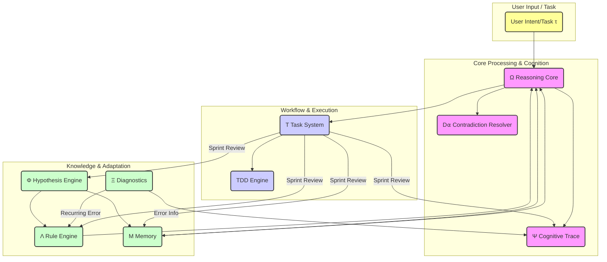
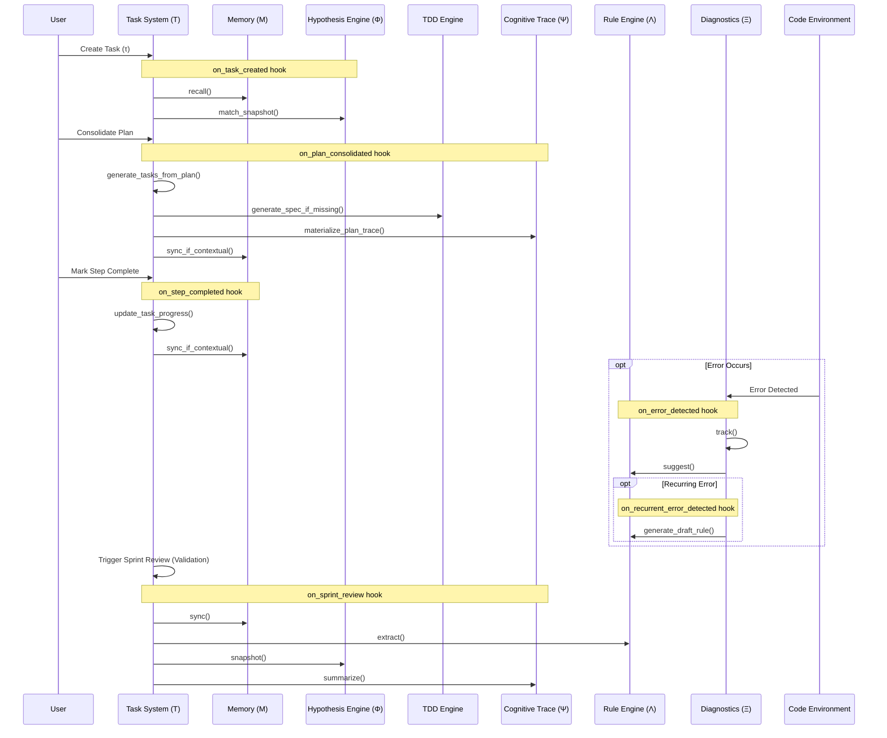

# Analysis of the Ω-System Cognitive Architecture

## 1. Introduction

This document analyzes the cognitive architecture and workflow system (referred to here as the Ω-system) described in the `rules_for_ai.txt` file. The goal is to distill its core concepts, operational ontologies, key mechanisms, and reusable patterns. This analysis serves as a knowledge base to understand this specific system and provides a toolkit of general principles applicable to designing other sophisticated AI interaction and prompt engineering systems.

The Ω-system outlines a comprehensive framework for intent-aligned reasoning, structured task management, self-learning, diagnostics, and cognitive tracing within an IDE environment.

## 2. Core Components Analysis

The system is composed of several interconnected modules, each with a specific function:

_Diagram 1: High-level interaction map of the Ω-System components._

Key interactions shown include: The Reasoning Core (Ω) receives user input, interacts bidirectionally with Memory (M) for context, sends logs to the Cognitive Trace (Ψ), and drives the Task System (T). The Task System uses the TDD Engine. Diagnostics (Ξ) logs error information to the Trace (Ψ) and informs the Rule Engine (Λ) about recurring issues. The Rule Engine guides Reasoning (Ω), and can be informed by patterns from the Hypothesis Engine (Φ). The Hypothesis Engine can also store patterns in Memory (M). Memory, in turn, informs the Reasoning Core.

- **Reasoning Core (Ω):**

  - **Purpose:** The central engine for processing tasks (τ) and aligning with user intent. It aims for maximum understanding (`max(∇ΣΩ)`).
  - **Key Features:**
    - `Ω*`: Core reasoning process involving task decomposition (β), adaptive reasoning based on context (γ), and handling diverse inputs (δ).
    - `Ω.modes`: Employs multiple reasoning strategies (deductive, analogical, exploratory, procedural, contrastive, skeptical).
    - `Ω_H`: Hierarchical decomposition of tasks into layered subproblems, organized into solvable units linked to appropriate reasoning modes.
    - `Ωₜ`: Trust evaluation mechanism for hypotheses, scoring based on confidence, evidence, and consistency, propagating trust levels.
    - `Ω.scope`: Contextual awareness, including project structure inference, dependency detection, observing ripple effects, and activating rules (Λ) in context.
    - `Ω.simplicity_guard` & `Ω.refactor_guard`: Promote pragmatic design by challenging overengineering, delaying unnecessary abstraction, detecting repetition, and proposing reusable components cautiously.

- **Contradiction Resolver (D⍺):**

  - **Purpose:** To identify and resolve ambiguities or contradictions encountered during reasoning.
  - **Key Features:** Uses ranking, scope shifting, or re-abstraction, logging unresolved tension in the Cognitive Trace (Ψ).

- **Structured Task System (T):**

  - **Purpose:** Manages complex tasks (τ_complex) through a structured, file-based workflow system.
  - **Key Features:**
    - `T.plan_path`, `T.backlog_path`, `T.sprint_path`: Defined file structure within `.cursor/tasks/` for task organization (backlog, sprints).
    - `T.structure`: Standardized format for task steps (`step_n.md`) and reviews (`review.md`) within sprints.
    - `T.progress`: In-file metadata (status, priority, notes) for tracking task progress.
    - `T.sprint_review`: Automated review process triggered on validation, integrating memory sync (M), rule extraction (Λ), pattern snapshotting (Φ), and summarization (Ψ).
    - `T.update_task_progress`: Mechanism for updating task status (e.g., to "done") upon observed completion.

- **Test-Driven Development Engine (TDD):**

  - **Purpose:** Integrates TDD principles into the workflow, especially for complex tasks.
  - **Key Features:**
    - `TDD.spec_engine`: Infers test cases (edge, validation, regression) from tasks (τ), cross-checking against known issues and rules (Λ).
    - `TDD.loop`: Defines the classic TDD cycle (spec → run → fail → fix → re-run), capturing results and syncing on success.
    - `TDD.spec_path`: Standardized location for test specifications within the sprint structure.
    - `TDD.auto_spec_trigger`: Automatically generates specification files (`spec_step_x.md`) for tasks exceeding a complexity threshold or when TDD is explicitly requested.

- **Hypothesis Abstraction Engine (Φ):**

  - **Purpose:** To capture and abstract emergent patterns and design motifs observed during the workflow.
  - **Key Features:**
    - `Φ_H`: Performs exploratory abstraction, capturing novel patterns and differentiating them from existing rules/templates (Λ).
    - `Φ.snapshot`: Stores identified design motifs, structures, and naming conventions, likely in Memory (M) or a dedicated path.

- **Diagnostics & Refinement (Ξ):**

  - **Purpose:** To track errors, identify recurring issues, propose refinements, and maintain code health.
  - **Key Features:**
    - `Ξ.error_memory`: Persistent log (`.cursor/memory/errors.md`) for encountered errors.
    - `Ξ.track`: Logs recurring issues and proposes fixes.
    - `Ξ.cleanup_phase`: Detects code drift (dead logic, broken imports, incoherence) and suggests refactoring or simplification.
    - `Ξ.recurrence_threshold`: Defines (e.g., 2 times) when a recurring issue triggers further action.
    - `Ξ.pattern_suggestion`: Suggests reusable strategies or auto-generates draft rules in the Rule Engine's path (Λ.path) for recurring, fixable issues.

- **Rule-Based Self-Learning (Λ):**

  - **Purpose:** Enables the system to learn, adapt, enforce best practices, and manage reusable knowledge based on experience and defined standards.
  - **Key Features:**
    - `Λ.path`: Central repository (`.cursor/rules/`) for rules.
    - `Λ.naming_convention`: Structured, category-based naming system (e.g., `0■■` for core, `1■■■` for language-specific) for rule organization.
    - `Λ.pattern_alignment`: Aligns code with best practices, suggesting patterns pragmatically and enforcing principles like SRP.
    - `Λ.autonomy`: Can auto-detect rule-worthy recurrences (likely via Ξ) and generate draft rules (`_DRAFT.mdc`) in context.

- **File-Based Memory (M):**

  - **Purpose:** Provides persistent storage for contextual information related to tasks, reasoning, insights, and constraints.
  - **Key Features:**
    - `M.memory_path`: Designated location (`.cursor/memory/`) for memory files.
    - `M.retrieval`: Supports dynamic reference resolution (mechanism not fully specified, but implies linking related information).
    - `M.sync`: Triggered synchronization mechanism (e.g., during reviews) to store ideas, constraints, insights, edge notes, etc.

- **Cognitive Trace & Dialogue (Ψ):**
  - **Purpose:** To record the system's reasoning process, decisions, rule invocations, and interactions, facilitating transparency, reflection, and dialogue.
  - **Key Features:**
    - `Ψ.enabled`: Can be toggled on/off.
    - `Ψ.capture`: Defines what aspects are logged (reasoning traces (Ω*), abstraction paths (Φ*), error flows (Ξ\*), rules invoked (Λ), etc.).
    - `Ψ.output_path`: Standardized location (`.cursor/memory/trace_{task_id}.md`) for trace files.
    - `Ψ.sprint_reflection`: Summarizes reasoning, decisions, and deviations during a completed sprint.
    - `Ψ.dialog_enabled`: Supports interactive dialogue, potentially using the trace information.
    - `Ψ.materialization`: Automatically generates markdown artifacts (likely task steps, reviews, traces) when plans reach execution granularity, ensuring traceability.
    - `Ψ.enforce_review`: Triggers reviews based on task complexity or step count to ensure oversight.

## 3. Key Mechanisms & Interactions

The power of the Ω-system lies in the interactions between its components, orchestrated largely by the event hooks (`Σ_hooks`):

_Diagram 2: Simplified lifecycle flow for a task, illustrating key hook triggers and component interactions (including a potential error handling branch)._

- **Task Lifecycle:** Tasks flow from creation (`on_task_created`) through planning (`on_plan_consolidated`), execution (`on_step_completed`), and review/completion (`on_sprint_review`, `on_sprint_completed`). Each stage triggers relevant actions: Memory recall (M) and pattern matching (Φ) at creation; task/spec generation (T, TDD) and trace materialization (Ψ) at planning; progress updates (T) at step completion; comprehensive syncs and summaries (M, Λ, Φ, Ψ) during reviews.
- **Learning Loop:** Errors (`on_error_detected`) are tracked by Diagnostics (Ξ). Recurring errors (`on_recurrent_error_detected`) trigger the Rule Engine (Λ) to suggest or generate draft rules, creating a self-improvement cycle based on operational experience.
- **Contextual Adaptation:** Code changes (`on_file_modified`, `on_module_generated`) trigger rule checks/suggestions (Λ) and potential pattern capture (Φ), allowing the system to adapt its understanding and guidance to the evolving codebase.
- **Feedback Integration:** User feedback (`on_user_feedback`) directly engages the dialogue capability (Ψ) and can update the system's knowledge base (M), allowing for explicit guidance and correction.
- **Proactive Quality Assurance:** Mechanisms like the Simplicity/Refactor Guards (Ω), the Cleanup Phase (Ξ), Pattern Alignment (Λ), and the TDD Engine work synergistically throughout the workflow to promote code quality, maintainability, and adherence to standards proactively, rather than relying solely on reactive fixes.

## 4. Reusable Patterns & Concepts

Beyond the specifics of the Ω-system, several general principles and patterns emerge that are valuable for prompt engineering and designing advanced AI assistant systems:

- **Modular Cognitive Architecture:** Decomposing complex AI behavior into distinct, specialized modules (e.g., Reasoning, Task Management, Learning, Memory, Diagnostics, Tracing) enhances clarity, maintainability, and allows for independent refinement of each function.
- **Explicit Workflow Management:** Implementing a well-defined, stateful system for managing tasks (like the Task System (T) with its sprints, steps, reviews, and status tracking) provides necessary structure, predictability, and auditability for complex operations. File-based systems (`.cursor/tasks/`) offer transparency.
- **Integrated Learning and Adaptation Loop:** Building closed loops where operational experience (errors tracked by Ξ) directly informs and improves the system's knowledge and behavior (rules generated by Λ) is crucial for creating adaptive and self-improving systems.
- **Cognitive Tracing for Explainability & Debugging:** Recording the 'why' behind actions, decisions, and invoked knowledge (Ψ) is invaluable not only for user understanding but also for debugging system behavior, identifying biases, and enabling more effective feedback.
- **Automated Quality & Consistency Gates:** Embedding automated checks, balances, and best-practice enforcement mechanisms (TDD specs, refactoring guards (Ω), cleanup phases (Ξ), rule alignment (Λ)) directly into the operational workflow promotes robustness and desired outcomes.
- **Event-Driven Architecture (Hooks):** Using an event hook system (`Σ_hooks`) provides a flexible and decoupled way to orchestrate complex interactions between different modules based on specific triggers in the workflow (e.g., task completion, file modification, error detection).
- **Structured Externalized Memory:** Implementing a dedicated, structured memory system (M) separate from the core logic allows for persistent storage and dynamic retrieval of context, constraints, insights, and learned patterns, improving contextual awareness.
- **Multi-Modal Reasoning Strategies:** Explicitly defining and selecting from different reasoning approaches (Ω.modes) based on the task or context allows the AI to tackle diverse problems more appropriately and effectively.
- **Pragmatic Design Principles:** Incorporating explicit guards against over-engineering (`Ω.simplicity_guard`) and premature generalization (`Ω.refactor_guard`) encourages practical, maintainable solutions.

## 5. Glossary Summary

- **Ω:** Reasoning Core - Central processing, intent alignment, multi-modal reasoning.
- **D⍺:** Contradiction Resolver - Identifies and handles ambiguity/contradiction.
- **T:** Task System - Manages structured workflows (sprints, steps, backlog) via files.
- **TDD:** Test-Driven Development Engine - Integrates spec generation and testing loop.
- **Φ:** Hypothesis Abstraction Engine - Captures and stores emergent patterns/motifs.
- **Ξ:** Diagnostics & Refinement - Error tracking, code health checks, improvement suggestions.
- **Λ:** Rule Engine - Manages, applies, learns, and suggests rules/best practices.
- **M:** Memory - File-based persistent storage for context, insights, constraints.
- **Ψ:** Cognitive Trace & Dialogue - Logs reasoning, decisions, interactions; enables reflection.
- **τ:** Task/Problem - The input unit for processing by the system.
- **Σ_hooks:** Event Hooks - Trigger actions and orchestrate interactions between modules.
