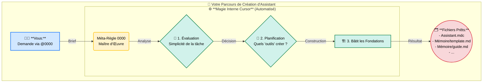

# Scénario 1: Créez Votre Premier Assistant Personnel Cursor avec la Règle 0000 ! ✨🚀

## Objectif : Révolutionnez Votre Façon de Coder avec l'IA ! 🤯

**Fatigué de répéter les mêmes instructions à l'IA ?** Frustré par des résultats parfois imprévisibles ? Imaginez pouvoir **"enseigner" une bonne fois pour toutes** à Cursor comment réaliser *parfaitement* une tâche répétitive, exactement comme *vous* le souhaitez !

Ce guide est votre rampe de lancement pour créer **votre propre assistant intelligent personnalisé** avec la **Méta-Règle `0000-cursor-rules.mdc`**. Oubliez les prompts à rallonge et les copier-coller fastidieux. Découvrez la puissance d'une **automatisation sur mesure**, conçue par vous, pour vous !

**Ce que vous allez découvrir (et adorer !) :**

1.  Pourquoi créer vos propres "assistants" (règles) va **changer votre quotidien** de développeur.
2.  Comment **invoquer le "Maître d'Œuvre" `0000`** pour démarrer la construction.
3.  Observer la **magie en action** : Cursor bâtit automatiquement les fondations pour vous !
4.  Comprendre la structure simple mais puissante (`.mdc` + `KB`) qui rend vos assistants **fiables et faciles à mettre à jour**.
5.  Comment **collaborer avec l'IA** pour créer votre assistant *encore plus vite*.
6.  Comment **déclencher votre nouvel assistant** d'une simple commande !

**Préparez-vous à décupler votre productivité et à rendre le codage encore plus fun !**

## Prérequis

1.  **Cursor IDE installé** et fonctionnel.
2.  Une petite **envie d'automatiser** ce qui peut l'être ! (Pas besoin d'être un expert en IA !)
3.  (Optionnel) Jeter un œil rapide à la [documentation de la méta-règle](https://github.com/giak/cursor-rules-agile-workflow/blob/structured-command-language/.cursor/documentation/0000-cursor-rules-documentation.md) pour les plus curieux.

## Votre Première Mission : Le Générateur de README Standardisé 📄✨

Pour commencer, créons un assistant simple mais incroyablement utile : un générateur de fichier `README.md`. Fini le syndrome de la page blanche pour ce fichier essentiel !

**Objectif de notre premier assistant (`@9001-init-readme`) :** Générer un fichier `README.md` à la racine du projet (s'il n'existe pas) avec *votre* structure standard préférée.

## Étape 1 : L'Invocation du Maître d'Œuvre ! ✨👷‍♂️

Ouvrez le chat Cursor et dites à `0000` ce que vous voulez construire. Soyez descriptif, comme si vous briefiez un assistant humain :

```
@0000-cursor-rules.mdc créer une nouvelle règle pour initialiser un fichier README.md standard.

Objectif: Créer un fichier README.md à la racine du projet s'il n'existe pas, et le remplir avec une structure de base (Titre, Description, Installation, Usage, Contribution, Licence).
Fonctionnalités clés:
- Vérifier l'existence de README.md à la racine.
- Si absent, créer le fichier README.md.
- Insérer un template de structure standard depuis sa "mémoire" (la KB).
- Si présent, ne rien faire et m'informer.
ID suggéré: 9001-init-readme
```

**Que se passe-t-il ?** Vous venez de donner le coup d'envoi ! `0000` se met au travail pour construire votre assistant.

## Étape 2 : La Magie Opère : L'Usine Intelligente en Action ! 🤖⚙️🏭

Regardez Cursor travailler ! Guidé par `0000`, il analyse votre demande et **construit automatiquement** toute l'infrastructure nécessaire pour votre nouvel assistant.



En quelques secondes, `0000` a créé :

*   Le fichier "cerveau" de votre assistant : `.cursor/rules/9001-init-readme.mdc`
*   Le répertoire "mémoire" (Base de Connaissances ou KB) : `.cursor/kb/9001-init-readme/`
*   Des fichiers "mémoire" essentiels :
    *   `readme_template.md` (pour stocker VOTRE modèle de README)
    *   `guideline.md` (un mini mode d'emploi)
    *   `example.md` (des exemples d'utilisation)
*   (Parfois) Un fichier de documentation : `.cursor/documentation/9001-init-readme-documentation.md`

**Le gain immédiat ? Zéro "boilerplate" !** Cursor a préparé le terrain. Vous allez pouvoir vous concentrer sur l'essentiel : définir *votre* standard et la logique simple de l'assistant.

## Étape 3 : Explorer Votre Nouvelle Création - Simple et Puissant ! 🗺️💡

Ouvrez les fichiers générés. C'est plus simple que ça en a l'air !

1.  **`.cursor/rules/9001-init-readme.mdc` (Le Cerveau 🧠)** :
    *   C'est le **centre de contrôle** de votre assistant. Il contient 3 parties clés :
        *   `↹ kb•...` : Les **raccourcis** vers sa "mémoire" (les fichiers dans `/kb/`).
        *   `↹ Ω•...` : La **"recette" simple** qu'il suivra à chaque fois (ex: "1. Vérifie si README existe. 2. Si non, lis le template. 3. Crée le fichier."). **C'est ça qui vous évite de répéter le prompt !**
        *   `↹ LLM•...` : Comment il peut demander de l'aide à un **spécialiste** (le LLM) pour des tâches plus complexes (pas utile pour cet exemple simple).
2.  **`.cursor/kb/9001-init-readme/` (La Mémoire / Boîte à Outils 🧰)** :
    *   C'est là que réside le **savoir statique** de votre assistant.
    *   `readme_template.md` : **Le fichier clé !** C'est ici que vous mettrez VOTRE modèle de README idéal.
    *   `guideline.md` & `example.md` : Des aides pour vous (et l'IA) rappeler comment utiliser l'assistant.
    *   **L'avantage ?** Besoin de changer votre standard de README ? Modifiez *juste* `readme_template.md` ! La logique de l'assistant (`.mdc`) n'a pas besoin de changer. C'est super facile à maintenir !

## Étape 4 : Donner Vie à Votre Assistant - La Touche Finale (Avec l'IA !) 💡🧠🤝🤖

C'est le moment d'ajouter votre touche personnelle. Et la meilleure partie ? **L'IA va faire une grande partie du travail pour vous !**

### 4.1. Remplir la "Mémoire" (KB) : Le Savoir de Votre Assistant

Ouvrez le répertoire `.cursor/kb/9001-init-readme/`.

**🔥 Le Super-Pouvoir : Collaborez avec l'IA !**

Utilisez le chat pour générer le contenu de ces fichiers. Vous êtes le **superviseur** !

*   **(Obligatoire) `readme_template.md` : VOTRE Modèle de README**
    *   **Votre Action (Assistée !) :** Demandez à l'IA de créer votre standard !
        ```
        @Chat @Web Génère-moi un template Markdown standard et complet pour un fichier README.md de projet logiciel. Inclus les sections typiques comme Installation, Usage, Contribution, Licence. Inspire-toi des bonnes pratiques actuelles.
        ```
        Ou si vous préférez vous baser sur votre projet :
        ```
        @Codebase Analyse la structure de mon projet et propose un template README.md adapté.
        ```
        **Validez, adaptez si besoin, et collez le résultat** dans `readme_template.md`. Exemple :
        ```markdown:.cursor/kb/9001-init-readme/readme_template.md
        # Nom de Votre Projet
        > Une courte description...
        ## Installation
        ... (etc.)
        ```
*   **(Recommandé) `guideline.md` & `example.md` : Mode d'Emploi et Exemples**
    *   **Votre Action (Assistée !) :** Laissez l'IA les rédiger !
        ```
        @Chat Rédige une courte guideline et des exemples pour la règle @9001-init-readme. Explique qu'elle initialise un README.md standard s'il n'existe pas. Montre l'invocation et le résultat (fichier créé ou message si déjà existant).
        ```
        **Vérifiez et collez** les réponses dans les fichiers `guideline.md` et `example.md`.

**Résultat :** La "mémoire" de votre assistant est prête, et ça n'a pris que quelques minutes grâce à l'IA ! 💪

### 4.2. Définir la "Recette" dans le Fichier `.mdc` : Le Cerveau de Votre Assistant

Ouvrez `.cursor/rules/9001-init-readme.mdc`.

*   **Vérifier les Raccourcis (`↹ kb•...`)**
    *   Assurez-vous que le fichier `.mdc` a bien un "raccourci" vers votre `readme_template.md`. Cursor l'a sûrement déjà fait :
        ```language=markdown:.cursor/rules/9001-init-readme.mdc
        ↹ kb•readme [p=1] { // Le nom 'kb•readme' peut varier
          ⊕ template: ".cursor/kb/9001-init-readme/readme_template.md", // Référence cruciale !
          // ... autres raccourcis ...
        }
        ```
*   **Décrire la Recette Simple (`↹ Ω•...`)**
    *   C'est ici que vous décrivez les étapes logiques. Pas de code complexe, juste du bon sens !
    *   **Votre Action :** Dans la section `↹ Ω•initialize_readme` (ou nom similaire), assurez-vous que la logique ressemble à ceci (vous pouvez même demander à `@Chat` de vous aider à l'écrire !) :
        ```language=markdown:.cursor/rules/9001-init-readme.mdc
        ↹ Ω•initialize_readme [p=1] -> [
            # 1. Où est le fichier README ?
            - define: target_path = "README.md"

            # 2. Existe-t-il déjà ?
            - check: file_exists(target_path) -> exists
            - if: exists == true THEN
                - notify_user: "Le fichier README.md existe déjà. C'est tout bon !"
                - stop_processing // On s'arrête là !
            - endif

            # 3. Lire notre super template depuis la "mémoire" (KB)
            - load: template_content = read_kb_file(kb•readme.template) // Utilise le raccourci !
            - if: load_failed(template_content) THEN
                - notify_user: "Oups, impossible de lire le template !"
                - stop_processing
            - endif

            # 4. Créer le fichier README avec le contenu du template
            - create: write_file(target_path, template_content)
            - if: write_failed THEN
                - notify_user: "Oups, impossible de créer le README.md !"
                - stop_processing
            - endif

            # 5. Confirmer que c'est fait !
            - notify_user: "✅ Fichier README.md créé avec succès !"
        ]
        ```
    *   **Le Gain Énorme :** Une fois cette "recette" définie, **vous n'aurez plus JAMAIS à l'expliquer à l'IA !** Il suffira d'appeler `@9001-init-readme`.

## Section Bonus : Pourquoi C'est Mieux Que Juste Prompter ? 🤔💡

Vous vous demandez peut-être pourquoi passer par ces étapes ?

*   **Avant (Prompting Classique) :**
    1.  Écrire un long prompt : "Vérifie si README existe, si non, crée-le avec cette structure : [coller la structure]..."
    2.  L'IA répond (parfois bien, parfois à côté).
    3.  Copier/Coller/Adapter le résultat.
    4.  **Recommencer** la prochaine fois... 😩
*   **Après (Avec Votre Assistant `@9001`) :**
    1.  Taper : `@9001-init-readme`
    2.  L'assistant suit sa recette (`Ω`) et utilise sa mémoire (`KB`).
    3.  **Résultat :** Le fichier est créé instantanément, toujours de la même manière. 🎉

**Vos Gains :**

*   **Temps Fou Économisé :** Plus de prompts répétitifs.
*   **Moins de Tokens Utilisés :** Une commande courte vs un long prompt.
*   **Zéro Charge Mentale :** Plus besoin de vous souvenir de la structure exacte.
*   **Consistance Garantie :** Toujours le même résultat fiable.
*   **Maintenance Simplifiée :** Changez le template en 1 seul endroit (KB).

Avec les règles, l'IA devient un **exécutant fiable** de vos processus, pas juste un générateur de texte !

## Étape 5 : Validation Rapide (Optionnel) ✅

```
@0000-cursor-rules.mdc valider la règle @9001-init-readme.mdc
```
Cursor vérifie que tout semble correct (fichier template référencé existe, etc.).

## Étape 6 : Tester Votre Nouveau Super-Pouvoir ! 🦸‍♀️🦸‍♂️

Le grand moment ! Assurez-vous qu'il n'y a pas de `README.md` à la racine (supprimez-le si besoin). Puis, lancez votre assistant :

```
@9001-init-readme
```

**Tadaaa ! ✨** Le fichier `README.md` apparaît, rempli avec VOTRE structure standard. Magique, non ?

## Conclusion : Le Début de Votre Révolution Personnelle ! 🌟

Félicitations ! Vous n'avez pas juste créé un générateur de README, vous avez appris à **construire un assistant intelligent et personnalisé** avec Cursor et la méta-règle `0000`.

**Ce que vous avez accompli :**

*   Transformé une tâche répétitive en une **commande unique et fiable**.
*   Utilisé une **structure simple et puissante** pour garantir la consistance.
*   **Collaboré avec l'IA** pour accélérer la création.
*   Débloqué un **potentiel d'automatisation énorme** pour votre workflow.

Ceci n'est que le début ! Quelles autres tâches pourriez-vous confier à vos propres assistants ? Générer des composants ? Refactoriser du code selon vos conventions ? Créer des fichiers de configuration ?

**Le pouvoir de l'automatisation intelligente est entre vos mains. Construisez, innovez, et rendez votre expérience de développement exceptionnelle avec les règles Cursor !**
